# Conhecendo o Caelum Eats

## Peça sua comida com o Caelum Eats

Nesse curso, usaremos como exemplo o Caelum Eats: uma aplicação de entrega de comida nos moldes de soluções conhecidas no mercado.

Há 3 perfis de usuário:

  - o cliente, que efetua um pedido
  - o dono do restaurante, que mantém os dados do restaurante e muda os status de pedidos pendentes
  - o administrador do Caelum Eats, que mantém os dados básicos do sistema e aprova novos restaurantes

## Funcionalidades

### Cliente

O intuito do cliente é efetuar um pedido, que é um processo de várias etapas. No Caelum Eats, o cliente não precisa fazer login.

Ao acessar a página principal do Caelum Eats, o cliente deve digitar o seu CEP.

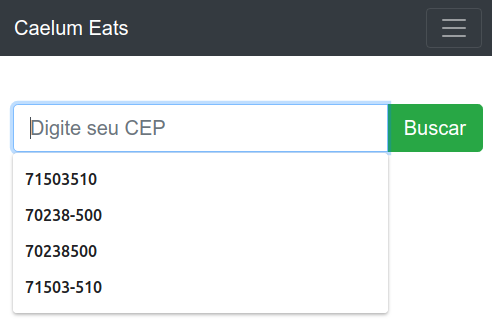

Depois de digitado o CEP, o Caelum Eats retorna uma lista com os restaurantes mais próximos. Entre as informações mostradas em cada item da lista, está a distância do restaurante ao CEP.

O cliente pode filtrar por tipo de cozinha, se desejar. Então, deve escolher algum restaurante.

Os dados iniciais do Caelum Eats vêm apenas com um restaurante: o Long Fu, de comida chinesa.

> Observação: a implementação não calcula de fato a distância do CEP aos restaurantes. O valor exibido é apenas um número randômico.

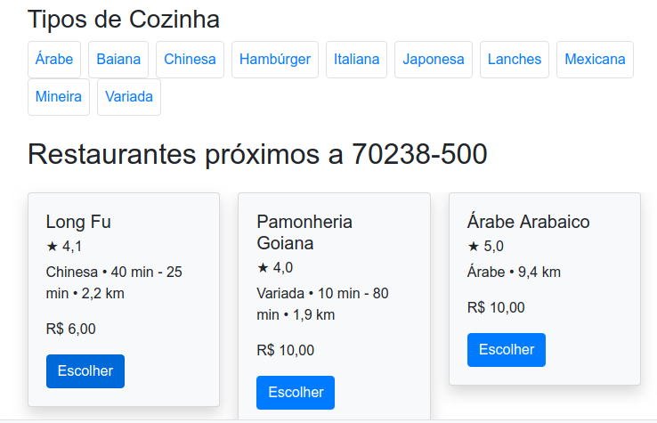

Depois de escolhido um restaurante, o cliente vê o cardápio.

Também são exibidas outras informações do restaurante, como a média das avaliações, a descrição, os tempos de espera mínimo e máximo e a distância do CEP digitado pelo cliente.

Há também uma aba de avaliações, em que o cliente pode ver as notas e comentários de pedidos anteriores.

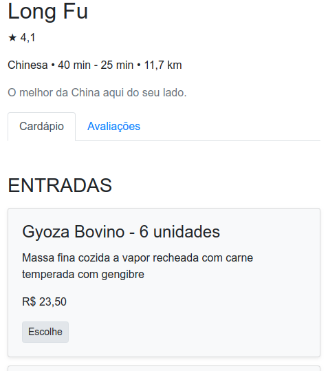

Ao escolher um item do cardápio, o cliente deve escolher uma quantidade. É possível fazer observações de preparo.

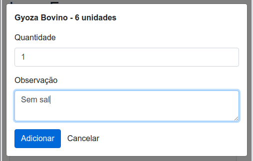

A cada item do cardápio escolhido, o resumo do pedido é atualizado.

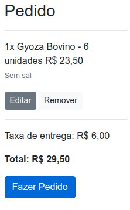

Ao clicar no botão "Fazer Pedido", o cliente deve digitar os seus dados pessoais (nome, CPF, email e telefone) e os dados de entrega (CEP, endereço e complemento).

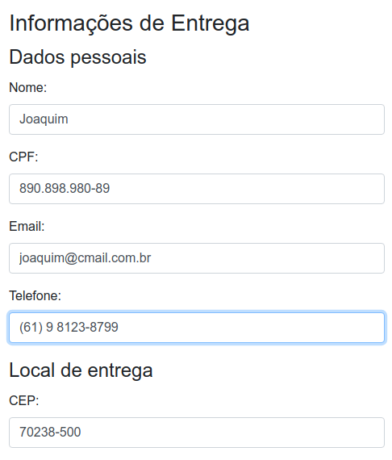

Então, o cliente informa os dados de pagamento. Por enquanto, o Caelum Eats só aceita cartões.

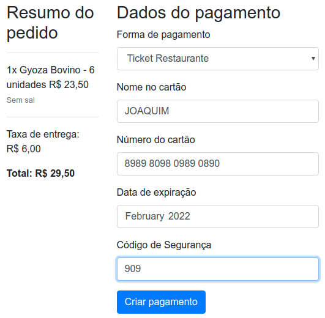

No próximo passo, o cliente pode confirmar ou cancelar o pagamento criado no anteriormente.

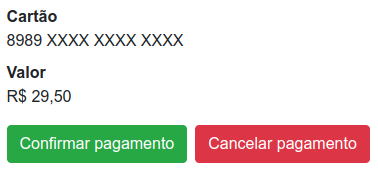

Se o pagamento for confirmado, o pedido será realizado e aparecerá como pedido pendente no restaurante!

Então, o cliente pode acompanhar a situação de seu pedido. Para ver se houve alguma mudança, a página deve ser recarregada.

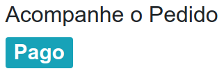

Quando o restaurante avisar o Caelum Eats que o pedido foi entregue, o cliente poderá deixar sua avaliação com comentários. A nota da avaliação influenciará na média do restaurante.

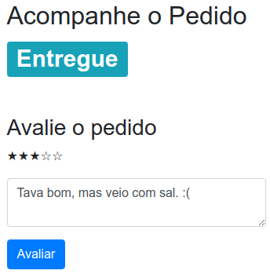

### Dono do Restaurante

O dono de um restaurante deve efetuar o login para manipular as informações de seu restaurante.

As informações de login do restaurante pré-cadastrado, o Long Fu, são as seguintes:

- usuário: `longfu`
- senha: `123456`

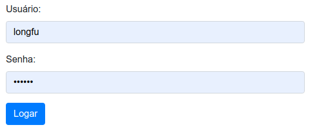

Depois do login efetuado, o dono do restaurante terá acesso ao menu.

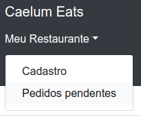

Uma das funcionalidades permite que o dono do restaurante atualize o cadastro, manipulando informações do restaurante como o nome, CPNJ, CEP, endereço, tipo de cozinha, taxa de entrega e tempos mínimo e máximo de entrega.

Além disso, o dono do restaurante pode escolher quais formas de pagamento são aceitas, o horário de funcionamento e cadastar o cardápio do restaurante.

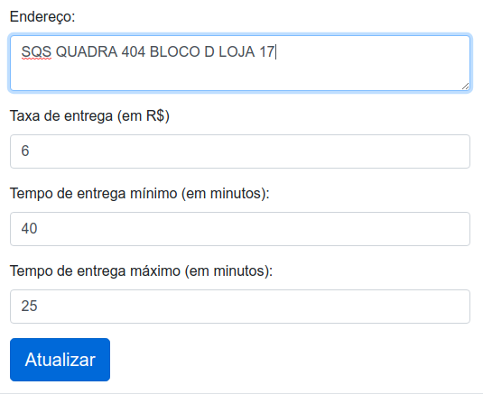

O dono do restaurante também pode acessar os pedidos pendentes, que ainda não foram entregues. Cada mudança na situação dos pedidos pode ser informada por meio dessa tela.

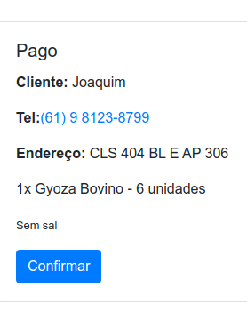

O dono de um novo restaurante, que ainda não faz parte do Caelum Eats, pode registrar-se clicando em "Cadastre seu Restaurante". Depois de cadastrar um usuário e a respectiva senha, poderá preencher as informações do novo restaurante.

O novo restaurante ainda não aparecerá para os usuários. É necessária a aprovação do restaurante pelo administrador do Caelum Eats.

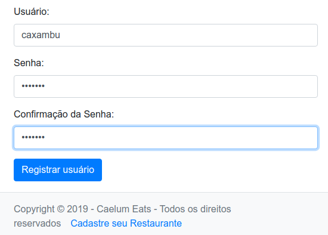

### Administrador

O administrador do Caelum Eats só terá acesso às suas funcionalidades depois de efetuar o login.

Há um administrador pré-cadastrado, com as seguintes credenciais:

- usuário: `admin`
- senha: `123456`

Não há uma tela de cadastro de novos administradores. Por enquanto, isso deve ser efetuado diretamente no Banco de Dados. Esse cadastro é uma das funcionalidades pendentes!


Depois do login efetuado, o administrador verá o menu.

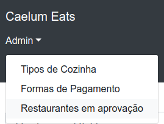

Somente o administrador, depois de logado, pode manter o cadastro dos tipos de cozinha disponíveis no Caelum Eats.


Outra funcionalidade disponível apenas do administrador é o cadastro das formas de pagamento que podem ser escolhidas no cadastro de restaurantes.

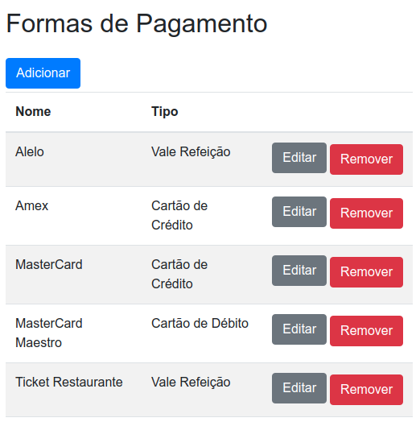

Também é tarefa do administrador do Caelum Eats revisar o cadastro de novos restaurantes e aprová-los.

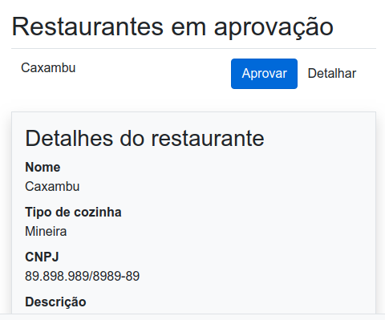

## A Arquitetura do Caelum Eats

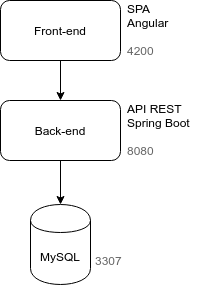

### Back-end

O back-end do Caelum Eats provẽ uma API REST. A porta usada é a `8080`.

O Banco de Dados utilizado é o MySQL, na versão 5.6 e executado na porta `3306`.

É implementado com as seguintes tecnologias:

- Spring Boot
- Spring Boot Web
- Spring Boot Validation
- Spring Data JPA
- MySQL Connector/J
- Flyway DB, para migrations
- Lombok, para um Java menos verboso
- Spring Security
- jjwt, para gerar e validar tokens JWT
- Spring Boot Actuator

As migrations do Flyway DB, que ficam no diretório `src/main/resources/db/migration`, além de criar a estrutura das tabelas, já popula o BD com dados iniciais.

### Front-end

O front-end do Caelum Eats é uma SPA (Single Page Application), implementada em Angular 7. A porta usada em desenvolvimento é a `4200`.

Para a folha de estilos, é utilizado o Bootstrap 4.

São utilizados alguns componentes open-source:

- ngx-toastr
- angular2-text-mask
- ng-bootstrap

## Exercício: Executando o back-end

1. Clone o projeto do back-end para seu Desktop com os seguintes comandos:

  ```sh
  cd ~/Desktop
  git clone https://gitlab.com/aovs/projetos-cursos/fj33-eats-monolito.git
  ```

2. Abra o Eclipse, definindo como workspace `/home/<usuario-do-curso>/workspace-monolito`. Troque `<usuario-do-curso>` pelo login utilizado no curso.
3. No Eclipse, acesse _File > Import > Existing Maven Projects_ e clique em _Next_. Em _Root Directory_, aponte para o diretório clonado anteriormente.
4. Acesse a classe `EatsApplication` e a execute com _CTRL+F11_. O banco de dados será criado automaticamente e alguns dados serão populados.
5. Teste a URL `http://localhost:8080/restaurantes/1` pelo navegador e verifique se um JSON com os dados de um restaurante foi retornado.
6. Analise o código. Veja:

  - as entidades de negócio
  - os recursos e suas respectivas URIs
  - os serviços e suas funcionalidades.

## Exercício: Executando o front-end

1. Baixe para o Desktop o projeto do front-end, usando o Git, com os comandos:

  ```sh
  cd ~/Desktop
  git clone https://gitlab.com/aovs/projetos-cursos/fj33-eats-ui.git
  ```

2. Abra um Terminal e digite:

  ```sh
  cd ~/Desktop/fj33-eats-ui
  ```

3. Instale as dependências do front-end com o comando:

  ```sh
  npm install
  ```

4. Execute a aplicação com o comando:

  ```sh
  ng serve
  ```

5. Abra um navegador e teste a URL: `http://localhost:4200`. Explore o projeto, fazendo um pedido, confirmando um pedido efetuado, cadastrando um novo restaurante e aprovando-o. Em caso de dúvidas, peça ajuda ao instrutor.

## Um negócio em expansão

No Caelum Eats, a entrega é por conta do restaurantes. Porém, está no _road map_ do produto ter entregas por meio de terceiros, como motoboys, ou por funcionários do próprio Caelum Eats.

Atualmente, só são aceitos cartões de débito, crédito e vale refeição. Entre as ideias estão aceitar o pagamento em dinheiro e em formas de pagamentos inovadoras como criptomoedas, soluções de pagamento online como Google Pay e Apple Pay e pagamento com QR Code.

Entre especialistas de negócio, desenvolvedores e operações, a equipe passou a ter algumas dezenas de pessoas, o que complica incrivelmente a comunicação.

Os desenvolvedores passaram a reclamar do código, dizendo que é difícil de entender e de encontrar onde devem ser implementadas manutenções, correções e novas funcionalidades.

Há ainda problemas de performance, especialmente no cálculo dos restaurantes mais próximos ao CEP informado por um cliente. Essa degradação da performance acaba afetando todas as outras partes da aplicação.

Será que esses problemas impedirão a Caelum Eats de expandir os negócios?
