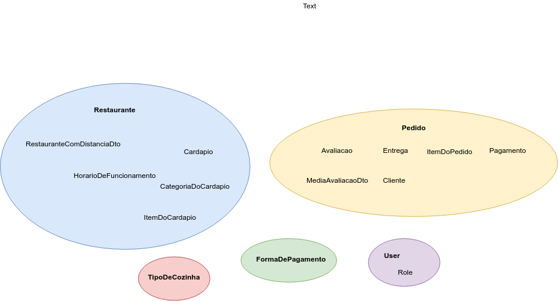
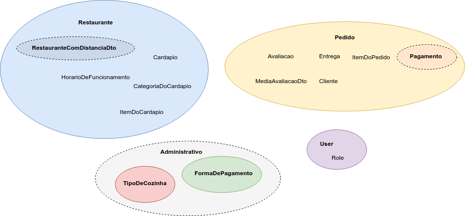
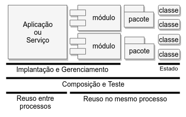
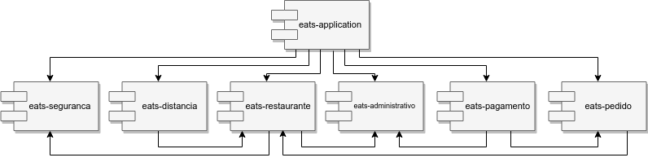

# Decompondo o monólito

## Da bagunça a camadas

Qual é a emoção que a palavra **monólito** traz pra você?

Muitos desenvolvedores associam a palavra monólito a código mal feito, sem estrutura aparente, com muito código repetido e com dados compartilhados entre partes pouco relacionadas. É o que comumente é chamado de código **Spaghetti** ou, [Big Ball of Mud](http://www.laputan.org/mud/mud.html) (FOOTE; YODER, 1999).

Porém, é possível criar monólitos bem estruturados. Uma maneira comum de organizar um monólito é usar camadas: cada camada provê um serviço para a camada de cima e é um cliente das camadas de baixo.

Usualmente, o código de uma aplicação é estruturado em 3 camadas:

- _Apresentação_: responsável por prover serviços ao front-end. Em alguns casos, é feita a renderização das telas da UI, como ao utilizar JSPs.
- _Negócio_: responsável pelos cálculos, fluxos e regras de negócio.
- _Persistência_: responsável pelo acesso aos dados armazenados, geralmente, em um Banco de Dados.

Uma maneira de representar essas camadas em um código Java é utilizar pacotes, o que é conhecido como _Package by Layer_.

> Na verdade, é preciso distinguir dois tipos de camadas que influenciam a arquitetura do software: as camadas físicas e as camadas lógicas.
>
> Uma camada física, ou _tier_ em inglês, descreve a estrutura de implantação do software, ou seja, as máquinas utilizadas.
>
> O que descrevemos no texto anterior é o conceito de camada lógica. Em inglês, a camada lógica é chamada de _layer_. Trata de agrupar o código que corresponde às camadas descritas anteriormente.

### Camadas no Caelum Eats

O código de back-end do Caelum Eats está organizado em camadas (layers). Podemos observar isso estudando a estrutura de pacotes do código Java:

<!--@note
É possível rodar o comando abaixo, na pasta do pacote base do código Java (src/main/java/br/com/caelum/eats/) do projeto fj33-eats-monolito, para mostrar a estrutura básica dos pacotes.

  tree -d -L 1

Claro, pela IDE também é possível ter uma "flat presentation" dos pacotes.
-->

```txt
eats
├── controller
├── dto
├── exception
├── model
├── repository
└── service
```

Bem organizado, não é mesmo?

Porém, quando a aplicação começa a crescer, o código passa a ficar difícil de entender. Centenas de Controllers juntos, centenas de Repositories misturados. Passa a ser difícil encontrar o código que precisa ser alterado.

## A Arquitetura que Grita

Reflita um pouco: dos projetos implementados com a plataforma Java em que você trabalhou, quantos seguiam uma variação da estrutura Package by Layer que estudamos anteriormente? Provavelmente, a maioria!

Veja a estrutura de diretórios abaixo:

```txt
.
├── assets
├── controllers
├── helpers
├── mailers
├── models
└── views
```

Os diretórios anteriores são a estrutura padrão de um framework de aplicações Web muito influente: o Ruby On Rails.

Perceba que interessante: a estrutura básica de diretórios é familiar; em alguns casos, até temos um palpite sobre qual o framework utilizado; mas não temos ideia do **domínio** da aplicação. Qual é o problema que está sendo resolvido?

No post [Screaming Architecture](https://blog.cleancoder.com/uncle-bob/2011/09/30/Screaming-Architecture.html) (MARTIN, 2011), Robert "Uncle Bob" Martin diz que a partir das plantas de edifícios, conseguimos saber se trata-se de uma casa ou uma biblioteca: a arquitetura "grita" a finalidade da construção.

> Na realidade, a construção civil tem diferentes plantas: a elétrica, a hidráulica, a estrutural, etc.
> Uncle Bob parece referir-se a um tipo específico de planta: a **planta baixa**. É feita por um arquiteto e é mais próxima do cliente. A partir dela são projetadas outras plantas mais técnicas e específicas.
> É o tipo de planta que encontramos em lançamentos de imóveis.

Para projetos de software, entretanto, é usual que a estrutura básica de diretórios indique qual o framework ou qual a ferramenta de build utilizados. Porém, para Uncle Bob, o framework é um detalhe; o Banco de Dados é um detalhe; a Web é um mecanismo de entrega da UI, um detalhe.

Uncle Bob cita a ideia de Ivar Jacobson, um dos criadores do UML, descrita no livro [Object Oriented Software Engineering: A Use-Case Driven Approach](https://www.amazon.com/Object-Oriented-Software-Engineering-Approach/dp/0201544350) (JACOBSON, 1992), de que a arquitetura de um software deveria ser _centrada nos casos de uso_ e não em detalhes técnicos.

## Por arquiteturas centradas no domínio

No livro [Clean Architecture](https://www.amazon.com/Clean-Architecture-Craftsmans-Software-Structure/dp/0134494164) (MARTIN, 2017), Uncle Bob define uma abordagem arquitetural que torna a aplicação:

- **independente de frameworks**: um framework não é sua aplicação. A estrutura de diretórios e as restrições do design do nosso código não deveriam ser determinadas por um framework. Frameworks deveriam ser usados apenas como ferramentas para que a aplicação cumpra suas necessidades.
- **independente da UI**: a UI muda mais frequentemente que o resto do sistema. Além disso, é possível termos diferentes UIs para as mesmas regras de negócio.
- **independente de BD**: as regras de negócio não devem depender de um Banco de Dados específico. Devemos possibilitar a troca, de maneira fácil, de Oracle ou SQL Server para MongoDB, CouchDB, Neo4J ou qualquer outro BD.
- **testável**: deve ser possível testar as regras de negócio diretamente, sem a necessidade de usar uma UI, BD ou servidor Web.

Uncle Bob ainda cita, no mesmo livro, outras arquiteturas semelhantes:

- Hexagonal Architecture, ou Ports & Adapters, descrita por Alistair Cockburn.
- DCI (Data, Context and Interaction), descrita por James Coplien, pioneiro dos Design Patterns, e Trygve Reenskaug, criador do MVC.
- BCE (Boundary-Control-Entity), introduzida por Ivar Jacobson no livro mencionado anteriormente.

> O curso [Práticas de Design e Arquitetura de código para aplicações Java](https://www.caelum.com.br/curso-design-arquitetura-de-aplicacoes-java) (FJ-38) explora, a partir de um gerador de ebooks, tópicos como os princípios SOLID de Orientação a Objetos e alguns Design Patterns, até chegar progressivamente a uma Arquitetura Hexagonal.

### Software é massa!

Raymond J. Rubey cita uma carta ao editor da revista CROSSTALK (RUBEY, 1992), em que é feita uma brincadeira que classifica qualidade de código como se fossem massas:

- **Spaghetti**: complicado, difícil de entender e impossível de manter
- **Lasagna**: simples, fácil de entender, estruturado em camadas, mas monolítico; na teoria, é fácil de mudar uma camada, mas não na prática
- **Ravioli**: componentes pequenos e soltos, que contém "nutrientes" para o sistema; qualquer componente pode ser modificado ou trocado sem afetar significativamente os outros componentes

## Explorando o domínio

Até um certo tamanho, uma aplicação estruturada em camadas no estilo Package by Layer, é fácil de entender. Novos desenvolvedores entram no projeto sem muitas dificuldades para entender a organização do código, já que é há uma certa familiaridade.

Mas há um momento em que é interessante reorganizar os pacotes ao redor do domínio, o que alguns chamam de _Package by Feature_. O intuito é que fique bem clara qual é a área de negócio de cade parte do código.

Mas qual critério usar para decompor o monólito? Uma funcionalidade é um pacote, como sugere o nome Package by Feature? Talvez isso seja muito granular.

Uma fonte de _insights_ interessantes em como explorar o domínio de uma aplicação é o livro [Domain Driven Design](https://www.amazon.com/Domain-Driven-Design-Tackling-Complexity-Software/dp/0321125215), de Eric Evans (EVANS, 2003).

## Caçando entidades importantes

Todo domínio tem entidades importantes, que são um ponto de entrada para o negócio e tem várias outras entidades ligadas. Um objeto que representa um pedido, por exemplo, terá informações dos itens do pedido, do cliente, da entrega e do pagamento. É o que é chamado, nos termos do DDD, de _Agregado_.

> **AGREGADO**
>
> Agrupamento de objetos associados que são tratados como uma unidade para fins de alterações nos dados. Referências externas são restritas a um único membro do AGREGADO, designado como _raiz_. Um conjunto de regras de consistência se aplicada dentro dos limites do AGREGADO.
>
> [Domain Driven Design](https://www.amazon.com/Domain-Driven-Design-Tackling-Complexity-Software/dp/0321125215) (EVANS, 2003)

Referências a objetos de fora desse Agregado devem ser feitas por meio do objeto principal, a raiz do Agregado. Uma relação entre um pedido e um restaurante deve ser feita pelo pedido, e não pela entrega ou pelo pagamento do pedido.

Os dados de um Agregado são alterados em conjunto. Por isso, Banco de Dados Orientados a Documentos, como o MongoDB, em que um documento pode ter um grafo de outros objetos conectados, são interessantes para persistir Agregados.

E no Caelum Eats?

<!--@note
  Falar para o pessoal abrir o pacote `model` e ir explorando com eles os objetos principais.
  Explorar os outros pacotes, desenho o que o pessoal acha que são os agregados.
  Classes como `RestauranteComDistanciaDto` e `MediaAvaliacoesDto` são objetos interessante que estão no pacote `dto`.
  Uma classe especial é a DistanciaService, do pacote `service`. Faz parte do agregado de Restaurante ou não?
-->

Um objeto muito importante é o `Pedido`. Associado a um `Pedido` temos uma lista de `ItemDoPedido` e uma `Entrega`. Uma `Entrega` está associada a um `Cliente`. Cada `Pedido` também pode ter uma `Avaliacao`. Há, possivelmente, um `Pagamento` para cada `Pedido`. E um `Pagamento` tem uma `FormaDePagamento`. Um `Pedido` também está associado a um `Restaurante`.

Um `Restaurante` tem seu cadastro mantido por seu dono e é aprovado pelo administrador do Caelum Eats. Um `Restaurante` pode existir sem nenhum pedido, o que acontece logo que foi cadastrado. Um `Restaurante` está relacionado a um `Cardapio` que contém uma lista de `CategoriaDoCardapio` que, por sua vez, contém uma lista de `ItemDoCardapio`. Um `Restaurante` possui também uma lista de `HorarioDeFuncionamento` e das `FormaDePagamento` aceitas, assim como um `TipoDeCozinha`.

Um `Restaurante` também possui um `User`, que representa seu dono. O `User` também é utilizado pelo administrador do Caelum Eats. Um `User` tem um ou mais `Role`.

Uma `FormaDePagamento` existe independentemente de um `Restaurante` e os valores possíveis são mantidos pelo administrador. O mesmo ocorre para `TipoDeCozinha`.

Há algumas classes interessantes como `MediaAvaliacoesDto` e `RestauranteComDistanciaDto`, que associam um restaurante à média das notas das avaliações e uma distância a um dado CEP, respectivamente.



Poderíamos alinhar o código do Caelum Eats com o domínio, utilizando os agregados identificados anteriormente.

## Das estruturas de comunicação para o código

No artigo [How Do Committees Invent?](http://www.melconway.com/Home/Committees_Paper.html) (CONWAY, 1968), Melvin Conway descreve como sistemas tendem a reproduzir as estruturas de comunicação das empresas/orgãos/corporações que os produziram:

> **Lei de Conway**
>
> _Qualquer organização que faz design de sistemas vai inevitavelmente produzir um design cuja estrutura é uma cópia das estruturas de comunicação dessa organização._

No estudo preliminar _Exploring the Duality between Product and Organizational Architectures_ (2008, MACCORMACK et al.) da Harvard Business School, os autores testaram o que chamam de Hipótese do Espelho (em inglês, _Mirroring Hypothesis_): a estrutura dos times influencia na modularidade dos softwares produzidos. Os autores dividem as organizações entre as _altamente acopladas_, em que as visões e os objetivos estão altamente alinhados, e as _baixamente acopladas_, organizadas como comunidades open-source distribuídas geograficamente. Para produtos similares, organizações altamente acopladas tendem a produzir softwares menos modulares.

Um exemplo da Lei de Conway aplicada pode ser encontrada no caso da Amazon, que tem uma regra conhecida como _two pizza team_: um time tem que poder ser alimentado por duas pizzas. Um tanto subjetivo, mas traz a ideia de que os times na Amazon são pequenos, independentes e autônomos, cuidando de todo o ciclo de vida do software, da concepção à operação. E isso influencia na arquitetura do software.

No artigo [Contending with Creaky Platforms CIO](http://jonnyleroy.com/2011/02/03/dealing-with-creaky-legacy-platforms/) (SIMONS; LEROY, 2010), Matthew Simons e Jonny Leroy, argumentam que a Lei de Conway pode ser descrita como: organizações disfuncionais criam aplicações disfuncionais. Por isso, refazer uma aplicação mantendo a mesma estrutura organizacional levaria às mesmas disfunções do software original. Para obter um software mais modular e organizado, poderíamos começar quebrando silos que restringem a habilidade dos times colaborarem de maneira efetiva. Os autores chamam essa ideia de **Manobra Inversa de Conway** (em inglês, _Inverse Conway's Maneuver_).

Pesquisadores da UFMG analisaram se a Lei de Conway se aplica ao kernel do Linux. Para isso, criaram uma métrica que chamaram de DOA (Degree of Authorship), que indica o quanto um determinado desenvolvedor é "autor" de um arquivo do código fonte. O DOA foi estimado por meio da verificação do histórico de uma década dos arquivos no controle de versões. A métrica relaciona um autor a um arquivo e é proporcional a quem criou o arquivo, ao número de mudanças feitas por um determinado autor e é inversamente proporcional ao número de mudanças feitas por outros desenvolvedores. No artigo de divulgação [Does Conway’s Law apply to Linux?](https://medium.com/@aserg.ufmg/does-conways-law-apply-to-linux-6acf23c1ef15) (ASERG-UFMG, 2017), é descrita a conclusão de que o kernel do Linux segue uma forma inversa da Lei de Conway, já que a arquitetura definida ao longo dos anos é que influenciou na organização e nas especializações do time de desenvolvimento.

<!--@note

  Não há prova científica da Lei de Conway, mas apenas a forte impressão de que ela vale por desenvolvedores experientes.
  Há muitos artigos tentando quantificar a Lei de Conway. Alguns dizem comprová-la e outros refutá-la.
  Mas é algo sempre presente nas discussões sobre decomposição de microservices.
-->

## A linguagem do negócio depende do Contexto

Um foco importante do DDD é na linguagem. Os **especialistas de domínio** usam certos termos que devem ser representados nos requisitos, nos testes e, claro, no código de produção. A linguagem do negócio deve estar representada em código, no que chamamos de **Modelo de Domínio** (em inglês, _Domain Model_). Essa linguagem estruturada em torno do domínio e usada por todos os envolvidos no desenvolvimento do software é chamada pelo DDD de **Linguagem Onipresente** (em inglês, _Ubiquitous Language_).

Porém, para uma aplicação de grande porte as coisas não são tão simples. Por exemplo, em uma aplicação de e-commerce, o que é um Produto? Para diferentes especialistas de domínio, um Produto tem diferentes significados:

- para os da Loja Online, um Produto é algo que tem preço, altura, largura e peso.
- para os do Estoque, um Produto é algo que tem uma quantidade em um inventário.
- para os do Financeiro, um Produto é algo que tem um preço e descontos.
- para os de Entrega, um Produto é algo que tem uma altura, largura e peso.

Até atributos de um Produto tem diferentes significados, dependendo do contexto. Para a Loja Online, o que interessa é a altura, largura e peso de um produto fora da caixa, que servem para um cliente saber se o item caberá na pia da sua cozinha ou em seu armário. Já para a Entrega, esses atributos devem incluir a caixa e vão influenciar nos custos de transporte.

Para aplicações maiores, manter apenas um Modelo de Domínio é inviável. A origem do problema está na linguagem utilizada pelos especialistas de domínio: não há só uma Linguagem Onipresente. Nessa situação, tentar unificar o Modelo de Domínio o tornará inconsistente.

A linguagem utilizada pelos especialistas de domínio está atrelada a uma área de negócio. Há um contexto em que um Modelo de Domínio é consistente, porque representa a linguagem de uma área de negócio. No DDD, é importante identificarmos esses **Contextos Delimitados** (em inglês, _Bounded Contexts_), para que não haja degradação dos _vários_ Modelos de Domínio.

> **CONTEXTO DELIMITADO (BOUNDED CONTEXT)**
>
> Aplicabilidade delimitada de um determinado modelo. CONTEXTOS DELIMITADOS dão aos membros de uma equipe um entendimento claro e compartilhado do que deve ser consistente e o que pode se desenvolver independentemente.
>
> [Domain Driven Design](https://www.amazon.com/Domain-Driven-Design-Tackling-Complexity-Software/dp/0321125215) (EVANS, 2003)

No fim das contas, ao alinhar as linguagens utilizadas nas áreas de negócio aos modelos representados em código, estamos caminhando na direção de uma velha promessa: _alinhar TI com o Negócio_.

## Bounded Contexts no Caelum Eats

No Caelum Eats, podemos verificar como a empresa é organizada para encontrar os Bounded Contexts e influenciar na organização do nosso código.

Digamos que a Caelum Eats tem, atualmente, as seguintes áreas de negócio:

- _Administrativo_, que mantém os cadastros básicos como tipos de cozinha e formas de pagamento aceitas, além de aprovar novos restaurantes
- _Pedido_, que acompanha e dá suporte aos pedidos dos clientes
- _Pagamento_, que cuida da parte Financeira e está explorando novos meios de pagamento como criptomoedas e QR Code
- _Distância_, que contém especialistas em geoprocessamento
- _Restaurante_, que lida com tudo que envolve os donos do restaurantes

Esses seriam os Bounded Contexts, que definem uma fronteira para um Modelo de Domínio consistente.

Poderíamos reorganizar o código para que a estrutura básica de pacotes seja parecida com a seguinte:

```txt
eats
├── administrativo
├── distancia
├── pagamento
├── pedido
└── restaurante
```



Há ainda o código de Segurança, um domínio bastante técnico que cuida de um requisito transversal (ou não-funcional), utilizado por todas as outras partes do sistema.

Poderíamos incluir um pacote responsável por agrupar o código de segurança:

```txt
eats
├── administrativo
├── distancia
├── pagamento
├── pedido
├── restaurante
└── seguranca
```

<!--@note

Costumo a desenhar a arquitetura em 3 camadas (layers) como uma maneira horizontal de "fatiar" o código.

Já agrupar por Bounded Contexts seria uma maneira vertical.

Martin Fowler fala sobre isso no texto PresentationDomainDataLayering e descreve que a maneira vertical seria mais interessante pra aplicações maiores:
https://martinfowler.com/bliki/PresentationDomainDataLayering.html

Um artigo clássico sobre decomposição em módulos, de 1972, é On the Criteria To Be Used in Decomposing Systems into Modules, do David Parnas.
A conclusão é que módulos devem ser modelados de maneira que escondam decisões prováveis de serem alteradas.
https://www.win.tue.nl/~wstomv/edu/2ip30/references/criteria_for_modularization.pdf

-->

## Nem tudo precisa ser público

Em Java, uma classe pode ter dois modificadores de acesso: `public` ou _default_, o padrão, quando não há um modificador de acesso.

Uma classe `public` pode ser acessada por classes de qualquer outro pacote.

Já no caso de classes com modificador de acesso padrão, só podem ser acessadas por outras classes do mesmo pacote. É o que alguns chamam de _package-private_.

No caso de atributos, métodos e construtores, além de `public` e _default_, há o modificador `private`, que restringe acesso a própria classe, e `protected`, que restringe ao mesmo pacote ou classes filhas mesmo se estiverem em outros pacotes.

Pense nos projetos Java em que você trabalhou: quantas vezes você criou uma classe que não é pública?

<!--@note

Essa ideia de agrupar classes por domínio e não colocar public é bem propagada por Simon Brown, que tem uma palestra interessante sobre o tema com a mesma pegada:

http://www.codingthearchitecture.com/presentations/sa2015-modular-monoliths

-->

Provavelmente, é uma implicação de organizarmos o código usando Package by Layer. Como o Controller está em um pacote, a entidade em outro e o Repository em outro ainda, precisamos tornar as classes públicas.

Uma outra coisa que nos "empurra" na direção de todas as classes serem públicas são as IDEs: o Eclipse, por exemplo, coloca o `public` por padrão.

Porém, se alinharmos os pacotes ao domínio, passamos a ter a opção de deixar as classes acessíveis apenas no pacote em que são definidas.

Por exemplo, podemos agrupar no pacote `br.com.caelum.eats.pagamento` as seguintes classes relacionadas ao contexto de Pagamento:

####### br.com.caelum.eats.pagamento

```txt
.
├── PagamentoController.java
├── PagamentoDto.java
├── Pagamento.java
└── PagamentoRepository.java
```

Algumas classes como `FormaDePagamento` e `Restaurante` são usadas por classes de outros pacotes. Essas devem ser deliberadamente tornadas públicas.

Há o caso da classe `DistanciaService`, que utiliza diretamente `RestauranteRepository`. Ou seja, temos uma classe de um contexto (distância) usando um detalhe de BD de outro contexto (restaurante). É interessante manter `RestauranteRepository` com o modificador padrão e criar uma classe `RestauranteService`, responsável por expôr funcionalidades para outros pacotes.

## Exercício opcional: decomposição em pacotes

1. Baixe, via Git, o projeto do monólito decomposto em pacotes:

  ```sh
  cd ~/Desktop
  git clone https://gitlab.com/aovs/projetos-cursos/fj33-eats-pacotes.git
  ```

2. Crie um novo workspace no Eclipse, clicando em _File > Switch Workspace > Other_. Defina o workspace `/home/<usuario-do-curso>/workspace-pacotes`, onde `<usuario-do-curso>` é o login do curso.
3. Acesse _File > Import > Existing Maven Projects_ e clique em _Next_. Em _Root Directory_, aponte para o diretório clonado no passo anterior.
4. Acesse a classe `EatsApplication` e a execute com _CTRL+F11_.
5. Certifique-se que o projeto `fj33-eats-ui` esteja sendo executado. Acesse `http://localhost:4200` e teste algumas das funcionalidades. Tudo deve funcionar como antes!
6. Analise o projeto. Veja quais classes e interfaces são públicas e quais são _package private_. Observe as dependências entre os pacotes.

## Módulos

No livro [Java Application Architecture: Modularity Patterns](https://www.amazon.com.br/Java-Application-Architecture-Modularity-Patterns/dp/0321247132) (KNOERNSCHILD, 2012), Kirk Knoernschild descreve módulos como artefatos que contém as seguintes características:

- **Implantáveis**: são entregáveis que podem ser executados em _runtime_
- **Reusáveis**: são nativamente reusáveis por diferentes aplicações, sem a necessidade de comunicação pela rede. As funcionalidade de um módulo são invocadas diretamente, dentro da mesma JVM e, portanto, do mesmo processo (no Windows, o mesmo `java.exe`).
- **Testáveis**: podem ser testados independentemente, com testes de unidade.
- **Sem Estado**: módulos não mantém estado, apenas suas classes.
- **Unidades de Composição**: podem se unir a outros módulos para compor uma aplicação.
- **Gerenciáveis**: em um sistema de módulos mais elaborado, como OSGi, podem ser instalados, reinstalados e desinstalados.



Qual será o artefato Java que contém todas essas características?

É o JAR, ou **J**ava **AR**chive.

JARs são arquivos compactados no padrão ZIP que contém pacotes que, por sua vez, contém os `.class` compilados a partir do código fonte das classes.

Um JAR é implantável, reusável, testável, gerenciável, sem estado e é possível compô-lo com outros JARs para formar uma aplicação.  

## Módulos Maven

Com o Maven, é possível criarmos um **multi-module project**, que permite definir vários módulos em um mesmo projeto. O Maven ficaria responsável por obter as dependências necessárias e o fazer _build_ na ordem correta. Os artefatos gerados (JARs, WARs e/ou EARs) teriam a mesma versão.

Devemos definir um módulo pai, ou supermódulo, que contém um ou mais módulos filhos, ou submódulos.

No caso do Caelum Eats, teríamos um supermódulo `eats` e submódulos para cada Bounded Context identificado anteriormente.

Além disso, precisaríamos de um submódulo que depende de todos os outros submódulos e conteria a classe principal `EatsApplication`, que possui o `main` e está anotada com `@SpringBootApplication`. Dentro desse submódulo, que chamaremos de `eats-application`, teríamos em `src/main/resources` o arquivo `application.properties` e as migrations do Flyway.

A estrutura de diretórios seria a seguinte:

```txt
eats
│
├── pom.xml
│
├── eats-application
│   ├── pom.xml
│   └── src
│
├── eats-administrativo
│   ├── pom.xml
│   └── src
│
├── eats-distancia
│   ├── pom.xml
│   └── src
│
│
├── eats-pagamento
│   ├── pom.xml
│   └── src
│
│
├── eats-pedido
│   ├── pom.xml
│   └── src
│
├── eats-restaurante
│   ├── pom.xml
│   └── src
│
└── eats-seguranca
    ├── pom.xml
    └── src
```

O supermódulo `eats` deve definir um `pom.xml`.  Nesse arquivo, a propriedade `packaging` deve ter o valor `pom`. Podem ser definidas propriedades, dependências, repositórios e outras configurações comuns a todos os submódulos. No nosso caso, definiríamos no supermódulo a dependência ao Lombok.

Os submódulos disponíveis devem ser declarados da seguinte maneira:

```xml
<modules>
  <module>eats-application</module>
  <module>eats-administrativo</module>
  <module>eats-distancia</module>
  <module>eats-pagamento</module>
  <module>eats-pedido</module>
  <module>eats-restaurante</module>
  <module>eats-seguranca</module>
</modules>
```

Já os submódulos não devem definir um `<groupId>` ou `<version>` próprios, apenas o `<artifactId>`. Devem declarar qual é o seu supermódulo com a tag `<parent>`. Segue o exemplo para o submódulo de restaurante:

```xml
<parent>
  <groupId>br.com.caelum</groupId>
  <artifactId>eats</artifactId>
  <version>0.0.1-SNAPSHOT</version>
</parent>

<artifactId>eats-restaurante</artifactId>
```

Os arquivos `pom.xml` dos submódulos podem definir em seus `pom.xml` suas próprias configurações, como propriedades, dependências e repositórios.

Se houver uma dependência a outros submódulos, é possível usar `${project.version}` como versão. Por exemplo, o submódulo `eats-restaurante` deve declarar a dependência ao submódulo `eats-administrativo` da seguinte maneira:

```xml
<dependency>
  <groupId>br.com.caelum</groupId>
  <artifactId>eats-administrativo</artifactId>
  <version>${project.version}</version>
</dependency>
```

É interessante notar que, nos arquivos `pom.xml`, há uma _materialização em código_ da estrutura de dependências entre os módulos do sistema. Observando as dependências declaradas entre os módulos, podemos montar um diagrama parecido com o seguinte:



<!--
  Detalhe: na imagem anterior, que mostra as dependências entre módulos do Caelum Eats, as caixinhas são a notação para componentes do UML.
-->

O submódulo `eats-application` depende de todos os outros e contém a classe principal, que contém o `main`. Ao executarmos o build, com o comando `mvn clean package` no diretório do supermódulo `eats`, o _Fat JAR_ do Spring Boot é gerado no diretório _target_ do `eats-application`, contendo o código compilado da aplicação e de todas as bibliotecas utilizadas.

## Pragmatismo e (um pouco de) Duplicação

Onde colocar dependências comuns a todos os módulos, como os starters do Web, Validation e Spring Data JPA?

Onde colocar classes comuns à maioria dos módulos, como a `ResourceNotFoundException`, uma exceção que gerará o status HTTP `404 (Not Found)` quando lançada?

Muitos projetos colocam esses códigos comuns em um módulo (ou pacote) chamado `common` ou `util`. Assim evitaríamos duplicação. Afinal de contas, um lema importante no design de código é _Don't Repeat Yourself_ (não se repita).

Porém, criar um módulo `common` seria inserir mais uma dependência à maioria dos outros módulos.

Uma eventual extração de um módulo para outro projeto levaria à necessidade de carregar junto o conteúdo do módulo `common`.

E, possivelmente, o módulo `common` acabaria com código útil para apenas alguns módulos específicos e não para outros.

Talvez fosse mais interessante extrair esse código para bibliotecas externas (JARs), bem focadas em necessidades específicas: uma para gráficos, outra para relatórios.

Uma ideia, visando tornar os módulos o mais independentes o possível, é aceitar um pouco de duplicação. Trocaríamos o purismo da qualidade de código por pragmatismo, pensando nos próximos passos do projeto.

## Exercício: o monólito decomposto em módulos Maven

1. Clone o projeto com a decomposição do monólito em módulos Maven:

  ```sh
  cd ~/Desktop
  git clone https://gitlab.com/aovs/projetos-cursos/fj33-eats-monolito-modular.git
  ```

2. Crie o novo workspace `/home/<usuario-do-curso>/workspace-monolito-modular` no Eclipse, clicando em _File > Switch Workspace > Other_. Troque `<usuario-do-curso>` pelo login do curso.
3. Importe, pelo menu  _File > Import > Existing Maven Projects_ do Eclipse, o projeto `fj33-eats-monolito-modular`.
4. Para executar a aplicação, acesse o módulo `eats-application` e execute a classe `EatsApplication` com _CTRL+F11_. Certifique-se que as versões anteriores do projeto não estão sendo executadas.
5. Com o projeto `fj33-eats-ui` no ar, teste as funcionalidades por meio de `http://localhost:4200`. Deve funcionar!
6. Observe os diferentes módulos Maven. Note as dependências entre esses módulos, declaradas nos `pom.xml` de cada módulo.
  Note se há alguma duplicação entre os módulos.

## O Monólito Modular

Simon Brown, na sua palestra [Modular monoliths](http://www.codingthearchitecture.com/presentations/sa2015-modular-monoliths) (BROWN, 2015), diz que há uma premissa comum, mas não explícita, no mercado de que todo monólito é um spaghetti e que o único caminho para um código organizado seria a migração para uma arquitetura de microservices. Só que há uma bagagem enorme de conhecimento sobre como componentizar e melhorar a manutenibilidade de um monólito. Estudamos algumas dessas ideias nesse capítulo.

Um **Monólito Modular** poderia ter diversas das características desejáveis em um código:

- alta coesão
- baixo acoplamento
- dados encapsulados
- substituíveis e passíveis de composição
- foco no negócio, inspirados por Agregados ou Bounded Contexts

Além disso, um Monólito Modular seria **um passo na direção de uma Arquitetura de Microservices**, mas sem as complexidades de um sistema distribuído.


Kirsten Westeinde, desenvolvedora sênior da Shopify, no post [Deconstructing the Monolith](https://engineering.shopify.com/blogs/engineering/deconstructing-monolith-designing-software-maximizes-developer-productivity) (WESTEINDE, 2019), conta como a empresa chegou a um ponto em que a base de código monolítica, uma das maiores aplicações Ruby On Rails do mundo, começou a tornar-se tão frágil e difícil de entender, que código novo tinha consequências inesperadas e que novos desenvolvedores precisavam aprender muita coisa antes de entregar pequenas mudanças. Foi avaliada uma Arquitetura de Microservices mas foi identificado que o problema, na verdade, estava na falta de barreiras entre contextos diferentes do código. Então, escolheram um monólito modular.

Alguns times passam para uma migração para Microservices, mas resolvem voltar atrás, para um monólito modular. É o caso da Beep Saúde, como é contado por Luiz Costa, CTO, e outros desenvolvedores da Beep no episódio [Monolitos modulares e vacinas](https://hipsters.tech/monolitos-autonomos-e-vacinas-hipsters-on-the-road-17/) do podcast Hipsters On The Road. A Beep teve que escolher entre focar os desenvolvedores em resolver os problemas técnicos trazidos por uma Arquitetura de Microservices ou desenvolver novas funcionalidades, algo imprescindível em uma startup. Resolveram voltar para o monólito, mas de maneira modular, inspirados pela Arquitetura Hexagonal, pela Clean Architecture e pelos Bounded Contexts do DDD.

No final da palestra [Modular monoliths](http://www.codingthearchitecture.com/presentations/sa2015-modular-monoliths) (BROWN, 2015), Simon Brown faz uma provocação:

_"Se você não consegue construir um Monólito Modular, porque você acha que microservices são a resposta"_?

### Porque modularizar?

No livro [Modular Java](https://pragprog.com/book/cwosg/modular-java) (WALLS, 2009), Craig Walls cita algumas vantagens de modularizar uma aplicação:

- capacidade de trocar um módulo por outro, com uma implementação diferente, desde que a interface pública seja mantida
- facilidade de compreensão de cada módulo individualmente
- possibilidade de desenvolvimento em paralelo, permitindo que tarefas sejam divididas entre diferentes times
- testabilidade melhorada, permitindo um outro nível de testes, que trata um módulo como uma unidade
- flexibilidade, permitindo o reuso de módulos em outras aplicações

Talvez essas vantagens não sejam oferecidas pelo uso de módulos Maven. Nos textos complementares a seguir, discutiremos tecnologias como o Java Module System, a Service Loader API e OSGi, que auxiliariam a atingir essas características. Cada uma dessas tecnologias, porém, traz novas dificuldades de aprendizado, de configurações e de operação.

## O que é um monólito, afinal?

Muitas vezes o termo "monólito" é usado como um _antagonista terrível_.

Mas, para uma aplicação pequena, mesmo um monólito clássico organizado em camadas não é um problema. Há diversas vantagens:

- Os desenvolvedores estão acostumados com monólitos.
- As IDEs, frameworks e demais ferramentas são otimizadas para o desenvolvimento de monólitos.
- Por termos apenas uma base de código, a refatoração do monólito é facilitada e, muitas vezes, auxiliada por IDEs.
- Implantar o monólito nos diferentes ambientes é uma tarefa muito tranquila: basta copiar um artefato para o(s) servidor(es) e pronto!
- O monitoramento é muito simples: ou está ou não está no ar.

Porém, quando o tamanho da aplicação começa a crescer, começam a surgir várias **complicações**.

Algumas são complicações no desenvolvimento:

- muitas funcionalidades requerem um **time grande**. E a **comunicação** entre as pessoas em um time torna-se **mais custosa** quanto maior for o time.
- quanto maior a **base de código**, mais **complexa** e **difícil de entender**. A tentação de criar dependências indevidas passa a ser grande. Se não houver um constante cuidado com o código, será inevitável o acúmulo de dívida técnica até termos um spaghetti. 
- a **produtividade do desenvolvedor** é **diminuída**. As IDEs travam devido à massiva quantidade de código. A aplicação demora a iniciar, dificultando o ciclo de código-compilação-execução-teste de cada desenvolvedor.
- os **testes**, manuais ou automatizados, passam a ser muito **demorados**. Uma estratégia de Continuous Integration/Deployment demora demais, atrasando o feedback e diminuindo a confiança.
- é **difícil de atualizar as tecnologias** ou de usar diferentes tecnologias para diferentes partes dos problemas. O código pode até ser “poliglota” (usar diferentes linguagens), desde que compatíveis com mesma plataforma (p. ex., JVM).

Há também complicações na operação:

- a **implantação**, apesar de ainda fácil, é **dificultada**. Um time grande produz várias funcionalidades em cadências diferentes. É preciso haver uma grande coordenação para que não haja implantação de funcionalidades ainda em desenvolvimento. O uso de feature branches pode ajudar, mas pode levar a merges complicadíssimos. A ideia de Continuous Deployment/Delivery, de publicar código em produção várias vezes ao dia, parece muito distante.
- há um **ponto único de falha**. Não há isolamento de falhas. Se algo derrubar a aplicação (por exemplo, por vazamento de memória), tudo fica indisponível.
- há **ineficiência na escalabilidade**. É possível escalar, pois podemos replicar o entregável em várias instâncias, usando um Load Balancer para alternar entre elas. Porém, toda a aplicação será replicada e não apenas as partes que sofrem maior carga em termos de CPU ou memória. Isso leva a subutilização de recursos.

É possível resolver parte dos problemas através de técnicas de modularização, implementando um Monólito Modular.

Um **Monólito Modular** seria composto por **componentes independentes**, que colaboram entre si através de contratos idealmente definidos em abstrações (em Java, interfaces ou classes abstratas). Com um **sistema de módulos** como o Java Module System (Java 9+) ou OSGi, é possível **reforçar as barreiras arquiteturais** mesmo com classes públicas, explicitando e limitando as dependências entre os módulos. Isso levaria a um **melhor gerenciamento das dependências** entre os módulos. 

Já através de uma **Arquitetura de Plugins**, a base de código seria “fatiada” em módulos menores. Poderíamos ter **equipes mais enxutas**, focadas em cada módulo, trabalhando em várias **bases de código distintas**. A aplicação seria composta a partir de diferentes módulos em runtime. Cada desenvolvedor passaria a trabalhar com apenas uma parte do código, suavizando a IDE. Porém, subir a aplicação como um todo ainda seria algo relativamente demorado, já que seria preciso colocar todos os módulos no ar. Os testes poderiam ser agilizados, concentrando-se em cada módulo separadamente, mas teria que ser feito um teste de sistema, que avaliaria a integração entre todos os módulos na aplicação.

Por meio de uma solução como **OSGi**, até seria possível **atualizar um módulo sem parar a aplicação** como um todo.

> **Monólitos Poliglotas**
>
> Um monólito não está restrito a apenas uma tecnologia de persistência, já que pode ter diferentes _data sources_ para diferentes paradigmas: BDs relacionais, BDs orientados a documentos, BDs orientados a grafos, etc.
>
> Com tecnologias como a [Graal VM](https://www.graalvm.org/docs/reference-manual/polyglot/), é possível criar monólitos desenvolvidos em múltiplas linguagens de diferentes plataformas: linguagens da JVM como Java, Scala, Kotlin, Groovy e Clojure; linguagens baseadas em LLVM como C e C++; e linguagens como JavaScript, Ruby, Python e R.

### Uma definição de monólito

Como estudamos nesse capítulo, um monólito não é sinônimo de código mal feito. É possível implementar um monólito com código organizado, fatiado em pequenos pedaços independentes e alinhados com o negócio. Podemos até compor esses pedaços de diferentes maneiras e implementá-los de maneira poliglotas. Dependendo da tecnologia utilizada, podem ser atualizados parcialmente sem derrubar toda a aplicação. E podemos escalar um monólito, executando múltiplas instâncias por trás de um Load Balancer. Então o que define um monólito?

Para responser, precisamos pensar em qual é o “entregável” de uma aplicação: qual é o artefato que implantamos no ambiente de produção?

Na plataforma Java, há algum tempo, o artefato mais comum era um WAR implantado em um servlet container como Tomcat ou Jetty. Já com frameworks como o Spring Boot, temos um JAR com as dependências embutidas, um _fat JAR_. Em uma Arquitetura de Plugins, seja com Service Loader API ou com OSGi, temos uma coleção de JARs.

Em qualquer uma das maneiras de implantar um monólito, a comunicação entre as "fatias" do código é feita por chamadas de métodos, _in-memory_. E isso só é possível porque cada instância é executada em um mesmo processo.

> **MONÓLITO**
>
> Um monólito, modular ou não, é um sistema em que uma instância do back-end de toda a aplicação é executada em um mesmo processo do sistema operacional.

## Para saber mais: Limitações dos Módulos Maven e JARs

Os módulos Maven ajudam a organizar o código de aplicações maiores porque fornecem uma maneira de representar a decomposição modular do domínio. Além disso, as dependências ficam materializadas nas declarações dos `pom.xml` de cada módulo.

Uma desvantagem dos módulos Maven como utilizamos no exemplo do exercício anterior é que **a base de código é uma só**. Diferentes times poderiam estar focados em módulos diferentes mas teriam acesso ao código dos outros módulos. A tentação de alterar algo de um módulo de outro time é muito forte! Para resolver isso, poderíamos implementar os módulos como bibliotecas completamente separadas. Um problema que iria surgir é como controlar a versão de cada módulo.

Outra desvantagem é que, em _runtime_, **a JVM não possui uma maneira de atualizar módulos** (JARs). Para atualizá-los, teríamos que parar a JVM e iniciá-la novamente, o que tornaria a aplicação indisponível. Num ambiente com diversos times entregando software em taxas diferentes múltiplas vezes por dia/semana, a disponibilidade da aplicação seria terrivelmente afetada.

Ainda outra desvantagem dos módulos Maven é que **um módulo tem acesso às suas dependências transitivas**, ou seja, às dependências de suas dependências. Por exemplo, o módulo `eats-distancia` depende de `eats-restaurante` que, por sua vez, depende de `eats-administrativo`. Portanto, o módulo `eats-distancia` tem como dependência transitiva o módulo `eats-administrativo` e tem acesso a qualquer uma de suas classes públicas, como `FormaDePagamento` e `TipoDeCozinha`. Além disso, em `eats-distancia`, temos acesso a qualquer biblioteca declarada como dependência nos módulos `eats-restaurante` e `eats-administrativo`.

Essa fronteira fraca entre os módulos Maven pode ser problemática, já que leva a dependências indesejadas e não previstas. Se somarmos a isso o fato de que quase sempre definimos classes como públicas, módulos com muitas dependências transitivas terão acesso a boa parte das classes de outros módulos e às bibliotecas utilizadas por esses módulos. O código pode sair do controle.

Uma solução é limitar as classes públicas ao mínimo possível, tornando as classes acessíveis apenas ao pacote em que estão definidas. Mas para módulos mais complexos, teríamos dezenas ou centenas de classes no mesmo pacote! Observe, por exemplo, o módulo `eats-restaurante`: são 26 classes no mesmo pacote. Passa a ficar difícil de entender o código.

### Os problemas do Classpath

Na verdade, há uma limitação nos JARs, que são apenas ZIPs com arquivos `.class` e de configuração organizados em diretórios (pacotes).

Uma vez que os JARs disponíveis são vasculhados e uma classe é carregada por um `ClassLoader` na JVM, perde-se o conceito de módulo.

O Classpath da JVM é apenas uma lista de classes, sem qualquer referência a seu JAR de origem ou de quais outros JARs dependem.

A ausência de algo que represente JAR de origem e suas dependências no Classpath enfraquece o encapsulamento em uma aplicação Java modularizada.

Nicolai Parlog, no livro [The Java Module System](https://www.manning.com/books/the-java-module-system) (PARLOG, 2018), elenca os seguintes problemas no Classpath:

- _Encapsulamento fraco entre JARs_: conforme estudamos, o Classpath é uma grande lista de classes. As classes públicas são visíveis por quaisquer outras. Não é possível criar uma funcionalidade visível dentro de todos os pacotes de um JAR, mas não fora dele.
- _Ausência de representação das dependências entre JARs_: não há como um JAR declarar de quais outros JARs ele depende apenas com o Classpath.
- _Ausência de checagens automáticas de segurança_: o encapsulamento fraco dos JARs permite que código malicioso acesse e manipule funcionalidade crítica. Porém, é possível implementar manualmente checagens de segurança.
- _Sombreamento de classes com o mesmo nome_: no caso de JARs que definem duas classes com o mesmo nome, apenas uma delas é tornada disponível. E não é possível saber qual.
- _Conflitos entre versões diferentes do mesmo JAR_: duas versões do mesmo JAR no Classpath levam a comportamentos imprevisíveis.
- _JRE é rígida_: não é possível disponibilizar no Classpath um subconjunto das bibliotecas padrão do Java. Muitas classes não utilizadas ficam acessíveis.
- _Performance ruim no startup_: apesar dos class loaders serem _lazy_, carregando classes só no seu primeiro uso, muitas classes já são carregadas ao iniciar uma aplicação.
- _Class loading complexo_

## Para saber mais: JPMS, um sistema de módulos para o Java

A partir do Java 9, o Java inclui um sistema de módulos bastante poderoso: o Java Platform Module System (JPMS).

Um módulo JPMS é um JAR que define:

- um nome único para o módulo
- dependências a outros módulos
- pacotes exportados, cujos tipos são acessíveis por outros módulos

Com um módulo JPMS, conseguimos definir **encapsulamento no nível de pacotes**, escolhendo quais pacotes são ou não exportados e, em consequência, acessíveis por outros módulos.

### A JDK modularizada

Um dos grandes avanços do JPMS, disponível a partir da JDK 9, foi a modularização da própria plataforma Java.

O JPMS é resultado do projeto _Jigsaw_, criado em 2009, no início do desenvolvimento da JDK 7.

Antes do Java 9, todo o código das bibliotecas padrão da JDK ficava apenas no módulo de _runtime_: o `rt.jar`.

O estudo inicial do projeto _Jigsaw_ agrupou o código já existente da JDK em diferentes módulos. Por exemplo, foi identificado um módulo base, que conteria pacotes fundamentais como o `java.lang` e `java.io`; um módulo desktop, com as bibliotecas Swing, AWT; além de módulos para APIs como Java Logging, JMX, JNDI.

A análise das dependências entre os módulos identificados na JDK 7 levou à descoberta de ciclos como: o módulo base depende de Logging que depende de JMX que depende de JNDI que depende de desktop que, por sua vez, depende do base.

O código da JDK 8 foi reorganizado para que não houvessem ciclos e dependências indevidas, mesmo que ainda sem um sistema de módulos propriamente dito. Os pacotes que pertenceriam ao módulo base não teriam mais dependências a nenhum outro módulo.

Na JDK 9, foram definidos módulos JPMS para cada parte do código da JDK:

- `java.base`, contendo código de pacotes como `java.lang`, `java.math`, `java.text`, `java.io`, `java.net` e `java.nio`.
- `java.logging`, com a Java Logging API.
- `java.management`, com a Java Managing Extensions (JMX) API.
- `java.naming`, com a Java Naming and Directory Interface (JNDI) API.
- `java.desktop`, contendo código de bibliotecas como Swing, AWT, 2D.

As dependências entre os módulos JPMS da JDK foram organizadas de maneira bem cuidadosa.

Antes da JDK 9, toda aplicação teria disponível todos os pacotes de todas as bibliotecas do Java. Não era possível depender de menos que a totalidade da JDK.

A partir da JDK 9, aplicações modularizadas com JPMS podem escolher, no arquivo `module-info.java`, de quais módulos da JDK dependerão.

## Para saber mais: Módulos plugáveis

Antigamente, antes do Java SE 6, para ligar um plugin de uma aplicação a uma implementação era necessário:

- criar uma solução caseira usando a Reflection API
- usar bibliotecas como [JPF](http://jpf.sourceforge.net/index.html) ou [PF4J](https://github.com/pf4j/pf4j)
- usar uma especificação robusta, mas complexa, como [OSGi](https://www.osgi.org/)

Porém, a partir do Java SE 6, a própria JRE contém uma solução: a **Service Loader API**.

Na _Service Loader API_, um ponto de extensão é chamado de _service_.

Para provermos um service precisamos de:

- **Service Provider Interface (SPI)**: interfaces ou classes abstratas que definem a assinatura do ponto de extensão.
- **Service Provider**: uma implementação da SPI.

Para ligar a SPI com seu _service provider_, o JAR do provider precisa definir o _provider configuration file_: um arquivo com o nome da SPI dentro da pasta `META-INF/services`. O conteúdo desse arquivo deve ser o _fully qualified name_ da classe de implementação.

No projeto que define a SPI, carregamos as implementações usando a classe `java.util.ServiceLoader`.

A classe `ServiceLoader` possui o método estático `load` que recebe uma SPI como parâmetro e, depois de vasculhar os diretórios `META-INF/services` dos JARs disponíveis no Classpath, retorna uma instância de `ServiceLoader` que contém todas as implementações.

O `ServiceLoader` é um `Iterable` e, por isso, pode ser percorrido com um _for-each_. Caso não haja nenhum service provider para a SPI, o `ServiceLoader` se comporta como uma lista vazia.

Perceba que uma mesma SPI pode ter vários service providers, o que traz bastante flexibilidade.

### Uma Arquitetura de Plugins

Com o uso de SPIs e Service Providers, é possível criar uma Arquitetura de Plugins com a plataforma Java.

Com a Service Loader API, a simples presença de um `.jar` que a implemente a abstração do plugin (ou SPI) fará com que o comportamento da aplicação seja estendido, sem precisarmos modificar nenhuma linha de código.

Em seu artigo [Microservices and Jars](https://blog.cleancoder.com/uncle-bob/2014/09/19/MicroServicesAndJars.html) (MARTIN, 2014), Uncle Bob escreve:

_Não pule para Microservices só porque parece legal. Antes, segregue o sistema em JARs usando uma Arquitetura de Plugins. Se isso não for suficiente, considere a introdução de fronteiras entre serviços (service boundaries) em pontos estratégicos._

Várias bibliotecas das mais usadas por desenvolvedores Java usam SPIs.

Por meio da SPI `javax.persistence.spi.PersistenceProvider`, bibliotecas como o Hibernate e o EclipseLink fornecem implementações para as interfaces do pacote `javax.persistence`.

Do Java SE 6 em diante, a classe [`DriverManager`](https://docs.oracle.com/javase/6/docs/api/java/sql/DriverManager.html) carrega automaticamente todas as implementações da SPI `java.sql.Driver`.  Por exemplo, o `mysql-connector-java.jar` do MySQL fornece um Service Provider para essa SPI.

O Spring tem a sua própria implementação de algo semelhante a Service Loader API: a classe [SpringFactoriesLoader](https://docs.spring.io/spring-framework/docs/current/javadoc-api/org/springframework/core/io/support/SpringFactoriesLoader.html). Essa classe é usada pelas Auto-Configurations do Spring Boot, fazendo com que a simples presença dos `.jar` dos starters adicionem comportamento à aplicação. Ou seja, o próprio Spring Boot é uma Arquitetura de Plugins.

## Para saber mais: OSGi

O Java Module System foi disponibilizado a partir de 2017, com o lançamento do Java 9. Porém, a plataforma Java já tinha uma solução mais poderosa desde 1999: a especificação OSGi (Open Services Gateway Initiative). Essa especificação é implementada por frameworks como Apache Felix, Eclipse Equinox, entre outros. IDEs como Eclipse e NetBeans, servidores de aplicação como GlassFish e WebSphere, são implementadas usando frameworks OSGi.

Por meio de diferentes Class Loaders, um framework OSGi traz a ideia de módulos para o _runtime_ da JVM, corrigindo falhas do Classpath. Dessa maneira, provê um nível de encapsulamento além dos pacotes.

Um módulo, no OSGi, é chamado de _bundle_. Bundles são JARs, só que com metadados adicionais no `META-INF/MANIFEST.MF` como o nome do bundle, a versão, de quais outros bundles depende, entre outros detalhes.

Um framework OSGi controla o ciclo de vida de um bundle, fazendo com que seja instalado, iniciado, atualizado, parado e desinstalado. Múltiplas versões de um bundle podem coexistir em runtime e um bundle pode ser trocado sem parar toda a JVM.

O OSGi também especifica o conceito de _service_, análogo à Service Loader API do Java: um bundle define interface pública e outros bundles, uma ou mais implementações. Para ligar as implementações à interface, um framework OSGi provê um _service registry_. Novas implementações podem ter seu registro feito ou cancelado dinamicamente, sem parar a JVM. Os consumidores de um service dependeriam apenas da interface e do service registry, sem ter acesso a detalhes de implementação.

O nível de encapsulamento de um bundle e a possibilidade de **atualizar e registrar implementações dinamicamente** permitiria que diferentes times cuidassem de diferentes bundles alinhados com os Bounded Contexts (e as áreas de negócio) da organização. A implantação de novas versões de um bundle poderia ser feita sem derrubar a aplicação como um todo.

Porém, OSGi traz alguns problemas que limitaram sua adoção em aplicações e restringiram o uso basicamente a criadores de middleware e IDEs. Há quem diga que OSGi aumenta drasticamente o uso de memória, talvez pela implementação de diferentes Class Loaders, mas há soluções com baixo uso de memória, como de IoT, que usam implementações OSGi. Ross Mason, criador do Mule ESB, escreve no artigo [OSGi? No Thanks](https://blogs.mulesoft.com/dev/news-dev/osgi-no-thanks/) (MASON, 2010) que o principal dos problemas é a curva de aprendizado e a complexidade, com a necessidade de diversas configurações cheias de detalhes técnicos, o que afeta negativamente a experiência do desenvolvedor. 

<!--
Alexandre: ouvi relatos de um desenvolvedor do Liferay de que o uso de OSGi quadruplicou o uso de memória. Apesar disso, OSGi é usado em software embarcado e na indústria de automóveis. Fica claro que a tecnologia traz dificuldades.
-->

> Um detalhe interessante é que Craig Walls, no livro [Modular Java](https://pragprog.com/book/cwosg/modular-java) (WALLS, 2009), cita o termo _SOA in a JVM_ como uma maneira usada para descrever os services do OSGi.
>
> Um post sobre services OSGi de 2010, no blog da OSGi Alliance, usou pela primeira vez o termo [µServices](https://blog.osgi.org/2010/03/services.html) (KRIENS, 2010), com a letra grega mu (µ) que é usada como símbolo do prefixo _micro_ pelo Sistema Internacional de Unidades.
>
> No livro de 2012 [Java Application Architecture: Modularity Patterns](https://www.amazon.com.br/Java-Application-Architecture-Modularity-Patterns/dp/0321247132) (KNOERNSCHILD, 2012), Kirk Knoernschild usa repetidamente o termo µServices para se referir aos services OSGi.
