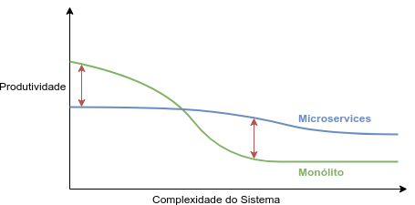
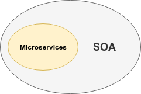
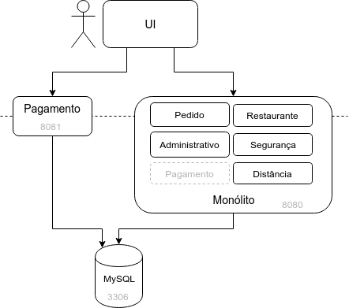
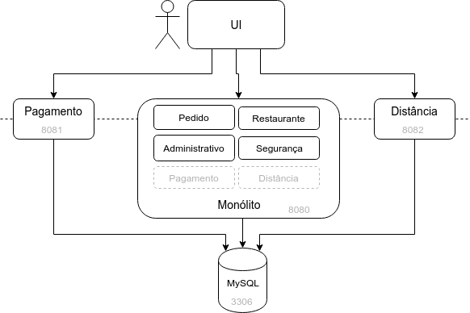

# Extraindo serviços

## O contexto que levou aos Microservices

Na década de 90, aplicações Desktop deram lugar à Web. A arquitetura Web, do estilo Cliente/Servidor com “telas” geradas pelo Servidor (_thin clients_), influenciou na maneira como o código é implantado. Com controle total dos servidores, publicações de novas versões da aplicação foram facilitadas.

Em 2001, vários metodologistas publicaram o **Manifesto Ágil** em que definem os valores e princípios de metodologias leves, que serviram como uma resposta às maneiras burocráticas que levaram vários projetos ao fracasso durante a década de 90. Uma maneira mais adequada seria a entrega frequente de software funcionando através ciclos curtos de colaboração com os clientes, permitindo resposta às mudanças do negócio. Tudo feito por **times autônomos** e pequenos, de 9 pessoas, no máximo.

Em 2003, Eric Evans documentou sua abordagem de design no livro **Domain-Driven Design (DDD)**, em que divide um problema complexo em sub-domínios alinhados com áreas de expertise do negócio. Cada sub-domínio define um contexto delimitado (bounded context) em que há uma linguagem (ubiquitous language). Um modelo dessa linguagem é representado no código: o modelo do domínio (domain model).

Entre 2005 e 2006, a Intel e a AMD criaram extensões em seus processadores para permitir a criação eficiente de **virtual machines** (máquinas virtuais). Já havia tecnologia semelhante em mainframes desde a década de 1960. Porém, com essas novas capacidades em hardwares mais baratos, surgiram uma profusão de soluções como VMWare, VirtualBox, Hyper-V, entre outras.

As tecnologias de criação de máquinas virtuais permitiram o provisionamento (configuração) de máquinas virtuais por meio de scripts, o que ficou conhecido como **infrastructure as code**. A partir de 2005, surgiram várias soluções do tipo como Puppet, Chef, Vagrant, Salt e Ansible.

Em 2006, foi inaugurada a Amazon Web Services (AWS) que, por meio do Elastic Compute Cloud (EC2), cunhou o termo **Cloud Computing**. A ideia é que o código de uma aplicação seria executado na “nuvem”, sem a necessidade de compra, manutenção e configuração de máquina físicas. O poder computacional poderia ser consumido sob-demanda, como luz ou água, permitindo que a infraestrutura de TI seja ajustada às reais necessidades, minimizando máquinas ociosas. 

Em 2009, foi organizada a primeira conferência devopsdays, que unia tópicos de desenvolvimento de software e operações de TI, cunhando o termo **DevOps**.

Em 2010, Jez Humble e David Farley publicaram o livro **Continuous Delivery**, em que descrevem como algumas grandes empresas conseguem publicar software várias vezes ao dia, com poucos defeitos e alta disponibilidade (_zero downtime_). Partindo de técnicas ágeis como _continuous integration_, há um grande foco em automação, inclusive de testes.

Todo esse contexto é resumido por Sam Newman no início do livro [Building Microservices](https://learning.oreilly.com/library/view/building-microservices/9781491950340/) (NEWMAN, 2015):

_Domain-driven design. Continuous delivery. On-demand virtualization. Infrastructure automation. Small autonomous teams. Systems at scale. Microservices have emerged from this world._

## Do monólito (modular) aos Microservices

Um monólito comum, organizado com Package by Layer, pode trazer problemas para aplicações maiores: código progressivamente mais complexo, dependências indevidas, times cada vez maiores, impossibilidade de deploys sem parar a aplicação, entre outros.

Com uma estratégia de componentização baseada em módulos, a manutenção e evolução podem ser melhoradas. Com uma Arquitetura de Plugins, podemos ter pequenos times autônomos. Com runtimes como OSGi, podemos até fazer hot-deploy, atualizando módulos com a aplicação no ar. Com diferentes datasources, podemos explorar diferentes tecnologias de persistência. Com plataformas como a JVM, é possível o uso de linguagens de diversos paradigmas diferentes.

Mas, ainda assim, o monólito é executado como um único processo. Se houver alguma falha na memória ou bug que cause uso massivo de CPU ou um loop infinito, a aplicação toda sairá do ar.

Se houver um aumento na carga, é possível sim escalar um monólito: basta colocarmos um cluster de instâncias, com requests alternados por um Load Balancer. Porém, pode haver uma subutilização de recursos, já que a replicação será de toda a aplicação e não daquelas partes em que há mais necessidade de CPU ou memória. E, como o código será o mesmo, bugs que derrubam a aplicação poderão ser replicados por todos os nós do cluster.

Na palestra [Evoluindo uma Arquitetura inteiramente sobre APIs](https://www.infoq.com/br/presentations/evoluindo-uma-arquitetura-soundcloud/) (CALÇADO, 2013), Phil Calçado diz de maneira bem clara o grande problema de um monólito:

_Quando você tem uma base de código só, você é tão estável quanto a sua parte menos estável._

<!--@note
  O interessante é que o Phil Calçado não usa o termo Microservices nessa palestra, mas APIs. Só que a abordagem é a mesma e ele já dá um hint sobre os BFFs.
-->

E, convenhamos, um monólito modular é algo raríssimo no mercado. Então, para a maioria dos monólitos há problemas com times grandes, deploys e complexidade do código. Mas um monólito modular, com complexidade e dependências gerenciadas, facilitará uma possível migração para serviços.

Simon Brown diz na palestra [Modular monoliths](http://www.codingthearchitecture.com/presentations/sa2015-modular-monoliths) (BROWN, 2015):

_Escolha Microservices por seus benefícios, não por que sua base de código monólitica é uma bagunça._

### Componentização em serviços

Uma **Arquitetura de Microservices** traz uma abordagem diferente de componentização: a aplicação é decomposta em diversos **serviços**.

Um serviço é um componente de software que provê alguma funcionalidade e pode ser implantado independentemente. Cada serviço provê uma **API** que pode ser “consumida” por seus clientes. Uma chamada a um serviço é feita por meio de **comunicação interprocessos** que, no fim das contas, é comunicação pela rede. Isso faz com que uma Arquitetura de Microservices seja um **Sistema Distribuído**.

Microservices:

- são executados em diferentes processos em máquinas (ou containers) distintos
- a comunicação é interprocessos, pela rede
- o deploy é independente, por definição
- podem usar múltiplos mecanismos de persistência em paradigmas diversos (Relacional, NoSQL, etc), desde que não compartilhados com outros serviços
- há diversidade tecnológica, sendo a única restrição a possibilidade de prover uma API em um protocolo padrão (HTTP, AMQP, etc)
- há uma fronteira fortíssima entre as bases de código

## Prós e contras de uma Arquitetura de Microservices

### PRÓ: Times Pequenos e Autônomos

Um Microservice permite times menores, com uma possibilidade de melhor comunicação e mais focados em uma área de negócio. E isso afeta positivamente a velocidade de desenvolvimento de novas funcionalidades.

Uma monólito com uma Arquitetura de Plugins talvez permita o desenvolvimento de diferentes módulos por times diversos em torno de um núcleo comum. Porém, é uma raridade no mercado.

### PRÓ: “Trocabilidade”

É comum termos aquele sistema legado em que ninguém toca e que ninguém sabe dar manutenção. E isso acontece porque qualquer mudança ficou muito arriscada.

Com serviços mais focados, independentes e pequenos, é menos provável acabar com uma parte do sistema que ninguém toca. Caso surja uma nova ideia de implementação melhor e mais eficiente, será mais fácil de trocar a antiga. Caso não haja mais necessidade de um determinado Microservice, podemos removê-lo.

É algo que um monólito modular também permitiria.

### PRÓ: Reuso e composibilidade

Diferentes serviços podem ser compostos em novos serviços, atendendo com agilidade às demandas do negócio. É uma velha promessa do SOA (Service-Oriented Architecture).

A Uber é um exemplo disso: provê um serviço de transporte urbano, mas lançou há algum tempo um serviço de fretes de caminhões e outro de entrega de comida. Provavelmente, reaproveitaram serviços de pagamentos, de geolocalização, entre outros. 

Um monólito modular é uma outra maneira de atingir isso, sem termos um Sistema Distribuído.

### PRÓ: Fronteiras fortes entre componentes

Se usarmos serviços como estratégia de componentização, ao invés de simples pacotes ou módulos, teremos uma separação fortíssima entre o código de cada componente.

Em um monólito não modular é tentador tomar atalhos para entregar funcionalidades mais rápido, esquecendo das fronteiras entre componentes. Mesmo em monólitos modulares, dependendo do sistema de módulos utilizado, é possível acessar em _runtime_ (e até via código) funcionalidades de outros módulos, talvez por meio de _workarounds_ (as famosas gambiarras). Porém, há sistemas de módulos como o Java Module System do Java 9+ e o OSGi, que reforçaram as barreiras entre código de módulos diferentes tanto em desenvolvimento como em runtime.

Uma vantagem de uma Arquitetura de Microservices é que temos esse fronteira fortes entre componentes mantendo a estrutura de cada serviço parecida com a que estamos acostumados. É possível usar o bom e velho _Package by Layer_, já que o código de cada serviço é focado em um conjunto específico de funcionalidades.

Um ponto de atenção é o acesso a dados. Em uma Arquitetura de Microservices, cada serviço tem o seu BD separado. E isso reforça bastante a componentização dos dados, eliminando os perigos de uma integração pelo BD que pode levar a um acomplamento indesejado. Por outro lado, ao separar os BDs, perdemos muitas coisas, que discutiremos adiante.

### PRÓ: Diversidade tecnológica e experimentação

Em uma aplicação monolítica, as escolhas tecnológicas inicias restringem as linguagens e frameworks que podem ser usados.

Com Microservices, partes do sistema podem ser implementadas em tecnologias que estejam mais de acordo com o problema a ser resolvido. Os protocolos de integração entre os serviços passam a ser as partes mais importantes das escolhas tecnológicas.

Essa heterogeneidade tecnológica permite que soluções performáticas e com mais funcionalidades sejam utilizadas.

Em seu artigo [Microservice Trade-Offs](https://martinfowler.com/articles/microservice-trade-offs.html) (FOWLER, 2015a), Martin Fowler diz que coisas prosaicas como atualizar a versão de uma biblioteca podem ser facilitadas. Em um monólito, temos que usar a mesma versão para todo a aplicação e os upgrades podem ser problemáticos. Ou tudo é atualizado, ou nada. Quanto maior a base de código, maior é o problema nas atualizações de bibliotecas.

Sam Newman, no livro [Building Microservices](https://learning.oreilly.com/library/view/building-microservices/9781491950340/) (NEWMAN, 2015), argumenta: _Uma das grandes barreiras para testar e adotar novas tecnologias são os riscos associados. Em um monólito, qualquer mudança impactará uma quantia grande do sistema. Com um sistema que consiste de múltiplos serviços, há múltiplos lugares para testar novas tecnologias. Um serviço de baixo risco pode ser usado para minimizar os riscos e limitar os possíveis impactos negativos. A habilidade de absorver novas tecnologias traz vantagens competitivas para as organizações._

Porém, é importante ressaltar o risco de adotar muitas stacks de tecnologias completamente distintas: é difícil de entender as características de performance, confiabilidade, operações e monitoramento.  Por isso, no livro [Building Microservices](https://learning.oreilly.com/library/view/building-microservices/9781491950340/) (NEWMAN, 2015), Sam Newman diz que empresas como a Netflix e Twitter focam boa parte dos seus esforços em usar a JVM como uma plataforma para diferentes linguagens e tecnologias. Para empresas menores, o risco de adotar tecnologias "esotéricas" é aumentado, já que pode ser difícil de contratar pessoas experientes e familiarizadas com algumas tecnologias.

É possível implementar um monólito poliglota.  Mas é algo raro. No caso da JVM, podemos usar linguagens como Java, Kotlin, Scala e Clojure. Com a GraalVM, podemos até mesclar plataformas, usando algumas linguagens da JVM com algumas da LLVM, entre outras. E múltiplos datasources podem permitir o uso de mecanismos de persistências diferentes, como um BD orientado a Grafos, como o Neo4J,  junto a um BD relacional, como o PostgreSQL.

### PRÓ: Deploy independente

A mudança de uma linha de código em uma aplicação monolítica de um milhão de linhas requer que toda a aplicação seja implantada para que seja feito o _release_ da pequena alteração. Isso leva a deploys de alto risco e alto impacto, o que leva a medo de que alguma coisa dê errado. E esse medo leva a diminuir a frequência dos deploys, o que leva ao acúmulo de mudanças em cada deploy. E quanto mais alterações em um mesmo deploy, maior o risco de que algo dê errado. Esse _ciclo vicioso dos deploys_ é demonstrado por Sam Newman, no livro [Building Microservices](https://learning.oreilly.com/library/view/building-microservices/9781491950340/) (NEWMAN, 2015).

Com Microservices, só um pedaço do sistema fica fora do ar ao implantarmos novas versões. Isso minimiza o risco e o impacto de cada deploy, já que uma falha de um serviço   e diminuiu a indisponibilidade da aplicação. A consequência é que podemos passar a fazer mais deploys em produção, talvez várias vezes por dia. Ou seja, serviços habilitam a entrega rápida, frequente, confiável de aplicações complexas.

Essa Entrega Contínua (_Continuous Delivery_, em inglês) permite que os negócios da organização reajam rápido ao feedback do cliente, a novas oportunidades e a concorrentes. A mudança cultural e organizacional para permitir isso é um dos temas do DevOps.

No artigo [Microservice Trade-Offs](https://martinfowler.com/articles/microservice-trade-offs.html) (FOWLER, 2015a), Martin Fowler argumenta que a relação entre Microservices e Continuous Delivery/DevOps é de duas vias: para ter vários Microservices, provisionar máquinas e implantar aplicações rapidamente são pré-requisitos. Fowler ainda cita Neal Ford, que relaciona uma Arquitetura de Microservices e DevOps: _Microservices são a primeira arquitetura depois da revolução trazida pelo DevOps_.

Atingir algo parecido com um monólito é até possível com algumas tecnologias como OSGi, mas incomum. Martin Fowler diz, ainda no artigo [Microservice Trade-Offs](https://martinfowler.com/articles/microservice-trade-offs.html) (FOWLER, 2015a), que Facebook e Etsy são dois casos de empresas cujos monólitos têm Continuous Delivery. O autor ainda diz que entregas rápidas, confiáveis e frequentes são mais relacionadas com o uso prático de Modularidade do que necessariamente com Microservices.

### PRÓ: Maior isolamento de falhas

Em em um monólito, se uma parte da aplicação apresentar um vazamento de memória, pode ser que o todo seja interrompido.

Quando há uma falha ou indisponibilidade em um serviço, os outros serviços continuam no ar e, portanto, parte da aplicação ainda permanece disponível e utilizável, o que alguns chamam de _graceful degradation_.

### PRÓ: Escalabilidade independente

Em um monólito, componentes que tem necessidades de recursos computacionais completamente diferentes devem ser implantados em conjunto, isso leva a um desperdício de recursos. Se uma pequena parte usa muita CPU, por exemplo, estamos restritos a escalar o todo para atender às demandas de processamento.

Com Microservices, necessidades diferentes em termos computacionais, como processamentos intensivos em termos de memória e/ou CPU, podem ter recursos específicos. Isso minimiza o impacto em outras partes da aplicação, otimiza recursos e diminui custos de operação. Quando são usados provedores de Cloud como AWS, Azure ou Google Cloud, isso levará a um corte de custos quase imediato.

Sam Newman, no livro [Building Microservices](https://learning.oreilly.com/library/view/building-microservices/9781491950340/) (NEWMAN, 2015), cita o caso da Gilt, uma loja online de roupas. Começaram com um monólito Rails em 2007 que, já em 2009, não estava suportando a carga. Ao quebrar partes do sistema, a Gilt conseguiu lidar melhor com picos de tráfego.


<!--@note
Referências
  Building Microservices - Cap 1 - Key Benefits
  Microservice Patterns - Cap 1 - Benefits of the microservice architecture
-->

### CONTRA: Dificuldades inerentes a um Sistema Distribuído

Uma chamada entre dois Microservices envolve a rede. Uma Arquitetura de Microservices é um Sistema Distribuído.

A comunicação intraprocesso, com as chamadas em memória, é milhares de vezes mais rápida que uma chamada interprocessos.

Leslie Lamport, pioneiro da teoria de Sistemas Distribuídos, brincou com a definição de Sistemas Distribuídas em uma [lista interna](https://lamport.azurewebsites.net/pubs/distributed-system.txt) (LAMPORT, 1987) da DEC Systems Research Center: 
_Um sistema distribuído é um sistema em que uma falha em um computador que você nem sabia da existência torna o seu próprio computador inutilizável._

A performance é afetada negativamente. É preciso tomar cuidado com latência, limites de banda, falhas na rede, indisponibilidade de outros serviços, entre outros problemas. Além disso, transações distribuídas são um problema muito complexo.

A rede é lenta e instável e temos que lidar com as consequências disso.

> **As falácias da Computação Distribuída**
>
> Peter Deustch e seus colegas da Sun Microsystems definiram algumas premissas falsas que desenvolvedores assumem quando tratam de aplicações distribuídas:
> 
> 1. A rede é confiável
> 2. A latência é zero
> 3. A banda é infinita
> 4. A rede é segura
> 5. A topologia não muda
> 6. Só há um administrador
> 7. O custo de transporte é zero
> 8. A rede é homogênea

### CONTRA: Complexidade ao operar e monitorar

Configurar, fazer deploy e monitorar um monólito é fácil. Depois de gerar o entregável (WAR, JAR, etc) e configurar portas e endereços de BDs, basta replicar o artefato em diferentes servidores. O sistema está ou não fora do ar, os logs ficam apenas em uma máquina e sabemos claramente por onde uma requisição passou.

Em uma Arquitetura de Microservices, precisamos:

- agregar logs que ficam espalhados pelos diversos Microservices 
- saber da “saúde” de cada um dos Microservices
- rastrear por quais Microservices passa uma requisição
- ter uma maneira de facilitar a configuração de portas e endereços de BDs e de outros Microservices
- fazer deploy dos diferentes Microservices

Já no post [Microservice Prerequisites](https://martinfowler.com/bliki/MicroservicePrerequisites.html) (FOWLER, 2014), Martin Fowler descrever alguns pré-requisitos para a adoção de uma Arquitetura de Microservices:

- **provisionamento rápido**: preparar novos servidores com os softwares, dados e configurações necessários deve ser rápido e o mais automatizado o possível. Provedores e ferramentas de Cloud ajudam muito nessa tarefa.
- **deploy rápido**: fazer o deploy da aplicação em ambientes de teste e produção deve ser algo rápido e automatizado.
- **monitoramento básico**: detectar indisponibilidade de serviços, erros e acompanhar métricas de negócio é essencial
- **cultura DevOps**: é necessária uma mudança cultural em direção a uma maior colaboração entre desenvolvedores e pessoal de infra

Se Continuous Delivery é uma prática importante para monólitos, torna-se essencial para uma Arquitetura de Microservices. Ferramentas de automação de infra-estrutura são imprescindíveis. 

James Lewis diz, no [podcast SE Radio](https://www.se-radio.net/2014/10/episode-213-james-lewis-on-microservices/) (LEWIS, 2014), que:

_"Nós estamos mudando a COMPLEXIDADE ACIDENTAL de dentro da aplicação para a infraestrutura. AGORA é uma boa hora para isso porque nós temos mais maneiras de gerenciar a complexidade. Infraestrutura programável, automação, tudo indo pra cloud. Nós temos ferramentas melhores para resolver esse problemas AGORA."_

Michael Feathers, no post [Microservices Until Macro Complexity](https://michaelfeathers.silvrback.com/microservices-until-macro-complexity
) (FEATHERS, 2014), diz que há uma Lei da conservação da complexidade no software:

_"Quando quebramos coisas grandes em pequenos pedaços nós passamos a complexidade para a interação entre elas."_

> **Complexidade Essencial x Complexidade Acidental**
>
> No clássico artigo [No Silver Bullets](http://faculty.salisbury.edu/~xswang/Research/Papers/SERelated/no-silver-bullet.pdf) (BROOKS, 1986), Fred Brooks separa complexidades essenciais do software, que tem a ver com o problema que está sendo resolvido (e, poderíamos dizer, com o domínio) de complexidades acidentais, que são reflexos das escolhas tecnológicas. O autor argumenta que mesmo que as complexidades acidentais fossem zero, ainda não teríamos um ganho significativo no esforço de produzir um software. Por isso, **não existe bala de prata**.

### CONTRA: Perda da consistência dos dados e transações

Manter uma consistência forte dos dados em um Sistema Distribuído é extremamente difícil.

De acordo com o Teorema CAP, cunhado por Eric Brewer na publicação [Towards Robust Distributed Systems](http://pld.cs.luc.edu/courses/353/spr11/notes/brewer_keynote.pdf) (BREWER, 2000), não é possível termos simultaneamente mais que duas das seguintes características: Consistência dos dados, Disponibilidade (_Availability_, em inglês) e tolerância a Partições de rede. Ou seja, se a rede falhar, temos que escolher entre Consistência e Disponibilidade. Se escolhermos Consistência, o sistema ficará indisponível até a falha na rede ser resolvido. Se escolhermos Disponibilidade, a Consistência será sacrificada. Portanto, em um Sistema Distribuído, não temos garantias ACID (Atomicidade, Consistência, Isolamento e Durabilidade). Em um esperto jogo de palavras com os conceitos da químico de ácido e base, Brewer diz que poderíamos ter garantias BASE (Basically Available, Soft-state, Eventually consistent): para manter um Sistema Distribuído disponível, teríamos respostas aproximadas que eventualmente ficariam consistentes.

Daniel Abadi, no paper [Consistency Tradeoffs in Modern Distributed Database System Design](http://www.cs.umd.edu/~abadi/papers/abadi-pacelc.pdf)(ABADI, 2012) , cunha o Teorema PACELC, incluindo alta latência de rede como uma forma de indisponibilidade.

No artigo [Microservice Trade-Offs](https://martinfowler.com/articles/microservice-trade-offs.html) (FOWLER, 2015a), Martin Fowler descreve o seguinte cenário: você faz uma atualização de algo e, ao recarregar a página, a atualização não está lá. Depois de alguns minutos, você dá refresh novamente a atualização aparece. Talvez isso acontece porque a atualização foi feita em um nó do cluster mas o segundo request obteve os dados de outro nó. Eventualmente, os nós ficam consistentes, com os mesmos dados. O autor pondera que inconsistências como essa são irritantes, mas podem ser catastróficas para a Organização quando decisões de negócios são feitas com base em dados inconsistentes. E o pior: é muito difícil de reproduzir e debugar!

<!--@note
  Um exemplo semelhante são os likes que "não pegam" em redes sociais.
-->

Em um monólito, é possível alterar vários dados no BD de maneira consistente, usando apenas uma transação. Como cada Microservice tem o seu BD, as transações teriam que ser distribuídas, o que iria na direção da Consistência em detrimento da Disponibilidade. O mundo dos Microservices abraça a consistência eventual (em inglês, _eventual consistency_). Processos de negócio são relativamente tolerantes a pequenas inconsistências momentâneas.

### CONTRA: Saber o momento correto de adoção é difícil

Encontrar fatias pequenas e independentes do domínio, criando fronteiras arquiteturais alinhadas com os Bounded Contexts, é difícil no começo do projeto, quando não se conhece claramente o Negócio ou as possíveis alterações. Isso é especialmente difícil para startups, que ainda estão validando o Modelo de Negócio e fazem mudanças drásticas com frequência. Aliando-se a isso as complexidade de operação, monitoramento e os desafios de um Sistema Distribuído, uma Arquitetura de Microservices pode ser uma escolha ruim para uma startup que tem uma base de usuário limitada, uma equipe reduzida e pouco financiamento.

Do ponto de vista Lean, usar uma Arquitetura de Microservices para um projeto simples ou em fase inicial pode ser considerado _overengineering_, um tipo de desperdício (Muda).

No artigo [Microservice Premium](https://martinfowler.com/bliki/MicroservicePremium.html) (FOWLER, 2015b), Martin Fowler argumenta que uma Arquitetura de Microservices introduz uma complexidade que pode elevar os custos e riscos do projeto, como se fosse adicionado um ágio (em inglês, _premium_). O autor diz que, para projetos de baixa complexidade (essenciais, poderíamos dizer), uma Arquitetura de Microservices adiciona uma série de complicações no monitoramento, em como lidar com falhas e consistência eventual, entre outras. Já para projetos mais complexos, com um time muito grande, muitos modelos de interação com o usuário, dificuldade em escalar, partes do negócio que evoluem independentemente ou uma base de código gigantesca, vale pensar em uma Arquitetura de Microservices. Martin Fowler conclui: 

_Minha principal orientação seria nem considerar Microservices, a menos que você tenha um sistema complexo demais para gerenciar como um Monólito. A maioria dos sistemas de software deve ser construída como uma única aplicação monolítica. Atenção deve ser prestada à uma boa modularização do Monólito (...) Se você puder  manter o seu sistema simples o suficiente para evitar a necessidade de Microservices: faça._



#### Começar com um Monólito ou com Microservices?

No artigo [Monolith First](https://www.martinfowler.com/bliki/MonolithFirst.html) (FOWLER, 2015c), Martin Fowler argumenta que devemos começar com um Monólito, mesmo se você tiver certeza que a aplicação será grande e complexa o bastante para compensar o uso de Microservices. Fowler baseia o argumento em sua experiência:

_Quase todas as histórias de sucesso de Microservices começaram com um Monólito que ficou muito grande e foi decomposto. Quase todos os casos de sistemas que começaram com Microservices do zero, terminaram em sérios apuros. (...) Até arquitetos experientes trabalhando em domínios familiares tem grandes dificuldades em acertar quais são as fronteiras estáveis entre serviços._

Stefan Tilkov publicou o artigo [Don't start with a monolith](https://martinfowler.com/articles/dont-start-monolith.html) (TILKOV, 2015) no próprio site de Martin Fowler, argumentando o contrário: é incrivelmente difícil, senão impossível, fatiar um monólito. Pra Tilkov, o que é necessário na verdade é um bom conhecimento sobre o domínio da aplicação antes começar a particioná-lo. Outro argumento é que um Monólito bem componentizado e com baixo acoplamento é raríssimo e que uma das maiores vantagens dos Microservices é a fronteira fortíssima entre o código de cada serviço, evitando um emaranhado nas dependências. Partes do monólito comunicam entre si usando as mesmas bibliotecas, usam o mesmo modelo de persistência, podem usar transações no BD e muitas vezes compartilham objetos de domínio. Tudo isso dificulta imensamente uma possível migração posterior para uma Arquitetura de Microservices. Para o autor, em sistemas que sabe-se que serão grandes, complexos e em que o domínio é familiar, vale a pena começar a construí-los em subsistemas da maneira mais independente o possível.

Um outro argumento a favor do uso inicial de uma Arquitetura de Microservices é que, se as ferramentas de deploy, configuração e monitoramento são complexas, devemos começar a dominá-las o mais cedo o possível. Claro, se a visão é que o projeto crescerá em tamanho e complexidade.

## Quão micro deve ser um Microservice?

Os serviços em uma Arquitetura de Microservices devem ser pequenos. Por isso, o “micro” no nome. Mas o que deve ser considerado “micro”? Algo menor que um miliservice ou maior que um nanoservice (termo infelizmente usado pelo mercado)? Não! O tamanho não é importante! O termo “micro” é enganoso.

<!--@note
  Alexandre: costumo a desenhar uma tabelinha com micro (10^-6), nano (10^-12) e mili (10^-3) e perguntar isso.
-->

Chris Richardson, no livro [Microservice Patterns](https://www.manning.com/books/microservices-patterns) (RICHARDSON, 2018) diz:

_Um problema com o termo Microservice é que a primeira coisa que você ouve é micro. Isso sugere que um serviço deve ser muito pequeno. (...) Na realidade, tamanho não é uma métrica útil. Um objetivo melhor é definir um serviço bem modelado como um serviço capaz de ser desenvolvido por um time pequeno com um lead time mínimo e com mínima colaboração com outros times. Na teoria, um time deve ser responsável somente por um serviço (...) Por outro lado, se um serviço requer um time grande ou leva muito tempo para ser testado, provavelmente faz sentido dividir o time e o serviço._

O critério para decomposição deve ser, em geral, algo alinhado com o negócio da organização. No fim das contas, o objetivo principal é alinhar negócio à TI. Um serviço pequeno é um serviço que embarca uma capacidade de negócio.

Os conceitos de Agregado e Contexto Delimitado do DDD, que vimos no capítulo anterior, vêm à nossa ajuda!

Um Microservice pode ser modelado como um Agregado ou, preferencialmente, como um Contexto Delimitado (Bounded Context) em que a linguagem do especialista de domínio será representada no código (Domain Model) sem apresentar inconsistências.

No livro [Building Microservices](https://learning.oreilly.com/library/view/building-microservices/9781491950340/) (NEWMAN, 2015), Sam Newman diz que devemos focar as fronteiras entre os serviços nas fronteiras do negócio. Dessa maneira, saberemos onde estará o código de uma determinada funcionalidade e evitaremos a tentação de deixar um determinado serviço crescer demais. Ao modelar de acordo com o negócio, as fronteiras ficam claras.

Phil Calçado, em [um tweet](https://twitter.com/pcalcado/status/963183090339385345) (CALÇADO, 2018),  diz que o critério de decomposição de uma Arquitetura de Microservices deve ser parecido com o de um monólito modular:

_Eu sempre descrevo Microservices como a aplicação da mesma maneira de agrupar que você teria em uma aplicação maior, só que através de seus componentes distribuídos._

### Cuidado com o Monólito Distribuído

No livro [Monolith to Microservices](https://learning.oreilly.com/library/view/monolith-to-microservices/9781492047834/) (NEWMAN, 2019), Sam Newman define um Monólito Distribuído como um sistema que consiste de múltiplos serviços mas cujos deploys devem ser feitos ao mesmo tempo. Na experiência do autor, um Monólito Distribuído tem todas as desvantagens de um Sistema Distribuído e todas as desvantagens de um Monólito. Para Newman, um Monólito Distribuído emerge de um ambiente em que não houve foco o suficiente em conceitos como _Information Hiding_ e coesão das funcionalidades de negócio, levando a arquiteturas altamente acopladas em que mudanças se propagam através dos limites de serviço e onde mudanças aparentemente inocentes, que parecem ter escopo local, quebram outras partes do sistema.

Uma maneira comum de chegar a um Monólito Distribuído é ter serviços extremamente pequenos, chegando a um serviço por Entidade de Negócio (objetos que tem continuidade, identidade e estão representados em algum mecanismo de persistência).

Chris Richardson, no livro [Microservice Patterns](https://www.manning.com/books/microservices-patterns) (RICHARDSON, 2018), chega uma conclusão semelhante: um Monólito Distribuído é o resultado de uma decomposição incorreta dos componentes. Para Richardson, o antídoto aos Monólitos Distribuídos é seguir, só que no nível de serviços, o Common Closure Principle definido por Robert "Uncle Bob" Martin: _Agregue, em componentes, classes que mudam ao mesmo tempo e pelos mesmos motivos. Separe em componentes diferentes classes que mudam em momentos diferentes e por razões distintas._

## Microservices e SOA

SOA (Service-Oriented Architecture) é uma abordagem arquitetural documentada pela Gartner em um artigo de 1996 que, no começo da década de 2000, passou a ser adotada por várias grandes corporações. A oportunidade de vender soluções de software e hardware foi aproveitada por empresas de TI como IBM, Oracle, HP, SAP e Sun durante essa década.

Chris Richardson, em seu livro [Microservices Patterns](https://www.manning.com/books/microservices-patterns) (RICHARDSON, 2018), descreve SOA como sendo uma arquitetura que usa _smart pipes_ como ESB, protocolos pesados como SOAP e WS-*, Persistência centralizada em BDs corporativos e serviços de granularidade grossa. Talvez seja a versão mais comum de SOA que vemos implementada nas organizações.

Martin Fowler e James Lewis dizem em seu artigo sobre [Microservices](https://martinfowler.com/articles/microservices.html) (FOWLER; LEWIS, 2014), que há uma grande ambiguidade sobre o que SOA realmente é e, dependendo da definição, uma Arquitetura de Microservices é SOA, mas pode não ser. Talvez seria “SOA do jeito certo”. Algumas características a distinguem do SOA implementado em grandes organizações: governança e gerenciamento de dados descentralizado; mais inteligência nos Microservices (_smart endpoints_) e menos nos canais de comunicação (_dumb pipes_). Um ESB seria um _smart pipe_, já que faz roteamento de mensagens, transformações, orquestração e até algumas regras de negócio. Ainda citam em um rodapé que a Netflix, uma das referências em Microservices, inicialmente chamava sua abordagem de _fine-grained SOA_.

<!--@note
  Alexandre: eu já trabalhei, nos idos de 2013, como analista de integração em uma grande empresa de seguros do Brasil. Haviam 5 diretorias: Seguros, Saúde, Previdência, Capitalização e Consórcios. Um serviço era basicamente uma diretoria. Portanto, tínhamos 5 serviços. Uma história interessante é que uma merge 5 empresas diferentes com sistemas feitos em COBOL, Oracle Forms + PL/SQL, SQL Server + T-SQL e até Web Services SOAP. E tudo isso tinha que ser vendido como uma coisa só, num front-end. Era usado um ESB de um desses grandes players do mercado de TI.
-->

Henrique Lobo mostra em seu artigo [Repensando micro serviços](https://www.itexto.com.br/devkico/?p=1768) que SOA como descrito pelo consórcio de padrões abertos [OASIS](https://en.wikipedia.org/wiki/OASIS_(organization) é muito parecido com o espírito dos microservices.

Sam Newman, em seu livro [Building Microservices](https://learning.oreilly.com/library/view/building-microservices/9781491950340/) (NEWMAN, 2015), reconhece que SOA trouxe boas ideias, mas que houve uma falta de consenso em como fazer SOA bem e dificuldade em ter uma narrativa alternativa à dos vendedores. SOA passou a ser visto como uma coleção de ferramentas e não como uma abordagem arquitetural. Ainda fala que uma Arquitetura de Microservices está para SOA assim como XP e Scrum estão para Agile: uma abordagem específica que veio de projetos reais.

Microservices são, então, uma abordagem para SOA.



<!--
TODO:
## Estrangulando o monólito

> **Pattern: STRANGLER APPLICATION**
>
> 
-->


## Criando um microservice de pagamentos

Pelo navegador, abra `https://start.spring.io/`.
Em _Project_, mantenha _Maven Project_.
Em _Language_, mantenha _Java_.
Em _Spring Boot_, mantenha a versão padrão.
No trecho de _Project Metadata_, defina:

- `br.com.caelum` em _Group_
- `eats-pagamento-service` em _Artifact_

Clique em _More options_.
Mantenha o valor em _Name_.
Apague a _Description_, deixando-a em branco.
Em _Package Name_, mude para `br.com.caelum.eats.pagamento`.

Mantenha o _Packaging_ como `Jar`.
Mantenha a _Java Version_ em `8`.

Em _Dependencies_, adicione:

- Web
- DevTools
- Lombok
- JPA
- MySQL

Clique em _Generate Project_.

Extraia o `eats-pagamento-service.zip`.

No arquivo `src/main/resources/application.properties`, modifique a porta para `8081` e, por enquanto, aponte para o mesmo BD do monólito. Defina também algumas outras configurações do JPA e de serialização de JSON.

####### fj33-eats-pagamento-service/src/main/resources/application.properties

```properties
server.port = 8081

#DATASOURCE CONFIGS
spring.datasource.url=jdbc:mysql://localhost/eats?createDatabaseIfNotExist=true
spring.datasource.username=<SEU USUARIO>
spring.datasource.password=<SUA SENHA>

#JPA CONFIGS
spring.jpa.hibernate.ddl-auto=validate
spring.jpa.show-sql=true

spring.jackson.serialization.fail-on-empty-beans=false
```

Observação: `<SEU USUARIO>` e `<SUA SENHA>` devem ser trocados pelos valores do MySQL do monólito.

## Extraindo código de pagamentos do monólito

Copie do módulo `eats-pagamento` do monólito, as seguintes classes, colando-as no pacote `br.com.caelum.eats.pagamento` do `eats-pagamento-service`:

- `Pagamento`
- `PagamentoController`
- `PagamentoDto`
- `PagamentoRepository`
- `ResourceNotFoundException`

Dica: você pode copiar e colar pelo próprio Eclipse.

Há alguns erros de compilação. Os corrigiremos nos próximos passos.

Na classe `Pagamento`, há erros de compilação nas referências às classes `Pedido` e `FormaDePagamento` que são, respectivamente, dos módulos `eats-pedido` e `eats-administrativo` do monólito.

Será que devemos colocar dependências Maven a esses módulos? Não parece uma boa, não é mesmo?

Vamos, então, trocar as referências a essas classes pelos respectivos ids, de maneira a referenciar as raízes dos agregados `Pedido` e `FormaDePagamento`:

####### fj33-eats-pagamento-service/src/main/java/br/com/caelum/eats/pagamento/Pagamento.java

```java
// anotações ...
class Pagamento {

  // código omitido...

  @̶M̶a̶n̶y̶T̶o̶O̶n̶e̶(̶o̶p̶t̶i̶o̶n̶a̶l̶=̶f̶a̶l̶s̶e̶)̶
  p̶r̶i̶v̶a̶t̶e̶ ̶P̶e̶d̶i̶d̶o̶ ̶p̶e̶d̶i̶d̶o̶;̶

  @Column(nullable=false)
  private Long pedidoId;

  @̶M̶a̶n̶y̶T̶o̶O̶n̶e̶(̶o̶p̶t̶i̶o̶n̶a̶l̶=̶f̶a̶l̶s̶e̶)̶
  p̶r̶i̶v̶a̶t̶e̶ ̶F̶o̶r̶m̶a̶D̶e̶P̶a̶g̶a̶m̶e̶n̶t̶o̶ ̶f̶o̶r̶m̶a̶D̶e̶P̶a̶g̶a̶m̶e̶n̶t̶o̶;̶

  @Column(nullable=false)
  private Long formaDePagamentoId;

}
```

Ajuste os imports, removendo os desnecessários e adicionando novos:

```java
i̶m̶p̶o̶r̶t̶ ̶b̶r̶.̶c̶o̶m̶.̶c̶a̶e̶l̶u̶m̶.̶e̶a̶t̶s̶.̶a̶d̶m̶i̶n̶.̶F̶o̶r̶m̶a̶D̶e̶P̶a̶g̶a̶m̶e̶n̶t̶o̶;̶
i̶m̶p̶o̶r̶t̶ ̶b̶r̶.̶c̶o̶m̶.̶c̶a̶e̶l̶u̶m̶.̶e̶a̶t̶s̶.̶p̶e̶d̶i̶d̶o̶.̶P̶e̶d̶i̶d̶o̶;̶
i̶m̶p̶o̶r̶t̶ ̶j̶a̶v̶a̶x̶.̶p̶e̶r̶s̶i̶s̶t̶e̶n̶c̶e̶.̶M̶a̶n̶y̶T̶o̶O̶n̶e̶;̶

import javax.persistence.Column; // adicionado ...

// outros imports ...
```

A mesma mudança deve ser feita para a classe `PagamentoDto`, referenciando apenas os ids das classes `PedidoDto` e `FormaDePagamento`:

####### fj33-eats-pagamento-service/src/main/java/br/com/caelum/eats/pagamento/PagamentoDto.java

```java
// anotações ...
class PagamentoDto {

  // outros atributos...

  p̶r̶i̶v̶a̶t̶e̶ ̶F̶o̶r̶m̶a̶D̶e̶P̶a̶g̶a̶m̶e̶n̶t̶o̶D̶t̶o̶ ̶f̶o̶r̶m̶a̶D̶e̶P̶a̶g̶a̶m̶e̶n̶t̶o̶;̶
  private Long formaDePagamentoId;

  p̶r̶i̶v̶a̶t̶e̶ ̶P̶e̶d̶i̶d̶o̶D̶t̶o̶ ̶p̶e̶d̶i̶d̶o̶;̶
  private Long pedidoId;

  public PagamentoDto(Pagamento p) {
    this(p.getId(), p.getValor(), p.getNome(), p.getNumero(), p.getExpiracao(), p.getCodigo(), p.getStatus(),
      n̶e̶w̶ ̶F̶o̶r̶m̶a̶D̶e̶P̶a̶g̶a̶m̶e̶n̶t̶o̶D̶t̶o̶(̶p̶.̶g̶e̶t̶F̶o̶r̶m̶a̶D̶e̶P̶a̶g̶a̶m̶e̶n̶t̶o̶(̶)̶)̶,̶
      p.getFormaDePagamentoId(),
      n̶e̶w̶ ̶P̶e̶d̶i̶d̶o̶D̶t̶o̶(̶p̶.̶g̶e̶t̶P̶e̶d̶i̶d̶o̶(̶)̶)̶)̶;̶
      p.getPedidoId());
  }

}
```

Remova os imports desnecessários:

```java
i̶m̶p̶o̶r̶t̶ ̶b̶r̶.̶c̶o̶m̶.̶c̶a̶e̶l̶u̶m̶.̶e̶a̶t̶s̶.̶a̶d̶m̶i̶n̶i̶s̶t̶r̶a̶t̶i̶v̶o̶.̶F̶o̶r̶m̶a̶D̶e̶P̶a̶g̶a̶m̶e̶n̶t̶o̶D̶t̶o̶;̶
i̶m̶p̶o̶r̶t̶ ̶b̶r̶.̶c̶o̶m̶.̶c̶a̶e̶l̶u̶m̶.̶e̶a̶t̶s̶.̶p̶e̶d̶i̶d̶o̶.̶P̶e̶d̶i̶d̶o̶D̶t̶o̶;̶
```

Ao confirmar um pagamento, a classe `PagamentoController` atualiza o status do pedido.

Por enquanto, vamos simplificar a confirmação de pagamento, que ficará semelhante a criação e cancelamento: apenas o status do pagamento será atualizado.

Depois voltaremos com a atualização do pedido.

####### fj33-eats-pagamento-service/src/main/java/br/com/caelum/eats/pagamento/PagamentoController.java

```java
// anotações ...
class PagamentoController {

  private PagamentoRepository pagamentoRepo;
  p̶r̶i̶v̶a̶t̶e̶ ̶P̶e̶d̶i̶d̶o̶S̶e̶r̶v̶i̶c̶e̶ ̶p̶e̶d̶i̶d̶o̶s̶;̶

  // demais métodos...

  @PutMapping("/{id}")
  public PagamentoDto confirma(@PathVariable Long id) {
    Pagamento pagamento = pagamentoRepo.findById(id).orElseThrow(() -> new ResourceNotFoundException());
    pagamento.setStatus(Pagamento.Status.CONFIRMADO);
    pagamentoRepo.save(pagamento);
    L̶o̶n̶g̶ ̶p̶e̶d̶i̶d̶o̶I̶d̶ ̶=̶ ̶p̶a̶g̶a̶m̶e̶n̶t̶o̶.̶g̶e̶t̶P̶e̶d̶i̶d̶o̶(̶)̶.̶g̶e̶t̶I̶d̶(̶)̶;̶
    ̶P̶e̶d̶i̶d̶o̶ ̶p̶e̶d̶i̶d̶o̶ ̶=̶ ̶p̶e̶d̶i̶d̶o̶s̶.̶p̶o̶r̶I̶d̶C̶o̶m̶I̶t̶e̶n̶s̶(̶p̶e̶d̶i̶d̶o̶I̶d̶)̶;̶
    ̶p̶e̶d̶i̶d̶o̶.̶s̶e̶t̶S̶t̶a̶t̶u̶s̶(̶P̶e̶d̶i̶d̶o̶.̶S̶t̶a̶t̶u̶s̶.̶P̶A̶G̶O̶)̶;̶
    ̶p̶e̶d̶i̶d̶o̶s̶.̶a̶t̶u̶a̶l̶i̶z̶a̶S̶t̶a̶t̶u̶s̶(̶P̶e̶d̶i̶d̶o̶.̶S̶t̶a̶t̶u̶s̶.̶P̶A̶G̶O̶,̶ ̶p̶e̶d̶i̶d̶o̶)̶;̶
    return new PagamentoDto(pagamento);
  }
}
```

Ah! Limpe os imports:

```java
i̶m̶p̶o̶r̶t̶ ̶b̶r̶.̶c̶o̶m̶.̶c̶a̶e̶l̶u̶m̶.̶e̶a̶t̶s̶.̶p̶e̶d̶i̶d̶o̶.̶P̶e̶d̶i̶d̶o̶;̶
i̶m̶p̶o̶r̶t̶ ̶b̶r̶.̶c̶o̶m̶.̶c̶a̶e̶l̶u̶m̶.̶e̶a̶t̶s̶.̶p̶e̶d̶i̶d̶o̶.̶P̶e̶d̶i̶d̶o̶S̶e̶r̶v̶i̶c̶e̶;̶
```

## Fazendo a UI chamar novo serviço de pagamentos

Adicione uma propriedade `pagamentoUrl`, que aponta para o endereço do novo serviço de pagamentos, no arquivo `environment.ts`:

####### fj33-eats-ui/src/environments/environment.ts

```typescript
export const environment = {
  production: false,
  baseUrl: '//localhost:8080'
  , pagamentoUrl: '//localhost:8081' //adicionado
};
```

Use a nova propriedade `pagamentoUrl` na classe `PagamentoService`:

####### fj33-eats-ui/src/app/services/pagamento.service.ts

```typescript
export class PagamentoService {

  p̶r̶i̶v̶a̶t̶e̶ ̶A̶P̶I̶ ̶=̶ ̶e̶n̶v̶i̶r̶o̶n̶m̶e̶n̶t̶.̶b̶a̶s̶e̶U̶r̶l̶ ̶+̶ ̶'̶/̶p̶a̶g̶a̶m̶e̶n̶t̶o̶s̶'̶;̶
  private API = environment.pagamentoUrl + '/pagamentos';

  // restante do código ...
}
```

No `eats-pagamento-service`, trocamos referências às entidades `Pedido` e `FormaDePagamento` pelos respectivos ids. Essa mudança afeta o código do front-end. Faça o ajuste dos ids na classe `PagamentoService`:

####### fj33-eats-ui/src/app/services/pagamento.service.ts

```typescript
export class PagamentoService {

  // código omitido ...

  cria(pagamento): Observable<any> {
    this.ajustaIds(pagamento); // adicionado
    return this.http.post(`${this.API}`, pagamento);
  }

  confirma(pagamento): Observable<any> {
    this.ajustaIds(pagamento); // adicionado
    return this.http.put(`${this.API}/${pagamento.id}`, null);
  }

  cancela(pagamento): Observable<any> {
    this.ajustaIds(pagamento); // adicionado
    return this.http.delete(`${this.API}/${pagamento.id}`);
  }

  // adicionado
  private ajustaIds(pagamento) {
    pagamento.formaDePagamentoId = pagamento.formaDePagamentoId || pagamento.formaDePagamento.id;
    pagamento.pedidoId = pagamento.pedidoId || pagamento.pedido.id;
  }

}
```

O código do método privado `ajustaIds` define as propriedades `formaDePagamentoId` e `pedidoId`, caso ainda não estejam presentes.

No componente `PagamentoPedidoComponent`, precisamos fazer ajustes para usar o atributo `pedidoId` do pagamento:

####### fj33-eats-ui/src/app/pedido/pagamento/pagamento-pedido.component.ts

```typescript
export class PagamentoPedidoComponent implements OnInit {

  // código omitido ...

  confirmaPagamento() {
    this.pagamentoService.confirma(this.pagamento)
      .̶s̶u̶b̶s̶c̶r̶i̶b̶e̶(̶p̶a̶g̶a̶m̶e̶n̶t̶o̶ ̶=̶>̶ ̶t̶h̶i̶s̶.̶r̶o̶u̶t̶e̶r̶.̶n̶a̶v̶i̶g̶a̶t̶e̶B̶y̶U̶r̶l̶(̶`̶p̶e̶d̶i̶d̶o̶s̶/̶$̶{̶p̶a̶g̶a̶m̶e̶n̶t̶o̶.̶p̶e̶d̶i̶d̶o̶.̶i̶d̶}̶/̶s̶t̶a̶t̶u̶s̶`̶)̶)̶;̶
      .subscribe(pagamento => this.router.navigateByUrl(`pedidos/${pagamento.pedidoId}/status`));
  }

  // restante do código ...

}
```

Com o monólito e o serviço de pagamentos sendo executados, podemos testar o pagamento de um novo pedido.

Deve ocorrer um _Erro no Servidor_. O Console do navegador, acessível com F12, deve ter um erro parecido com:

_Access to XMLHttpRequest at 'http://localhost:8081/pagamentos' from origin 'http://localhost:4200' has been blocked by CORS policy: Response to preflight request doesn't pass access control check: No 'Access-Control-Allow-Origin' header is present on the requested resource._

Isso acontece porque precisamos habilitar o CORS no serviço de pagamentos, que está sendo invocado diretamente pelo navegador.

## Habilitando CORS no serviço de pagamentos

Para habilitar o Cross-Origin Resource Sharing (CORS) no serviço de pagamento, é necessário definir uma classe `CorsConfig` no pacote `br.com.caelum.eats.pagamento`, semelhante à do módulo `eats-application` do monólito:

```java
@Configuration
class CorsConfig implements WebMvcConfigurer {

  @Override
  public void addCorsMappings(CorsRegistry registry) {
    registry.addMapping("/**").allowedMethods("*").allowCredentials(true);
  }

}
```

Faça um novo pedido, crie e confirme um pagamento. Deve funcionar!

Note apenas um detalhe: o status do pedido, exibido na tela após a confirmação do pagamento, **está _REALIZADO_ e não _PAGO_**. Isso ocorre porque removemos a chamada à classe `PedidoService`, que ainda está no módulo `eats-pedido` do monólito. Corrigiremos esse detalhe mais adiante no curso.

## Apagando código de pagamentos do monólito

Remova a dependência a `eats-pagamento` do `pom.xml` do módulo `eats-application` do monólito:

####### fj33-eats-monolito-modular/eats/eats-application/pom.xml

```xml
<̶d̶e̶p̶e̶n̶d̶e̶n̶c̶y̶>̶
̶ ̶ ̶<̶g̶r̶o̶u̶p̶I̶d̶>̶b̶r̶.̶c̶o̶m̶.̶c̶a̶e̶l̶u̶m̶<̶/̶g̶r̶o̶u̶p̶I̶d̶>̶
̶ ̶ ̶<̶a̶r̶t̶i̶f̶a̶c̶t̶I̶d̶>̶e̶a̶t̶s̶-̶p̶a̶g̶a̶m̶e̶n̶t̶o̶<̶/̶a̶r̶t̶i̶f̶a̶c̶t̶I̶d̶>̶
̶ ̶ ̶<̶v̶e̶r̶s̶i̶o̶n̶>̶$̶{̶p̶r̶o̶j̶e̶c̶t̶.̶v̶e̶r̶s̶i̶o̶n̶}̶<̶/̶v̶e̶r̶s̶i̶o̶n̶>̶
̶<̶/̶d̶e̶p̶e̶n̶d̶e̶n̶c̶y̶>̶
```

No projeto pai dos módulos, o projeto `eats`, remova o módulo `eats-pagamento`  do `pom.xml`:

####### fj33-eats-monolito-modular/eats/pom.xml

```xml
<modules>
  <module>eats-administrativo</module>
  <̶m̶o̶d̶u̶l̶e̶>̶e̶a̶t̶s̶-̶p̶a̶g̶a̶m̶e̶n̶t̶o̶<̶/̶m̶o̶d̶u̶l̶e̶>̶
  <module>eats-restaurante</module>
  <module>eats-pedido</module>
  <module>eats-distancia</module>
  <module>eats-seguranca</module>
  <module>eats-application</module>
</modules>
```

Apague o módulo `eats-pagamento` do monólito. Pelo Eclipse, tecle _Delete_ em cima do módulo, selecione a opção _Delete project contents on disk (cannot be undone)_ e clique em _OK_. O diretório com o código do módulo `eats-pagamento` será removido do disco.

Extraímos nosso primeiro serviço do monólito. A evolução do código de pagamento, incluindo a exploração de novos meios de pagamento, pode ser feita em uma base de código separada do monólito. Porém, ainda mantivemos o mesmo BD, que será migrado em capítulos posteriores.



## Exercício: Testando o novo serviço de pagamentos

1. Abra um Terminal e, no Desktop, clone o projeto com o código do serviço de pagamentos:

  ```sh
  cd ~/Desktop
  git clone https://gitlab.com/aovs/projetos-cursos/fj33-eats-pagamento-service.git
  ```

  Vamos criar um workspace do Eclipse separado para os microservices, mantendo aberto o workspace com o monólito. Para isso, clique no ícone do Eclipse da área de trabalho. Em _Workspace_, defina `/home/<usuario-do-curso>/workspace-microservices`, onde `<usuario-do-curso>` é o login do curso.

  No Eclipse, importe o projeto `fj33-eats-pagamento-service`, usando o menu _File > Import > Existing Maven Projects_.

  Então, execute a classe `EatsPagamentoServiceApplication`.

   Teste a criação de um pagamento com o cURL:

  ```sh
  curl -X POST
    -i
    -H 'Content-Type: application/json'
    -d '{ "valor": 51.8, "nome": "JOÃO DA SILVA", "numero": "1111 2222 3333 4444", "expiracao": "2022-07", "codigo": "123", "formaDePagamentoId": 2, "pedidoId": 1 }'
    http://localhost:8081/pagamentos
  ```

  Para que você não precise digitar muito, o comando acima está disponível em: https://gitlab.com/snippets/1859389

  No comando acima, usamos as seguintes opções do cURL:

  - `-X` define o método HTTP a ser utilizado
  - `-i` inclui informações detalhadas da resposta
  - `-H` define um cabeçalho HTTP
  - `-d` define uma representação do recurso a ser enviado ao serviço

  A resposta deve ser algo parecido com:

  ```txt
  HTTP/1.1 200
  Content-Type: application/json;charset=UTF-8
  Transfer-Encoding: chunked
  Date: Tue, 21 May 2019 20:27:10 GMT
  ```

  <!--  -->

  ```json
  { "id":7, "valor":51.8, "nome":"JOÃO DA SILVA",
    "numero":"1111 2222 3333 4444", "expiracao":"2022-07", "codigo":"123",
    "status":"CRIADO", "formaDePagamentoId":2, "pedidoId":1}
  ```

  Observação: há outros clientes para testar APIs RESTful, como o Postman. Fique à vontade para usá-los. Peça ajuda ao instrutor para instalá-los.

  Usando o id retornado no passo anterior, teste a confirmação do pagamento pelo cURL, com o seguinte comando:

  ```sh
  curl -X PUT -i http://localhost:8081/pagamentos/7
  ```

  Você deve obter uma resposta semelhante a:

  ```txt
  HTTP/1.1 200 
  Content-Type: application/json;charset=UTF-8
  Transfer-Encoding: chunked
  Date: Tue, 21 May 2019 20:31:08 GMT
  ```

  <!--  -->

  ```json
  { "id":7, "valor":51.80, "nome":"JOÃO DA SILVA",
    "numero":"1111 2222 3333 4444", "expiracao":"2022-07", "codigo":"123",
    "status":"CONFIRMADO","formaDePagamentoId":2,"pedidoId":1}
  ```

  Observe que o status foi modificado para _CONFIRMADO_.

2. Pare a execução do monólito, caso esteja no ar.

  Vá até o diretório do monólito. Obtenha o código da branch `cap3-extrai-pagamento-service`, que já tem o serviço de pagamentos extraído.

  ```sh
  cd ~/Desktop/fj33-eats-monolito-modular
  git checkout -f cap3-extrai-pagamento-service
  ```

  Execute novamente a classe `EatsApplication` do módulo `eats-application` do monólito.

3. Pare a execução da UI.

  No diretório da UI, mude a branch para `cap3-extrai-pagamento-service`, que contém as alterações necessárias para invocar o novo serviço de pagamentos.

  ```sh
  cd ~/Desktop/fj33-eats-ui
  git checkout -f cap3-extrai-pagamento-service
  ```

  Execute novamente a UI com o comando `ng serve`.

  Acesse `http://localhost:4200` e realize um pedido. Tente criar um pagamento.

  Observe que, após a confirmação do pagamento, o status do pedido **está _REALIZADO_ e não _PAGO_**. Isso ocorre porque removemos a chamada à classe `PedidoService`, cujo código ainda está no monólito. Corrigiremos esse detalhe mais adiante no curso.

## Criando um microservice de distância

Abra `https://start.spring.io/` no navegador.
Em _Project_, mantenha _Maven Project_.
Em _Language_, mantenha _Java_.
Em _Spring Boot_, mantenha a versão padrão.
No trecho de _Project Metadata_, defina:

- `br.com.caelum` em _Group_
- `eats-distancia-service` em _Artifact_

Clique em _More options_.
Mantenha o valor em _Name_.
Apague a _Description_, deixando-a em branco.
Em _Package Name_, mude para `br.com.caelum.eats.distancia`.

Mantenha o _Packaging_ como `Jar`.
Mantenha a _Java Version_ em `8`.

Em _Dependencies_, adicione:

- Web
- DevTools
- Lombok
- JPA
- MySQL

Clique em _Generate Project_.

Descompacte o `eats-distancia-service.zip` para seu Desktop.

Edite o arquivo `src/main/resources/application.properties`, modificando a porta para 8082, apontando para o BD do monólito, além de definir configurações do JPA e de serialização de JSON:

####### fj33-eats-distancia-service/src/main/resources/application.properties

```properties
server.port = 8082

#DATASOURCE CONFIGS
spring.datasource.url=jdbc:mysql://localhost/eats?createDatabaseIfNotExist=true
spring.datasource.username=<SEU USUARIO>
spring.datasource.password=<SUA SENHA>

#JPA CONFIGS
spring.jpa.hibernate.ddl-auto=validate
spring.jpa.show-sql=true

spring.jackson.serialization.fail-on-empty-beans=false
```

Troque `<SEU USUARIO>` e `<SUA SENHA>` pelos valores do BD.

## Extraindo código de distância do monólito

Copie para o pacote `br.com.caelum.eats.distancia` do serviço `eats-distancia-service`, as seguintes classes do módulo `eats-distancia` do monólito:

- `DistanciaService`
- `RestauranteComDistanciaDto`
- `RestaurantesMaisProximosController`
- `ResourceNotFoundException`

Além disso, já antecipando problemas com CORS no front-end, copie do módulo `eats-application` do monólito, para o pacote `br.com.caelum.eats.distancia` do serviço de distância, a classe:

- `CorsConfig`

Há alguns erros de compilação na classe `DistanciaService`, que corrigiremos nos passos seguintes.

O motivo de um dos erros de compilação é uma referência à classe `Restaurante` do módulo `eats-restaurante` do monólito.

Copie essa classe para o pacote `br.com.caelum.eats.distancia` do serviço de distância. Ajuste o pacote, caso seja necessário.

Remova, na classe `Restaurante` copiada, a referência à entidade `TipoDeCozinha`, trocando-a pelo id.

Remova por completo a referência à classe `User`.

####### fj33-eats-distancia-service/src/main/java/br/com/caelum/eats/distancia/Restaurante.java

```java
// anotações
public class Restaurante {

  // código omitido ...

  @̶M̶a̶n̶y̶T̶o̶O̶n̶e̶(̶o̶p̶t̶i̶o̶n̶a̶l̶=̶f̶a̶l̶s̶e̶)̶
  ̶p̶r̶i̶v̶a̶t̶e̶ ̶T̶i̶p̶o̶D̶e̶C̶o̶z̶i̶n̶h̶a̶ ̶t̶i̶p̶o̶D̶e̶C̶o̶z̶i̶n̶h̶a̶;̶

  @Column(nullable=false)
  private Long tipoDeCozinhaId;

  ̶@̶O̶n̶e̶T̶o̶O̶n̶e̶
  ̶p̶r̶i̶v̶a̶t̶e̶ ̶U̶s̶e̶r̶ ̶u̶s̶e̶r̶;̶

}
```

Ajuste os imports:

```java
i̶m̶p̶o̶r̶t̶ ̶j̶a̶v̶a̶x̶.̶p̶e̶r̶s̶i̶s̶t̶e̶n̶c̶e̶.̶M̶a̶n̶y̶T̶o̶O̶n̶e̶;̶
̶i̶m̶p̶o̶r̶t̶ ̶j̶a̶v̶a̶x̶.̶p̶e̶r̶s̶i̶s̶t̶e̶n̶c̶e̶.̶O̶n̶e̶T̶o̶O̶n̶e̶;̶

i̶m̶p̶o̶r̶t̶ ̶b̶r̶.̶c̶o̶m̶.̶c̶a̶e̶l̶u̶m̶.̶e̶a̶t̶s̶.̶a̶d̶m̶i̶n̶i̶s̶t̶r̶a̶t̶i̶v̶o̶.̶T̶i̶p̶o̶D̶e̶C̶o̶z̶i̶n̶h̶a̶;̶
̶i̶m̶p̶o̶r̶t̶ ̶b̶r̶.̶c̶o̶m̶.̶c̶a̶e̶l̶u̶m̶.̶e̶a̶t̶s̶.̶s̶e̶g̶u̶r̶a̶n̶c̶a̶.̶U̶s̶e̶r̶;̶

import javax.persistence.Column; // adicionado ...
```

Na classe `DistanciaService` de `eats-distancia-service`, remova os imports que referenciam as classes `Restaurante` e `TipoDeCozinha`:

####### fj33-eats-distancia-service/src/main/java/br/com/caelum/eats/distancia/DistanciaService.java

```java
i̶m̶p̶o̶r̶t̶ ̶b̶r̶.̶c̶o̶m̶.̶c̶a̶e̶l̶u̶m̶.̶e̶a̶t̶s̶.̶a̶d̶m̶i̶n̶i̶s̶t̶r̶a̶t̶i̶v̶o̶.̶T̶i̶p̶o̶D̶e̶C̶o̶z̶i̶n̶h̶a̶;̶
i̶m̶p̶o̶r̶t̶ ̶b̶r̶.̶c̶o̶m̶.̶c̶a̶e̶l̶u̶m̶.̶e̶a̶t̶s̶.̶r̶e̶s̶t̶a̶u̶r̶a̶n̶t̶e̶.̶R̶e̶s̶t̶a̶u̶r̶a̶n̶t̶e̶;̶
```

Como a classe `Restaurante` foi copiada para o mesmo pacote de `DistanciaService`, não há a necessidade de importá-la.

Mas e para `TipoDeCozinha`? Utilizaremos apenas o id. Por isso, modifique o método `restaurantesDoTipoDeCozinhaMaisProximosAoCep` de `DistanciaService`:

####### fj33-eats-distancia-service/src/main/java/br/com/caelum/eats/distancia/DistanciaService.java

```java
public List<RestauranteComDistanciaDto> restaurantesDoTipoDeCozinhaMaisProximosAoCep(Long tipoDeCozinhaId, String cep) {
  T̶i̶p̶o̶D̶e̶C̶o̶z̶i̶n̶h̶a̶ ̶t̶i̶p̶o̶ ̶=̶ ̶n̶e̶w̶ ̶T̶i̶p̶o̶D̶e̶C̶o̶z̶i̶n̶h̶a̶(̶)̶;̶
  t̶i̶p̶o̶.̶s̶e̶t̶I̶d̶(̶t̶i̶p̶o̶D̶e̶C̶o̶z̶i̶n̶h̶a̶I̶d̶)̶;̶

  L̶i̶s̶t̶<̶R̶e̶s̶t̶a̶u̶r̶a̶n̶t̶e̶>̶ ̶a̶p̶r̶o̶v̶a̶d̶o̶s̶D̶o̶T̶i̶p̶o̶D̶e̶C̶o̶z̶i̶n̶h̶a̶ ̶=̶ ̶r̶e̶s̶t̶a̶u̶r̶a̶n̶t̶e̶s̶.̶f̶i̶n̶d̶A̶l̶l̶B̶y̶A̶p̶r̶o̶v̶a̶d̶o̶A̶n̶d̶T̶i̶p̶o̶D̶e̶C̶o̶z̶i̶n̶h̶a̶(̶t̶r̶u̶e̶,̶ ̶t̶i̶p̶o̶,̶ ̶L̶I̶M̶I̶T̶)̶.̶g̶e̶t̶C̶o̶n̶t̶e̶n̶t̶(̶)̶;̶
  List<Restaurante> aprovadosDoTipoDeCozinha = restaurantes.findAllByAprovadoAndTipoDeCozinhaId(true, tipoDeCozinhaId, LIMIT).getContent(); // modificado ...

  return calculaDistanciaParaOsRestaurantes(aprovadosDoTipoDeCozinha, cep);
}
```

Ainda resta um erro de compilação na classe `DistanciaService`: o uso da classe `RestauranteService`. Poderíamos fazer uma chamada remota, por meio de um cliente REST, ao monólito para obter os dados necessários. Porém, para esse serviço, acessaremos diretamente o BD.

Por isso, crie uma interface `RestauranteRepository` no pacote `br.com.caelum.eats.distancia` de `eats-distancia-service`, que estende `JpaRepository` do Spring Data Jpa e possui os métodos usados por `DistanciaService`:

####### fj33-eats-distancia-service/src/main/java/br/com/caelum/eats/distancia/RestauranteRepository.java

```java
package br.com.caelum.eats.distancia;

import org.springframework.data.domain.Page;
import org.springframework.data.domain.Pageable;
import org.springframework.data.jpa.repository.JpaRepository;

interface RestauranteRepository extends JpaRepository<Restaurante, Long> {

  Page<Restaurante> findAllByAprovadoAndTipoDeCozinhaId(boolean aprovado, Long tipoDeCozinhaId, Pageable limit);

  Page<Restaurante> findAllByAprovado(boolean aprovado, Pageable limit);

}
```

Em `DistanciaService`, use `RestauranteRepository` ao invés de `RestauranteService`:

####### fj33-eats-distancia-service/src/main/java/br/com/caelum/eats/distancia/DistanciaService.java

```java
// anotações ...
class DistanciaService {

  // código omitido ...

  p̶r̶i̶v̶a̶t̶e̶ ̶R̶e̶s̶t̶a̶u̶r̶a̶n̶t̶e̶S̶e̶r̶v̶i̶c̶e̶ ̶r̶e̶s̶t̶a̶u̶r̶a̶n̶t̶e̶s̶;̶
  private RestauranteRepository restaurantes;

  // restante do código ...

}
```

Limpe o import:

```java
i̶m̶p̶o̶r̶t̶ ̶b̶r̶.̶c̶o̶m̶.̶c̶a̶e̶l̶u̶m̶.̶e̶a̶t̶s̶.̶r̶e̶s̶t̶a̶u̶r̶a̶n̶t̶e̶.̶R̶e̶s̶t̶a̶u̶r̶a̶n̶t̶e̶S̶e̶r̶v̶i̶c̶e̶;̶
```

## Simplificando o restaurante do serviço de distância

O `eats-distancia-service` necessita apenas de um subconjunto das informações do restaurante: o `id`, o `cep`, se o restaurante está `aprovado` e o `tipoDeCozinhaId`.

Enxugue a classe `Restaurante` do pacote `br.com.caelum.eats.distancia`, deixando apenas as informações realmente necessárias:

####### fj33-eats-distancia-service/src/main/java/br/com/caelum/eats/distancia/Restaurante.java

```java
// anotações ...
public class Restaurante {

  @Id @GeneratedValue(strategy=GenerationType.IDENTITY)
  private Long id;

  @̶N̶o̶t̶B̶l̶a̶n̶k̶ ̶@̶S̶i̶z̶e̶(̶m̶a̶x̶=̶1̶8̶)̶
  p̶r̶i̶v̶a̶t̶e̶ ̶S̶t̶r̶i̶n̶g̶ ̶c̶n̶p̶j̶;̶

  @̶N̶o̶t̶B̶l̶a̶n̶k̶ ̶@̶S̶i̶z̶e̶(̶m̶a̶x̶=̶2̶5̶5̶)̶
  p̶r̶i̶v̶a̶t̶e̶ ̶S̶t̶r̶i̶n̶g̶ ̶n̶o̶m̶e̶;̶ 

  @̶S̶i̶z̶e̶(̶m̶a̶x̶=̶1̶0̶0̶0̶)̶
  p̶r̶i̶v̶a̶t̶e̶ ̶S̶t̶r̶i̶n̶g̶ ̶d̶e̶s̶c̶r̶i̶c̶a̶o̶;̶

  @̶N̶o̶t̶B̶l̶a̶n̶k̶ ̶@̶S̶i̶z̶e̶(̶m̶a̶x̶=̶9̶)̶
  private String cep;

  @̶N̶o̶t̶B̶l̶a̶n̶k̶ ̶@̶S̶i̶z̶e̶(̶m̶a̶x̶=̶3̶0̶0̶)̶
  p̶r̶i̶v̶a̶t̶e̶ ̶S̶t̶r̶i̶n̶g̶ ̶e̶n̶d̶e̶r̶e̶c̶o̶;̶

  @̶P̶o̶s̶i̶t̶i̶v̶e̶
  ̶p̶r̶i̶v̶a̶t̶e̶ ̶B̶i̶g̶D̶e̶c̶i̶m̶a̶l̶ ̶t̶a̶x̶a̶D̶e̶E̶n̶t̶r̶e̶g̶a̶E̶m̶R̶e̶a̶i̶s̶;̶

  @̶P̶o̶s̶i̶t̶i̶v̶e̶ ̶@̶M̶i̶n̶(̶1̶0̶)̶ ̶@̶M̶a̶x̶(̶1̶8̶0̶)̶
  p̶r̶i̶v̶a̶t̶e̶ ̶I̶n̶t̶e̶g̶e̶r̶ ̶t̶e̶m̶p̶o̶D̶e̶E̶n̶t̶r̶e̶g̶a̶M̶i̶n̶i̶m̶o̶E̶m̶M̶i̶n̶u̶t̶o̶s̶;̶

  @̶P̶o̶s̶i̶t̶i̶v̶e̶ ̶@̶M̶i̶n̶(̶1̶0̶)̶ ̶@̶M̶a̶x̶(̶1̶8̶0̶)̶
  p̶r̶i̶v̶a̶t̶e̶ ̶I̶n̶t̶e̶g̶e̶r̶ ̶t̶e̶m̶p̶o̶D̶e̶E̶n̶t̶r̶e̶g̶a̶M̶a̶x̶i̶m̶o̶E̶m̶M̶i̶n̶u̶t̶o̶s̶;̶

  private Boolean aprovado;

  @̶C̶o̶l̶u̶m̶n̶(̶n̶u̶l̶l̶a̶b̶l̶e̶ ̶=̶ ̶f̶a̶l̶s̶e̶)̶
  private Long tipoDeCozinhaId;

}
```

####### fj33-eats-distancia-service/src/main/java/br/com/caelum/eats/distancia/Restaurante.java

O conteúdo da classe `Restaurante` do serviço de distância ficará da seguinte maneira:

```java
// anotações ...
public class Restaurante {

  @Id @GeneratedValue(strategy=GenerationType.IDENTITY)
  private Long id;

  private String cep;

  private Boolean aprovado;

  private Long tipoDeCozinhaId;

}
```

Alguns dos imports podem ser removidos:

```java
i̶m̶p̶o̶r̶t̶ ̶j̶a̶v̶a̶.̶m̶a̶t̶h̶.̶B̶i̶g̶D̶e̶c̶i̶m̶a̶l̶;̶

i̶m̶p̶o̶r̶t̶ ̶j̶a̶v̶a̶x̶.̶p̶e̶r̶s̶i̶s̶t̶e̶n̶c̶e̶.̶T̶a̶b̶l̶e̶;̶
i̶m̶p̶o̶r̶t̶ ̶j̶a̶v̶a̶x̶.̶v̶a̶l̶i̶d̶a̶t̶i̶o̶n̶.̶c̶o̶n̶s̶t̶r̶a̶i̶n̶t̶s̶.̶M̶a̶x̶;̶
i̶m̶p̶o̶r̶t̶ ̶j̶a̶v̶a̶x̶.̶v̶a̶l̶i̶d̶a̶t̶i̶o̶n̶.̶c̶o̶n̶s̶t̶r̶a̶i̶n̶t̶s̶.̶M̶i̶n̶;̶
i̶m̶p̶o̶r̶t̶ ̶j̶a̶v̶a̶x̶.̶v̶a̶l̶i̶d̶a̶t̶i̶o̶n̶.̶c̶o̶n̶s̶t̶r̶a̶i̶n̶t̶s̶.̶N̶o̶t̶B̶l̶a̶n̶k̶;̶
i̶m̶p̶o̶r̶t̶ ̶j̶a̶v̶a̶x̶.̶v̶a̶l̶i̶d̶a̶t̶i̶o̶n̶.̶c̶o̶n̶s̶t̶r̶a̶i̶n̶t̶s̶.̶P̶o̶s̶i̶t̶i̶v̶e̶;̶
i̶m̶p̶o̶r̶t̶ ̶j̶a̶v̶a̶x̶.̶v̶a̶l̶i̶d̶a̶t̶i̶o̶n̶.̶c̶o̶n̶s̶t̶r̶a̶i̶n̶t̶s̶.̶S̶i̶z̶e̶;̶
```

## Fazendo a UI chamar serviço de distância

Abra o projeto `fj33-eats-ui` e defina uma nova propriedade `distanciaUrl` no arquivo `environment.ts`:

####### fj33-eats-ui/src/environments/environment.ts

```typescript
export const environment = {
  production: false,
  baseUrl: '//localhost:8080'
  , pagamentoUrl: '//localhost:8081'
  , distanciaUrl: '//localhost:8082'
};
```

Modifique a classe `RestauranteService` para que use `distanciaUrl` nos métodos `maisProximosPorCep`, `maisProximosPorCepETipoDeCozinha`  e `distanciaPorCepEId`:

####### fj33-eats-ui/src/app/services/restaurante.service.ts

```typescript
export class RestauranteService {

  private API = environment.baseUrl;
  private DISTANCIA_API = environment.distanciaUrl; // adicionado

  // código omitido ...

  maisProximosPorCep(cep: string): Observable<any> {
    r̶e̶t̶u̶r̶n̶ ̶t̶h̶i̶s̶.̶h̶t̶t̶p̶.̶g̶e̶t̶(̶`̶$̶{̶t̶h̶i̶s̶.̶A̶P̶I̶}̶/̶r̶e̶s̶t̶a̶u̶r̶a̶n̶t̶e̶s̶/̶m̶a̶i̶s̶-̶p̶r̶o̶x̶i̶m̶o̶s̶/̶$̶{̶c̶e̶p̶}̶`̶)̶;̶
    return this.http.get(`${this.DISTANCIA_API}/restaurantes/mais-proximos/${cep}`); // modificado
  }

  maisProximosPorCepETipoDeCozinha(cep: string, tipoDeCozinhaId: string): Observable<any> {
    r̶e̶t̶u̶r̶n̶ ̶t̶h̶i̶s̶.̶h̶t̶t̶p̶.̶g̶e̶t̶(̶`̶$̶{̶t̶h̶i̶s̶.̶A̶P̶I̶}̶/̶r̶e̶s̶t̶a̶u̶r̶a̶n̶t̶e̶s̶/̶m̶a̶i̶s̶-̶p̶r̶o̶x̶i̶m̶o̶s̶/̶$̶{̶c̶e̶p̶}̶/̶t̶i̶p̶o̶s̶-̶d̶e̶-̶c̶o̶z̶i̶n̶h̶a̶/̶$̶{̶t̶i̶p̶o̶D̶e̶C̶o̶z̶i̶n̶h̶a̶I̶d̶}̶`̶)̶;̶
    return this.http.get(`${this.DISTANCIA_API}/restaurantes/mais-proximos/${cep}/tipos-de-cozinha/${tipoDeCozinhaId}`); // modificado
  }

  distanciaPorCepEId(cep: string, restauranteId: string): Observable<any> {
    r̶e̶t̶u̶r̶n̶ ̶t̶h̶i̶s̶.̶h̶t̶t̶p̶.̶g̶e̶t̶(̶`̶$̶{̶t̶h̶i̶s̶.̶A̶P̶I̶}̶/̶r̶e̶s̶t̶a̶u̶r̶a̶n̶t̶e̶s̶/̶$̶{̶c̶e̶p̶}̶/̶r̶e̶s̶t̶a̶u̶r̶a̶n̶t̶e̶/̶$̶{̶r̶e̶s̶t̶a̶u̶r̶a̶n̶t̶e̶I̶d̶}̶`̶)̶;̶
    return this.http.get(`${this.DISTANCIA_API}/restaurantes/${cep}/restaurante/${restauranteId}`); // modificado
  }

  // restante do código ...

}
```

## Removendo código de distância do monólito

Remova a dependência a `eats-distancia` do `pom.xml` do módulo `eats-application`:

####### fj33-eats-monolito-modular/eats/eats-application/pom.xml

```xml
<̶d̶e̶p̶e̶n̶d̶e̶n̶c̶y̶>̶
̶ ̶ ̶<̶g̶r̶o̶u̶p̶I̶d̶>̶b̶r̶.̶c̶o̶m̶.̶c̶a̶e̶l̶u̶m̶<̶/̶g̶r̶o̶u̶p̶I̶d̶>̶
̶ ̶ ̶<̶a̶r̶t̶i̶f̶a̶c̶t̶I̶d̶>̶e̶a̶t̶s̶-̶d̶i̶s̶t̶a̶n̶c̶i̶a̶<̶/̶a̶r̶t̶i̶f̶a̶c̶t̶I̶d̶>̶
̶ ̶ ̶<̶v̶e̶r̶s̶i̶o̶n̶>̶$̶{̶p̶r̶o̶j̶e̶c̶t̶.̶v̶e̶r̶s̶i̶o̶n̶}̶<̶/̶v̶e̶r̶s̶i̶o̶n̶>̶
̶<̶/̶d̶e̶p̶e̶n̶d̶e̶n̶c̶y̶>̶
```

No `pom.xml` do projeto `eats`, o módulo pai, remova a declaração do módulo `eats-distancia`:

####### fj33-eats-monolito-modular/eats/pom.xml

```xml
<modules>
  <module>eats-administrativo</module>
  <module>eats-restaurante</module>
  <module>eats-pedido</module>
  <̶m̶o̶d̶u̶l̶e̶>̶e̶a̶t̶s̶-̶d̶i̶s̶t̶a̶n̶c̶i̶a̶<̶/̶m̶o̶d̶u̶l̶e̶>̶
  <module>eats-seguranca</module>
  <module>eats-application</module>
</modules>
```

Apague o código do módulo `eats-distancia` do monólito. Pelo Eclipse, tecle _Delete_ em cima do módulo, selecione a opção _Delete project contents on disk (cannot be undone)_ e clique em _OK_.

Ufa! Mais um serviço extraído do monólito. Em um projeto real, isso seria feito em paralelo com a extração do serviço de pagamentos, por times independentes. A exploração de novas tecnologias, afim de melhorar o desempenho da busca de restaurantes próximos a um dado CEP, poderia ser feita de maneira separada do monólito. Contudo, o BD continua monolítico.




## Exercício: Testando o novo serviço de distância

1. Em um Terminal, clone o projeto do serviço de distância para o seu Desktop:

  ```sh
  cd ~/Desktop
  git clone https://gitlab.com/aovs/projetos-cursos/fj33-eats-distancia-service.git
  ```

  No workspace de microservices do Eclipse, use o menu _File > Import > Existing Maven Projects_ para importar o projeto `fj33-eats-distancia-service`.

  Execute a classe `EatsDistanciaServiceApplication`.

  Use o cURL para disparar chamadas ao serviço de distância.

  Para buscar os restaurantes mais próximos ao CEP `71503-510`:

  ```sh
  curl -i http://localhost:8082/restaurantes/mais-proximos/71503510
  ```

  A resposta será algo como:

  ```txt
  HTTP/1.1 200 
  Content-Type: application/json;charset=UTF-8
  Transfer-Encoding: chunked
  Date: Wed, 22 May 2019 18:44:13 GMT
  ```

  <!--  -->

  ```json
  [
    { "restauranteId": 1, "distancia":8.357388557756333824499961338005959987640380859375},
    { "restauranteId": 2, "distancia":8.17018321127992663832628750242292881011962890625}
  ]
  ```

  Para buscar os restaurantes mais próximos ao CEP `71503-510` com o tipo de cozinha _Chinesa_ (que tem o id `1`):

  ```sh
  curl -i http://localhost:8082/restaurantes/mais-proximos/71503510/tipos-de-cozinha/1
  ```

  A resposta será semelhante a:

  ```txt
  HTTP/1.1 200 
  Content-Type: application/json;charset=UTF-8
  Transfer-Encoding: chunked
  Date: Wed, 22 May 2019 18:44:13 GMT
  ```

  <!--  -->

  ```json
  [{ "restauranteId": 1, "distancia":18.38244999613380059599876403835738855775633085935}]
  ```

  Para descobrir a distância de um dado CEP a um restaurante específico:

  ```sh
  curl -i http://localhost:8082/restaurantes/71503510/restaurante/1
  ```

  Teremos um resultado parecido com:

  ```txt
  HTTP/1.1 200 
  Content-Type: application/json;charset=UTF-8
  Transfer-Encoding: chunked
  Date: Wed, 22 May 2019 18:44:13 GMT
  ```

  <!--  -->

  ```json
  { "restauranteId": 1, "distancia":13.95998764038357388538244999613380055775633085935}
  ```

2. Interrompa o monólito, caso esteja sendo executado.

  No diretório do monólito, vá até a branch `cap3-extrai-distancia-service`, que tem as alterações no monólito logo após da extração do serviço de distância:

  ```sh
  cd ~/Desktop/fj33-eats-monolito-modular
  git checkout -f cap3-extrai-distancia-service
  ```

  Execute novamente a classe `EatsApplication` do módulo `eats-application` do monólito.

3. Interrompa a UI, se estiver sendo executada.

  No diretório da UI, altere a branch para `cap3-extrai-distancia-service`, que contém as mudanças para chamar o novo serviço de distância:

  ```sh
  cd ~/Desktop/fj33-eats-ui
  git checkout -f cap3-extrai-distancia-service
  ```

  Com o comando `ng serve`, garanta que o front-end esteja rodando.
  
  Acesse `http://localhost:4200`. Busque os restaurantes de um dado CEP, escolha um dos restaurantes retornados e, na tela de detalhes do restaurante, verifique que a distância aparece logo acima da descrição. Deve funcionar!
