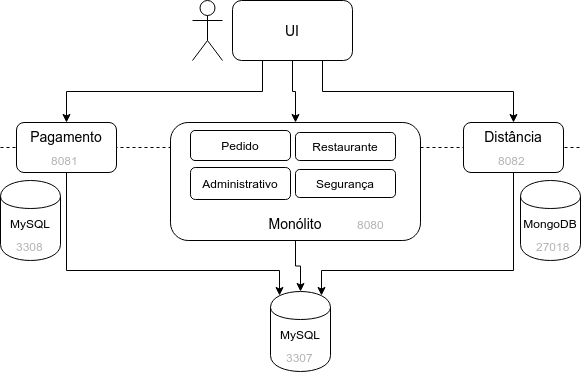
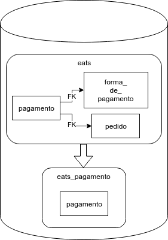
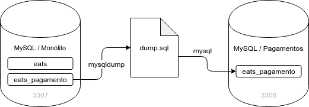
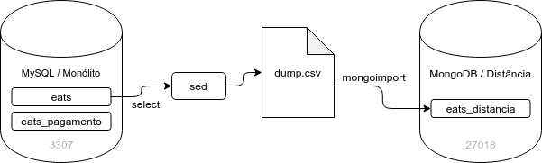

# Migrando dados

## Banco de Dados Compartilhado: uma boa ideia?

Mesmo depois de extrairmos os serviços de Pagamentos e Distância, mantivemos o mesmo MySQL monolítico.


Há vantagens em manter um BD Compartilhado, como as mencionadas por Chris Richardson na página [Shared Database](https://microservices.io/patterns/data/shared-database.html) (RICHARDSON, 2018b):

- os desenvolvedores estão familiarizados com BD relacionais e soluções de ORM
- há o reforço da consistência dos dados com as garantias ACID (Atomicidade, Consistência, Isolamento e Durabilidade) do MySQL e de outros BDs relacionais
- é possível fazer consultas complexas de maneira eficiente, com joins de dados dos múltiplos serviços
- um único BD é mais fácil de operar e monitorar

Era comum em adoções de SOA que fosse mantido um BD Corporativo, que mantinha todos os dados da organização.

Porém, há diversas desvantagens, como as discutidas por Richardson na mesma página:

- dificuldade em escalar BDs, especialmente, relacionais
- necessidade de diferentes paradigmas de persistência para alguns serviços, como BDs orientados a grafos, como Neo4J, ou BDs bons em armazenar dados pouco estruturados, como MongoDB
- acoplamento no desenvolvimento, fazendo com que haja a necessidade de coordenação para a evolução dos schemas do BD monolítico, o que pode diminuir a velocidade dos times
- acoplamento no _runtime_, fazendo com que um lock em uma tabela ou uma consulta pesada feita por um serviço afete os demais

No livro [Building Microservices](https://learning.oreilly.com/library/view/building-microservices/9781491950340/) (NEWMAN, 2015), Sam Newman foca bastante no acoplamento gerado pelo Shared Database. Newman diz que essa Integração pelo BD é muito comum no mercado. A facilidade de obter e modificar dados de outro serviço diretamente pelo BD explica a popularidade. É como se o schema do BD fosse uma API. O acoplamento é feito por detalhes de implementação e uma mudança no schema do BD quebra os "clientes" da integração. Uma migração para outro paradigma de BD fica impossibilitada. A promessa de autonomia de uma Arquitetura de Microservices seria uma promessa não cumprida. Ficaria difícil evitar mudanças que quebram o contrato, o que inevitavelmente levaria a medo de qualquer mudança.

Sam Newman conta, no livro [Monolith to Microservices](https://learning.oreilly.com/library/view/monolith-to-microservices/9781492047834/) (NEWMAN, 2019), sobre uma experiência em um banco de investimento em que o time chegou a conclusão que uma reestruturação do schema do BD iriam aumentar drasticamente a performance do sistema. Então, descobriram que outras aplicações tinham acesso de leitura, e até de escrita, ao BD. Como o mesmo usuário e senha eram utilizados, era impossível saber quais eram essas aplicações e o que estava sendo acessado. Por uma análise de tráfego de rede, estimaram que cerca de 20 outras aplicações estavam usando integração pelo BD. Eventualmente, as credenciais foram desabilitadas e o time esperou o contato das pessoas que mantinham essas aplicações. Então, descobriram que a maioria das aplicações não tinha uma equipe para mantê-las. Ou seja, o schema antigo teria que ser mantido. O BD passou a ser uma API pública. O time de Newman resolveu o problema criando um schema privado e projetando os dados em Views públicas com informações limitadas, para que os outros sistemas acessassem.

Em [um tweet](https://twitter.com/rponte/status/1186337012724441089) (PONTE, 2019), Rafael Ponte, deixa claro que usar um Shared Database é integração de sistemas e que, nesse cenário, é preciso manter um contrato bem definido. Dessa maneira, a evolução dos schemas e a manutenção de longo prazo ficam facilitadas. Segundo Ponte, o problema é que o mercado utilizado o que ele chamada de _orgia de dados_, em que os sistemas acessando diretamente os dados, sem um contrato claro. E BDs permitem diversas maneiras de definir contratos:

- Grants a schemas
- API via procedures
- API via views
- API via tabelas de integração
- Eventos e signals

Rafael Ponte explica que tabelas de integração são especialmente úteis, pois são simples de implementar e provêem um contrato bem definido. Nenhum sistema conhece a estrutura de tabelas do outro, os detalhes de implementação do BD original. Há, portanto, _information hiding_ e encapsulamento. Um sistema produz dados para a tabela de integração e outro sistema consome esses dados, na cadência em que desejar.

Ponte afirma existem diversas estratégias de integração via BD. Procedures permitem uma maior flexibilidade na implementação, permitindo validação, enrichment, queuing, roteamento, etc. Views funcionam como uma API read-only, onde o sistema consumirdor não conhece nada da estrutura interna de tabelas.

## Um Banco de Dados por serviço

No artigo [Database per service](https://microservices.io/patterns/data/database-per-service.html) (RICHARDSON, 2018c), Chris Richardson argumenta em favor de um BD separado para cada serviço. O BD é um detalhe de implementação do serviço e não deve ser acessado diretamente por outros serviços.

> **Pattern: Database per service**
>
> Faça com que os dados de um Microservice sejam apenas acessíveis por sua API.

Podemos fazer um paralelo com o conceito de encapsulamento em Orientação a Objetos. Um objeto deve proteger seus detalhes internos e tornar os atributos privados é uma condição para isso. Qualquer manipulação dos atributos deve ser feita pelos métodos públicos.

No nível de serviços, os dados estarão em algum mecanismo de persistência, que devem ser privados. O acesso aos dados deve ser feito pela API do serviço, não diretamente.

A autonomia e o desacoplamento oferecidos por essa abordagem cumprem a promessa de uma Arquitetura de Microservices. As mudanças na implementação da persistência de um serviço não afetariam os demais. Cada serviço poderia usar o tipo de BD mais adequado às suas necessidades. Seria possível escalar um BD de um serviço independentemente, otimizando recursos computacionais.

Claro, não deixam de existir pontos negativos nessa abordagem. Temos que lidar com uma possível falta de consistência dos dados. Cenários de negócio transacionais passam a ser um desafio. Consultas que juntam dados de vários serviços são dificultadas. Há também a complexidade de operar e monitorar vários BDs distintos. Se forem usados múltiplos paradigmas de persistência, talvez seja difícil ter os especialistas necessários na organização.

### Um Servidor de Banco de Dados por serviço

Richardson cita algumas estratégias para tornar privados os dados persistidos de um serviço:

- Tabelas Privadas por Serviço: cada serviço tem um conjunto de tabelas que só deve ser acessada por esse serviço. Pode ser reforçado por um usuário para cada serviço e o uso de grants.
- Schema por Serviço: cada serviço tem seu próprio Schema no BD.
- Servidor de BD por Serviço: cada serviço tem seu próprio servidor de BD separado. Serviços com muitos acessos ou consultas pesadas trazem a necessidade de um servidor de BD separado.

Ter Tabelas Privadas ou um Schema Separado por serviço pode ser usado como um passo em direção à uma eventual migração para um servidor separado. 

Quando há a necessidade, para um serviço, de mecanismo de persistência com um paradigma diferente dos demais serviços, o servidor do BD deverá ser separado.

## Bancos de Dados separados no Caelum Eats

No Caelum Eats, vamos criar servidores de BD separados do MySQL do Monólito para os serviços de Pagamentos e de Distância.

O time de Pagamentos também usará um MySQL.

Já o time de Distância planeja explorar uma nova tecnologia de persistência, mais alinhada com as necessidades de geoprocessamento: o MongoDB. É um BD NoSQL, orientado a documentos, com um paradigma diferente do relacional.



Por enquanto, apenas criaremos os servidores de cada BD. Daria trabalho instalar e configurar os BDs manualmente. Então, para essas necessidades de infraestrutura, usaremos o Docker!

> O curso [Infraestrutura ágil com Docker e Docker Swarm](https://www.caelum.com.br/curso-infraestrutura-agil-com-docker-e-docker-swarm) (DO-26) aprofunda nos conceitos do Docker e tecnologias relacionadas.

## Criando uma nova instância do MySQL a partir do Docker

Abra um Terminal e baixe a imagem do MySQL 5.7 para sua máquina com o seguinte comando:

```sh
docker image pull mysql:5.7
```

Suba um container do MySQL 5.7 com o seguinte comando:

```sh
docker container run --rm -d -p 3307:3306 --name eats.mysql -e MYSQL_ROOT_PASSWORD=caelum123 -e MYSQL_DATABASE=eats_pagamento -e MYSQL_USER=pagamento -e MYSQL_PASSWORD=pagamento123 mysql:5.7
```

Usamos as configurações:

- `--rm` para remover o container quando ao sair.
- `-d`, ou `--detach`, para rodar o container no background, imprimindo o id do container e liberando o Terminal para outros comandos.
- `-p`, ou `--publish`, que associa a porta do container ao host. No nosso caso, associamos a porta `3307` do host à porta padrão do MySQL (`3306`) do container.
- `--name`, define um apelido para o container.
- `-e`, ou `--env`, define variáveis de ambiente para o container. No caso, definimos a senha do usuário `root` por meio da variável `MYSQL_ROOT_PASSWORD`. Também definimos um database a ser criado na inicialização do container e seu usuário e senha, pelas variáveis `MYSQL_DATABASE`, `MYSQL_USER` e `MYSQL_PASSWORD`, respectivamente.

Mais detalhes sobre essas opções podem ser encontrados em: https://docs.docker.com/engine/reference/commandline/run/

Liste os containers que estão sendo executados pelo Docker com o comando:

```sh
docker container ps
```

Deve aparecer algo como:

```txt
CONTAINER ID                                                       IMAGE               COMMAND                         CREATED             STATUS              PORTS                               NAMES
183bc210a6071b46c4dd790858e07573b28cfa6394a7017cb9fa6d4c9af71563   mysql:5.7           "docker-entrypoint.sh mysqld"   16 minutes ago      Up 16 minutes       33060/tcp, 0.0.0.0:3307->3306/tcp   eats.mysql
```

É possível formatar as informações, deixando a saída do comando mais enxuta. Para isso, use a opção `--format`:

```sh
docker container ps --format "{{.Image}}\t{{.Names}}"
```

O resultado será semelhante a:

```txt
mysql:5.7     eats.mysql
```

Acesse os logs do container `eats.mysql` com o comando:

```sh
docker container logs eats.mysql
```

Podemos executar um comando dentro de um container por meio do `docker exec`.

Para acessar a interface de linha de comando do MySQL (o comando `mysql`) com o database e usuário criados em passos anteriores, devemos executar:

```sh
docker container exec -it eats.mysql mysql -upagamento -p eats_pagamento
```

A opção `-i` (ou `--interactive`) repassa a entrada padrão do host para o container do Docker.

Já a opção `-t` (ou `--tty`) simula um Terminal dentro do container.

Informe a senha `pagamento123`, registrada em passos anteriores.

Devem ser impressas informações sobre o MySQL, cuja versão deve ser _5.7.26 MySQL Community Server (GPL)_.

Digite o seguinte comando:

```sql
show databases;
```

Deve ser exibido algo semelhante a:

```txt
+--------------------+
| Database           |
+--------------------+
| information_schema |
| eats_pagamento     |
+--------------------+
2 rows in set (0.00 sec)
```

Para sair, digite `exit`.

Pare a execução do container `eats.mysql` com o comando a seguir:

```sh
docker container stop eats.mysql
```

## Criando uma instância do MongoDB a partir do Docker

Baixe a imagem do MongoDB 3.6 com o comando a seguir:

```sh
docker image pull mongo:3.6
```

Execute o MongoDb 3.6 em um container com o comando:

```sh
docker container run --rm -d -p 27018:27017 --name eats.mongo mongo:3.6
```

Note que mudamos a porta do host para `27018`. A porta padrão do MongoDB é `27017`.

Liste os containers, obtenha os logs de `eats.mongo` e pare a execução. Use como exemplo os comandos listados no exercício do MySQL.

## Simplificando o gerenciamento dos containers com Docker Compose

O Docker Compose permite definir uma série de _services_ (cuidado com o nome!) que permitem descrever a configuração de containers. Com essa ferramenta, é possível disparar novas instâncias de maneira muito fácil!

Para isso, basta definirmos um arquivo `docker-compose.yml`. Os services devem ter um nome e referências às imagens do Docker Hub e podem ter definições de portas utilizadas, variáveis de ambiente e diversas outras configurações.

####### docker-compose.yml

```yml
version: '3'

services:
  mysql.pagamento:
    image: mysql:5.7
    restart: on-failure
    ports:
      - "3307:3306"
    environment:
      MYSQL_ROOT_PASSWORD: caelum123
      MYSQL_DATABASE: eats_pagamento
      MYSQL_USER: pagamento
      MYSQL_PASSWORD: pagamento123
  mongo.distancia:
    image: mongo:3.6
    restart: on-failure
    ports:
      - "27018:27017"
```

Para subir os serviços definidos no `docker-compose.yml`, execute o comando:

```sh
docker-compose up -d
```
A opção `-d`, ou `--detach`, roda os containers no background, liberando o Terminal.

É possível executar um Terminal diretamente em uma dos containers criados pelo Docker Compose com o comando `docker-compose exec`.

Por exemplo, para acessar o comando `mongo`, a interface de linha de comando do MongoDB, do service `mongo.distancia`, faça:

```sh
docker-compose exec mongo.distancia mongo
```

Você pode obter os logs de ambos os containers com o seguinte comando:

```sh
docker-compose logs
```

Caso queira os logs apenas de um container específico, basta passar o nome do _service_ (o termo para uma configuração do Docker Compose). Para o MySQL, seria algo como:

```sh
docker-compose logs mysql.pagamento
```

Para interromper todos os _services_ sem remover os containers, volumes e imagens associados, use:

```sh
docker-compose stop
```

Depois de parados com `stop`, para iniciá-los novamente, faça um `docker-compose start`.

É possível parar e remover um _service_ específico, passando seu nome no final do comando.

_ATENÇÃO: **evite** usar o comando `docker-compose down` durante o curso. Esse comando apagará todos os dados dos seus BD. Use apenas o comando `docker-compose stop`._

## Exercício: Gerenciando containers de infraestrutura com Docker Compose

1. No seu Desktop, defina um arquivo `docker-compose.yml` com o conteúdo anterior, que pode ser encontrado em: https://gitlab.com/snippets/1859850

  Observação: mantenha os TABs certinhos. São muito importantes em um arquivo `.yml`. Em caso de dúvida, peça ajuda ao instrutor.

2. No Desktop, suba ambos os containers, do MySQL e do MongoDB, com o comando:

  ```sh
  cd ~/Desktop
  docker-compose up -d
  ```

  Observe os containers sendo executados com o comando do Docker:

  ```sh
  docker container ps
  ```

  Deverá ser impresso algo como:

  ```txt
  CONTAINER ID        IMAGE               COMMAND                  CREATED             STATUS              PORTS                               NAMES
  49bf0d3241ad        mysql:5.7           "docker-entrypoint..."   26 minutes ago      Up 3 minutes        33060/tcp, 0.0.0.0:3307->3306/tcp   eats-microservices_mysql.pagamento_1
  4890dcb9e898        mongo:3.6           "docker-entrypoint..."   26 minutes ago      Up 3 minutes        0.0.0.0:27018->27017/tcp            eats-microservices_mongo.distancia_1
  ```

3. Acesse o MongoDB do service `mongo.distancia` com o comando:

  ```sh
  docker-compose exec mongo.distancia mongo
  ```

  Devem aparecer informações sobre o MongoDB, como a versão, que deve ser algo como _MongoDB server version: 3.6.12_.

  Digite o seguinte comando:

  ```sh
  show dbs
  ```

  Deve ser impresso algo parecido com:

  ```txt
  admin   0.000GB
  config  0.000GB
  local   0.000GB
  ```

  Para sair, digite `quit()`, com os parênteses.

4. Observe os logs dos services com o comando:

  ```sh
  docker-compose logs
  ```

## Separando Schemas

Agora temos um container com um MySQL específico para o serviço de Pagamentos. Vamos migrar os dados para esse servidor de BD. Mas o faremos de maneira progressiva e metódica.

No livro [Monolith to Microservices](https://learning.oreilly.com/library/view/monolith-to-microservices/9781492047834/) (NEWMAN, 2019), Sam Newman descreve, entre várias abordagens de migração, o uso de Views como um passo em direção a esconder informações entre serviços distintos que usam um Shared Database.

Um passo importante nessa progressão é usar, nos diferentes serviços, Schemas Separados dentro do Shared Database (ou, poderíamos dizer, um _database_ separado em um mesmo SGBD). Como comentado em capítulos anteriores, no livro [Building Microservices](https://learning.oreilly.com/library/view/building-microservices/9781491950340/) (NEWMAN, 2015), Sam Newman recomenda o uso de Schemas Separados mesmo mantendo o código no Monólito Modular.

> **Pattern: Schemas separados**
>
> Inicie a decomposição dos dados do Monólito usando Schemas Separados no mesmo servidor de BD, alinhados aos Bounded Contexts.

No livro [Monolith to Microservices](https://learning.oreilly.com/library/view/monolith-to-microservices/9781492047834/) (NEWMAN, 2019), Sam Newman argumenta que usar Schemas Separados seria uma _separação lógica_, enquanto usar um servidor de BD separado seria uma separação _física_. A separação lógica permite mudanças independentes e encapsulamento, enquanto que a separação física potencialmente melhor vazão, latência, uso de recursos e isolamento de falhas. Contudo, a separação lógica é uma condição para a separação física.

Mesmo com Schemas Separados, se for utilizado um mesmo servidor de BD, podemos ter usuários que tem acesso a mais de um Schema e, portanto, que conseguem fazer migração de dados.

Uma vez que decidimos por Schemas Separados, a integridade oferecida por _foreign keys_ (FKs) nos BDs relacionais tem que ser deixada de lado. Essa perda traz duas consequências:

- consultas que fazem join dos dados tem que ser feitas em memória, tornando a operação mais lenta
- perda de consistência dos dados, cujos efeitos discutiremos mais adiante

Tanto Sam Newman como Chris Richardson indicam como referência para a evolução de BDs relacionais o livro [Refactoring Databases](https://learning.oreilly.com/library/view/refactoring-databases-evolutionary/0321293533/) (SADALAGE; AMBER, 2006) de Pramod Sadalage e Scott Ambler.

## Separando schema do BD de pagamentos do monólito

Em capítulos anteriores, quebramos o Modelo de Domínio de `Pagamento` para que não dependesse de `FormaDePagamento` nem de `Pedido`, que são dos módulos Administrativo e de Pedido do Monólito, respectivamente. Porém, as FKs foram mantidas.

Nessa momento, criaremos um Schema Separado para o serviço de Pagamentos. Não existiram FKs às tabelas que representam `FormaDePagamento` e `Pedido`. Serão mantidos apenas os ids dessas tabelas.



Mas como efetuar essa alteração? 

Criaremos scripts `.sql` com instruções DDL (Data Definition Language), como `CREATE TABLE` ou `ALTER TABLE`, para criar as estruturas das tabelas e, instruções DML (Data Manipulation Languagem), como `INSERT` ou `UPDATE`, para popular os dados.

Para executar esses scripts, usaremos uma ferramenta de Migration.

Entre as bibliotecas mais usadas para Migration em projetos Java estão Liquibase e Flyway. Ambas estão bem integradas com o Spring Boot. O Liquibase permite que as Migrations sejam definidas em XML, JSON, YAML e SQL. Já no Flyway, podem ser usados SQL e Java. Uma grande vantagem do Liquibase é a possibilidade de ter Migrations de rollback na versão _community_. 

Uma ferramenta de migração de dados tem uma maneira de definir a versão dos scripts e de controlar quais scripts já foram executados. Assim, é possível recriar um BD do zero, saber qual é a versão atual de um BD específico e evoluir para novas versões.

O Monólito já usa o Flyway para DDL e DML.

No caso do Flyway, há uma nomenclatura padrão para o nome dos arquivos `.sql`: 

- Um `V` como prefixo.
- Um número de versão incremental e único, como `0001` ou `0919`. Pode haver pontos para versões intermediárias, como `2.5`
- Dois underscores (`__`) como separador
- Uma descrição
- A extensão `.sql` como sufixo.

Um exemplo de nome de arquivo seria `V0001__cria-tabela-pagamento.sql`.

Para manter a versão atual do BD e saber quais scripts foram executados, o Flyway mantém uma tabela chamada `flyway_schema_history`. No livro [Refactoring Databases](https://learning.oreilly.com/library/view/refactoring-databases-evolutionary/0321293533/) (SADALAGE; AMBER, 2006), os autores já demonstram a necessidade de manter qual a última versão do Schema em uma tabela que chamam de _Database Configuration_.

Um novo Schema não teria essa tabela e, portanto, estaria vazia, significando que todos os scripts devem ser executados. Essa tabela tem colunas como: 

- `version`, que contém as versões executadas;
- `script`, que contém o nome do arquivo executado;
- `installed_on`, que contém a data/hora da execução;
- `checksum`, que contém um número calculado a partir do arquivo `.sql`;
- `success`, que indica se a execução foi bem sucedida.

_Observação: o `checksum` é checado para todos os scripts ao iniciar a aplicação. Não mude ou remova scripts porque a aplicação pode deixar de subir. Cuidado!_ 

Usaremos o Flyway também para o serviço de Pagamentos.

Para isso, deve ser adicionada uma dependência ao Flyway no `pom.xml` do `eats-pagamento-service`:

####### fj33-eats-pagamento-service/pom.xml

```xml
<dependency>
  <groupId>org.flywaydb</groupId>
  <artifactId>flyway-core</artifactId>
</dependency>
```

O database do serviço de pagamentos precisa ser modificado para um novo. Podemos chamá-lo de `eats_pagamento`.

####### fj33-eats-pagamento-service/src/main/resources/application.properties

```properties
s̶p̶r̶i̶n̶g̶.̶d̶a̶t̶a̶s̶o̶u̶r̶c̶e̶.̶u̶r̶l̶=̶j̶d̶b̶c̶:̶m̶y̶s̶q̶l̶:̶/̶/̶l̶o̶c̶a̶l̶h̶o̶s̶t̶/̶e̶a̶t̶s̶?̶c̶r̶e̶a̶t̶e̶D̶a̶t̶a̶b̶a̶s̶e̶I̶f̶N̶o̶t̶E̶x̶i̶s̶t̶=̶t̶r̶u̶e̶
spring.datasource.url=jdbc:mysql://localhost/eats_pagamento?createDatabaseIfNotExist=true
```

O mesmo usuário `root` deve ter acesso a ambos os databases: `eats`, do monólito, e `eats_pagamento`, do serviço de pagamentos. Dessa maneira, é possível executar scripts que migram dados de um database para outro.

Numa nova pasta `db/migration` em  `src/main/resources` deve ser criada uma primeira migration, que cria a tabela de `pagamento`. O arquivo pode ter o nome `V0001__cria-tabela-pagamento.sql` e o seguinte conteúdo:

####### fj33-eats-pagamento-service/src/main/resources/db/migration/V0001__cria-tabela-pagamento.sql

```sql
CREATE TABLE pagamento (
  id bigint(20) NOT NULL AUTO_INCREMENT,
  valor decimal(19,2) NOT NULL,
  nome varchar(100) DEFAULT NULL,
  numero varchar(19) DEFAULT NULL,
  expiracao varchar(7) NOT NULL,
  codigo varchar(3) DEFAULT NULL,
  status varchar(255) NOT NULL,
  forma_de_pagamento_id bigint(20) NOT NULL,
  pedido_id bigint(20) NOT NULL,
  PRIMARY KEY (id)
) ENGINE=InnoDB DEFAULT CHARSET=latin1;
```

O conteúdo acima pode ser encontrado na seguinte URL: https://gitlab.com/snippets/1859564

Uma segunda migration, de nome `V0002__migra-dados-de-pagamento.sql`, obtem os dados do database `eats`, do monólito, e os insere no database `eats_pagamento`. Crie o arquivo  em `db/migration`, conforme a seguir:

####### fj33-eats-pagamento-service/src/main/resources/db/migration/V0002__migra-dados-de-pagamento.sql

```sql
insert into eats_pagamento.pagamento
  (id, valor, nome, numero, expiracao, codigo, status, forma_de_pagamento_id, pedido_id)
    select id, valor, nome, numero, expiracao, codigo, status, forma_de_pagamento_id, pedido_id
      from eats.pagamento;
```

O trecho de código acima pode ser encontrado em: https://gitlab.com/snippets/1859568

Essa migração só é possível porque o usuário tem acesso aos dois databases.

Após executar `EatsPagamentoServiceApplication`, nos logs, devem aparecer informações sobre a execução dos scripts `.sql`. Algo como:

```txt
2019-05-22 18:33:56.439  INFO 30484 --- [  restartedMain] o.f.c.internal.license.VersionPrinter    : Flyway Community Edition 5.2.4 by Boxfuse
2019-05-22 18:33:56.448  INFO 30484 --- [  restartedMain] com.zaxxer.hikari.HikariDataSource       : HikariPool-1 - Starting...
2019-05-22 18:33:56.632  INFO 30484 --- [  restartedMain] com.zaxxer.hikari.HikariDataSource       : HikariPool-1 - Start completed.
2019-05-22 18:33:56.635  INFO 30484 --- [  restartedMain] o.f.c.internal.database.DatabaseFactory  : Database: jdbc:mysql://localhost/eats_pagamento (MySQL 5.6)
2019-05-22 18:33:56.708  INFO 30484 --- [  restartedMain] o.f.core.internal.command.DbValidate     : Successfully validated 2 migrations (execution time 00:00.016s)
2019-05-22 18:33:56.840  INFO 30484 --- [  restartedMain] o.f.c.i.s.JdbcTableSchemaHistory         : Creating Schema History table: `eats_pagamento`.`flyway_schema_history`
2019-05-22 18:33:57.346  INFO 30484 --- [  restartedMain] o.f.core.internal.command.DbMigrate      : Current version of schema `eats_pagamento`: << Empty Schema >>
2019-05-22 18:33:57.349  INFO 30484 --- [  restartedMain] o.f.core.internal.command.DbMigrate      : Migrating schema `eats_pagamento` to version 0001 - cria-tabela-pagamento
2019-05-22 18:33:57.596  INFO 30484 --- [  restartedMain] o.f.core.internal.command.DbMigrate      : Migrating schema `eats_pagamento` to version 0002 - migra-dados-de-pagamento
2019-05-22 18:33:57.650  INFO 30484 --- [  restartedMain] o.f.core.internal.command.DbMigrate      : Successfully applied 2 migrations to schema `eats_pagamento` (execution time 00:00.810s)
```

Para verificar se o conteúdo do database `eats_pagamento` condiz com o esperado, podemos acessar o MySQL em um Terminal:

```sh
mysql -u <SEU USUÁRIO> -p eats_pagamento
```

`<SEU USUÁRIO>` deve ser trocado pelo usuário do banco de dados. Deve ser solicitada uma senha.

Dentro do MySQL, deve ser executada a seguinte query:

```sql
select * from pagamento;
```

Os pagamentos devem ter sido migrados.

Novos pagamentos serão armazenados apenas no schema `eats_pagamento`. Os dados do serviço de Pagamentos são suficientemente independentes para serem mantidos em um BD separado.

É importante lembrar que a mudança do status do pedido para _PAGO_, que perdemos ao extrair o serviço de Pagamentos do Monólito, ainda precisa ser resolvida. Faremos isso mais adiante.

## Exercício: migrando dados de pagamento para schema separado

1. Pare a execução de `EatsPagamentoServiceApplication`.

  Obtenha as configurações e scripts de migração para outro schema da branch `cap5_migrando_pagamentos_para_schema_separado` do serviço de pagamentos:

  ```sh
  cd ~/Desktop/fj33-eats-pagamento-service
  git checkout -f cap5_migrando_pagamentos_para_schema_separado
  ```

  Execute `EatsPagamentoServiceApplication`. Observe o resultado da execução das migrations nos logs.

2. Verifique se o conteúdo do database `eats_pagamento` condiz com o esperado, digitando os seguintes comandos em um Terminal:

  ```sh
  mysql -u <SEU USUÁRIO> -p eats_pagamento
  ```

  Troque `<SEU USUÁRIO>` pelo usuário informado pelo instrutor. Quando solicitada, digite a senha informada pelo instrutor.

  Dentro do MySQL, execute a seguinte query:

  ```sql
  select * from pagamento;
  ```

  Os pagamentos devem ter sido migrados. Note as colunas `forma_de_pagamento_id` e `pedido_id`.

## Migrando dados de um servidor MySQL para outro

Nesse momento, temos um servidor de BD com Schemas separados para o Monólito e para o serviço de Pagamentos. Também temos um servidor de BD específico para Pagamentos, mas ainda vazio.

No MySQL, o Schema (ou _database_) pode ser criado, se ainda não existir, quando a aplicação conecta com o BD se usarmos a propriedade `createDatabaseIfNotExist`. Em um projeto Spring Boot, isso pode ser definido na URL de conexão do _data source_:

```properties
spring.datasource.url=jdbc:mysql://localhost:3307/eats_pagamento?createDatabaseIfNotExist=true
```

Com o Schema criado no MySQL de Pagamentos, precisamos criar as estruturas das tabelas e migrar os dados. Para isso, podemos gerar um dump com o comando `mysqldump` a partir do Schema `eats_pagamento` do MySQL do Monólito. Será gerado um script `.sql` com todo o DDL e DML do Schema.

O script com o dump pode ser carregado no outro MySQL, específico de Pagamentos, com o comando `mysql`. Mãos à obra!



## Exercício: migrando dados de pagamento para um servidor MySQL específico

1. Abra um Terminal e faça um dump do dados de pagamento com o comando a seguir:

  ```sh
  mysqldump -u <SEU USUÁRIO> -p --opt eats_pagamento > eats_pagamento.sql
  ```

  Peça ao instrutor o usuário do BD e use em `<SEU USUÁRIO>`. Peça também a senha.

  O comando anterior cria um arquivo `eats_pagamento.sql` com todo o schema e dados do database `eats_pagamento`.

  A opção `--opt` equivale às opções:
  
    - `--add-drop-table`, que adiciona um `DROP TABLE` antes de cada `CREATE TABLE`
    - `--add-locks`, que faz um `LOCK TABLES` e `UNLOCK TABLES` em volta de cada dump
    - `--create-options`, que inclui opções específicas do MySQL nos `CREATE TABLE`
    - `--disable-keys`, que desabilita e habilita PKs e FKs em volta de cada `INSERT`
    - `--extended-insert`, que faz um `INSERT` de múltiplos registros de uma vez
    - `--lock-tables`, que trava as tabelas antes de realizar o dump
    - `--quick`, que lê os registros um a um
    - `--set-charset`, que adiciona `default_character_set` ao dump

  > Caso o MYSQL monolítico esteja dockerizado, execute o comando `mysqldump` pelo Docker:
  > 
  > ```sh
  >  docker exec -it <NOME-DO-CONTAINER> mysqldump -u root -p --opt eats_pagamento > eats_pagamento.sql
  > ```
  > 
  > O valor de `<NOME-DO-CONTAINER>` deve ser o nome do container do MySQL do monólito, que pode ser descoberto com o comando `docker ps`.

2. Garanta que o container MySQL do serviço de pagamentos está sendo executado. Para isso, execute em um Terminal:

  ```sh
  docker-compose up -d mysql.pagamento
  ```

3. Pela linha de comando, vamos executar, no container de `mysql.pagamento`, o script `eats_pagamento.sql`.

  Para isso, vamos usar o comando `mysql` informando _host_ e porta do container Docker:

  ```sh
  mysql -u pagamento -p --host 127.0.0.1 --port 3307 eats_pagamento < eats_pagamento.sql
  ```

  _Observação: o comando `mysql` não aceita `localhost`, apenas o IP `127.0.0.1`._

  Quando for solicitada a senha, informe a que definimos no arquivo do Docker Compose: `pagamento123`.

  > No caso do comando anterior não funcionar, copie o arquivo `eats_pagamento.sql` para o container do MySQL de pagamentos usando o Docker:
  > 
  > ```sh
  > docker cp eats_pagamento.sql <NOME-DO-CONTAINER>:/eats_pagamento.sql
  > ```
  >
  >  Então, execute o `bash` no container do MySQL de pagamentos:
  > 
  > ```sh
  > docker exec -it <NOME-DO-CONTAINER> bash
  > ```
  > 
  > Finalmente, dentro do container do MySQL de pagamentos, faça o import do dump:
  > 
  > ```
  > mysql -upagamento -p eats_pagamento < eats_pagamento.sql
  > ```
  >
  > Lembrando que o `<NOME-DO-CONTAINER>` pode ser descoberto com um `docker ps`.


4. Para verificar se a importação do dump foi realizada com sucesso, vamos acessar o comando `mysql` sem passar nenhum arquivo:

  ```sh
  mysql -u pagamento -p --host 127.0.0.1 --port 3307 eats_pagamento
  ```

  Informe a senha `pagamento123`.

  Perceba que o MySQL deve estar na versão _5.7.26 MySQL Community Server (GPL)_, a que definimos no arquivo do Docker Compose.

  > Se o comando `mysql` não funcionar, execute o `bash` no container do MySQL de pagamentos:
  > 
  > ```sh
  > docker exec -it <NOME-DO-CONTAINER> bash
  > ```
  > 
  > Dentro do container, execute o comando `mysql`:
  > 
  > ```sh
  > mysql -upagamento -p eats_pagamento
  > ```
  >

  Digite o seguinte comando SQL e verifique o resultado:

  ```sql
  select * from pagamento;
  ```

  Devem ser exibidos todos os pagamentos já efetuados!

  Para sair, digite `exit`.

## Apontando serviço de pagamentos para o BD específico

O serviço de pagamentos deve deixar de usar o MySQL do monólito e passar a usar a sua própria instância do MySQL, que contém seu próprio schema e apenas os dados necessários.

Para isso, basta alterarmos a URL, usuário e senha de BD do serviço de pagamentos, para que apontem para o container Docker do `mysql.pagamento`:

####### fj33-eats-pagamento-service/src/main/resources/application.properties

```properties
s̶p̶r̶i̶n̶g̶.̶d̶a̶t̶a̶s̶o̶u̶r̶c̶e̶.̶u̶r̶l̶=̶j̶d̶b̶c̶:̶m̶y̶s̶q̶l̶:̶/̶/̶l̶o̶c̶a̶l̶h̶o̶s̶t̶/̶e̶a̶t̶s̶_̶p̶a̶g̶a̶m̶e̶n̶t̶o̶?̶c̶r̶e̶a̶t̶e̶D̶a̶t̶a̶b̶a̶s̶e̶I̶f̶N̶o̶t̶E̶x̶i̶s̶t̶=̶t̶r̶u̶e̶
spring.datasource.url=jdbc:mysql://localhost:3307/eats_pagamento?createDatabaseIfNotExist=true

s̶p̶r̶i̶n̶g̶.̶d̶a̶t̶a̶s̶o̶u̶r̶c̶e̶.̶u̶s̶e̶r̶n̶a̶m̶e̶=̶<̶S̶E̶U̶ ̶U̶S̶U̶A̶R̶I̶O̶>̶
spring.datasource.username=pagamento

s̶p̶r̶i̶n̶g̶.̶d̶a̶t̶a̶s̶o̶u̶r̶c̶e̶.̶p̶a̶s̶s̶w̶o̶r̶d̶=̶<̶S̶U̶A̶ ̶S̶E̶N̶H̶A̶>̶
spring.datasource.password=pagamento123
```

Note que a porta `3307` foi incluída na URL, mas mantivemos ainda `localhost`.

## Exercício: fazendo serviço de pagamentos apontar para o BD específico

1. Obtenha as alterações no datasource do serviço de pagamentos da branch `cap5_apontando_pagamentos_para_BD_proprio`:

  ```sh
  cd ~/Desktop/fj33-eats-pagamento-service
  git checkout -f cap5_apontando_pagamentos_para_BD_proprio
  ```

  Reinicie o serviço de pagamentos, executando a classe `EatsPagamentoServiceApplication`.

2. Abra um Terminal e crie um novo pagamento:

  ```sh
  curl -X POST
    -i
    -H 'Content-Type: application/json'
    -d '{ "valor": 9.99, "nome": "MARIA DE SOUSA", "numero": "777 2222 8888 4444", "expiracao": "2025-04", "codigo": "777", "formaDePagamentoId": 1, "pedidoId": 2 }'
    http://localhost:8081/pagamentos
  ```

  Se desejar, baseie-se na seguinte URL, modificando os valores: https://gitlab.com/snippets/1859389

  A resposta deve ter sucesso, com status `200` e o um id e status `CRIADO` no corpo da resposta.

3. Pelo Eclipse, inicie o monólito e o serviço de distância. Suba também o front-end. Faça um novo pedido, até efetuar o pagamento. Deve funcionar!

4. (opcional) Apague a tabela `pagamento` do database `eats`, do monólito. Remova também o database `eats_pagamento` do MySQL do monólito. Atenção: muito cuidado para não remover dados indesejados!

## Migrando dados do MySQL para MongoDB

Provisionamos, pelo Docker Compose, um MongoDB específico para o serviço de Distância. Por enquanto, não há dados nesse BD.

O MongoDB não é um BD relacional, mas de um paradigma orientado a documentos.

Não existem tabelas no MongoDB, mas _collections_. As collections armazenam _documents_. Um document é _schemaless_, pois não tem colunas e tipos  definidos. Um document tem um _id_ como identificador, que deve ser único.

No MongoDB, um _database_ agrupa várias collections, de maneira semelhante ao MySQL.

Há um conflito entre os conceitos de um BD relacional como o MySQL e de um BD orientado a documentos, como o MongoDB. Por isso, as estratégias de migração devem ser diferentes.

Devemos exportar um subconjunto dos dados de um `Restaurante`, que são relevantes para o serviço de Distância: o `id`, o `cep`, o `tipoDeCozinhaId` e o atributo `aprovado`, que indica se o restaurante já foi revisado e aprovado pelo Administrativo do Caelum Eats.

Não é possível fazer um dump para um script `.sql`. Porém, como a nossa migração é simples, podemos usar um arquivo CSV com os dados de restaurantes que são relevantes para o serviço de Distância. Já que restaurantes não aprovados não são interessantes para o cálculo de distância, podemos fazer uma filtragem, mantendo apenas os restaurantes já aprovados.

Para criar esse CSV a partir do MySQL, podemo usar um `select` com a instrução `into outfile`:

```sql
select r.id, r.cep, r.tipo_de_cozinha_id from restaurante r where r.aprovado = true into outfile '/tmp/restaurantes.csv' fields terminated by ',' enclosed by '"' lines terminated by '\n';
```

A consulta anterior criará um arquivo `/tmp/restaurantes.csv`, com uma estrutura semelhante à seguinte:

####### /tmp/restaurantes.csv

```csv
"1","70238500","1"
"2","71458-074","6"
```

Para importar o CSV para o MongoDB, podemos usar a ferramenta `mongoimport`. Algumas opções do comando:

- `--db`, o database de destino
- `--collection`, a collection de destino
- `--type`, o tipo do arquivo (no caso, um CSV)
- `--file`, o caminho do arquivo a ser importado
- `--fields`, para definir os nomes das propriedades do document

Perceba que não há os nomes das propriedades no arquivo `restaurantes.csv`. Por isso, devemos definí-las usando a opção `--fields`. O campo de identificação do document deve se chamar `_id`. 

Para importar o conteúdo do CSV para a collection `restaurantes` do database `eats_distancia`, com os campos `_id`, `cep` e `tipoDeCozinhaId`, devemos executar o seguinte comando:

```sh
mongoimport --db eats_distancia --collection restaurantes --type csv  --fields=_id,cep,tipoDeCozinhaId --file restaurantes.csv
```



## Exercício: migrando dados de restaurantes do MySQL para o MongoDB

1. Em um Terminal, acesse o MySQL do monólito com o usuário `root`, já acessando `eats`, o database monolítico:

  ```sh
  mysql -u root -p eats
  ```

  Peça a senha de root do MySQL para o instrutor. Se não houver senha, omita a opção `-p`.

  Na CLI do MySQL, faça uma consulta que obtém os dados relevantes do MySQL para o serviço de distância: o id do restaurante, o cep e o id do tipo de cozinha. O cálculo de distância é feito somente para restaurantes aprovados. Por isso, podemos por um filtro na consulta, mantendo apenas os restaurantes aprovados.

  O resultado pode ser exportado para um arquivo CSV, um formato que pode ser facilmente importado em um MongoDB.

  ```sh
  mysql> select r.id, r.cep, r.tipo_de_cozinha_id from restaurante r where r.aprovado = true into outfile '/tmp/restaurantes.csv' fields terminated by ',' enclosed by '"' lines terminated by '\n';
  ```

  A query do código anterior pode ser obtida em: https://gitlab.com/snippets/1894030

  > Caso a instância do MySQL monolítico esteja dockerizada, execute o comando `mysql` pelo Docker:
  > 
  > ```sh
  > docker exec -it <NOME-DO-CONTAINER> mysql -u root -p eats
  > ```
  > 
  > Digite a senha de root do MySQL do monólito. Execute a query, salvando o arquivo `restaurantes.csv` no diretório `/var/lib/mysql-files/`.
  > 
  > ```sh
 >  mysql> select r.id, r.cep, r.tipo_de_cozinha_id from restaurante r where r.aprovado = true into outfile '/var/lib/mysql-files/restaurantes.csv' fields terminated by ',' enclosed by '"' lines terminated by '\n';
  > ```
  > 
  > A query do código anterior pode ser obtida em: https://gitlab.com/snippets/1895021
  > 
  > Então, obtenha o texto do `restaurantes.csv` e o copie para o diretório `/tmp` com o seguinte comando:
  > 
  > ```sh
  > docker exec -it <NOME-DO-CONTAINER> cat /var/lib/mysql-files/restaurantes.csv > /tmp/restaurantes.csv
  > ```
  >
  > Lembrando que o `<NOME-DO-CONTAINER>` pode ser descoberto com um `docker ps`.

2. Certifique-se que o container MongoDB do serviço de distância definido no Docker Compose esteja no ar. Para isso, execute em um Terminal:

  ```sh
  docker-compose up -d mongo.distancia
  ```

  Copie o CSV exportado a partir do MySQL para o seu Desktop:

  ```sh
  cp /tmp/restaurantes.csv ~/Desktop
  ```

  Descubra o nome do container do MongoDB de distância, com o comando `docker ps`. O container do MongoDB terá como sufixo `mongo.distancia_1`.

  Copie o arquivo CSV com os dados exportados para o container do MongoDB:

  ```sh
  docker cp ~/Desktop/restaurantes.csv <NOME-DO-CONTAINER>:/restaurantes.csv
  ```

  Troque `<NOME-DO-CONTAINER>` pelo nome descoberto no passo anterior.

  Execute um bash no container com o comando:

  ```sh
  docker exec -it <NOME-DO-CONTAINER> bash
  ```

  Importe os dados do CSV para a collection `restaurantes` do MongoDB de distância:

  ```sh
  mongoimport --db eats_distancia --collection restaurantes --type csv  --fields=_id,cep,tipoDeCozinhaId --file restaurantes.csv
  ```

  O comando acima pode ser encontrado em: https://gitlab.com/snippets/1894035

  Ainda no bash do MongoDB, acesse o database de distância com o Mongo Shell:

  ```sh
  mongo eats_distancia
  ```

  Dentro do Mongo Shell, verifique a collection de restaurantes foi criada:

  ```sh
  show collections;
  ```

  Deve ser retornado algo como:

  ```txt
  restaurantes
  ```

  Veja os documentos da collection `restaurantes` com o comando: 

  ```js
  db.restaurantes.find();
  ```

  O resultado será semelhante a:

  ```json
  { "_id" : 1, "cep" : 70238500, "tipoDeCozinhaId" : 1 }
  { "_id" : 2, "cep" : "71503-511", "tipoDeCozinhaId" : 7 }
  { "_id" : 3, "cep" : "70238-500", "tipoDeCozinhaId" : 9 }
  ```

  Pronto, os dados foram migrados para o MongoDB!

  > Apenas os restaurantes já aprovados terão seus dados migrados. Restaurantes ainda não aprovados ou novos restaurantes não aparecerão para o serviço de distância.

## Configurando MongoDB no serviço de distância

O _starter_ do Spring Data MongoDB deve ser adicionado ao `pom.xml` do `eats-distancia-service`.

Já as dependências ao Spring Data JPA e ao driver do MySQL devem ser removidas.

####### fj33-eats-distancia-service/pom.xml

```xml
<dependency>
  <groupId>org.springframework.boot</groupId>
  <artifactId>spring-boot-starter-data-mongodb</artifactId>
</dependency>

<̶d̶e̶p̶e̶n̶d̶e̶n̶c̶y̶>̶
  <̶g̶r̶o̶u̶p̶I̶d̶>̶m̶y̶s̶q̶l̶<̶/̶g̶r̶o̶u̶p̶I̶d̶>̶
  <̶a̶r̶t̶i̶f̶a̶c̶t̶I̶d̶>̶m̶y̶s̶q̶l̶-̶c̶o̶n̶n̶e̶c̶t̶o̶r̶-̶j̶a̶v̶a̶<̶/̶a̶r̶t̶i̶f̶a̶c̶t̶I̶d̶>̶
  <̶s̶c̶o̶p̶e̶>̶r̶u̶n̶t̶i̶m̶e̶<̶/̶s̶c̶o̶p̶e̶>̶
<̶/̶d̶e̶p̶e̶n̶d̶e̶n̶c̶y̶>̶

<̶d̶e̶p̶e̶n̶d̶e̶n̶c̶y̶>̶
  <̶g̶r̶o̶u̶p̶I̶d̶>̶o̶r̶g̶.̶s̶p̶r̶i̶n̶g̶f̶r̶a̶m̶e̶w̶o̶r̶k̶.̶b̶o̶o̶t̶<̶/̶g̶r̶o̶u̶p̶I̶d̶>̶
  <̶a̶r̶t̶i̶f̶a̶c̶t̶I̶d̶>̶s̶p̶r̶i̶n̶g̶-̶b̶o̶o̶t̶-̶s̶t̶a̶r̶t̶e̶r̶-̶d̶a̶t̶a̶-̶j̶p̶a̶<̶/̶a̶r̶t̶i̶f̶a̶c̶t̶I̶d̶>̶
<̶/̶d̶e̶p̶e̶n̶d̶e̶n̶c̶y̶>̶
```

Devem ocorrer vários erros de compilação.

A classe `Restaurante` do serviço de distância deve ser modificada, removendo as anotações do JPA.

A anotação `@Document`, do Spring Data MongoDB, deve ser adicionada.

A anotação `@Id` deve ser mantida, porém o import será trocado para `org.springframework.data.annotation.Id`, uma anotação genérica do Spring Data.

> Perceba que, apesar do campo ser `_id` no document, o manteremos como `id` no código Java. A anotação `@Id` cuidará de informar qual dos atributos é o identificador do documento e está relacionado ao campo `_id`.

O atributo `aprovado` pode ser removido, já que a migração dos dados foi feita de maneira que o database de distância do MongoDB só contém restaurantes já aprovados.

####### fj33-eats-distancia-service/src/main/java/br/com/caelum/eats/distancia/Restaurante.java

```java
@Document(collection = "restaurantes") // adicionado
@̶E̶n̶t̶i̶t̶y̶
@Data
@NoArgsConstructor
@AllArgsConstructor
public class Restaurante {

  @Id
  @̶G̶e̶n̶e̶r̶a̶t̶e̶d̶V̶a̶l̶u̶e̶(̶s̶t̶r̶a̶t̶e̶g̶y̶ ̶=̶ ̶G̶e̶n̶e̶r̶a̶t̶i̶o̶n̶T̶y̶p̶e̶.̶I̶D̶E̶N̶T̶I̶T̶Y̶)̶
  private Long id;

  private String cep;

  p̶r̶i̶v̶a̶t̶e̶ ̶B̶o̶o̶l̶e̶a̶n̶ ̶a̶p̶r̶o̶v̶a̶d̶o̶;̶

  @̶C̶o̶l̶u̶m̶n̶(̶n̶u̶l̶l̶a̶b̶l̶e̶ ̶=̶ ̶f̶a̶l̶s̶e̶)̶
  private Long tipoDeCozinhaId;

}
```

Os seguinte imports devem ser removidos:

```java
i̶m̶p̶o̶r̶t̶ ̶j̶a̶v̶a̶x̶.̶p̶e̶r̶s̶i̶s̶t̶e̶n̶c̶e̶.̶C̶o̶l̶u̶m̶n̶;̶
i̶m̶p̶o̶r̶t̶ ̶j̶a̶v̶a̶x̶.̶p̶e̶r̶s̶i̶s̶t̶e̶n̶c̶e̶.̶E̶n̶t̶i̶t̶y̶;̶
i̶m̶p̶o̶r̶t̶ ̶j̶a̶v̶a̶x̶.̶p̶e̶r̶s̶i̶s̶t̶e̶n̶c̶e̶.̶G̶e̶n̶e̶r̶a̶t̶e̶d̶V̶a̶l̶u̶e̶;̶
i̶m̶p̶o̶r̶t̶ ̶j̶a̶v̶a̶x̶.̶p̶e̶r̶s̶i̶s̶t̶e̶n̶c̶e̶.̶G̶e̶n̶e̶r̶a̶t̶i̶o̶n̶T̶y̶p̶e̶;̶
i̶m̶p̶o̶r̶t̶ ̶j̶a̶v̶a̶x̶.̶p̶e̶r̶s̶i̶s̶t̶e̶n̶c̶e̶.̶I̶d̶;̶
```

E os imports a seguir devem ser adicionados:

Os imports corretos são os seguintes:

```java
import org.springframework.data.annotation.Id;
import org.springframework.data.mongodb.core.mapping.Document;
```

Note que o `@Id` foi importado de `org.springframework.data.annotation` e **não** de `javax.persistence` (do JPA).

A interface `RestauranteRepository` deve ser modificada, para que passe a herdar de um `MongoRepository`.

Como removemos o atributo `aprovado`, as definições de métodos devem ser ajustadas.

####### fj33-eats-distancia-service/src/main/java/br/com/caelum/eats/distancia/RestauranteRepository.java

```java
i̶n̶t̶e̶r̶f̶a̶c̶e̶ ̶R̶e̶s̶t̶a̶u̶r̶a̶n̶t̶e̶R̶e̶p̶o̶s̶i̶t̶o̶r̶y̶ ̶e̶x̶t̶e̶n̶d̶s̶ ̶J̶p̶a̶R̶e̶p̶o̶s̶i̶t̶o̶r̶y̶<̶R̶e̶s̶t̶a̶u̶r̶a̶n̶t̶e̶,̶ ̶L̶o̶n̶g̶>̶ ̶{̶
interface RestauranteRepository extends MongoRepository<Restaurante, Long> {

  P̶a̶g̶e̶<̶R̶e̶s̶t̶a̶u̶r̶a̶n̶t̶e̶>̶ ̶f̶i̶n̶d̶A̶l̶l̶B̶y̶A̶p̶r̶o̶v̶a̶d̶o̶A̶n̶d̶T̶i̶p̶o̶D̶e̶C̶o̶z̶i̶n̶h̶a̶I̶d̶(̶b̶o̶o̶l̶e̶a̶n̶ ̶a̶p̶r̶o̶v̶a̶d̶o̶,̶ ̶L̶o̶n̶g̶ ̶t̶i̶p̶o̶D̶e̶C̶o̶z̶i̶n̶h̶a̶I̶d̶,̶ ̶P̶a̶g̶e̶a̶b̶l̶e̶ ̶l̶i̶m̶i̶t̶)̶;̶
  Page<Restaurante> findAllByTipoDeCozinhaId(Long tipoDeCozinhaId, Pageable limit);

  P̶a̶g̶e̶<̶R̶e̶s̶t̶a̶u̶r̶a̶n̶t̶e̶>̶ ̶f̶i̶n̶d̶A̶l̶l̶B̶y̶A̶p̶r̶o̶v̶a̶d̶o̶(̶b̶o̶o̶l̶e̶a̶n̶ ̶a̶p̶r̶o̶v̶a̶d̶o̶,̶ ̶P̶a̶g̶e̶a̶b̶l̶e̶ ̶l̶i̶m̶i̶t̶)̶;̶
  Page<Restaurante> findAll(Pageable limit);

}
```

Os imports devem ser corrigidos:

```java
i̶m̶p̶o̶r̶t̶ ̶o̶r̶g̶.̶s̶p̶r̶i̶n̶g̶f̶r̶a̶m̶e̶w̶o̶r̶k̶.̶d̶a̶t̶a̶.̶j̶p̶a̶.̶r̶e̶p̶o̶s̶i̶t̶o̶r̶y̶.̶J̶p̶a̶R̶e̶p̶o̶s̶i̶t̶o̶r̶y̶;̶
import org.springframework.data.mongodb.repository.MongoRepository;
```

Como removemos o atributo `aprovado`, é necessário alterar a chamada ao `RestauranteRepository` em alguns métodos do `DistanciaService`:

####### fj33-eats-distancia-service/src/main/java/br/com/caelum/eats/distancia/DistanciaService.java

```java
// anotações....
class DistanciaService {

  // atributos...

  public List<RestauranteComDistanciaDto> restaurantesMaisProximosAoCep(String cep) {
    L̶i̶s̶t̶<̶R̶e̶s̶t̶a̶u̶r̶a̶n̶t̶e̶>̶ ̶a̶p̶r̶o̶v̶a̶d̶o̶s̶ ̶=̶ ̶r̶e̶s̶t̶a̶u̶r̶a̶n̶t̶e̶s̶.̶f̶i̶n̶d̶A̶l̶l̶B̶y̶A̶p̶r̶o̶v̶a̶d̶o̶(̶t̶r̶u̶e̶,̶ ̶L̶I̶M̶I̶T̶)̶.̶g̶e̶t̶C̶o̶n̶t̶e̶n̶t̶(̶)̶;̶
    List<Restaurante> aprovados = restaurantes.findAll(LIMIT).getContent(); // modificado
    return calculaDistanciaParaOsRestaurantes(aprovados, cep);
  }

  public List<RestauranteComDistanciaDto> restaurantesDoTipoDeCozinhaMaisProximosAoCep(Long tipoDeCozinhaId, String cep) {
    L̶i̶s̶t̶<̶R̶e̶s̶t̶a̶u̶r̶a̶n̶t̶e̶>̶ ̶a̶p̶r̶o̶v̶a̶d̶o̶s̶D̶o̶T̶i̶p̶o̶D̶e̶C̶o̶z̶i̶n̶h̶a̶ ̶=̶ ̶r̶e̶s̶t̶a̶u̶r̶a̶n̶t̶e̶s̶.̶f̶i̶n̶d̶A̶l̶l̶B̶y̶A̶p̶r̶o̶v̶a̶d̶o̶A̶n̶d̶T̶i̶p̶o̶D̶e̶C̶o̶z̶i̶n̶h̶a̶I̶d̶(̶t̶r̶u̶e̶,̶ ̶t̶i̶p̶o̶D̶e̶C̶o̶z̶i̶n̶h̶a̶I̶d̶,̶ ̶L̶I̶M̶I̶T̶)̶.̶g̶e̶t̶C̶o̶n̶t̶e̶n̶t̶(̶)̶;̶
    List<Restaurante> aprovadosDoTipoDeCozinha = restaurantes.findAllByTipoDeCozinhaId(tipoDeCozinhaId, LIMIT).getContent();
    return calculaDistanciaParaOsRestaurantes(aprovadosDoTipoDeCozinha, cep);
  }

  // restante do código...

}
```

No arquivo `application.properties` do `eats-distancia-service`, devem ser adicionadas as configurações do MongoDB. As configurações de datasource do MySQL e do JPA devem ser removidas.

####### fj33-eats-distancia-service/src/main/resources/application.properties

```properties
spring.data.mongodb.database=eats_distancia
spring.data.mongodb.port=27018

#̶D̶A̶T̶A̶S̶O̶U̶R̶C̶E̶ ̶C̶O̶N̶F̶I̶G̶S̶
s̶p̶r̶i̶n̶g̶.̶d̶a̶t̶a̶s̶o̶u̶r̶c̶e̶.̶u̶r̶l̶=̶j̶d̶b̶c̶:̶m̶y̶s̶q̶l̶:̶/̶/̶l̶o̶c̶a̶l̶h̶o̶s̶t̶/̶e̶a̶t̶s̶?̶c̶r̶e̶a̶t̶e̶D̶a̶t̶a̶b̶a̶s̶e̶I̶f̶N̶o̶t̶E̶x̶i̶s̶t̶=̶t̶r̶u̶e̶
s̶p̶r̶i̶n̶g̶.̶d̶a̶t̶a̶s̶o̶u̶r̶c̶e̶.̶u̶s̶e̶r̶n̶a̶m̶e̶=̶<̶S̶E̶U̶ ̶U̶S̶U̶Á̶R̶I̶O̶>̶
s̶p̶r̶i̶n̶g̶.̶d̶a̶t̶a̶s̶o̶u̶r̶c̶e̶.̶p̶a̶s̶s̶w̶o̶r̶d̶=̶<̶S̶U̶A̶ ̶S̶E̶N̶H̶A̶>̶

#̶J̶P̶A̶ ̶C̶O̶N̶F̶I̶G̶S̶
s̶p̶r̶i̶n̶g̶.̶j̶p̶a̶.̶h̶i̶b̶e̶r̶n̶a̶t̶e̶.̶d̶d̶l̶-̶a̶u̶t̶o̶=̶v̶a̶l̶i̶d̶a̶t̶e̶
s̶p̶r̶i̶n̶g̶.̶j̶p̶a̶.̶s̶h̶o̶w̶-̶s̶q̶l̶=̶t̶r̶u̶e̶
```

O database padrão do MongoDB é `test`. A porta padrão é `27017`.

Para saber sobre outras propriedades, consulte: https://docs.spring.io/spring-boot/docs/current/reference/html/common-application-properties.html

## Exercício: Migrando dados de distância para o MongoDB

1. Interrompa o serviço de distância.

  Obtenha o código da branch `cap5_migrando_distancia_para_mongodb` do `fj33-eats-distancia-service`:

  ```sh
  cd ~/Desktop/fj33-eats-distancia-service
  git checkout -f cap5_migrando_distancia_para_mongodb
  ```

  Certifique-se que o MongoDB do serviço de distância esteja no ar com o comando:

  ```sh
  cd ~/Desktop
  docker-compose up -d mongo.distancia
  ```

  Execute novamente a classe `EatsDistanciaServiceApplication`.

  Use o cURL para testar algumas URLs do serviço de distância, como as seguir:

  ```sh
  curl -i http://localhost:8082/restaurantes/mais-proximos/71503510

  curl -i http://localhost:8082/restaurantes/mais-proximos/71503510/tipos-de-cozinha/1

  curl -i http://localhost:8082/restaurantes/71503510/restaurante/1
  ```

  Observação: como é disparado um GET, é possível testar as URLs anteriores diretamente pelo navegador.

## Para saber mais: Change Data Capture

Mudar dados de um servidor de BD para outro sempre foi um desafio, mesmo para projetos com BDs monolíticos.

Nesse capítulo, fizemos um dump com um script SQL para que fosse importado no MySQL de Pagamentos e um dump com um arquivo CSV para que fosse importado no MongoDB de Distância.

Esse processo tem um uso limitado em uma aplicação real. O sistema que usa o BD original teria que ficar fora do ar durante o dump e import no BD de destino. Se o sistema for mantido no ar, os dados continuariam a ser alterados, inseridos e deletados.

Um dump, porém, é um passo útil para alimentar o novo BD com um snapshot dos dados em um momento inicial. Sam Newman descreve esse passo, no livro [Monolith to Microservices](https://learning.oreilly.com/library/view/monolith-to-microservices/9781492047834/) (NEWMAN, 2019), como _Bulk Synchronize Data_.

Logo em seguida, é necessário ter alguma forma de sincronização. Uma maneira é usar **Change Data Capture** (CDC): as modificações no BD original são detectadas e alimentadas no novo BD. A técnica é descrita no livro de Sam Newman e também por Mario Amaral e outros membros da equipe da Elo7, no episódio [Estratégias de migração de dados no Elo7](https://hipsters.tech/estrategias-de-migracao-de-dados-no-elo7-hipsters-on-the-road-07/) (AMARAL et al., 2019) do podcast Hipsters On The Road.

> **Pattern: Change Data Capture (CDC)**
>
> Capture as mudanças em um BD, para que ações sejam tomadas a partir dos dados modificados.

Uma das maneiras de implementar CDC é usando _triggers_. É algo que os BDs já fazem e não há a necessidade de introduzir nenhuma nova tecnologia. Porém, como Sam Newman diz em seu livro, as ferramentas e o controle de mudanças de triggers deixam a desejar e podem complicar a aplicação se forem usadas exageradamente. Além disso, na maioria dos BDs só é possível executar SQL. E o destino for um BD não relacional ou um outro sistema?

Sam Newman diz, em seu livro, que uma outra maneira de implementar é utilizar um _Batch Delta Copier_: um programa que roda de tempos em tempos, com um `cron` ou similares, e consulta o BD original, verificando os dados que foram alterados e copiando os dados para o BD de destino. Porém, a lógica de saber o que foi alterado pode ser complexa e requerer a adição de colunas de _timestamps_ nas tabelas. Além disso, as consultas podem ser pesadas, afetando a performance do BD original.

Uma outra maneira de implementar CDC, descrita por Renato Sardinha no post [Introdução ao Change Data Capture (CDC)](https://elo7.dev/cdc-parte-1/) (SARDINHA, 2019) do blog de desenvolvimento da Elo7, é publicar _eventos_ (que estudaremos mais adiante) junto ao código que faz as modificações no BD original. A vantagem é que os eventos poderiam ser consumidos por qualquer outro sistema, não só BDs. Sardinha levanta a complexidade dessa solução: a arquitetura requer um sistema de Mensageria, há a necessidade dos desenvolvedores emitirem esses eventos manualmente e, se alterações forem feitas diretamente no BD por SQL, os eventos não seriam disparados.

A conclusão que os livros, podcasts e posts mencionados chegam é a mesma: podem ser usados os **transaction logs** dos BDs para implementar CDC. A maioria dos BDs relacionais mantém um log de transações (no MySQL, o `binlog`), que contém um registro de todas as mudanças comitadas e é usado na replicação entre nós de um cluster de BDs.

Existem _transaction log miners_ como o [Debezium](https://debezium.io/), que lêem o transaction log de BDs como MySQL, PostgreSQL, MongoDB, Oracle e SQL Server e publicam eventos automaticamente em um Message Broker (especificamente o Kafka, no caso do Debezium). A solução é complexa e requer um sistema de Mensageria, mas consegue obter atualizações feitas diretamente no BD e permite que os eventos sejam consumidos por diferentes ferramentas. Além do Debezium, existem ferramentas semelhantes como o [LinkedIn Databus](https://github.com/linkedin/databus) para o Oracle, o [DynamoDB Streams](http://docs.aws.amazon.com/amazondynamodb/latest/developerguide/Streams.html) para o DynamoDB da Amazon e o [Eventuate Tram](https://github.com/eventuate-tram/eventuate-tram-core), mantido por Chris Richardson.

Com o CDC funcionando com Debezium ou outra ferramenta parecida, podemos usar uma estratégia progressiva descrita por Sam Newman, em seu livro e, de maneira semelhante, pelo pessoal da Elo 7:

- Inicialmente, é feito um dump (ou Bulk Synchronize)
- Depois, leituras e escritas são mantidas no BD original e os dados são escritos no novo BD com CDC. Assim, é possível observar o comportamento do novo BD com o volume de dados real.
- Em passo seguinte, o BD original fica apenas para leitura e a leitura e escrita é feita no novo BD. No caso de problemas inesperados, o BD original fica como solução paliativa.
- Finalmente, com a estabilização das operações e da migração, o BD original é removido.

É importante salientar que uma Migração de Dados não acontece de uma hora pra outra. Jeff Barr, da Amazon, diz no post [Migration Complete – Amazon’s Consumer Business Just Turned off its Final Oracle Database](https://aws.amazon.com/pt/blogs/aws/migration-complete-amazons-consumer-business-just-turned-off-its-final-oracle-database/) (BARR, 2019), que a migração de BDs Oracle para BDs da AWS de diferentes paradigmas, como DynamoDB, Aurora e Redshift, foi feita ao longo de vários anos.
