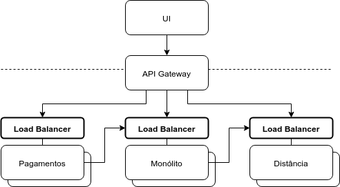
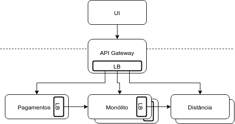

# Load Balancing

## Escalabilidade

Em um dia como a Black Friday, é comum um aumento drástico nos acessos a lojas online como a Casa do Código. No caso de um desastre natural, há um incremento vigoroso no uso de redes sociais como o Twitter. Como esses softwares conseguem lidar com essa demanda anormal?

Além das funcionalidades acessadas pelos usuários, um software possui uma série de características operacionais transversais, que não estão relacionadas a uma capacidade de negócio específica. São características comuns a todo bom software, geralmente chamadas de requisitos não-funcionais ou atributos de qualidade. São requisitos relevantes para a Arquitetura de Software como, por exemplo: segurança, resiliência, performance, usabilidade, manutenibilidade, disponibilidade, escalabilidade, entre vários outros. Também são chamados de _-ilidades_, já que esse é o sufixo de boa parte desses requisitos.

Uma dessas _ilidades_ é a característica de um sistema de conseguir lidar com esse aumento vigoroso no uso: a **Escalabilidade**.

Um sistema pode ter como característica a **Escalabilidade Vertical**, em que o aumento na capacidade computacional se deve a uma máquina mais poderosa: mais memória, mais CPUs e mais disco.

Já um que apresenta **Escalabilidade Horizontal** aumenta seu poder computacional adicionando mais máquinas _commodity_ a um Sistema Distribuído. Em uma Arquitetura de Microservices, significa adicionar **redundância**, replicando o código de um mesmo serviço em mais de uma máquina.

Redundância não é suficiente. Vários outras características são necessárias para que um serviço possa ser escalado horizontalmente. Por exemplo, um serviço _Stateless_ favorece bastante a Escalabilidade Horizontal. Lembrando a definição de Roy Fielding sua tese [Architectural Styles and the Design of Network-based Software Architectures](https://www.ics.uci.edu/~fielding/pubs/dissertation/top.htm) (FIELDING, 2000): uma sistema é _Stateless_ quando cada request do cliente deve conter todos os dados necessários, sem tomar vantagem de nenhum contexto armazenado no servidor

Em sistemas executados em alguma plataforma de Cloud Computing, manter recursos alocados sem utilização custa caro. Por isso, é importante que o sistema possa aumentar _e diminuir_ a sua capacidade de maneira automática. Essa característica é conhecida como _Elasticidade_.

> Será que um Monólito ser escalável horizontalmente? Pode sim, se for construído de maneira que o código do projeto possa ser replicado em múltiplas máquinas.

## Disponibilidade

O pesquisador da Google Jeffrey Dean, na palestra [Designs, Lessons and Advice from Building Large Distributed Systems](http://www.cs.cornell.edu/projects/ladis2009/talks/dean-keynote-ladis2009.pdf) (DEAN, 2009), lista alguns problemas de hardware que ocorrem no primeiro ano de um novo cluster:

- 3 falhas em roteadores, tirando o cluster do ar por 1 hora
- 8 manutenções na rede, causando 30 minutos de perdas de conexões
- 12 reloads em roteadores, derrubando o DNS por alguns minutos
- 20 falhas em racks, matando dezenas de máquinas e levando 
- milhares de falhas em discos rígidos

<!-- @note
O Jeffrey Dean ainda menciona tubarões como problemas em links de longa distância, provavelmente para links marinhos entre continentes!
-->

> _A principal coisa que notei, no entanto, foi que os discos rígidos foram conectados por velcro. Perguntei a um dos Googlers o motivo disso. 'Ah', disse ele, 'os discos rígidos falham tanto que não queremos que eles sejam aparafusados. Nós apenas os arrancamos, jogamos na lixeira e conectamos um novo com velcro._
>
> Sam Newman, no livro [Building Microservices](https://learning.oreilly.com/library/view/building-microservices/9781491950340/) (NEWMAN, 2015)

Há diversas outras fontes de erro, como mudança de configurações de Firewall, alterações no DNS ainda não propagadas, atualizações em serviços externos para versões não compatíveis, falhas no Sistema Operacional e, claro, bugs involuntariamente adicionados pelos desenvolvedores de um serviço.

Fica claro que, no mundo real, um Sistema Distribuído tem diversos motivos para ficar fora do ar. 

Estar operando normalmente é algo relacionado a outra _ilidade_: a **Disponibilidade**. Trata-se da proporção de tempo em que um sistema se mantém em operação. Algumas medidas de Disponibilidade comuns:

- um sistema que fica fora do ar durante 3,65 dias por ano tem Disponibilidade anual de 99 %, conhecida como _two nines_
- um sistema que fica fora do ar durante 8,77 horas por ano tem Disponibilidade anual de 99.9 %, conhecida como _three nines_
- um sistema que fica fora do ar durante 5,26 minutos por ano tem Disponibilidade anual de 99,999 %, conhecida como _five nines_

> Mais adiante na apostila vamos revisitar o conceito de Disponibilidade.

Em um Sistema Distribuído, manter a Disponibilidade passa ser mais difícil. Para estar disponível, um Sistema Distribuído com 3 serviços distintos tem que ter todos no ar ao mesmo tempo. Se a Disponibilidade de cada serviço for 99 %, a Disponibilidade do todo é de 99<sup>3</sup> %, ou **97 %**. Ou seja, a disponibilidade geral é menor do que a disponibilidade de cada serviço!

O que podemos fazer para ajudar a aumentar a Disponibilidade de um Sistema Distribuído?

Devemos eliminar pontos únicos de falha (em inglês, _Single Points of Failure_) adicionando **redundância**, replicando o código de um mesmo serviço em mais de uma máquina. Assim, se uma das máquinas falharem, teremos outras que tratarão as requisições ao serviço.

Redundância por si só não é suficiente para garantir Alta Disponibilidade de um Sistema Distribuído. De maneira semelhante à Escalabilidade, há outras características necessárias. Ser _Stateless_, por exemplo, facilita a redundância, favorecendo a Disponibilidade.

## Load Balancing

Perceba que, tanto para atingir Escalabilidade Horizontal como para conseguirmos Alta Disponibilidade, devemos usar redundância, replicando os mesmo serviços em diferentes instâncias.

Surge um problema: qual das instâncias deve ser chamada por clientes externos, como uma UI Web? E, em uma chamada entre serviços, qual instância deve ser invocada?

Precisamos fazer um **Balanceamento de Carga** (em inglês, _Load Balancing_), distribuindo as requisições entre as instâncias disponíveis de um serviço.

Podemos implementar o Load Balancing de duas maneiras diferentes: do lado de quem provê as instâncias (servidor) e do lado de quem chama as instâncias (cliente).

Um detalhe importante: se um _load balancer_ estiver fora do ar, todas as instâncias de um serviço ficarão inatingíveis. Para que não seja um _Single Point of Failure_, é necessário que haja redundância do próprio load balancer.

Load Balancers que usam dados de protocolos no nível de rede ou transporte como IP, TCP, FTP e UDP para fazer o balanceamento são chamados de _L4 load balancers_, já que vão até o nível 4 (Transporte) do Modelo OSI de redes computacionais. Já quando um load balancer lida dados de protocolos do nível de aplicação, como cabeçalhos do HTTP, são chamados de _L7 load balancers_, correspondendo ao nível 7 (Aplicação) do Modelo OSI.

> _Sistemas escaláveis horizontalmente atingem disponibilidade e escalabilidade por meio da multiplicidade. A adição de mais máquinas para aumentar a capacidade melhora a resiliência a impulsos (choques agudos e curtos no sistema). Os servidores menores usados em arquiteturas escaláveis horizontalmente também custam muito menos e permitem aumentar a capacidade em pequenos incrementos._
>
> _A criação de sistemas escaláveis horizontalmente implica em alguma forma de balanceamento de carga. O balanceamento de carga tem tudo a ver com a distribuição de solicitações em um pool ou farm de servidores para atender a todas as requisições corretamente no menor tempo possível._
>
> Michael Nygard, em seu livro [Release It!](https://pragprog.com/book/mnee/release-it) (NYGARD, 2007)

### Server Side Load Balancing

A maneira mais comum de implementar Load Balancing é do lado do servidor: o **Server Side Load Balacing**.

Esses server side load balancers pode hardwares, como as _appliances_ da Cisco ou F5. Em geral, são L4 load balancers mas também podem ser L7. São equipamentos caríssimos.

É bem comum termos softwares que funcionam como server side load balancers. Em geral, são L7 load balancers. Proxys reversos como Squid, Apache httpd, NGinx e HAProxy são comumente usados para Load Balancing.

> Plataformas de Cloud Computing tem load balancers já integrados com as outras soluções oferecidas. A Amazon AWS, por exemplo, tem o AWS Elastic Load Balancer (ELB), que está integrado com AWS EC2 e AWS Lambda, por exemplo. É possível escolher entre L4 e L7 load balancers.

Em termos de topologia de rede, um load balancer deve ser colocado na frente de cada grupo de instâncias de um determinado serviço.

No caso do Caelum Eats, isso significaria que precisaríamos de um load balancer em frente do Monólito, outro em frente do serviço de distância e outro em frente do serviço de pagamentos. Toda chamada do API Gateway a esses serviços, assim como toda chamada entre esses serviços deveria passar pelos respectivos load balancers, para que a carga seja distribuída entre as instâncias dos serviços.



No orquestrador de containers [Kubernetes](https://kubernetes.io/), as instâncias de uma aplicação são chamadas de [Pods](https://kubernetes.io/docs/concepts/workloads/pods/pod-overview/). O Kubernetes já provê uma abstração para o agrupamento dos diferentes Pods de uma aplicação, chamada de [Service](https://kubernetes.io/docs/concepts/services-networking/service/). Um Service funciona como um server side load balancer, expondo os Pods de uma aplicação sob um mesmo DNS name.

> No livro [Release It!](https://pragprog.com/book/mnee/release-it) (NYGARD, 2007), Michael Nygard menciona que o próprio DNS pode ser usado como um L7 load balancer: é possível associar múltiplos IPs a um mesmo domínio. Ao contrário de outros load balancers, o balanceamento não é feito durante uma requisição, mas na resolução de nomes. É feito um balanceamento do tipo _round-robin_, em que os IPs oferecidos ao cliente são rotacionados sequencialmente. Uma grande desvantagem do DNS é que os IPs devem ser acessíveis diretamente. Além disso, não há uma maneira de modificar o algoritmo de balanceamento e, uma vez que o cliente esteja conectado a um IP, não há como redirecionar para outras instâncias.

### Client Side Load Balancing

Uma alternativa é que um componente dentro da própria aplicação sirva como load balancer: é o que chamamos de **Client Side Load Balancing**.

Esse componente da aplicação precisa, de alguma forma, saber quais instâncias estão disponíveis para quais serviços. Isso pode ser feito através de configurações.

A topologia de rede é drasticamente simplificada, já que o load balancer não é externo à aplicação. Além disso, cada instância terá o mesmo componente com a mesma configuração, ou seja, já há redundância do load balancer!



## Ribbon

A Netflix lançou como parte de sua iniciativa open-source o [Ribbon](https://github.com/Netflix/ribbon/), um Client Side Load Balancer integrado com outras ferramentas do Netflix OSS.

Uma das necessidades do Ribbon é saber o IP ou DNS name das instâncias de um determinado serviço. Isso pode ser feito por uma configuração estática (`ConfigurationBasedServerList`), ou de maneira dinâmica, de modo a remover, de tempos em tempos, instâncias indisponíveis e adicionar novas instâncias (`DiscoveryEnabledNIWSServerList`). Nesse capítulo, focaremos na configuração estática. Em um capítulo posterior, estudaremos a configuração dinâmica da lista de instâncias.

O Ribbon possui diferentes _rules_, que são lógicas de escolha de uma instância da lista. Entre elas:

- `RoundRobinRule`: usa o algoritmo _round robin_, que rotaciona a lista de instâncias, alternando sequencialmente entre as instâncias disponíveis. É o algoritmo padrão. Se tivermos 3 instâncias, as chamadas seriam à primeira, à segunda e à terceira, e então à primeira novamente, e assim por diante.
- `AvailabilityFilteringRule`: um algoritmo que pula as instâncias indisponíveis. Por padrão, uma instância é considerada indisponível se há falha em 3 conexões consecutivas. Depois de 30 segundos, há nova tentativa de conexão. Se houver falha nas novas tentativas, há um aumento exponencial do tempo de espera. Todos esses valores são configuráveis.
- `WeightedResponseTimeRule`: é coletado o tempo de resposta de cada instância. Quanto maior o tempo de resposta, menor a probabilidade da instância ser obtida da lista.

Além disso, o Ribbon mantém estatísticas da latência e frequência de falha de cada instância.

Também é possível agrupar clientes e servidores em zonas (equivalente a _data centers_), mantendo chamadas numa mesma zona de maneira a minimizar a latência.

É possível obter detalhes sobre essas configurações no Wiki de documentação do Ribbon no GitHub: https://github.com/Netflix/ribbon/wiki/Working-with-load-balancers

> Em Abril de 2016, o time da Netflix responsável pelo Ribbon informou que o projeto está em [modo de manutenção](https://github.com/Netflix/ribbon/commit/ba0d2a10cb3712a017878a283865bf4e8bee6ea2#diff-04c6e90faac2675aa89e2176d2eec7d8) e novas funcionalidades não serão adicionadas. Afirmaram também que o projeto é bastante estável e que as partes principais são utilizadas em produção. Também disseram que os planos são migrar para uma solução baseada em gRPC, com interceptadores customizados para load balancing e service discovery.

## Spring Cloud Netflix Ribbon

O projeto Spring Cloud Netflix Ribbon integra o Ribbon com o ecossistema do Spring.

Para utilizá-lo em um projeto Spring Boot, basta adicionar como dependência o artefato `spring-cloud-starter-netflix-ribbon`. Com o Maven, basta declarar:

```xml
<dependency>
  <groupId>org.springframework.cloud</groupId>
  <artifactId>spring-cloud-starter-netflix-ribbon</artifactId>
</dependency>
```

_Observação: para que o Maven obtenha as versões corretas do Spring Cloud e das dependências transitivas, o artefato `spring-cloud-dependencies` deve ser adicionado ao Dependency Management com tipo `pom`. Faremos isso nos próximos exercícios para os projetos que ainda não possuem essa declaração._

Digamos que temos duas instâncias de um serviço de Estoque sendo executadas nas portas `8089` e `9099`.

Uma chamada à instância de porta `8089` para obter o item de estoque de `id` igual a `1` seria feita com a URL:

```txt
http://localhost:8089/item/1
```

Já para a outra instância, teríamos:

```txt
http://localhost:9099/item/1
```

Com o Spring Cloud Netflix Ribbon, poderíamos ter a seguinte configuração no `application.properties` do projeto:

```properties
estoque.ribbon.listOfServers=http://localhost:8089,http://localhost:9099
```

Com a configuração anterior, o nome `estoque` está associado pelo Ribbon à lista com as duas instâncias do serviço. É como se fosse criado um Virtual Host chamado `estoque`. Como o algoritmo padrão é o _round robin_, chamadas a `http://estoque` que passam pelo Ribbon seriam alternadas entre as duas instâncias.

Uma outra configuração que devemos fazer por enquanto é desabilitar o Eureka, que está integrado ao Ribbon mas estudaremos em capítulos posteriores:

```properties
ribbon.eureka.enabled=false
```

### Integrando com RestTemplate

Então, poderíamos usar a seguinte URL em uma chamada com `RestTemplate` do Spring:

```txt
String url = "http://estoque/item/1";
Map dados = restTemplate.getForObject(url, Map.class);
```

Porém, ao executarmos esse código, teríamos uma exceção semelhante a:

```txt
java.net.UnknownHostException: estoque
```

O RestTemplate não entende o que significa `estoque`. Na verdade, a chamada não foi interceptada pelo Ribbon.

Para associar o Ribbon ao `RestTemplate`, devemos utilizar a anotação `@LoadBalanced` no momento da criação da instância do `RestTemplate`:

```java
@Configuration
public class RestClientConfig {

  @LoadBalanced // adicionado
  @Bean
  public RestTemplate restTemplate() {
    return new RestTemplate();
  }

}
```

A anotação `@LoadBalanced` é do pacote `org.springframework.cloud.client.loadbalancer`. Perceba que não é de um pacote específico do Ribbon, mas de um pacote mais genérico. Essa anotação está definida no projeto Spring Cloud Commons, que contém diversas abstrações que permitem deixar o código desacoplado de implementações específicas. É o poder das abstrações!

### Integrando com Feign

O Feign já é totalmente integrado com o Ribbon. A presença do JAR do Ribbon faz com que as chamadas feitas pelo Feign sejam interceptadas e o load balancing seja efetuado.

Basta fornecer o nome do serviço na anotação `@FeignClient`:

```java
@FeignClient("estoque")
public interface EstoqueRestClient {

  @GetMapping("/item/{id}")
  Map obtemDadosDoItem(@PathVariable("id") Long id);

}
```

Com o código anterior, seria feita uma requisição à URL `http://estoque/item/1`, alternando entre as duas instâncias configuradas pelo Ribbon.

### Integrando com Zuul

O Zuul já é totalmente integrado com o Ribbon. Não há nem a necessidade de declarar o Spring Cloud Netflix Ribbon como dependência do projeto.

Nas configurações do Zuul, precisaríamos criar uma rota com o nome do serviço, usando a propriedade `path` para determinar qual o prefixo de URL associado:

```properties
zuul.routes.estoque.path=/estoque/**
```

Com a configuração anterior, qualquer requisição ao Zuul cuja URL for iniciada com `/estoque` seria redirecionada para a configuração do serviço `estoque` do Ribbon que, por sua vez, cuidaria da distribuição das chamadas às diferentes instâncias.

## Detalhando o log de requests do serviço de distância

Para que todas as requisições do serviço de distância sejam logadas (e com mais informações), vamos configurar um `CommonsRequestLoggingFilter`.

Para isso, crie a classe `RequestLogConfig` no pacote `br.com.caelum.eats.distancia`:

####### fj33-eats-distancia-service/src/main/java/br/com/caelum/eats/distancia/RequestLogConfig.java

```java
@Configuration
class RequestLogConfig {

  @Bean
  CommonsRequestLoggingFilter requestLoggingFilter() {
    CommonsRequestLoggingFilter loggingFilter = new CommonsRequestLoggingFilter();
    loggingFilter.setIncludeClientInfo(true);
    loggingFilter.setIncludePayload(true);
    loggingFilter.setIncludeHeaders(true);
    loggingFilter.setIncludeQueryString(true);
    return loggingFilter;
  }

}
```

Os imports são os seguintes:

```java
import org.springframework.context.annotation.Bean;
import org.springframework.context.annotation.Configuration;
import org.springframework.web.filter.CommonsRequestLoggingFilter;
```

O nível de log do `CommonsRequestLoggingFilter` deve ser modificado para `DEBUG` no `application.properties`:

####### fj33-eats-distancia-service/src/main/resources/application.properties

```properties
logging.level.org.springframework.web.filter.CommonsRequestLoggingFilter=DEBUG
```

## Exercício: executando uma segunda instância do serviço de distância

1. Interrompa o serviço de distância.

  No projeto `fj33-eats-distancia-service`, vá até a branch `cap8-detalhando-o-log-de-resquests-do-servico-de-distancia`:

  ```sh
  cd ~/Desktop/fj33-eats-distancia-service
  git checkout -f cap8-detalhando-o-log-de-resquests-do-servico-de-distancia
  ```

  <!--
    TODO: renomear a branch cap8-detalhando-o-log-de-requests-do-servico-de-distancia, corrigindo o resquests, tanto na apostila como no repositório. 
  -->

  Execute a classe `EatsDistanciaServiceApplication`.

2. Configure a segunda instância do serviço de distância para que seja executada na porta `9092`.

  No Eclipse, acesse o menu _Run > Run Configurations..._.

  Clique com o botão direito na configuração `EatsDistanciaServiceApplication` e, então, na opção _Duplicate_.

  Deve ser criada a configuração `EatsDistanciaServiceApplication (1)`.

  Na aba _Arguments_, defina `9092` como a porta dessa segunda instância, em _VM Arguments_:

  ```txt
  -Dserver.port=9092
  ```

  Clique em _Run_. Nova instância do serviço de distância no ar!

3. Acesse uma URL do serviço de distância que está sendo executado na porta `8082` como, por exemplo, a URL `http://localhost:8082/restaurantes/mais-proximos/71503510`. Verifique os logs no Console do Eclipse, na configuração `EatsDistanciaServiceApplication`.

  Use a porta para `9092`, por meio de uma URL como `http://localhost:9092/restaurantes/mais-proximos/71503510`. Note que os logs do Console do Eclipse agora são da configuração `EatsDistanciaServiceApplication (1)`.

## Client side load balancing no RestTemplate do monólito com Ribbon

No `pom.xml` do módulo `eats`, o módulo pai do monólito, adicione uma dependência ao _Spring Cloud_ na versão `Greenwich.SR2`, em `dependencyManagement`:

####### fj33-eats-monolito-modular/eats/pom.xml

```xml
<dependencyManagement>
  <dependencies>
    <dependency>
      <groupId>org.springframework.cloud</groupId>
      <artifactId>spring-cloud-dependencies</artifactId>
      <version>Greenwich.SR2</version>
      <type>pom</type>
      <scope>import</scope>
    </dependency>
  </dependencies>
</dependencyManagement>
```

Adicione o _starter_ do Ribbon como dependência do módulo `eats-application` do monólito:
  
####### fj33-eats-monolito-modular/eats/eats-application/pom.xml

```xml
<dependency>
  <groupId>org.springframework.cloud</groupId>
  <artifactId>spring-cloud-starter-netflix-ribbon</artifactId>
</dependency>
```

Para que a instância do `RestTemplate` configurada no módulo `eats-application` do monólito use o Ribbon, anote o método `restTemplate` de `RestClientConfig` com `@LoadBalanced`:

####### fj33-eats-monolito-modular/eats/eats-application/src/main/java/br/com/caelum/eats/RestClientConfig.java

```java
@Configuration
public class RestClientConfig {

  @LoadBalanced // adicionado
  @Bean
  public RestTemplate restTemplate() {
    return new RestTemplate();
  }

}
```

O import correto é:

```java
import org.springframework.cloud.client.loadbalancer.LoadBalanced;
```

Mude o arquivo `application.properties`, do módulo `eats-application` do monólito, para que seja configurado o _virtual host_ `distancia`, com uma lista de servidores cujas chamadas serão alternadas.

Faça com que a propriedade `configuracao.distancia.service.url` aponte para esse _virtual host_.

Por enquanto, desabilite o Eureka, que será abordado mais adiante.

####### fj33-eats-monolito-modular/eats/eats-application/src/main/resources/application.properties

```properties
c̶o̶n̶f̶i̶g̶u̶r̶a̶c̶a̶o̶.̶d̶i̶s̶t̶a̶n̶c̶i̶a̶.̶s̶e̶r̶v̶i̶c̶e̶.̶u̶r̶l̶=̶h̶t̶t̶p̶:̶/̶/̶l̶o̶c̶a̶l̶h̶o̶s̶t̶:̶8̶0̶8̶2̶
configuracao.distancia.service.url=http://distancia

distancia.ribbon.listOfServers=http://localhost:8082,http://localhost:9092
ribbon.eureka.enabled=false
```

## Client side load balancing no RestTemplate do API Gateway com Ribbon

O Zuul já é integrado com o Ribbon e, por isso, não precisamos colocá-lo como dependência.

Modifique o `application.properties` do `api-gateway`, para que use o Ribbon como _load balancer_ nas chamadas ao serviço de distância.

Troque a configuração do Zuul do serviço de distância para fazer um _matching_ pelo `path`. Em seguida, configure a lista de servidores do Ribbon com as instâncias do serviço de distância.

Adicione a propriedade `configuracao.distancia.service.url`, usando a URL `http://distancia` do Ribbon. Essa propriedade será usada no `DistanciaRestClient`.

####### fj33-api-gateway/src/main/resources/application.properties

```properties
z̶u̶u̶l̶.̶r̶o̶u̶t̶e̶s̶.̶d̶i̶s̶t̶a̶n̶c̶i̶a̶.̶u̶r̶l̶=̶h̶t̶t̶p̶:̶/̶/̶l̶o̶c̶a̶l̶h̶o̶s̶t̶:̶8̶0̶8̶2̶

zuul.routes.distancia.path=/distancia/**
distancia.ribbon.listOfServers=http://localhost:8082,http://localhost:9092

configuracao.distancia.service.url=http://distancia
```

Modifique a anotação `@Value` do construtor de `DistanciaRestClient` para que use a propriedade `configuracao.distancia.service.url`:

####### fj33-api-gateway/src/main/java/br/com/caelum/apigateway/DistanciaRestClient.java

```java
class DistanciaRestClient {

  // código omitido ...

  DistanciaRestClient(RestTemplate restTemplate,
        @̶V̶a̶l̶u̶e̶(̶"̶$̶{̶z̶u̶u̶l̶.̶r̶o̶u̶t̶e̶s̶.̶d̶i̶s̶t̶a̶n̶c̶i̶a̶.̶u̶r̶l̶}̶"̶)̶ ̶S̶t̶r̶i̶n̶g̶ ̶d̶i̶s̶t̶a̶n̶c̶i̶a̶S̶e̶r̶v̶i̶c̶e̶U̶r̶l̶)̶ ̶{̶
        @Value("${configuracao.distancia.service.url}") String distanciaServiceUrl) {

    this.restTemplate = restTemplate;
    this.distanciaServiceUrl = distanciaServiceUrl;

  }

  // restante do código ...

}
```

Na classe `RestClientConfig` do `api-gateway`, faça com que o `RestTemplate` seja `@LoadBalanced`:

####### fj33-api-gateway/src/main/java/br/com/caelum/apigateway/RestClientConfig.java

```java
@Configuration
class RestClientConfig {

  @LoadBalanced // adicionado
  @Bean
  RestTemplate restTemplate() {
    return new RestTemplate();
  }

}
```

Lembrando que o import correto é:

```java
import org.springframework.cloud.client.loadbalancer.LoadBalanced;
```

## Exercício: Client side load balancing no RestTemplate com Ribbon

1. Interrompa o monólito e o API Gateway.

  Faça o checkout da branch `cap8-client-side-load-balancing-no-rest-template-com-ribbon` dos projetos `fj33-eats-monolito-modular` e `fj33-api-gateway`:

  ```sh
  cd ~/Desktop/fj33-eats-monolito-modular
  git checkout -f cap8-client-side-load-balancing-no-rest-template-com-ribbon

  cd ~/Desktop/fj33-api-gateway
  git checkout -f cap8-client-side-load-balancing-no-rest-template-com-ribbon
  ```

  Execute novamente o monólito e o API Gateway.

2. Certifique-se que o monólito, o serviço de distância, o API Gateway e a UI estejam no ar.

  Teste a alteração do CEP e/ou tipo de cozinha de um restaurante. Para isso, efetue o login como um dono de restaurante. Se desejar, use as credenciais pré-cadastradas (`longfu`/`123456`) do restaurante Long Fu.

  Observe qual instância do serviço de distância foi invocada.

  Tente alterar novamente o CEP e/ou tipo de cozinha do restaurante. Note que foi invocada a outra instância do serviço de distância.

  A cada alteração, as instâncias são invocadas alternadamente.

3. Teste também a API Composition do API Gateway, que invoca o serviço de distância usando um `RestTemplate` do Spring, agora com `@LoadBalanced`, na classe `DistanciaRestClient`.

  Observe, pelos logs, que a URL `http://localhost:9999/restaurantes-com-distancia/71503510/restaurante/1` também alterna entre as instâncias.

  O Zuul já está integrado com o Ribbon. Então, ao utilizarmos o Zuul como proxy, a alternância entre as instâncias já é efetuada. Teste isso acessando a URL `http://localhost:9999/distancia/restaurantes/mais-proximos/71503510`.

## Exercício: executando uma segunda instância do monólito

1. Faça com que uma segunda instância do monólito rode com a porta `9090`.

  No workspace do monólito, acesse o menu _Run > Run Configurations..._ do Eclipse e clique com o botão direito na configuração `EatsApplication` e depois clique em _Duplicate_.

  Na configuração `EatsApplication (1)` que foi criada, acesse a aba _Arguments_ e defina `9090` como a porta da segunda instância, em _VM Arguments_:

  ```txt
  -Dserver.port=9090
  ```

  Clique em _Run_. Nova instância do monólito no ar!

## Client side load balancing no Feign do serviço de pagamentos com Ribbon

Adicione como dependência o _starter_ do Ribbon no `pom.xml` do `eats-pagamento-service`:

####### fj33-eats-pagamento-service/pom.xml

```xml
<dependency>
  <groupId>org.springframework.cloud</groupId>
  <artifactId>spring-cloud-starter-netflix-ribbon</artifactId>
</dependency>
```

Configure a URL do monólito para use uma lista de servidores do Ribbon e, por enquanto, desabilite o Eureka:

####### fj33-eats-pagamento-service/src/main/resources/application.properties

```properties
c̶o̶n̶f̶i̶g̶u̶r̶a̶c̶a̶o̶.̶p̶e̶d̶i̶d̶o̶.̶s̶e̶r̶v̶i̶c̶e̶.̶u̶r̶l̶=̶h̶t̶t̶p̶:̶/̶/̶l̶o̶c̶a̶l̶h̶o̶s̶t̶:̶8̶0̶8̶0̶

monolito.ribbon.listOfServers=http://localhost:8080,http://localhost:9090
ribbon.eureka.enabled=false
```

Troque a anotação do Feign em `PedidoRestClient` para que aponte para a configuração `monolito` do Ribbon:

####### fj33-eats-pagamento-service/src/main/java/br/com/caelum/eats/pagamento/PedidoRestClient.java

```java
@̶F̶e̶i̶g̶n̶C̶l̶i̶e̶n̶t̶(̶u̶r̶l̶=̶"̶$̶{̶c̶o̶n̶f̶i̶g̶u̶r̶a̶c̶a̶o̶.̶p̶e̶d̶i̶d̶o̶.̶s̶e̶r̶v̶i̶c̶e̶.̶u̶r̶l̶}̶"̶,̶ ̶n̶a̶m̶e̶=̶"̶p̶e̶d̶i̶d̶o̶"̶)̶
@FeignClient("monolito") // modificado
public interface PedidoRestClient {

  // código omitido ...

}
```

## Client side load balancing no Feign do API Gateway com Ribbon

No `application.properties` do `api-gateway`, adicione da URL da segunda instância do monólito:

####### fj33-api-gateway/src/main/resources/application.properties

```properties
m̶o̶n̶o̶l̶i̶t̶o̶.̶r̶i̶b̶b̶o̶n̶.̶l̶i̶s̶t̶O̶f̶S̶e̶r̶v̶e̶r̶s̶=̶h̶t̶t̶p̶:̶/̶/̶l̶o̶c̶a̶l̶h̶o̶s̶t̶:̶8̶0̶8̶0̶
monolito.ribbon.listOfServers=http://localhost:8080,http://localhost:9090
```

## Exercício: Client side load balancing no Feign com Ribbon

1. Pare o serviço de pagamentos e o API Gateway.

  Vá até a branch `cap8-client-side-load-balancing-no-feign-com-ribbon` nos projetos `fj33-eats-pagamento-service` e `fj33-api-gateway`:

  ```sh
  cd ~/Desktop/fj33-eats-pagamento-service
  git checkout -f cap8-client-side-load-balancing-no-feign-com-ribbon

  cd ~/Desktop/fj33-api-gateway
  git checkout -f cap8-client-side-load-balancing-no-feign-com-ribbon
  ```

  Execute novamente o serviço de pagamentos e o API Gateway.

2. Garanta que o serviço de pagamentos foi reiniciado e que as duas instâncias do monólito estão no ar.

  Use um cliente REST como o cURL para confirmar um pagamento:

  ```txt
  curl -X PUT -i http://localhost:8081/pagamentos/1
  ```

  Teste várias vezes seguidas e note que os logs são alternados entre `EatsApplication` e `EatsApplication (1)`, as instâncias do monólito.

  _Observação: confirmar um pagamento já confirmado tem o mesmo efeito, incluindo o aviso de pagamento ao monólito._

3. Acesse pelo API Gateway, por duas vezes seguidas, uma URL do monólito como `http://localhost:9999/restaurantes/1`.

  Veja que os logs são alternados entre os Consoles de `EatsApplication` e `EatsApplication (1)`.
