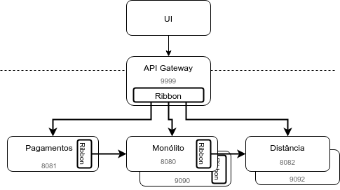
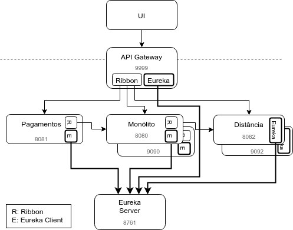

# Service Discovery

No capítulo anterior, temos as seguintes instâncias:

- 2 instâncias do Monólito, uma na porta 8080 e outra na porta 9090
- 1 instância do serviço de Pagamentos, na porta 8081
- 2 instâncias do serviço de Distância, uma na porta 8082 e outra na porta 9092



Para que o Ribbon faça o Client Side Load Balancing dessas instâncias, os `application.properties` das aplicações cliente devem conter os endereços de todas instâncias dos serviços que são chamados.

No API Gateway, o Monólito e os serviços de Pagamentos e Distância são usados para proxy e/ou API Composition. Para efetuar o Load Balancing corretamente, há referências aos endereços das duas instâncias do serviço de Distância e também das do Monólito:

####### fj33-api-gateway/src/main/resources/application.properties

```properties
distancia.ribbon.listOfServers=http://localhost:8082,http://localhost:9092
...
monolito.ribbon.listOfServers=http://localhost:8080,http://localhost:9090
```

Como o serviço de Pagamento chama o módulo de Pedidos do Monólito para avisar que foi confirmado um pagamento, há a necessidade do endereço das instâncias do Monólito em suas configurações:

####### fj33-eats-pagamento-service/src/main/resources/application.properties

```properties
monolito.ribbon.listOfServers=http://localhost:8080,http://localhost:9090
```

Já o Monólito chama o serviço de Distância quando há uma alteração em um CEP e/ou um tipo de cozinha de um restaurante. Por isso, o endereço das instâncias do serviço de Distância está entre suas configurações.

####### fj33-eats-monolito-modular/eats/eats-application/src/main/resources/application.properties

```properties
distancia.ribbon.listOfServers=http://localhost:8082,http://localhost:9092
```

Qual seria o impacto de uma nova instância do serviço de Distância?

Teríamos que alterar as configurações dos `application.properties` de todos os clientes desse serviço, tanto do Monólito como do API Gateway, fazer novo build dos projetos afetados e publicar o JAR.

Será que há uma maneira mais fácil. Sim! No Spring Boot, é possível sobrescrever a maioria das configurações com variáveis de ambiente. A propriedade `distancia.ribbon.listOfServers` seria equivalente a `DISTANCIA_RIBBON_LISTOFSERVERS`. Para adicionar uma instância do serviço de Distância na porta `9876` no Linux, teríamos algo como:

```sh
export DISTANCIA_RIBBON_LISTOFSERVERS=http://localhost:8082,http://localhost:9092,http://localhost:9876
```

Bem melhor que ter que recompilar e republicar o JAR.

Mais ainda assim, teríamos que configurar variáveis de ambiente nas máquinas de todos os clientes e reiniciar suas aplicações.

## Registrando serviços

Como afirma Chris Richardson, em seu livro [Microservices Patterns](https://www.manning.com/books/microservices-patterns) (RICHARDSON, 2018a), numa aplicação tradicional que é executada em hardware físico, os endereços de rede das instâncias dos serviços geralmente são estáticos. Seu código poderia ler URLs de um arquivo de configuração que é atualizado apenas ocasionalmente. Mas uma aplicação moderna, baseada em cloud, não é tão simples: há a necessidade de maior dinamicidade.

Instâncias de serviços tem URLs determinadas dinamicamente, Além disso, o conjunto de instâncias de um serviço muda dinamicamente por causa de falhas, atualizações ou _autoscaling_. É necessário que o código do cliente descubra dinamicamente quais os endereços das instâncias disponíveis. É o que chamamos de **Service Discovery**.

Para implementar Service Discovery, precisamos de um catálogo que mantenha as URLs das instâncias de um serviço. Chamamos esse catálogo de **Service Registry**.

Quando instâncias de um serviço são iniciadas ou paradas, o Service Registry deve ser atualizado. Ao invocar um serviço, um cliente consulta o Service Registry para obter as instâncias disponíveis e direciona a requisição a uma delas.

Sam Newman afirma, em seu livro [Building Microservices](https://learning.oreilly.com/library/view/building-microservices/9781491950340/) (NEWMAN, 2015), que as instâncias registradas no Service Registry podem ser usadas para saber o que deve ser monitorado e quais as APIs disponíveis para os desenvolvedores. 

Newman indica que DNS poderia ser utilizado como um Service Registry. Porém, poucos servidores DNS são configurados para lidar com instâncias altamente "descartáveis", fazendo com que a atualização do DNS seja trabalhosa. Além disso, os clientes mantém os endereços obtidos do DNS por pelo menos o TTL (_time to live_). Isso pode levar a endereços desatualizados.

<!-- @note
  O Sam Newman fala no capítulo 11 do Building Microservices que uma alternativa seria o DNS apontar para um Load Balancer que, por sua vez, teria uma maneira mais dinâmica de obter as instâncias disponíveis. Resolvi deixar essa solução de fora do texto.
-->

Para lidar com a dinamicidade da criação e destruição de instãncias de serviços em um ambiente Cloud, diferentes softwares são usados como Service Registry. Entre eles:

- [ZooKeeper](http://zookeeper.apache.org/), da Apache Software Foundation, é um sistema de coordenação distribuída originalmente desenvolvido como parte do projeto Hadoop. É bastante genérico em suas ofertas, lidando com gerenciamento de configurações, sincronização de dados, _leader election_, fila de mensagens e Service Discovery. É possível que clientes sejam alertados sobre mudanças nas configurações.
- [Consul](https://www.consul.io/), da HashiCorp, lida com gerenciamento de configurações e Service Discovery. Expõe uma RESTful API, é compatível com DNS, provê um _key-value store_ distribuído, entre outras funcionalidades. Por meio de requisições HTTP, uma instância de serviço pode ser registrada, um endereço pode ser consultado, etc.
- [Eureka](https://github.com/Netflix/eureka), da iniciativa open-source da Netflix, foca em Service Discovery e provê uma RESTful API e clientes Java. É integrado com o Ribbon, a ferramenta de Client Side Load Balancing da Netflix OSS.

Um problema que surge: como atualizar o registro das instâncias disponíveis no Service Registry?

Uma maneira bem ágil é cada instância avisar ao Service Registry que está no ar ou vai ser derrubada. No livro [Microservices Patterns](https://www.manning.com/books/microservices-patterns) (RICHARDSON, 2018a), Chris Richardson chama essa solução de _Self Registration_.

> **Pattern: Self Registration**
>
> Uma instância de um serviço se registra no Service Registry.

Do lado do cliente, há a necessidade de uma consulta ao Service Registry para obter quais instâncias de um serviço estão registradas. Então, o cliente usa um algoritmo de Load Balancing para selecionar uma instância da lista e efetua a requisição. Para melhorar a performance, o cliente pode fazer um cache das instâncias. No livro [Microservices Patterns](https://www.manning.com/books/microservices-patterns) (RICHARDSON, 2018a), Chris Richardson chama essa solução de _Client-Side Discovery_.

> **Pattern: Client-side Discovery**
>
> Um cliente recupera a lista de instâncias disponíveis de um serviço do Service Registry e faz Load Balancing entre os endereços obtidos.

## Eureka

Nesse curso, usaremos o Eureka, que é integrado com o ecossistema Spring através do projeto Spring Cloud Netflix Eureka. Para implementar o Service Registry, será utilizado o projeto Spring Cloud Netflix Eureka Server, disponível pelo artefato `spring-cloud-starter-netflix-eureka-server`. Por padrão, o Eureka Serve usa a porta `8761`.

Para implementar o pattern _Self Registration_, as instâncias dos serviços precisam invocar a API do Service Registry. No caso ecossistema Spring, há o Spring Cloud Netflix Eureka Client, disponível no artefato `spring-cloud-starter-netflix-eureka-client`. Essa biblioteca que provê uma maneira baseada em anotações de uma instância registrar-se no Service Registry.

Para clientes feitos em linguagens que não rodam na JVM, o Eureka Server disponibiliza uma API RESTful. A documentação dessa API pode ser encontrada em: https://github.com/Netflix/eureka/wiki/Eureka-REST-operations

A biblioteca Eureka Client implementa também o pattern _Client-Side Discovery_.

No curso usaremos, no lado do cliente, o Spring Cloud Netflix Eureka Client por meio do artefato `spring-cloud-starter-netflix-eureka-client`. O Eureka Client fica responsável por obter a lista de instâncias registradas e disponíveis no Eureka Server. O Load Balancing fica por conta do Ribbon, que vimos em capítulo anterior.

O API Gateway, o Monólito e os serviços de Pagamentos e Distância terão o Spring Cloud Netflix Eureka Client e serão registrados no Eureka Server. O Ribbon obterá do Eureka Client a lista de instâncias que será usada no Load Balancing. As configurações de lista de servidores poderão ser removidas do `application.properties`!



## Implementando um Service Registry com o Eureka

Pelo navegador, abra `https://start.spring.io/`.
Em _Project_, mantenha _Maven Project_.
Em _Language_, mantenha _Java_.
Em _Spring Boot_, mantenha a versão padrão.
No trecho de _Project Metadata_, defina:

- `br.com.caelum` em _Group_
- `service-registry` em _Artifact_

Mantenha os valores em _More options_.

Mantenha o _Packaging_ como `Jar`.
Mantenha a _Java Version_ em `8`.

Em _Dependencies_, adicione:

- Eureka Server

Clique em _Generate Project_.

Extraia o `service-registry.zip` e copie a pasta para seu Desktop.

Adicione a anotação `@EnableEurekaServer` à classe `ServiceRegistryApplication`:

####### fj33-service-registry/src/main/java/br/com/caelum/serviceregistry/ServiceRegistryApplication.java

```java
@EnableEurekaServer
@SpringBootApplication
public class ServiceRegistryApplication {

  public static void main(String[] args) {
    SpringApplication.run(ServiceRegistryApplication.class, args);
  }

}
```

Adicione o import:

```java
import org.springframework.cloud.netflix.eureka.server.EnableEurekaServer;
```

No arquivo `application.properties`, modifique a porta para `8761`, a porta padrão do Eureka Server, e adicione algumas configurações para que o próprio _service registry_ não se registre nele mesmo.

####### fj33-service-registry/src/main/resources/application.properties

```properties
server.port=8761

eureka.client.register-with-eureka=false
eureka.client.fetch-registry=false
logging.level.com.netflix.eureka=OFF
logging.level.com.netflix.discovery=OFF
```

## Exercício: executando o Service Registry

1. Em um Terminal, clone o repositório `fj33-service-registry` para seu Desktop:

  ```sh
  cd ~/Desktop
  git clone https://gitlab.com/aovs/projetos-cursos/fj33-service-registry.git
  ```

2. No Eclipse, no workspace de microservices, importe o projeto `fj33-service-registry`, usando o menu _File > Import > Existing Maven Projects_.

  Execute a classe `ServiceRegistryApplication`.

  Acesse, por um navegador, a URL `http://localhost:8761`. Esse é o Eureka!

  Por enquanto, a seção  _Instances currently registered with Eureka_, que mostra quais serviços estão registrados, está vazia.

## Self Registration do serviço de distância no Eureka Server

No `pom.xml` do `eats-distancia-service`, adicione uma dependência ao _Spring Cloud_ na versão `Greenwich.SR2`, em `dependencyManagement`:

####### fj33-eats-distancia-service/pom.xml

```xml
<dependencyManagement>
  <dependencies>
    <dependency>
      <groupId>org.springframework.cloud</groupId>
      <artifactId>spring-cloud-dependencies</artifactId>
      <version>Greenwich.SR2</version>
      <type>pom</type>
      <scope>import</scope>
    </dependency>
  </dependencies>
</dependencyManagement>
```

Adicione o _starter_ do Eureka Client como dependência:
  
####### fj33-eats-distancia-service/pom.xml

```xml
<dependency>
  <groupId>org.springframework.cloud</groupId>
  <artifactId>spring-cloud-starter-netflix-eureka-client</artifactId>
</dependency>
```

Adicione a anotação `@EnableDiscoveryClient` à classe `EatsDistanciaApplication`:

```java
@EnableDiscoveryClient // adicionado
@SpringBootApplication
public class EatsDistanciaApplication {

  // código omitido ...

}
```

Adicione o import:

```java
import org.springframework.cloud.client.discovery.EnableDiscoveryClient;
```

É preciso identificar o serviço de distância para o Eureka Server. Para isso, adicione a propriedade `spring.application.name` ao `application.properties`:

####### fj33-eats-distancia-service/src/main/resources/application.properties

```properties
spring.application.name=distancia
```

A URL padrão usada pelo Eureka Client é `http://localhost:8761/`.

Porém, um problema é que não há uma configuração para a URL do Eureka Server que seja customizada nos clientes para ambientes como de testes, homologação e produção.

É preciso definir essa configuração customizável no `application.properties`:

####### fj33-eats-distancia-service/src/main/resources/application.properties

```properties
eureka.client.serviceUrl.defaultZone=${EUREKA_URI:http://localhost:8761/eureka/}
```

Dessa maneira, caso seja necessário modificar a URL padrão do Eureka Server, basta definir a variável de ambiente `EUREKA_URI`.

## Self Registration do serviço de pagamentos no Eureka Server

No `pom.xml` do `eats-pagamento-service`, adicione como dependência o _starter_ do Eureka Client:

####### fj33-eats-pagamento-service/pom.xml

```xml
<dependency>
  <groupId>org.springframework.cloud</groupId>
  <artifactId>spring-cloud-starter-netflix-eureka-client</artifactId>
</dependency>
```

Anote a classe `EatsPagamentoServiceApplication` com `@EnableDiscoveryClient`:

####### fj33-eats-pagamento-service/src/main/java/br/com/caelum/eats/pagamento/EatsPagamentoServiceApplication.java

```java
@EnableDiscoveryClient // adicionado
@EnableFeignClients
@SpringBootApplication
public class EatsPagamentoServiceApplication {

}
```

Lembrando que o import é:

```java
import org.springframework.cloud.client.discovery.EnableDiscoveryClient;
```

Defina, no `application.properties`, um nome para aplicação, que será usado no Eureka Server. Além disso, adicione a configuração customizável para a URL do Eureka Server:

####### fj33-eats-pagamento-service/src/main/resources/application.properties

```properties
spring.application.name=pagamentos

eureka.client.serviceUrl.defaultZone=${EUREKA_URI:http://localhost:8761/eureka/}
```

## Self Registration do monólito no Eureka Server

No `pom.xml` do módulo `eats-application` do monólito, adicione como dependência o _starter_ do Eureka Client:

####### fj33-eats-monolito-modular/eats/eats-application/pom.xml

```xml
<dependency>
  <groupId>org.springframework.cloud</groupId>
  <artifactId>spring-cloud-starter-netflix-eureka-client</artifactId>
</dependency>
```

Anote a classe `EatsApplication` com `@EnableDiscoveryClient`:

####### fj33-eats-monolito-modular/eats/eats-application/src/main/java/br/com/caelum/eats/EatsApplication.java

```java
@EnableDiscoveryClient // adicionado
@SpringBootApplication
public class EatsApplication {

  // código omitido ...

}
```

Novamente, lembrando que o import correto:

```java
import org.springframework.cloud.client.discovery.EnableDiscoveryClient;
```

Defina, no `application.properties`, um nome para aplicação e a URL do Eureka Server:

####### fj33-eats-monolito-modular/eats/eats-application/src/main/resources/application.properties

```properties
spring.application.name=monolito

eureka.client.serviceUrl.defaultZone=${EUREKA_URI:http://localhost:8761/eureka/}
```

## Self registration do API Gateway no Eureka Server

Adicione como dependência o _starter_ do Eureka Client, No `pom.xml` do `api-gateway`:

####### fj33-api-gateway/pom.xml

```xml
<dependency>
  <groupId>org.springframework.cloud</groupId>
  <artifactId>spring-cloud-starter-netflix-eureka-client</artifactId>
</dependency>
```

Anote a classe `ApiGatewayApplication` com `@EnableDiscoveryClient`:

####### fj33-api-gateway/src/main/java/br/com/caelum/apigateway/ApiGatewayApplication.java

```java
@EnableDiscoveryClient // adicionado
@EnableFeignClients
@EnableZuulProxy
@SpringBootApplication
public class ApiGatewayApplication {

  // código omitido ...

}
```

Lembre do novo import:

```java
import org.springframework.cloud.client.discovery.EnableDiscoveryClient;
```

No `application.properties`, defina `apigateway` como nome da aplicação. Defina também a URL do Eureka Server:

####### fj33-api-gateway/src/main/resources/application.properties

```properties
spring.application.name=apigateway

eureka.client.serviceUrl.defaultZone=${EUREKA_URI:http://localhost:8761/eureka/}
```

## Exercício: Self registration no Eureka Server

1. Interrompa a execução do monólito, dos serviços de pagamentos e distância e do API Gateway.

  Faça o checkout da branch `cap9-self-registration-no-eureka-server` nos projetos do monólito, do API Gateway e dos serviço de pagamentos e distância:

  ```sh
  cd ~/Desktop/fj33-eats-monolito-modular
  git checkout -f cap9-self-registration-no-eureka-server

  cd ~/Desktop/fj33-api-gateway
  git checkout -f cap9-self-registration-no-eureka-server

  cd ~/Desktop/fj33-eats-distancia-service
  git checkout -f cap9-self-registration-no-eureka-server

  cd ~/Desktop/fj33-eats-pagamento-service
  git checkout -f cap9-self-registration-no-eureka-server
  ```

2. Pare as instâncias do serviço de distância.

  Execute a _run configuration_ `EatsDistanciaApplication`.

  Acesse o Eureka Server pelo navegador, na URL `http://localhost:8761/`. Observe que a aplicação _DISTANCIA_ aparece entre as instâncias registradas com Eureka.

  Então, execute a segunda instância do serviço de distância, usando a _run configuration_ `EatsDistanciaApplication (1)`.

  Recarregue a página do Eureka Server e note que são indicadas duas instâncias, com suas respectivas portas. Em _Status_, deve aparecer algo como `UP (2) - 192.168.0.90:distancia:9092 , 192.168.0.90:distancia:8082`. 

3. Pare o serviço de pagamento.

  Em seguida, execute novamente a classe `EatsPagamentoServiceApplication`.

  Com o serviço em execução, vá até a página do Eureka Server e veja que _PAGAMENTOS_ está entre as instâncias registradas.

4. Pare as duas instâncias do monólito.

  A seguir, execute novamente a _run configuration_ `EatsApplication`.

  Observe _MONOLITO_ como instância registrada no Eureka Server.

  Execute a segunda instância do monólito com a _run configuration_ `EatsApplication (1)`.

  Note o registro da segunda instância no Eureka Server, também em _MONOLITO_.

5. Pare o API Gateway.

  Logo após, execute novamente `ApiGatewayApplication`.

  Note, no Eureka Server, o registro da instância _APIGATEWAY_.

## Client side discovery no serviço de pagamentos

No `application.properties` de `eats-pagamento-service`, apague a lista de servidores de distância do Ribbon, para que seja obtida do Eureka Server e, também, a configuração que desabilita o Eureka Client no Ribbon, que é habilitado por padrão:

####### fj33-eats-pagamento-service/src/main/resources/application.properties

```properties
m̶o̶n̶o̶l̶i̶t̶o̶.̶r̶i̶b̶b̶o̶n̶.̶l̶i̶s̶t̶O̶f̶S̶e̶r̶v̶e̶r̶s̶=̶h̶t̶t̶p̶:̶/̶/̶l̶o̶c̶a̶l̶h̶o̶s̶t̶:̶8̶0̶8̶0̶,̶h̶t̶t̶p̶:̶/̶/̶l̶o̶c̶a̶l̶h̶o̶s̶t̶:̶9̶0̶9̶0̶
̶r̶i̶b̶b̶o̶n̶.̶e̶u̶r̶e̶k̶a̶.̶e̶n̶a̶b̶l̶e̶d̶=̶f̶a̶l̶s̶e̶
```

## Client side discovery no API Gateway

Modifique o `application.properties` do API Gateway, para que o Eureka Client seja habilitado e que não haja mais listas de servidores do Ribbon.

Limpe as configurações, já que boa parte delas serão obtidas pelas próprias URLs requisitadas e os nomes no Eureka Server.

Mantenha as que fazem sentido e modifique ligeiramente algumas delas.

####### fj33-api-gateway/src/main/resources/application.properties

```properties
r̶i̶b̶b̶o̶n̶.̶e̶u̶r̶e̶k̶a̶.̶e̶n̶a̶b̶l̶e̶d̶=̶f̶a̶l̶s̶e̶

z̶u̶u̶l̶.̶r̶o̶u̶t̶e̶s̶.̶p̶a̶g̶a̶m̶e̶n̶t̶o̶s̶.̶u̶r̶l̶=̶h̶t̶t̶p̶:̶/̶/̶l̶o̶c̶a̶l̶h̶o̶s̶t̶:̶8̶0̶8̶1̶
zuul.routes.pagamentos.stripPrefix=false

z̶u̶u̶l̶.̶r̶o̶u̶t̶e̶s̶.̶d̶i̶s̶t̶a̶n̶c̶i̶a̶.̶p̶a̶t̶h̶=̶/̶d̶i̶s̶t̶a̶n̶c̶i̶a̶/̶*̶*̶
d̶i̶s̶t̶a̶n̶c̶i̶a̶.̶r̶i̶b̶b̶o̶n̶.̶l̶i̶s̶t̶O̶f̶S̶e̶r̶v̶e̶r̶s̶=̶h̶t̶t̶p̶:̶/̶/̶l̶o̶c̶a̶l̶h̶o̶s̶t̶:̶8̶0̶8̶2̶,̶h̶t̶t̶p̶:̶/̶/̶l̶o̶c̶a̶l̶h̶o̶s̶t̶:̶9̶0̶9̶2̶
configuracao.distancia.service.url=http://distancia

zuul.routes.local.path=/restaurantes-com-distancia/**
zuul.routes.local.url=forward:/restaurantes-com-distancia

z̶u̶u̶l̶.̶r̶o̶u̶t̶e̶s̶.̶m̶o̶n̶o̶l̶i̶t̶o̶.̶p̶a̶t̶h̶=̶/̶*̶*̶
zuul.routes.monolito=/**

m̶o̶n̶o̶l̶i̶t̶o̶.̶r̶i̶b̶b̶o̶n̶.̶l̶i̶s̶t̶O̶f̶S̶e̶r̶v̶e̶r̶s̶=̶h̶t̶t̶p̶:̶/̶/̶l̶o̶c̶a̶l̶h̶o̶s̶t̶:̶8̶0̶8̶0̶,̶h̶t̶t̶p̶:̶/̶/̶l̶o̶c̶a̶l̶h̶o̶s̶t̶:̶9̶0̶9̶0̶
```

## Client side discovery no monólito

Remova, do `application.properties` do módulo `eats-application` do monólito, a lista de servidores de distância do Ribbon e a configuração que desabilita o Eureka Client:

####### fj33-eats-monolito-modular/eats/eats-application/src/main/resources/application.properties

```properties
d̶i̶s̶t̶a̶n̶c̶i̶a̶.̶r̶i̶b̶b̶o̶n̶.̶l̶i̶s̶t̶O̶f̶S̶e̶r̶v̶e̶r̶s̶=̶h̶t̶t̶p̶:̶/̶/̶l̶o̶c̶a̶l̶h̶o̶s̶t̶:̶8̶0̶8̶2̶,̶h̶t̶t̶p̶:̶/̶/̶l̶o̶c̶a̶l̶h̶o̶s̶t̶:̶9̶0̶9̶2̶
r̶i̶b̶b̶o̶n̶.̶e̶u̶r̶e̶k̶a̶.̶e̶n̶a̶b̶l̶e̶d̶=̶f̶a̶l̶s̶e̶
```

## Exercício: Client Side Discovery com Eureka Client

1. Pare o monólito, o serviço de pagamentos e o API Gateway.

  Obtenha o código da branch `cap9-client-side-discovery` dos repositórios do monólito, do API Gateway e do serviço de pagamentos:

  ```sh
  cd ~/Desktop/fj33-eats-monolito-modular
  git checkout -f cap9-client-side-discovery

  cd ~/Desktop/fj33-api-gateway
  git checkout -f cap9-client-side-discovery

  cd ~/Desktop/fj33-eats-pagamento-service
  git checkout -f cap9-client-side-discovery
  ```

  Execute novamente o monólito, o serviço de pagamentos e o API Gateway.

2. Com as duas instâncias do monólito no ar, use um cliente REST como o cURL para confirmar um pagamento:

  ```txt
  curl -X PUT -i http://localhost:8081/pagamentos/1
  ```

  Note que os logs são alternados entre `EatsApplication` e `EatsApplication (1)`, quando testamos o comando acima várias vezes.

3. Teste, pelo navegador ou por um cliente REST, as seguintes URLs:

  - `http://localhost:9999/restaurantes/1`, observando se os logs são alternados entre as instâncias do monólito
  - `http://localhost:9999/distancia/restaurantes/mais-proximos/71503510`, e note a alternância entre logs das instâncias do serviço de distância
  - `http://localhost:9999/restaurantes-com-distancia/71503510/restaurante/1`, que alterna tanto entre instâncias do monólito como do serviço de distância

4. Com a UI, os serviços e o monólito no ar, faça login em um restaurante (`longfu`/`123456` está pré-cadastrado) e modifique o tipo de cozinha ou o CEP. Realize essa operação mais de uma vez.

  Perceba que as instâncias do serviço de distância são chamadas alternadamente.

<!-- TODO: exemplo com Consul -->

## Para saber mais: Qual a diferença entre o Eureka e o AWS ELB?

Na [documentação do Eureka](https://github.com/Netflix/eureka/wiki/Eureka-at-a-glance), há a seguinte comparação:

_O AWS Elastic Load Balancer (ELB) é uma solução de Load Balancing para edge services expostos ao tráfego da web do usuário final. O Eureka preenche a necessidade de Load Balancing nas **chamadas entre serviços**. Embora você possa, teoricamente, colocar seus serviços internos atrás do AWS ELB, no EC2, você os expõe ao mundo exterior e perdendo toda a utilidade dos security groups da AWS._

_O AWS ELB também é uma solução tradicional de Load Balancing baseada em proxy, enquanto no Eureka é diferente, pois o Load Balancing ocorre **no nível da instância**. As instâncias do cliente conhecem com quais servidores precisam conversar [...]_

_Outro aspecto importante que diferencia o Load Balancing baseado em proxy [do AWS ELB] do Load Balancing do Eureka é que seu aplicativo pode ser **resiliente às interrupções dos load balancers**, pois as informações sobre os servidores disponíveis são armazenadas em cache no cliente [...]_

## Para saber mais: Third party registration e Server-side Discovery

No livro [Microservices Patterns](https://www.manning.com/books/microservices-patterns) (RICHARDSON, 2018a), Chris Richardson afirma que há plataformas que possuem Service Discovery implícita, como se tivessem um Service Registry já embutido. A própria plataforma fica responsável pelo registro das instâncias, pela descoberta das instâncias disponíveis e pelo balanceamento de carga. Dessa forma, não há a necessidade de código ou bibliotecas de Service Discovery nos serviços e em seus clientes. Consequentemente, esse tipo de implementação é nativamente multi-plataforma.

Richardson lista dois _patterns_ relacionados:

- **Third party registration**: ao invés de um serviço registrar-se no Service Registry, um outro componente chamado _Registrar_, que normalmente faz parte da plataforma de implantação, lida com o registro.
- **Server-side Discovery**: Em vez de um cliente consultar o Service Registry, é feita uma solicitação para um DNS name, que é resolvido para um componente chamado _Request Router_, que consulta o registro do serviço e faz o Load Balancing.

Como dissemos em capítulo anterior, no orquestrador de containers [Kubernetes](https://kubernetes.io/), há o conceito de Service, que expõe um conjunto de Pods sob um mesmo DNS name. Richardson afirma que um Service do Kubernetes é uma forma de Service Discovery provido pela infra-estrutura. Os dados de um cluster Kubernetes são armazenados no [etcd](https://etcd.io/), um BD distribuído do tipo chave-valor.

Outras plataformas como [Marathon](https://mesosphere.github.io/marathon/), um orquestrador de containers para [Datacenter Operating System (DC/OS)](https://dcos.io/) e [Apache Mesos](https://mesos.apache.org/), implementam os mesmo patterns.
