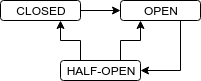

# Resiliência

## Revisitando o conceito de Disponibilidade

Em capítulos anteriores, definimos Disponibilidade como a proporção de tempo, em um determinado período, em que o sistema opera normalmente.

Mas o que acontece se um sistema estiver extremamente lento?

Conforme mencionamos nos primeiros capítulos, ao falar sobre Consistência em um Sistema Distribuído, no paper [Consistency Tradeoffs in Modern Distributed Database System Design](http://www.cs.umd.edu/~abadi/papers/abadi-pacelc.pdf) (ABADI, 2012), Daniel Abadi amplia o Teorema CAP, cunhando o Teorema PACELC: no caso de uma Partição na rede, um Sistema Distribuído precisa escolher entre Disponibilidade (em inglês, _Availability_) e Consistência;  se não houver Partição na rede, a escolha é entre Latência e Consistência. Simplificando, podemos incluir alta latência de rede como uma forma de indisponibilidade.

> _Observe que Disponibilidade e Latência são sem dúvida a mesma coisa: um sistema indisponível fornece essencialmente uma Latência extremamente alta. Para os fins desta discussão, considero como indisponíveis sistemas com latências maiores que um timeout típico para uma requisição, como alguns segundos; e como "Alta Latência", sistemas com latências menores que um timeout típico, mas ainda se aproximando de centenas de milissegundos._
>
> Daniel Abadi, no paper [Consistency Tradeoffs in Modern Distributed Database System Design](http://www.cs.umd.edu/~abadi/papers/abadi-pacelc.pdf) (ABADI, 2012)

<!--@note
  Alexandre - Podemos lembrar aos alunos dos números de Latência do Jeffrey Dean da Google: Cache L1 é 0.5 ns enquanto round Round trip dentro do mesmo data center é 500 000 ns. Ou seja, uma latência 1 milhão de vezes maior. Podemos lembrar que a Luz, a coisa mais rápida do Universo, demoraria 133 ms pra ir e voltar do Japão.
-->

## Falhas em Cascata

Em um Sistema Distribuído implementado de maneira ingênua, uma lentidão em um serviço pode levar o sistema todo a ficar indisponível. Isso é comumente conhecido como falhas em cascata (em inglês, **Cascading Failures**).

No livro [Microservices in Action](https://www.manning.com/books/microservices-in-action) (BRUCE; PEREIRA, 2018), os autores ligam esse tipo de comportamento em cascata com um comportamento emergente de Sistemas Complexos: _um evento perturba um Sistema, levando a algum efeito que, por sua vez, aumenta a magnitude do distúrbio inicial. [...] Considere uma debandada em um rebanho de animais: o pânico faz um animal correr que, por sua vez, espalha o pânico para outros animais, o que faz com que eles corram, e assim por diante. Em Microservices, uma sobrecarga pode causar um efeito dominó: uma falha em um serviço aumenta falhas nos serviços que o chamam e, por sua vez, nos serviços que chamam esses. No pior caso, o resultado é uma indisponibilidade generalizada._

No livro [Building Microservices](https://learning.oreilly.com/library/view/building-microservices/9781491950340/) (NEWMAN, 2015), Sam Newman descreve o caso em um sistema de agregador de anúncios, que unia resultados de diferentes sistemas legados. Um dos legados mais antigos e pouco usados, que correspondia a menos de 5% do faturamento, passou a responder de maneira muito lenta.  A demora fez com que o único pool de conexões fosse preenchido e, como as threads ficavam esperando indefinidamente, o sistema todo veio abaixo.

> _Responder muito lentamente é um dos piores modos de falha que você pode experimentar. Se um sistema não está no ar, você descobre rapidamente. Quando apenas está lento, você acaba esperando um pouco antes de desistir. [...] descobrimos da maneira mais difícil que os sistemas lentos são muito mais difíceis de lidar do que os sistemas que falham rapidamente. Em um Sistema Distribuído, a Latência mata._
>
> Sam Newman, no livro [Building Microservices](https://learning.oreilly.com/library/view/building-microservices/9781491950340/) (NEWMAN, 2015)

## Patterns de Estabilidade

Desejamos que nosso Sistema Distribuído apresente como característica a **Resiliência**. Segundo o Dicionário Michaelis, um significado figurativo da palavra [Resiliência](https://michaelis.uol.com.br/moderno-portugues/busca/portugues-brasileiro/resili%C3%AAncia/) é a _capacidade de rápida adaptação ou recuperação_. A qual _ilidade_ a Resiliência estaria ligada? À **Estabilidade** que, também segundo o Dicionário Michaelis, é _característica daquilo que é estável; solidez._

Michael Nygard, em seu livro [Release It! Second Edition](https://pragprog.com/book/mnee2/release-it-second-edition) (NYGARD, 2018), define Estabilidade como a característica observável em _um sistema resiliente que se mantém processando transações [de negócio], mesmo quando há impulsos transientes, estresses persistentes ou falhas de componentes que interrompem o processamento normal._

<!--@note
  Nygard define uma série de termos de usados quando fala em Estabilidade:
  transaction: abstract unit of work processed by the system
  system: I mean the complete, interdependent set of hardware, applications, and services required to process transactions for users

  (impulse and stress come from mechanical engineering)

  impulse: a rapid shock to the system
  stress: a force applied to the system over an extended period
-->

Nygard lista uma série de patterns de Estabilidade. Alguns deles serão descritos a seguir.

## Timeouts

No exemplo do agregador de anúncios mencionado por Sam Newman, no livro [Building Microservices](https://learning.oreilly.com/library/view/building-microservices/9781491950340/) (NEWMAN, 2015), a lentidão em um dos legados ocasionou uma interrupção no sistema todo. O motivo mencionado por Newman é que o pool de conexões único utilizado esperava "para sempre" e, com uma alta demanda, o pool foi exaurido e o serviço de anúncios não poderia chamar nenhum outro legado. A biblioteca de pool de conexões dava suporte a um **Timeout**, mas estava desabilitada por padrão!

Newman, recomenda que todas as chamadas remotas tenham Timeouts configurados. E qual valor definir? Se for longo demais, ainda causará lentidão no sistema. Se for rápido demais, uma chamada bem sucedida por ser considerado como falha. Uma boa solução é usar valores default de bibliotecas, ajustando valores para cenários específicos.

Em seu livro [Release It! Second Edition](https://pragprog.com/book/mnee2/release-it-second-edition) (NYGARD, 2018), Michael Nygard argumenta que Timeouts provêem _isolamento de falhas_, já que um problema em outro serviço, dispositivo ou sistema não deve ser um problema de quem o invoca. Nygard relata que, infelizmente, muitas APIs e bibliotecas de clientes de sistemas como Bancos de Dados não provêem maneiras de setar Timeouts. Para Nygard, qualquer pool de recursos que bloqueia threads deve ter Timeouts.

## Fail Fast

Michael Nygard, ainda no livro [Release It! Second Edition](https://pragprog.com/book/mnee2/release-it-second-edition) (NYGARD, 2018), diz: _se respostas lentas são piores que nenhuma resposta, o pior dos mundos certamente são falhas lentas._ Se um sistema puder detectar que vai falhar, é melhor que retorne o mais rápido possível um response de erro para seus clientes. Falhe rápido (em inglês, **Fail Fast**). Como predizer uma falha? Nygard afirma que um load balancer, por exemplo, deve recusar novas requisições se não houver nenhum servidor para balanceamento no ar, evitando enfileirar requisições.

Para Nygard, no código de uma aplicação, parâmetros devem ser validados e recursos obtidos, como conexões a BDs ou a outros sistemas, assim que possível. Assim, se houver uma falha de validação ou na obtenção de algum recurso, é possível falhar rapidamente. É importante notar que isso serve como um príncipio, porém não é aplicável em todas as situações.

<!--@note
Nygard cita um projeto para um estúdio fotográfico em que, caso fontes, cores, imagens ou planos de fundo não estivessem disponíveis, uma imagem preta era enviada a uma impressora de alta resolução. Eram gastos recursos caríssimos como papéis especiais, produtos químicos, tempo de impressão e profissionais para separar as imagens defeituosas, diagnosticando e ajudando desenvolvedores a debugar o software. Então, o time de Nygard aplicou o pattern _Fail Fast_, checando fontes, cores, imagens, planos de fundo, memória disponível. Dessa forma, os erros induzidos pelo software foram a zero.
-->

Para Nygard, tanto o Timeout como Fail Fast são patterns que tratam de problemas de latência, sendo dois lados da mesma moeda. O Timeout é útil para proteger o seu sistema de falhas dos outros. O Fail Fast é útil quando você precisa avisar o porquê não será possível processar alguma requisição. Timeouts são para saídas e Fail Fast para entradas.

## Bulkheads

Ainda no livro [Release It! Second Edition](https://pragprog.com/book/mnee2/release-it-second-edition) (NYGARD, 2018), Michael Nygard empresta um conceito da Engenharia Naval: as anteparas (em inglês, **Bulkheads**): _em um navio, Bulkheads são divisórias metálicas que podem ser seladas para dividir o navio em compartimentos separados. Quando as escotilhas são fechadas, uma Bulkhead impede que a água se mova de uma seção para outra. Dessa maneira, um único dano no casco não afunda irreversivelmente o navio. A Bulkhead aplica um princípio de contenção de dados._


_Observação: a fonte das imagens anteriores é a [documentação do OpenLiberty](https://openliberty.io/guides/bulkhead.html), um Microservice Chassis baseado no IBM WebSphere._

Nygard afirma que, em TI, redundância física é a maneira mais comum de aplicar a ideia de Bulkheads: uma falha no hardware de um servidor não afetaria os outros. O mesmo princípio pode ser atingido executando múltiplas instâncias de um serviço em um mesmo servidor.

Para Nygard, há maneiras mais granulares de aplicar Bulkheads. Por exemplo, é possível apartar em pools diferentes threads de um processo que tem responsabilidades distintas, separando threads que tratam requests de threads administrativas. Assim, se as threads da aplicação travarem, é possível usar as threads administrativas para obter um dump ou fazer um _shut down_. Nygard menciona ainda que um Sistema Operacional pode alocar um processo a um core específico (ou a um grupo de cores), o que é conhecido como _CPU Binding_. Dessa maneira, a sobrecarga em um processo não degrada a performance da máquina toda, já outros cores estarão liberados para outros processo.

Há também maneiras menos granulares. No caso de _cloud computing_, podem ser exploradas diferentes topologias como zonas e regiões da AWS.

> _Você pode particionar pools de threads em uma aplicação, CPUs em um servidor ou servidores em um cluster._
>
> Michael Nygard, no livro [Release It! Second Edition](https://pragprog.com/book/mnee2/release-it-second-edition) (NYGARD, 2018)

Em seu livro [Building Microservices](https://learning.oreilly.com/library/view/building-microservices/9781491950340/) (NEWMAN, 2015), Sam Newman afirma que as barreiras arquiteturais entre microservices são, no fim das contas, Bulkheads: uma falha em um serviço pode degradar certas funcionalidades, mas não pára tudo.

No exemplo do agregador de anúncios de Newman, todas as conexões aos sistemas legados compartilhavam um mesmo pool de conexões. A falha em um legado derrubou o único pool de conexões e, consequentemente, impediu que chamadas fossem feitas aos outros legados, tornando o sistema inutilizável. Usando a ideia de Bulkheads, cada sistema legado deveria ter seu próprio pool de conexões, de maneira a isolar possíveis falhas.

## Circuit Breaker

Michael Nygard, no livro [Release It! Second Edition](https://pragprog.com/book/mnee2/release-it-second-edition) (NYGARD, 2018), conta que quando a fiação elétrica começou a ser construída nas casas, à medida que as pessoas plugassem mais aparelhos, os fios iam esquentando mais e mais, até que a casa fosse incendiada, eventualmente. A indústria então passou a usar fusíveis residenciais que queimavam antes da fiação (_fail fast_), protegendo as casas. Só que os fusíveis são descartáveis e as pessoas começaram a usa moedas de cobre no lugar. Resultado: casas queimadas. Então, inventaram o disjuntor (em inglês, **Circuit Breaker**), atualmente presente em qualquer prédio residencial ou comercial. Um Circuit Breaker detecta um uso excessivo de corrente e abre, desarmando como um fusível, desligando todos os aparelhos. Mas, diferentemente de um fusível, um Circuit Breaker pode ser fechado novamente, de maneira manual, assim que não houver perigo.

O princípio por trás de um Circuit Breaker é permitir que um subsistema falhe sem destruir o sistema todo. Assim, um circuito elétrico pode apresentar corrente excessiva devido a um curto-circuito, por exemplo, mas impede que a fiação queime a casa toda.

Nygard diz que, em software, podemos envolver operações perigosas em um componente que oferece uma alternativa quando o sistema não está saudável: um Circuit Breaker. Essa operações são, em geral, chamadas a outros sistemas mas podem ser operações internas a um serviço.

No estado fechado (em inglês, _Closed_), o Circuit Breaker executa as operações normalmente. Se houver uma falha, o Circuit Breaker a contabiliza. Falhas podem ser:

- demoras que ocasionam Timeouts
- falhas em conexões, quando o sistema a ser chamado estiver fora do ar
- retornos com erro, como o status 500 em uma chamada HTTP

Se o número (ou frequência) de falhas passa um certo limite, o Circuit Breaker fica no estado aberto (em inglês, _Open_). Uma chamada a um Circuit Breaker no estado Open falha imediatamente (_fail fast_), sem nem tentar executar a operação solicitada.

Como contar o número de falhas? Nygard argumenta que a densidade de falhas em um período de tempo é o mais importante: 5 falhas em 5 horas é muito diferente de 5 falhas nos últimos 30 segundos. Para auxiliar na implementação, Nygard menciona o pattern Leaky Bucket, em que um contador é incrementado a cada falha mas é zerado periodicamente.

Um disjuntor residencial precisa ser fechado manualmente. Em software, ao contrário, podemos automatizar o fechamento. Para isso, depois de algum tempo, o Circuit Breaker passa para o estado meio aberto (em inglês, _Half-Open_). Nesse estado, a próxima chamada é executada normalmente. Se a chamada for bem sucedida, o Circuit Breaker passa ao estado de Closed. Se falhar, o Circuit Breaker volta ao estado Open.



Vamos voltar ao caso de uma falha em cascata: um serviço sobrecarregado é continuamente requisitado, deixando-o mais sobrecarregado ainda e exaurindo recursos do serviço que o chama. Como suavizar um serviço sobrecarregado? Falhando rapidamente! Como detectar que um serviço está sobrecarregado? Com um Timeout! Como evitar a exaustão de recursos nos serviços que o chamam? Com Circuit Breakers! O intuito final de um Circuit Breaker é suavizar um sistema sobrecarregado, evitando falhas em cascata. E com fechamento é automático.

> _Um Circuit Breaker evita chamadas quando uma Integração apresenta problemas. Um Timeout indica que há um problema em uma Integração._
>
> Michael Nygard, no livro [Release It! Second Edition](https://pragprog.com/book/mnee2/release-it-second-edition) (NYGARD, 2018)

Há diferentes frameworks que implementam Circuit Breakers:

- [Polly](https://github.com/App-vNext/Polly), implementado em .NET. Em: https://github.com/App-vNext/Polly
- [Resilience4j](https://github.com/resilience4j/resilience4j), implementa vários patterns de resiliência em Java. Em: https://github.com/resilience4j/resilience4j
- [Hystrix](https://github.com/Netflix/Hystrix), implementado em Java e parte da iniciativa open-source da Netflix. Em: https://github.com/Netflix/Hystrix

> **Pattern: Circuit Breaker**
>
> Um proxy para chamadas remotas que rejeita imediatamente invocações por um período depois que falhas consecutivas ultrapassam um limite especificado.
>
> Chris Richardson, no livro [Microservices Patterns](https://www.manning.com/books/microservices-patterns) (RICHARDSON, 2018a)

## Hystrix

Hystrix é uma biblioteca open-source mantida pela Netflix que é usada para impedir falhas em cascata, auxiliar na recuperação rápida e isolar threads. O pattern Circuit Breaker é implementado, aleḿ de funcionalidades de monitoramento que estudaremos em capítulos posteriores.

> Curiosidade: Hystrix é o nome do gênero dos roedores conhecidos comumente como porcos-espinho. O animal espinhento é o slogan da biblioteca da Netflix.

É preciso estender a classe abstrata `HystrixCommand` para uma única resposta ou `HystrixObservableCommand` para um estilo reativo. Internamente, tudo é convertido para um `HystrixObservableCommand`. Há maneiras bloqueantes e não-bloqueantes de executar esse comando. Há a possibilidade de habilitar caches de respostas.

O projeto [hystrix-javanica](https://github.com/Netflix/Hystrix/tree/master/hystrix-contrib/hystrix-javanica), mantido pela comunidade, usa aspectos (AOP) para permitir que um método com a anotação `@HystrixCommand` seja executado em um Circuit Breaker.

O Hystrix permite a execução dos Commands em Thread Pools, o padrão, ou Semáforos. Com Semáforos é possível usar Thread Local e, em frameworks, escopos de sessão/request. A _isolation strategy_ pode ser modificada através da propriedade `execution.isolation.strategy`.

Para o Hystrix, uma falha em uma requisição acontece se houve Timeout, exceção ou erro HTTP 500. Um Thread Pool ou Semáforo cheios causam uma rejeição da requisição.

O Hystrix trabalha com uma janela de tempo de 10s (configurável com `metrics.rollingStats.timeInMilliseconds`) e, se houverem mais de 20 (`circuitBreaker.requestVolumeTheshold`) falhas consecutivas em requisições, o Hystrix passa a coletar estatísticas. As métricas são coletadas em 10 (`metrics.rollingStats.numBuckets`) _buckets_ de 1s cada, em uma técnica chamada _rolling window sampling_, que suaviza flutuações e [otimiza cálculos](https://github.com/Netflix/Hystrix/blob/master/hystrix-core/src/main/java/com/netflix/hystrix/util/HystrixRollingPercentile.java) para altos volumes de requisições. Se mais de 50% (`circuitBreaker.error-ThresholdPercentage`) das requisições falharem, o Circuit Breaker fica Open (ou _tripped_). Caso o Circuit Breaker se mantenha Closed, as estatísticas são limpas na expiração da janela de tempo.

Enquanto o Circuit Breaker estiver aberto, novas requisições já falharão, sem chegar o serviço de destino. Há uma outra janela de 5s (`circuitBreaker.sleep-WindowInMilliseconds`) que passa o Circuit Breaker para Half-Open momentaneamente, deixando passar uma requisição. Se a chamada for bem sucedida, o Circuit Breaker passa para Closed. Senão, continuará Open e tentará nova requisição em mais 5s.

Com as anotações do `hystrix-javanica`, as propriedades mencionadas anteriormente podem ser modificadas da seguinte maneira:

```java
@HystrixCommand(
  commandPoolProperties = {
    @HystrixProperty(name="circuitBreaker.requestVolumeThreshold", value="10"),
    @HystrixProperty(name="circuitBreaker.errorThresholdPercentage", value="75"),
    @HystrixProperty(name="circuitBreaker.sleepWindowInMilliseconds", value="7000"),
    @HystrixProperty(name="metrics.rollingStats.timeInMilliseconds", value="15000"),
    @HystrixProperty(name="metrics.rollingStats.numBuckets", value="5"),
    @HystrixProperty(name="execution.isolation.strategy", value="SEMAPHORE")
  }
)
```

A documentação do Hystrix descreve o funcionamento do Circuit Breaker em detalhes: https://github.com/Netflix/Hystrix/wiki/How-it-Works

O projeto Hystrix não está mais sendo ativamente desenvolvido e passou para modo de manutenção (não revisarão issues e não aceitarão pull requests), de acordo com a documentação da biblioteca. Na Netflix, o Hystrix é usado apenas em aplicações já existentes. Para novos projetos, a Netflix diz usar bibliotecas como Resilience4j. A documentação diz que, ao invés de configurações estáticas, o foco está em implementações adaptativas que reagem a performance em produção.

<!--@note
  Ben Christensen e outros engenheiros da Netflix tem posts e palestras bem interessantes sobre o Hystrix:

  https://netflixtechblog.com/introducing-hystrix-for-resilience-engineering-13531c1ab362
  https://speakerdeck.com/benjchristensen/performance-and-fault-tolerance-for-the-netflix-api-august-2012
-->

### Spring Cloud Netflix Hystrix

O Spring Cloud provê o projeto `spring-cloud-starter-netflix-hystrix`, que integra o Circuit Breaker da Netflix com o ecossistema Spring.

A anotação `@EnableCircuitBreaker` deve ser adicionada à classe principal  ou em alguma classe de configuração.

Para executar um método em um Circuit Breaker, devemos anotá-lo com `@HystrixCommand`, do projeto `hystrix-javanica`. Serão criados proxies dinâmicos para cada um desses métodos.

O Spring Cloud Netflix Hystrix fornece um endpoint do Spring Actuator com métricas do Hystrix, que estudaremos em capítulos posteriores.

## Exercício: simulando demora no serviço de distância

1. Altere o método `calculaDistancia` da classe `DistanciaService` do serviço de distância, para que invoque o método que simula uma demora de 10 a 20 segundos:

  ####### fj33-eats-distancia-service/src/main/java/br/com/caelum/eats/distancia/DistanciaService.java

  ```java
  class DistanciaService {

    // código omitido ...

    private BigDecimal calculaDistancia() {
      simulaDemora(); // modificado
      return new BigDecimal(Math.random() * 15);
    }

  }
  ```

2. Em um Terminal, use o ApacheBench para simular a consulta da distância entre um CEP e um restaurante específico, cujos dados são compostos no API Gateway, com 100 requisições ao todo e 10 requisições concorrentes.

  O comando será parecido com o seguinte:

  ```sh
  ab -n 100 -c 10 http://localhost:9999/restaurantes-com-distancia/71503510/restaurante/1
  ```

  A opção `-n` define o número total de requisições. A opção `-c`, o número de requisições concorrentes.

  Entre os resultados aparecerá algo como:

  ```txt
  Connection Times (ms)
              min  mean[+/-sd] median   max
  Connect:        0    0   0.1      0       1
  Processing: 10097 15133 2817.3  14917   19635
  Waiting:    10096 15131 2817.4  14917   19632
  Total:      10097 15133 2817.3  14917   19636
  ```

  A requisição mais demorada, no exemplo anterior, foi de 19,6 segundos. Inviável!

## Circuit Breaker com Hystrix

No `pom.xml` do API Gateway, adicione o _starter_ do Spring Cloud Netflix Hystrix:

####### fj33-api-gateway/pom.xml

```xml
<dependency>
  <groupId>org.springframework.cloud</groupId>
  <artifactId>spring-cloud-starter-netflix-hystrix</artifactId>
</dependency>
```

Adicione a anotação `@EnableCircuitBreaker` à classe `ApiGatewayApplication`:

####### fj33-api-gateway/src/main/java/br/com/caelum/apigateway/ApiGatewayApplication.java

```java
@EnableCircuitBreaker // adicionado
// demais anotações...
public class ApiGatewayApplication {
  // código omitido...
}
```

Não deixe de adicionar o import correto:

```java
import org.springframework.cloud.client.circuitbreaker.EnableCircuitBreaker;
```

Na classe `DistanciaRestClient` do API Gateway, habilite o _circuit breaker_ no método `porCepEId`, com a anotação `@HystrixCommand`:

####### fj33-api-gateway/src/main/java/br/com/caelum/apigateway/DistanciaRestClient.java

```java
@Service
class DistanciaRestClient {

  // código omitido...

  @HystrixCommand // adicionado
  Map<String, Object>  porCepEId(String cep, Long restauranteId) {
    String url = distanciaServiceUrl + "/restaurantes/" + cep + "/restaurante/" + restauranteId;
    return restTemplate.getForObject(url, Map.class);
  }

}
```

O import é o seguinte:

```java
import com.netflix.hystrix.contrib.javanica.annotation.HystrixCommand;
```

## Exercício: Circuit Breaker com Hystrix

1. Mude para a branch `cap9-circuit-breaker-com-hystrix` do projeto `fj33-api-gateway`:

  ```sh
  cd ~/Desktop/fj33-api-gateway
  git checkout -f cap9-circuit-breaker-com-hystrix
  ```

2. Reinicie o API Gateway e execute novamente a simulação com o ApacheBench, com o comando:

  ```sh
  ab -n 100 -c 10 http://localhost:9999/restaurantes-com-distancia/71503510/restaurante/1
  ```

  Observe nos resultados uma diminuição no tempo máximo de request de 19,6 para 1,5 segundos:

  ```txt
  Connection Times (ms)
                min  mean[+/-sd] median   max
  Connect:        0    0   0.7      0       7
  Processing:    75  381 360.8    275    1557
  Waiting:       67  375 359.0    270    1527
  Total:         75  382 360.9    275    1558
  ```

## Degradando funcionalidades com Fallbacks

Por enquanto, em uma chamada a um Circuit Breaker aberto, é lançada a exceção `HystrixRuntimeException`.

Michael Nygard, no livro [Release It! Second Edition](https://pragprog.com/book/mnee2/release-it-second-edition) (NYGARD, 2018), discute que é preferível que a exceção seja diferente de um Timeout comum, para quem chama poder tratá-la adequadamente.

Nygard menciona que é interessante que um Circuit Breaker tenha uma resposta alternativa, um **Fallback**, como: uma resposta genérica, a última resposta bem sucedida, um valor em cache, uma resposta de um serviço secundário.

Em seu livro, Nygard afirma que qualquer estratégia de Fallback pode ter impacto nos negócios, já que há uma _degradação automática das funcionalidades_. Por isso, é essencial involver os _stakeholders_ ao decidir a estratégia a ser tomada. O autor exemplifica: um sistema de varejo deve aceitar um pedido se não pode confirmar a disponibilidade dos itens em estoque? E se o cartão de crédito não puder ser verificado? Um Fallback pode ser uma maneira interessante de abordar esse tipo de requisito.

No livro [Building Microservices](https://learning.oreilly.com/library/view/building-microservices/9781491950340/) (NEWMAN, 2015), Sam Newman foca na ideia de que a maneira correta de degradar as funcionalidades de um sistema em caso de falha em um serviço não é uma discussão técnica. É necessário saber o que é tecnicamente possível mas a  ação a ser tomada deve ser orientada pelo contexto de negócio. Em um e-commerce, por exemplo, no caso de um serviço de checkout estar fora do ar, é possível manter a listagem do catálogo e colocar um telefone para que os clientes possam fechar a compra.

## Fallback no @HystrixCommand

Se acessarmos repetidas vezes, em um navegador, a URL a seguir:

http://localhost:9999/restaurantes-com-distancia/71503510/restaurante/1

Deve ocorrer, em algumas das vezes, uma exceção semelhante a:

```txt
There was an unexpected error (type=Internal Server Error, status=500).
route:SendForwardFilter
com.netflix.hystrix.exception.HystrixRuntimeException: porCepEId timed-out and fallback failed.
  at com.netflix.hystrix.AbstractCommand$22.call(AbstractCommand.java:832)
  at com.netflix.hystrix.AbstractCommand$22.call(AbstractCommand.java:807)
  at rx.internal.operators.OperatorOnErrorResumeNextViaFunction$4.onError(OperatorOnErrorResumeNextViaFunction.java:140)
  ...
```

A mensagem da exceção (_porCepEId timed-out and fallback failed_) ,indica que houve um erro de timeout.

Em outras tentativas, teremos uma exceção semelhante, mas cuja mensagem indica que o Circuit Breaker está aberto e a resposta foi _short-circuited_, não chegando a invocar o serviço de destino da requisição:

```txt
There was an unexpected error (type=Internal Server Error, status=500).
route:SendForwardFilter
com.netflix.hystrix.exception.HystrixRuntimeException: porCepEId short-circuited and fallback failed.
	at com.netflix.hystrix.AbstractCommand$22.call(AbstractCommand.java:832)
	at com.netflix.hystrix.AbstractCommand$22.call(AbstractCommand.java:807)
	at rx.internal.operators.OperatorOnErrorResumeNextViaFunction$4.onError(OperatorOnErrorResumeNextViaFunction.java:140)
```

É possível fornecer um _fallback_, passando o nome de um método na propriedade `fallbackMethod` da anotação `@HystrixCommand`.

Defina o método `restauranteSemDistanciaNemDetalhes`, que retorna apenas o restaurante com o id. Se a outra parte da API Composition, a interface `RestauranteRestClient` não der erro e retornar os dados do restaurante, teríamos todos os detalhes do restaurante menos a distância.

####### fj33-api-gateway/src/main/java/br/com/caelum/apigateway/DistanciaRestClient.java

```java
@Service
class DistanciaRestClient {

  // código omitido...

  @̶H̶y̶s̶t̶r̶i̶x̶C̶o̶m̶m̶a̶n̶d̶
  @HystrixCommand(fallbackMethod="restauranteSemDistanciaNemDetalhes") // modificado
  Map<String, Object>  porCepEId(String cep, Long restauranteId) {
    String url = distanciaServiceUrl+"/restaurantes/"+cep+"/restaurante/"+restauranteId;
    return restTemplate.getForObject(url, Map.class);
  }

  // método adicionado
  Map<String, Object> restauranteSemDistanciaNemDetalhes(String cep, Long restauranteId) {
    Map<String, Object> resultado = new HashMap<>();
    resultado.put("restauranteId", restauranteId);
    resultado.put("cep", cep);
    return resultado;
  }

}
```

O seguinte import deve ser adicionado:

```java
import java.util.HashMap;
```

Observação: uma solução interessante seria manter um cache das distâncias entre CEPs e restaurantes e usá-lo como fallback, se possível. Porém, a _hit ratio_, a taxa de sucesso das consultas ao cache, deve ser baixa, já que os CEPs dos clientes mudam bastante.

## Exercício: Fallback com Hystrix

1. Acesse repetidas vezes, em um navegador, a URL a seguir:

  http://localhost:9999/restaurantes-com-distancia/71503510/restaurante/1

  Deve ocorrer, em algumas das vezes, uma exceção `HystrixRuntimeException` com as mensagens:

  - _porCepEId timed-out and fallback failed._
  - _porCepEId short-circuited and fallback failed._

2. No projeto `fj33-api-gateway`, obtenha o código da branch `cap9-fallback-no-hystrix-command`:

  ```sh
  cd ~/Desktop/fj33-api-gateway
  git checkout -f cap9-fallback-no-hystrix-command
  ```
  
  Reinicie o API Gateway.

3. Tente acessar várias vezes a URL testada anteriormente:

  http://localhost:9999/restaurantes-com-distancia/71503510/restaurante/1

  Observe que não ocorre mais uma exceção, mas não há a informação de distância. Apenas os detalhes do restaurante são retornados.

  Algo semelhante a:
  
  ```json
  {
    "id": 1,
    "cnpj": "98444252000104",
    "nome": "Long Fu",
    "descricao": "O melhor da China aqui do seu lado.",
    "cep": "71503510",
    "endereco": "ShC/SUL COMERCIO LOCAL QD 404-BL D LJ 17-ASA SUL",
    "taxaDeEntregaEmReais": 6,
    "tempoDeEntregaMinimoEmMinutos": 40,
    "tempoDeEntregaMaximoEmMinutos": 25,
    "aprovado": true,
    "tipoDeCozinha": {
      "id": 1,
      "nome": "Chinesa"
    },
    "restauranteId": 1
  }
  ```

## Exercício: Removendo simulação de demora do serviço de distância

1. Comente a chamada ao método que simula a demora em `DistanciaService` do `eats-distancia-service`. Veja se, quando não há demora, a distância volta a ser incluída na resposta.

  ####### fj33-eats-distancia-service/src/main/java/br/com/caelum/eats/distancia/DistanciaService.java

  ```java
  class DistanciaService {

    // código omitido ...

    private BigDecimal calculaDistancia() {
      //simulaDemora(); // modificado
      return new BigDecimal(Math.random() * 15);
    }

  }
  ```

## Exercício: Simulando demora no monólito

1. Altere o método `detalha` da classe `RestauranteController` do monólito para que tenha uma espera de 20 segundos:

  ####### fj33-eats-monolito-modular/eats/eats-restaurante/src/main/java/br/com/caelum/eats/restaurante/RestauranteController.java

  ```java
  // anotações ...
  class RestauranteController {

    // código omitido ...

    @GetMapping("/restaurantes/{id}")
    RestauranteDto detalha(@PathVariable("id") Long id) {

      // trecho de código adicionado ...
      try {
        Thread.sleep(20000);
      } catch (InterruptedException e) {
        throw new RuntimeException(e);
      }

      Restaurante restaurante = restauranteRepo.findById(id).orElseThrow(() -> new ResourceNotFoundException());
      return new RestauranteDto(restaurante);
    }
  
  // restante do código ...

  }
  ```

## Circuit Breaker com Hystrix no Feign

No `application.properties` do API Gateway, é preciso adicionar a seguinte linha:

####### fj33-api-gateway/src/main/resources/application.properties

```properties
feign.hystrix.enabled=true
```

A integração entre o Feign e o Hystrix vem desabilitada por padrão, nas versões mais recentes. Por isso, é necessário habilitá-la.

## Exercício: Integração entre Hystrix e Feign

1. Faça o checkout da branch `cap9-circuit-breaker-com-hystrix-no-feign` do projeto `fj33-api-gateway`:

  ```sh
  cd ~/Desktop/fj33-api-gateway
  git checkout -f cap9-circuit-breaker-com-hystrix-no-feign
  ```

  Reinicie o API Gateway.

2. Tente acessar novamente a URL:

  http://localhost:9999/restaurantes-com-distancia/71503510/restaurante/1

  _Observação: a URL anterior, além de obter a distância do serviço apropriado, obtém os detalhes do restaurante do monólito utilizando o Feign na implementação do cliente REST._

  Deve ocorrer a seguinte exceção:

  ```java
  There was an unexpected error (type=Internal Server Error, status=500).
    route:SendForwardFilter
    com.netflix.hystrix.exception.HystrixRuntimeException: RestauranteRestClient#porId(Long) timed-out and no fallback available.
    ...
  ```

  Quando o Circuit Breaker estiver aberto, a mensagem da exceção `HystrixRuntimeException` será um pouco diferente: _RestauranteRestClient#porId(Long) short-circuited and no fallback available_.

## Fallback com Feign

No Feign, definimos de maneira declarativa o cliente REST, por meio de uma interface.

A estratégia de Fallback na integração entre Hystrix e Feign é fornecer uma implementação para essa interface. Engenhoso!

No `api-gateway`, crie uma classe `RestauranteRestClientFallback`, que implementa a interface `RestauranteRestClient`. No método `porId`, deve ser fornecida uma lógica de fallback para o detalhamento de um restaurante. Anote essa nova classe com `@Component`, para que seja gerenciada pelo Spring.

####### fj33-api-gateway/src/main/java/br/com/caelum/apigateway/RestauranteRestClientFallback.java

```java
@Component
class RestauranteRestClientFallback implements RestauranteRestClient {

  @Override
  public Map<String,Object> porId(Long id) {
    Map<String,Object> resultado = new HashMap<>();
    resultado.put("id", id);
    return resultado;
  }

}
```

A seguir, estão os imports corretos:

```java
import java.util.HashMap;
import java.util.Map;

import org.springframework.stereotype.Component;
```

Observação: Uma solução mais interessante seria manter um cache dos dados dos restaurantes, com o `id` como chave, que seria usado em caso de fallback. Nesse caso, a _hit ratio_, a taxa de sucesso das consultas ao cache, seria bem alta: há um número limitado de restaurantes, que são escolhidos repetidas vezes, e os dados são raramente alterados.

Altere a anotação `@FeignClient` de `RestauranteRestClient`, passando na propriedade `fallback` a classe criada no passo anterior.

####### fj33-api-gateway/src/main/java/br/com/caelum/apigateway/RestauranteRestClient.java

```java
@̶F̶e̶i̶g̶n̶C̶l̶i̶e̶n̶t̶(̶"̶m̶o̶n̶o̶l̶i̶t̶o̶"̶)̶
@FeignClient(name = "monolito", fallback=RestauranteRestClientFallback.class) // modificado
interface RestauranteRestClient {

  @GetMapping("/restaurantes/{id}")
  Map<String,Object> porId(@PathVariable("id") Long id);

}
```

## Exercício: Fallback com Feign

1. Vá até a branch `cap9-fallback-com-feign` do projeto `fj33-api-gateway`:

  ```sh
  cd ~/Desktop/fj33-api-gateway
  git checkout -f cap9-fallback-com-feign
  ```

  Certifique-se que o API Gateway foi reiniciado.

2. Por mais algumas vezes, tente acessar a URL:

    http://localhost:9999/restaurantes-com-distancia/71503510/restaurante/1

  Veja que são mostrados apenas o id e a distância do restaurante. Os demais campos não são exibidos.

## Exercício: Removendo simulação de demora do monólito

1. Remova da classe `RestauranteController` do monólito, a simulação de demora.
  
  ####### fj33-eats-monolito-modular/eats/eats-restaurante/src/main/java/br/com/caelum/eats/restaurante/RestauranteController.java

  ```java
  // anotações ...
  class RestauranteController {

    // código omitido ...

    @GetMapping("/restaurantes/{id}")
    public RestauranteDto detalha(@PathVariable("id") Long id) {

      t̶r̶y̶ ̶{̶
        T̶h̶r̶e̶a̶d̶.̶s̶l̶e̶e̶p̶(̶2̶0̶0̶0̶0̶)̶;̶
      }̶ ̶c̶a̶t̶c̶h̶ ̶(̶I̶n̶t̶e̶r̶r̶u̶p̶t̶e̶d̶E̶x̶c̶e̶p̶t̶i̶o̶n̶ ̶e̶)̶ ̶{̶
        t̶h̶r̶o̶w̶ ̶n̶e̶w̶ ̶R̶u̶n̶t̶i̶m̶e̶E̶x̶c̶e̶p̶t̶i̶o̶n̶(̶e̶)̶;̶
      }̶

      Restaurante restaurante = restauranteRepo.findById(id).orElseThrow(() -> new ResourceNotFoundException());
      return new RestauranteDto(restaurante);
    }
  ```

  Teste novamente a URL: http://localhost:9999/restaurantes-com-distancia/71503510/restaurante/1

  Os detalhes do restaurante devem voltar a ser exibidos!

## Retry e Backoff

Uma outra maneira de lidar com falhas é tentar novamente (em inglês, **Retry**) de maneira automática.

Um Retry ajuda no caso de um erro intermitente, como uma falha de conexão com um BD ou um pacote descartado na rede. Para erros persistentes ou sistêmicos, um Retry não é uma boa opção.

No livro [Microservices in Action](https://www.manning.com/books/microservices-in-action) (BRUCE; PEREIRA, 2018), os autores indicam que um Retry pode minimizar o impacto para os usuários e evitar a necessidade de intervenção pelo time de Operações. Os autores também mencionam que operações idempotentes, que ao serem repetidas têm o mesmo efeito, são mais compatíveis com um Retry.

Michael Nygard, no livro [Release It! Second Edition](https://pragprog.com/book/mnee2/release-it-second-edition) (NYGARD, 2018), afirma que Circuit Breakers são diferentes de Retries, já que os Circuit Breakers impedem que operações sejam executadas ao invés de refazê-las.

Um Circuit Breaker visa suavizar um sistema sobrecarregado. Um Retry o tornaria mais sobrecarregado ainda.

Como mencionam os autores do livro [Microservices in Action](https://www.manning.com/books/microservices-in-action) (BRUCE; PEREIRA, 2018), no caso de um erro persistente, para evitar que os retries contribuam para uma falha em cascata, é interessante espalhar a carga feita pelas novas tentativas. Para isso, inserimos um tempo de espera entre as tentativas. Isso é conhecido como **Backoff**. O BackOff pode ser exponencial, esperando entre os Retries 2s, 4s, 8s, 16s e assim sucessivamente.

Ainda assim, pode ser que os Exponential Backoffs sejam amplificados, criando _multidões trovejantes de Retris sincronizados_, como escrevem os autores do [Microservices in Action](https://www.manning.com/books/microservices-in-action) (BRUCE; PEREIRA, 2018). Para evitar esses Retries sincronizados, os autores afirmam que é interessante que um Backoff inclua um elemento randômico, comumente chamado de _Jitter_.

> No [artigo de lançamento do Zuul 2](https://netflixtechblog.com/zuul-2-the-netflix-journey-to-asynchronous-non-blocking-systems-45947377fb5c), a Netflix menciona um fato interessante: os Retry Storms, em que os usuários ocasionam um aumento drástico de requisições logo depois de um problema. Quem nunca clicou sem parar em um botão após um erro?

## Spring Retry

O Spring Retry era um componente do projeto Spring Batch que foi extraído e tornou-se um projeto próprio.

Para utilizá-lo, basta adicionar como dependência o artefato `spring-retry` do grupo `org.springframework.retry`. No Maven:

```xml
<dependency>
  <groupId>org.springframework.retry</groupId>
  <artifactId>spring-retry</artifactId>
</dependency>
```

Em um projeto Spring Boot, devemos adicionar `@EnableRetry` na classe principal ou em alguma classe de configuração.

Para que os métodos que, em caso de exceção, tenham novas tentativas automáticas, basta anotá-los com `@Retryable`. Na propriedade `backoff` dessa anotação, é possível passar um `@Backoff`.

As bibliotecas do projeto Spring Cloud Netflix tem [integração com o Spring Retry](https://cloud.spring.io/spring-cloud-netflix/reference/html/#retrying-failed-requests). A simples presença no Classpath da biblioteca de Retry já faz com que várias bibliotecas façam novas tentativas.

O Ribbon possibilita Retries automáticos e é configurável pelas propriedades:

- `servico.ribbon.MaxAutoRetries`, indica o número máximo de novas tentativas em um mesmo servidor, excluindo a primeira tentativa
- `servico.ribbon.MaxAutoRetriesNextServer`, indica o número máximo de servidores para usar num Retry, excluindo o primeiro servidor
- `servico.ribbon.OkToRetryOnAllOperation`, para que todas as operações, incluindo requisições `POST`, tenham novas tentativas

É possível ainda fazer com que o Ribbon faça Retries para status codes específicos com a propriedade `servico.ribbon.retryableStatusCodes`.

Não há Backoff nos Retries do Ribbon. Porém, é possível configurar políticas de Backoff fornecendo um `@Bean` do tipo `LoadBalancedRetryFactory`, do Spring Cloud Commons, que deve instanciar uma implementação da interface `BackOffPolicy`, do Spring Retry. 

O Zuul usa as estratégias de Retry configuradas no Ribbon. Para desligá-las, basta desabilitar a propriedade `zuul.retryable`. É possível desabilitar o Retry para um rota específica com `zuul.routes.servico.retryable`.

## Exercício: Forçando uma exceção no serviço de distância

1. No serviço de distância, force o lançamento de uma exceção no método `atualiza` da classe `RestaurantesController`.

  Comente o código que está depois da exceção.

  ####### fj33-eats-distancia-service/src/main/java/br/com/caelum/eats/distancia/RestaurantesController.java

  ```java
  // anotações ...
  class RestaurantesController {

    // código omitido ...

    @PutMapping("/restaurantes/{id}")
    Restaurante atualiza(@PathVariable("id") Long id, @RequestBody Restaurante restaurante) {

      throw new RuntimeException();

      // código comentado ...

      //if (!repo.existsById(id)) {
      //  throw new ResourceNotFoundException();
      //}
      //log.info("Atualiza restaurante: " + restaurante);
      //return repo.save(restaurante);
    }

  }
  ```

## Tentando novamente com Spring Retry

No módulo `eats-restaurante` do monólito, adicione o Spring Retry como dependência:

####### fj33-eats-monolito-modular/eats/eats-restaurante/pom.xml

```xml
<dependency>
  <groupId>org.springframework.retry</groupId>
  <artifactId>spring-retry</artifactId>
</dependency>
```

Adicione a anotação `@EnableRetry` na classe `EatsApplication` do módulo `eats-application` do monólito:

####### fj33-eats-monolito-modular/eats/eats-application/src/main/java/br/com/caelum/eats/EatsApplication.java

```java
@EnableRetry // adicionado
// outra anotações
public class EatsApplication {

  // código omitido...

}
```

Faça o import adequado:

```java
import org.springframework.retry.annotation.EnableRetry;
```

Adicione a anotação `@Slf4j` à classe `DistanciaRestClient`, do módulo `eats-restaurante` do monólito, para configurar um logger que usaremos a seguir:

####### fj33-eats-monolito-modular/eats/eats-restaurante/src/main/java/br/com/caelum/eats/restaurante/DistanciaRestClient.java

```java
@Slf4j // adicionado
@Service
public class DistanciaRestClient {

  // código omitido...

}
```

O import é o seguinte:

```java
import lombok.extern.slf4j.Slf4j;
```

Em seguida, anote o método `restauranteAtualizado` com `@Retryable` para que faça 5 tentativas, logando as tentativas de acesso:

####### fj33-eats-monolito-modular/eats/eats-restaurante/src/main/java/br/com/caelum/eats/restaurante/DistanciaRestClient.java

```java
// anotações ...
public class DistanciaRestClient {

  // código omitido ...

  @Retryable(maxAttempts=5) // adicionado
  public void restauranteAtualizado(Restaurante restaurante) {
    log.info("monólito tentando chamar distancia-service");

    // código omitido ...
  }

}
```

Certifique-se que o import correto foi realizado:

```java
import org.springframework.retry.annotation.Retryable;
```

### Ajustando o Timeout no API Gateway

Perceba que aparece um erro `504 (Gateway Timeout)` _antes_ do fim das tentativas na UI. Lembre-se que a UI chama o API Gateway que, por sua vez, invoca o Monólito.

Configuramos o Monólito para fazer 5 tentativas. Depois da primeira chamada, o Spring Retry fará mais 4 novas tentativas esperando, por padrão, 1 segundo entre as tentativas. Por isso, o Monólito leva um pouco mais de 4 segundos ao todo para desistir de chamar o serviço de Distância.

Porém, o Zuul, nosso API Gateway, usa o Ribbon no proxy das requisições, que tem um Timeout padrão de 1 segundo. Como a chamada ao serviço de Distância leva uns 4 segundos, ocorre um erro no API Gateway. Portanto, a origem do erro na UI é o Timeout no Zuul, ocasionado pelo Ribbon. Por isso o status `504 (Gateway Timeout)`.

Para corrigir esse erro, podemos modificar o Timeout geral do Ribbon com a configuração `ribbon.ReadTimeout`, usando um valor em milissegundos. Também é possível definir o tempo de espera máximo para um cliente específico com `<cliente>.ribbon.ReadTimeout`. 

Podemos configurar um Timeout de 30 segundos apenas para as requisições enviadas do API Gateway para o Monólito da seguinte maneira:

####### fj33-api-gateway/src/main/resources/application.properties

```properties
monolito.ribbon.ReadTimeout=30000
```

## Exercício: Spring Retry

1. Faça o checkout da branch `cap9-retry` do monólito e no API Gateway:

  ```sh
  cd ~/Desktop/fj33-eats-monolito-modular
  git checkout -f cap9-retry

  cd ~/Desktop/fj33-api-gateway
  git checkout -f cap9-retry
  ```

  Reinicie o monólito.

2. Garanta que o monólito, o API Gateway, o serviço de distância e a UI estejam no ar.

  Faça login como dono de um restaurante (por exemplo, `longfu`/`123456`) e mude o CEP ou tipo de cozinha.

  Perceba que nos logs que foram feitas 5 tentativas de chamada ao serviço de distância. Algo como o que segue:

  ```txt
  2019-06-18 17:30:41.952  INFO 12547 --- [nio-8080-exec-9] b.c.c.e.restaurante.DistanciaRestClient  : monólito tentando chamar distancia-service
  ...
  2019-06-18 17:30:42.943  INFO 12547 --- [nio-8080-exec-9] b.c.c.e.restaurante.DistanciaRestClient  : monólito tentando chamar distancia-service
  2019-06-18 17:30:43.967  INFO 12547 --- [nio-8080-exec-9] b.c.c.e.restaurante.DistanciaRestClient  : monólito tentando chamar distancia-service
  2019-06-18 17:30:44.990  INFO 12547 --- [nio-8080-exec-9] b.c.c.e.restaurante.DistanciaRestClient  : monólito tentando chamar distancia-service
  2019-06-18 17:30:46.034  INFO 12547 --- [nio-8080-exec-9] b.c.c.e.restaurante.DistanciaRestClient  : monólito tentando chamar distancia-service
  2019-06-18 17:30:46.085 ERROR 12547 --- [nio-8080-exec-9] o.a.c.c.C.[.[.[/].[dispatcherServlet]    : Servlet.service() for servlet [dispatcherServlet] in context with path [] threw exception [Request processing failed; nested exception is org.springframework.web.client.HttpServerErrorException$InternalServerError: 500 null] with root cause

  org.springframework.web.client.HttpServerErrorException$InternalServerError: 500 null
    at org.springframework.web.client.HttpServerErrorException.create(HttpServerErrorException.java:79) ~[spring-web-5.1.4.RELEASE.jar:5.1.4.RELEASE]
    ...
  ```

## Exponential Backoff

Vamos configurar um backoff para ter um tempo progressivo entre as tentativas de 2, 4, 8 e 16 segundos:

####### fj33-eats-monolito-modular/eats/eats-restaurante/src/main/java/br/com/caelum/eats/restaurante/DistanciaRestClient.java

```java
// anotações ...
public class DistanciaRestClient {

  // código omitido ...

  @̶R̶e̶t̶r̶y̶a̶b̶l̶e̶(̶m̶a̶x̶A̶t̶t̶e̶m̶p̶t̶s̶=̶5̶)̶
  @Retryable(maxAttempts=5, backoff=@Backoff(delay=2000,multiplier=2))
  public void restauranteAtualizado(Restaurante restaurante) {
    // código omitido ...
  }

}
```

O import a seguir deve ser adicionado:

```java
import org.springframework.retry.annotation.Backoff;
```

> Para adicionar _jitter_, evitando Retries sincronizados, podemos habilitar a propriedade `random`.
> 
> ```java
> @Backoff(delay=2000,multiplier=2, random=true)) 
> ```

## Exercício: Exponential Backoff com Spring Retry

1. Vá até a branch `cap9-backoff` do projeto `fj33-eats-monolito-modular`:

  ```sh
  cd ~/Desktop/fj33-eats-monolito-modular
  git checkout -f cap9-backoff
  ```

2. Pela UI, faça novamente o login como dono de um restaurante (por exemplo, com `longfu`/`123456`) e modifique o CEP ou tipo de cozinha.

  Note o tempo progressivo nos logs. Será alguma coisa semelhante a:

  ```txt
  2019-06-18 18:00:18.367  INFO 15044 --- [nio-8080-exec-8] b.c.c.e.restaurante.DistanciaRestClient  : monólito tentando chamar distancia-service
  ...
  2019-06-18 18:00:20.973  INFO 15044 --- [nio-8080-exec-8] b.c.c.e.restaurante.DistanciaRestClient  : monólito tentando chamar distancia-service
  2019-06-18 18:00:24.994  INFO 15044 --- [nio-8080-exec-8] b.c.c.e.restaurante.DistanciaRestClient  : monólito tentando chamar distancia-service
  2019-06-18 18:00:33.047  INFO 15044 --- [nio-8080-exec-8] b.c.c.e.restaurante.DistanciaRestClient  : monólito tentando chamar distancia-service
  2019-06-18 18:00:49.079  INFO 15044 --- [nio-8080-exec-8] b.c.c.e.restaurante.DistanciaRestClient  : monólito tentando chamar distancia-service
  2019-06-18 18:00:49.127 ERROR 15044 --- [nio-8080-exec-8] o.a.c.c.C.[.[.[/].[dispatcherServlet]    : Servlet.service() for servlet [dispatcherServlet] in context with path [] threw exception [Request processing failed; nested exception is org.springframework.web.client.HttpServerErrorException$InternalServerError: 500 null] with root cause
  ...
  ```

## Exercício: Removendo exceção forçada do serviço de distância

1. Agora que testamos o retry e o backoff, vamos remover a exceção que forçamos anteriormente na classe `RestaurantesController` do serviço de distância:

  ####### fj33-eats-distancia-service/src/main/java/br/com/caelum/eats/distancia/RestaurantesController.java

  ```java
  // anotações ...
  class RestaurantesController {

    // código omitido ...

    @PutMapping("/restaurantes/{id}")
    Restaurante atualiza(@PathVariable("id") Long id, @RequestBody Restaurante restaurante) {

      t̶h̶r̶o̶w̶ ̶n̶e̶w̶ ̶R̶u̶n̶t̶i̶m̶e̶E̶x̶c̶e̶p̶t̶i̶o̶n̶(̶)̶;̶

      // descomente o código a seguir ...

      if (!repo.existsById(id)) {
        throw new ResourceNotFoundException();
      }
      log.info("Atualiza restaurante: " + restaurante);
      return repo.save(restaurante);
    }

  }
  ```


## Patterns de Resiliência: um resumo

A [documentação do Resilience4j](https://github.com/resilience4j/resilience4j#resilience-patterns), traz um resumo dos patterns de Resiliência de maneira divertida:

### Retry

- _Como funciona?_ Repete execuções que falharam.
- _Descrição:_ Muitas falhas são transientes e podem ser autocorrigidas depois de um pequeno período.
- _Slogans:_ "Insira uma moeda para tentar de novo" ou "Talvez seja só um tilt"

### Circuit Breaker

- _Como funciona?_ Bloqueia temporariamente possíveis falhas.
- _Descrição:_ Quando um sistema está sofrendo seriamente, é melhor fracassar rapidamente (_Fail Fast_) do que fazer com que os clientes esperem.
- _Slogans:_ "Dá uma folga pra aquele sistema" ou "Baby, don't hurt me, no more"

### Rate Limiter

- _Como funciona?_ Limita execuções por período.
- _Descrição:_ Prepare-se para uma escala e estabeleça a Confiabilidade e a Alta Disponibilidade de seu serviço.
- _Slogans:_ "Tá bom para esse minuto!" ou "Bom, vai funcionar da próxima vez"

### Timeout

- _Como funciona?_ Limita a duração de uma execução.
- _Descrição:_ Depois de um certo tempo, um resultado bem sucedido é improvável.
- _Slogans:_ "Não espere para sempre"

### Bulkhead

- _Como funciona?_ Limita execuções concorrentes.
- _Descrição:_ Recurso são isolados em pools de maneira que, se algum falhar, os outros continuarão.
- _Slogans:_ "Uma falha não deveria afundar o navio todo" ou "Por favor, não todos de uma vez"

### Cache

- _Como funciona?_ Memoriza um resultado bem sucedido.
- _Descrição:_ Alguma proporção das requisições pode ser semelhante.
- _Slogans:_ "Você já pediu esse"

### Fallback

- _Como funciona?_ Provê um resultado alternativo para falhas.
- _Descrição:_ As coisas ainda falharão - planeje o que você fará quando isso acontecer.
- _Slogans:_ "Degrade graciosamente" ou "Um pássaro na mão é melhor que dois voando"

## Para saber mais: Sidecar

Usamos bibliotecas da Netflix como Ribbon, Eureka e Hystrix em projetos Java. Poderíamos usá-las programas escritos em Groovy, Scala, Clojure ou Kotlin, já todas essas são linguagens que tem a JVM como plataforma. Mas e se tivermos microservices implementados em NodeJS, Python ou Go? É o caso da própria Netflix, que tem serviços em todas essas tecnologias.

Para integrar as bibliotecas mencionadas com linguagens que não rodam na JVM, a estratégia da Netflix foi criar um serviço feito em Java que oferece, por meio de uma API HTTP, funcionalidades como Client Side Load Balancing, Self Registration, Client Side Discovery, Timeouts, Circuit Breakers e Fallbacks. Esse serviço foi chamado de [Prana](https://github.com/Netflix/Prana).

Em termos de implantação, toda aplicação de linguagens não-JVM, tem o Prana instalado "ao lado", na mesma máquina (ou container). Por isso, o Prana é chamado de **Sidecar**, uma referência aos carros auxiliares anexados a algumas motocicletas.

> **Pattern: Sidecar**
>
> Implementa preocupações transversais em um processo ou container que é executado ao lado da instância de um serviço
>
> Chris Richardson, no livro [Microservice Patterns](https://www.manning.com/books/microservices-patterns) (RICHARDSON, 2018a)

No fim das contas, requisitos não-funcionais como Escalabilidade, Disponibilidade e Resiliência passam da aplicação para o Sidecar. Poderíamos remover responsabilidades inclusive de aplicações escritas em Java!

Chris Richardson cita, no livro [Microservice Patterns](https://www.manning.com/books/microservices-patterns) (RICHARDSON, 2018a), que um proxy como o [Envoy](https://www.envoyproxy.io/), implementado pela Lyft, é comumente implantado como um Sidecar.

O [Spring Cloud Netflix Sidecar](https://cloud.spring.io/spring-cloud-netflix/reference/html/#polyglot-support-with-sidecar) não usa o Prana, mas implementa o mesmo conceito, integrando com diversas outras ferramentas do Spring Cloud.

## Para saber mais: Service Mesh

No livro [Microservice Patterns](https://www.manning.com/books/microservices-patterns) (RICHARDSON, 2018a), Chris Richardson recomenda usar um Microservice Chassis, um framework ou coleção de frameworks, para implementar questões transversais às funcionalidades da aplicação.

Mas, para Richardson, um obstáculo é que frameworks são restritos a uma plataforma específica. É possível usar Spring Boot e Spring Cloud em aplicações escritas em Java ou Kotlin (e talvez em outras linguagens da JVM). Mas se alguns serviços forem escritos em Go, Elixir ou NodeJS, precisaremos de Microservices Chassis específicos.

Uma alternativa emergente identificada por Chris Richardson é implementar essas preocupações transversais na própria infraestrutura de redes, mediando tanto a comunicação entre os serviços como as requisições de clientes externos: é um **Service Mesh**.

Algumas implementações de Service Meshes:

- Istio (https://istio.io), iniciado pela Google, IBM/Red Hat e Lyft
- Linkerd (https://linkerd.io), da Bouyant, incubado na Cloud Native Computing Foundation (CNCF)
- Consul (https://www.consul.io/), da HashiCorp
- Maesh (https://containo.us/maesh/), da Containous, criadora do edge router Treafik 

> **Pattern: Service Mesh**
>
> Roteie todo o tráfego de rede dos serviços através de uma camada de rede que implementa questões como Circuit Breakers, Distributed Tracing, Service Discovery, Load Balancing, Criptografia, entre outros.
>
> Chris Richardson, No livro [Microservice Patterns](https://www.manning.com/books/microservices-patterns) (RICHARDSON, 2018a)

Para Richardson, com um Service Mesh, as implementações necessárias em um Microservice Chassis são minimizadas a Configurações Externalizadas, Health Checks e propagação de informações de Distributed Tracing.

Diz Richardson: um Service Mesh como o Istio integra-se muito bem com um Orquestrador de Containers como o Kubernetes. O Istio usa o proxy Envoy como um Sidecar de um serviço, em um container no mesmo Pod.

No artigo [Why Kubernetes is The New Application Server](https://developers.redhat.com/blog/2018/06/28/why-kubernetes-is-the-new-application-server/) (BENEVIDES, 2018), compara o Kubernetes junto ao Istio e ao Open Shift a um antigo Servidor de Aplicação do Java EE: o intuito era extrair da aplicação código de requisitos não-funcionais. Benevides faz uma analogia: o Servidor de Aplicação é um CD Player e a aplicação é um CD; uma imagem de um container com a aplicação é um novo formato de CD e o Kubernetes é um CD Player novo que provê as capacidades necessárias. E há uma grande vantagem: é multi-plataforma, já que o Kubernetes abstrai a infraestrutura.

Benevides argumenta que essa nova plataforma, com Kubernetes, Istio e Open Shift, provê 9 capacidades importantes para implantar em produção aplicações robustas:

- Service Discovery 
- Integração
- Elasticidade
- Logging
- Monitoramento
- CI/CD Pipelines
- Resiliência
- Autenticação
- Tracing

## Uma mentalidade antifrágil

No livro [Antifragile](https://www.amazon.com.br/Antifragile-Things-That-Gain-Disorder/dp/0812979680) (TALEB, 2012), Nassim Taleb questiona: qual seria o antônimo de frágil? Robusto, resiliente, sólido? Não! O antônimo de positivo é negativo, não neutro. O exato oposto de frágil seria algo que se beneficia ao receber pancadas, como um pacote com os dizeres "Por favor, lide sem nenhum cuidado". É o que Taleb chama de **antifrágil**.

<!--@note
  No livro, Taleb fala de 3 mitos gregos:

  - Damocles, um homem rico cujo rei o leva a um banquete com uma espada presa por um fio ao teto, bem sobre sua cabeça. Damocles é frágil.
  - Fênix, um pássaro que renasce das cinzas quando é destruído. A Fênix é resiliente.
  - Hidra, uma serpente com múltiplas cabeças que, quanto tem uma cabeça cortada, nascem duas. A Hidra é antifrágil.
-->

Sam Newman, no livro [Building Microservices](https://learning.oreilly.com/library/view/building-microservices/9781491950340/) (NEWMAN, 2015), cita os _game days_, simulações em que sistemas são desligados e os times reagem. Newman diz que a Google vai além e tem os exercícios DiRT (_Disaster Recovery Test_), em que há simulações de desastres em larga escala como terremotos.

Em seu livro, Newman cita um [artigo em que Ariel Tseitlin](https://queue.acm.org/detail.cfm?id=2499552) argumenta que a Netflix é a _organização antifrágil_. Tseitlin revela que a Netflix escreve programas que causam erros e os executa _em produção_ diariamente. Falhas são incitadas para assegurar que os sistemas da Netflix as toleram.

A Netflix tem programas como o [Chaos Monkey](https://github.com/Netflix/chaosmonkey), que desliga máquinas aleatoriamente. O que seria um evento raro, uma catástrofe, passa a ser comum. Isso acontece em produção! Assim, os sistemas precisam ser projetados, implementados e configurados para lidar com essas calamidades corriqueiras. O Chaos Gorilla era um projeto que tirava do ar um data center inteiro (ou o equivalente na AWS). Já o Latency Monkey simulava conexões de rede extremamente lentas. O conjunto dos projetos era conhecido como [Simian Army](https://github.com/Netflix/SimianArmy), mas foi descontinuado. Apenas o Chaos Monkey continua sendo ativamente mantido.

Newman relata que, para dar suporte a essa incitação de falhas, a Netflix foca na importância do aprendizado, uma cultura não focada nos culpados e no empoderamento dos desenvolvedores.

Os desenvolvedores da Netflix iniciaram um movimento que chamam de [Chaos Engineering](http://principlesofchaos.org/?lang=PTBRcontent#): _Chaos Engineering é a disciplina de realizar experimentos sobre sistemas distribuídos com o intuito de construir confiança com relação a capacidade de um sistema distribuído suportar condições adversas em produção._

Service Meshes, que controlam os serviços na própria infraestrutura, como o [Istio](https://istio.io/docs/tasks/traffic-management/fault-injection/) e [Linkerd](https://linkerd.io/2019/07/18/failure-injection-using-the-service-mesh-interface-and-linkerd/), dão suporte ao que chamam de _Fault Injection_.
