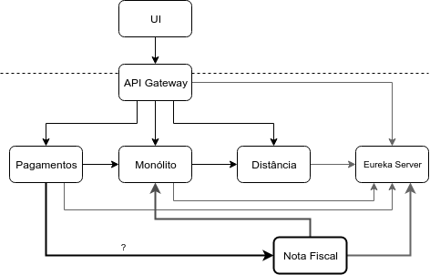
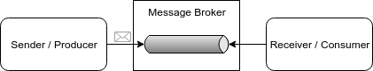
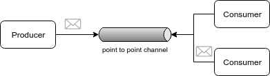
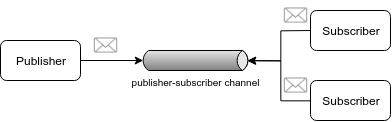
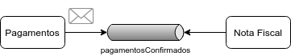
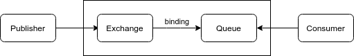
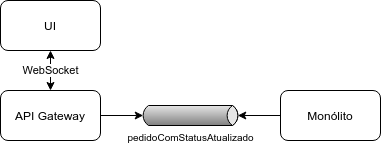
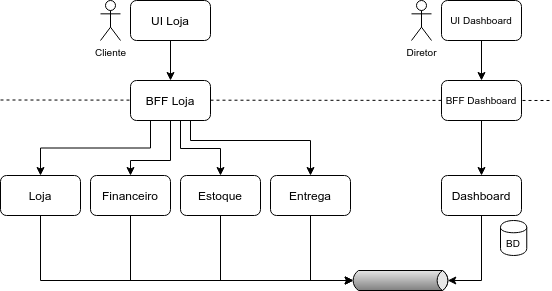

# Mensageria e Eventos

## Um serviço de geração de notas fiscais

Um outro time da Diretoria Financeira do Caelum Eats, alinhado com os especialistas contábeis, preparou um Microservice para a geração de notas fiscais.

Ao receber os ids dos Aggregates `Pagamento` e `Pedido`, os detalhes do pedido são solicitados ao Monólito e usados para gerar um XML com a nota fiscal.

A busca dos detalhes do pedido do Monólito é implementada com o OpenFeign.

O endereço das instâncias disponíveis é obtida .

A geração do XML é feita com a biblioteca FreeMarker.

 A classe que gerencia a emissão das notas fiscais é a `ProcessadorDePagamentos` que, dados os ids de um pagamento e de um pedido, obtém os detalhes do pedido do monólito usando o Feign.

A nota fiscal deve ser gerada assim que um Pagamento for confirmado.

Será que teremos que colocar mais um cliente Feign ou RestTemplate no serviço de Pagamento, para invocar o serviço de Nota Fiscal? E teremos que usar bibliotecas como Ribbon, Eureka Client e Hystrix para Load Balancing, Service Discovery e Resiliência.

Há uma outra maneira de fazer essa implementação?



## Exercício: um serviço de nota fiscal

1. Baixe o projeto do serviço de nota fiscal para seu Desktop usando o Git, com os seguintes comandos:

  ```sh
  cd ~/Desktop
  git clone https://gitlab.com/aovs/projetos-cursos/fj33-eats-nota-fiscal-service.git
  ```

2. Abra o Eclipse, usando o workspace dos microservices.
3. No Eclipse, acesse _File > Import > Existing Maven Projects_ e clique em _Next_. Em _Root Directory_, aponte para o diretório clonado anteriormente.

# Uma outra forma de comunicação

Já tentou alugar um imóvel?

Vamos dizer que você não teve muito sucesso nos aplicativos. O que fazer? Primeiro, conseguir uma lista de imobiliárias e corretores na região desejada. Com essa lista em mãos, seria necessário ligar para cada um dos telefones obtidos. A experiência é frustante: ou ninguém atende os telefones; ou a espera é grande para ser atendido; demoramos pra saber que não há imóveis na região ou que os imóveis ultrapassam nosso orçamento. E por aí vai... E o pior de tudo é que, ao passar todo esse tempo no telefone, não é possível fazer outras coisas no trabalho ou em casa.

Será que há outro jeito?

Dos telefones obtidos, a maioria é celular. E a maioria tem WhatsApp. E se mandássemos mensagens para as imobiliárias e corretores? Poderíamos enviar várias mensagens e esquecer do assunto, voltando a realizar as tarefas profissionais ou domésticas. Assim que estivermos livres, podemos ver as respostas, sejam textos ou (os famigerados) áudios.

### Comunicação síncrona x assíncrona

Um telefonema é um estilo de comunicação síncrona. Só é possível haver comunicação se a outra parte estiver disponível.

Uma conversa no WhatsApp é um estilo de comunicação **assíncrona**. Alguém envia uma mensagem sem que, necessariamente, o outro lado esteja disponível. Mesmo numa ligação telefônica, há uma maneira assíncrona de comunicação: o correio de voz (em inglês, _voice mail_), em que deixamos recados que podem ser lidos depois.

É possível que uma mesma mensagem seja enviada para diferentes destinatários. Por exemplo, é o que acontece num grupo de família do WhatsApp.

Mas como é possível mandar uma mensagem sem que o destinatário esteja lendo no mesmo momento? Por meio de um **intermediário**. No caso das mensagens de celular, os servidores do WhatsApp fazem essa intermediação. No caso do correio de voz, os servidores das operadoras.

## Mensageria

> _Ciência da Computação é a disciplina que acredita que todos os problemas podem ser resolvidos com mais uma camada de indireção._
>
> Dennis DeBruler, citado por Kent Beck no livro Refactoring (FOWLER et al., 1999)

No livro [Enterprise Integration Patterns](https://www.amazon.com.br/Enterprise-Integration-Patterns-Designing-Deploying/dp/0321200683) (HOHPE; WOOLF, 2003), Gregor Hohpe e Bobby Woolf exploram com detalhes a **Mensageria**: _uma tecnologia que permite comunicação de alta velocidade e assíncrona, programa a programa, com entrega confiável._

<!--@note
  Apesar do nome, o livro EIP é focado totalmente em Mensageria.
-->

> **Pattern: Mensageria**
>
> Um cliente invoca um serviço usando Mensageria Assíncrona.
>
> Chris Richardson, no livro [Microservices Patterns](https://www.manning.com/books/microservices-patterns) (RICHARDSON, 2018a)

Hohpe e Woolf explicam que, em um sistema de Mensageria, o intermediário que provê capacidades de Mensageria é chamado de **Message Broker** ou **Message-Oriented Middleware** (MOM). Um Message Broker pode usar redundância para prover Alta Disponibilidade, Performance e Qualidade de Serviço (em inglês, Quality of Service ou QoS).

Existem diversos Message Brokers no mercado, entre eles:

- [IBM MQ](https://www.ibm.com/products/mq), o antigo MQSeries
- [TIBCO Messaging](https://www.tibco.com/)
- [Microsoft BizTalk Server](https://docs.microsoft.com/en-us/biztalk/)
- [AWS Simple Queue Service](https://aws.amazon.com/pt/sqs/), uma solução mais limitada
- [RabbitMQ](https://www.rabbitmq.com/), implementado em Erlang
- [Apache ActiveMQ](http://activemq.apache.org/), que tem a versão "clássica" e a Artemis, baseada no antigo HornetQ da JBoss/Red Hat
- [Apache Kafka](https://kafka.apache.org/), que, além de um Message Broker, pode ser usado de outras maneiras

Um broker possui Canais (em inglês, **Channels**), caminhos lógicos que conectam os programas e transmitem mensagens.

> No JMS, um Channel é chamado de _Destination_.

Um remetente (em inglês, **Sender**) ou produtor (em inglês, **Producer**) é um programa que envia uma mensagem a um Channel.
 
Um receptor (em inglês, **Receiver**) ou consumidor (em inglês, **Consumer**) é um programa que recebe uma mensagem lendo, e excluindo, de um Channel.

Os Consumers que filtram as mensagens de um Channel, recebendo apenas as que atendem a um determinado critério são chamados de **Selective Consumers**.



### Prós e Contras da Mensageria

Para Gregor Hohpe e Bobby Woolf, ainda no livro [Enterprise Integration Patterns](https://www.amazon.com.br/Enterprise-Integration-Patterns-Designing-Deploying/dp/0321200683) (HOHPE; WOOLF, 2003), entre os benefícios da Mensageria estão:

- _Comunicação assíncrona_: o modelo Send-and-Forget permite que o Producer precise somente esperar que a mensagem seja armazenada no Channel, sem estar atrelado ao Consumer.
- _Taxa de Transferência Máxima_: em uma comunicação síncrona, o Producer aguarda o resultado do Consumer e, por isso, as chamadas são tão rápidas quanto o Consumer pode processá-la. Já no modelo assíncrono da Mensageria, o Producer e o Consumer podem trabalhar em ritmos diferentes. Não há tempo perdido esperando um pelo outro, levando a uma taxa de transferência máxima (em inglês, _maximum throughput_).
- _Throttling_: um problema com as chamadas síncronas é que muitas delas ao mesmo tempo a um único Consumer podem sobrecarregá-lo, causando degradação no desempenho ou falhas. Como o Message Broker enfileira requests até que o Consumer esteja pronto para processá-las, o Consumer pode controlar a taxa na qual consome, para não ficar sobrecarregado. Os Producers não são afetados por essa limitação porque a comunicação é assíncrona, portanto, não ficam bloqueados.
- _Comunicação Confiável_: os dados são empacotados como mensagens atômicas e independentes transmitidas com a estratégia Store-and-Forward. Se as mensagens forem armazenadas em disco ao invés da memória, temos Entrega Garantida (em inglês, _Guaranteed Delivery_). Problemas com a rede ou com o computador do Consumer são superados com uma (ou mais) nova tentativa automática (em inglês, _automatic retry_).
- _Operação Desconectada_: algumas aplicações são executadas desconectadas de uma rede, sincronizando com servidores quando uma conexão estiver disponível. Por exemplo, um geólogo faz medições no solo em lugares remotos e, quando volta ao escritório, tem os novos dados sincronizados. Uma das maneiras de implementar é usando Mensageria.
- _Mediação_: uma aplicação pode depender do Message Broker, ao invés de depender diretamente de várias outras aplicações. Assim, no caso de algum problema, basta reconectar ao Broker.
- _Gerenciamento de Threads_: não há a necessidade de bloquear uma _thread_ e esperar por outra aplicação. Assim, evita-se o esgotamento de threads disponíveis.

Os autores listam também alguns desafios:

- _Programação Complexa_: o modelo assíncrono requer um modelo _event-driven_ de programação, levando a diversos _event handlers_ para responder as mensagens que chegam. Desenvolver e debugar pode ser mais complexo, já que não há uma sequência de métodos invocados.
- _Problemas com sequências_: as mensagens podem ser entregues fora de ordem. Se a ordem for importante, é preciso restabelecer a sequência programaticamente.
- _Cenários síncronos_: nem todas as aplicações podem operar em um modelo Send-and-Forget.
- _Performance_: pode ser adicionado algum _overhead_ na comunicação, principalmente para grandes volumes de dados.
- _Suporte limitado_: algumas tecnologias não tem suporte a alguns Message Brokers.
- _Vendor lock-in_: muitos Message Brokers implementam protocolos proprietários e usualmente não se conectam uns aos outros. Inclusive, a terminologia é diferente entre muitas das soluções de Mensageria disponíveis.

## Tipos de Channel

Os autores do livro [Enterprise Integration Patterns](https://www.amazon.com.br/Enterprise-Integration-Patterns-Designing-Deploying/dp/0321200683) (HOHPE; WOOLF, 2003), classificam os Message Channels em dois tipos:

- Point-to-Point Channel, análogo a uma conversa um-a-um no WhatsApp
- Publisher-Subscriber Channel, análogo a um grupo do WhatsApp

### Point-to-Point Channel

Em um sistema de trading de ações, uma negociação deve ser feita apenas uma vez. Em uma loja de ebooks, um livro comprado por um usuário deve ser gerado apenas uma vez. Como o Producer pode garantir que apenas um Consumer recebe uma determinada mensagem?

Os Consumers poderiam coordenar entre si para saber quem recebeu qual mensagem, garantindo a entrega única. Porém, essa solução seria complexa, aumentaria o tráfego de rede e aumentaria o acoplamento entre Consumers antes independentes.

Uma implementação melhor seria o próprio Message Broker determinar qual Consumer deve obter qual mensagem, garantindo que somente um receba cada mensagem. Hohpe e Woolf chamam esse tipo de comunicação de **Point-to-Point Channel**.

> No JMS, um Point-to-Point Channel é chamado de _Queue_. O Producer é chamado de _Sender_ e o Consumer, de _Receiver_.

Quando um Point-to-Point Channel tem apenas um Consumer, não é nada surpreendente que uma mensagem é consumida apenas uma vez. Mas quando há muitos Consumers para um mesmo Channel, os autores os chamam de **Competing Consumers**.



Competing Consumers, em que apenas um dos Receivers disponíveis recebe cada mensagem, permite a Escalabilidade Horizontal. Poderíamos lidar com um aumento na carga do sistema alocando mais Receivers para um mesmo Point-to-Point Channel. O Message Broker ficaria responsável pelo Load Balancing entre as instâncias redundantes.

### Publisher-Subscriber Channel

Quando uma compra é finalizada em uma Loja Online, várias coisas precisam ser feitas: a nota fiscal precisa ser gerada, a entrega precisa ser despachada, o estoque precisa ser atualizado. Se a compra finalizada for uma mensagem, como um Producer pode transmitir uma mensagem para todos os Consumers interessados?

O Producer publica uma mensagem em um Message Channel e o Message Broker fica responsável por notificar todos os Consumers inscritos no Channel. Trata-se de um **Publisher-Subscriber Channel**, em que há um publicador (em inglês, _Publisher_) e vários inscritos (em inglês, _Subscribers_).

> No JMS, um Publisher-Subscriber Channel é chamado de _Topic_. O Producer é chamado de _Publisher_ e o Consumer, de _Subscriber_.

Um Subscriber deve ser notificado de uma mensagem apenas uma vez. Uma mensagem deve ser considerada consumida somente quando todos os Subscribers foram notificados. Subscribers não devem competir entre si, mas receber todas as mensagens de um Publisher-Subscriber Channel.



Um Publish-Subscribe Channel é, em geral, implementado da seguinte maneira: há um Channel de entrada que é dividido em múltiplos Channels de saída, um para cada Subscriber. Cada mensagem tem uma cópia entregue a cada um dos Channels de saída.

É possível usar um Publisher-Subscriber Channel para monitoramento, bastando plugar um sistema de Monitoramento como um Subscriber.

Digamos que temos um Publish-Subscribe Channel com um sistema de Monitoramento e um sistema de Notas Fiscais como Subscribers. O que acontece quando um Subscriber está fora do ar? Certamente, o outro Subscribers continua a receber as mensagens. Mas e quando o Subscriber volta a funcionar normalmente? Caso seja o sistema de Monitoramento, as mensagens não recebidas podem ser descartadas. Já no caso do sistema de Notas Fiscais, seria interessante que o Message Broker tenha armazenado todas as mensagens não entregues enquanto estava fora do ar. O sistema de Notas Fiscais é o que Hohpe e Woolf chamam de **Durable Subscriber**: um Subscriber que tem as mensagens publicadas salvas enquanto estiver desconectado.

## Tipos de Mensagens

No livro [Enterprise Integration Patterns](https://www.amazon.com.br/Enterprise-Integration-Patterns-Designing-Deploying/dp/0321200683) (HOHPE; WOOLF, 2003), Gregor Hohpe e Bobby Woolf descrevem uma Mensagem como dados que são transmitidos em um Message Channel e que consistem de um _header_, que contém metadados usados pelo Message Broker, e um _body_, que contém os dados em si.

Para um Message Broker, todas as mensagens são semelhantes: alguns dados no _body_ a serem transmitidos de acordo com o configurado no _header_. Uma Mensagem pode ser binária, um texto CSV, XML ou JSON ou um objeto Java serializado, por exemplo.

Já para uma aplicação, os autores identificam alguns tipos de mensagens:

- **Document Message**: é usada para transmitir dados entre aplicações. O Consumer decide o que fazer com os dados recebidos. 
- **Command Message**: serve como a invocação de um método em outra aplicação. É apenas a requisição, sem uma resposta. Em geral, é usada em um Point-to-Point Channel, e é consumida apenas uma vez por apenas um Consumer.
- **Event Message**: é uma notificação aos Consumers de que algo aconteceu. Em geral, é usada em um Publisher-Subscriber Channel.

## Domain Events

No livro [Domain-Driven Design Distilled](https://www.amazon.com.br/Domain-Driven-Design-Distilled-Vaughn-Vernon/dp/0134434420) (VERNON, 2016), Vaughn Vernon diz que um **Domain Event** é uma ocorrência significativa em termos de negócio em um determinado Bounded Context.

Vernon ressalta que o nome de um evento é importante, ligando com o conceito de Ubiquitous Language, em que a linguagem de negócio deve estar representada no código. Um bom nome de um Domain Event deve ser uma referência a algo de negócio que já aconteceu. Por exemplo, em um contexto de gerenciamento ágil teríamos os Domain Events `ProdutoCriado` e `ReleaseAgendada`. Perceba que um Domain Event tem um Aggregate associado, como `Produto` e `Release`.

Mas qual o estímulo que a aplicação recebe para ocorrer um Domain Event como `ProdutoCriado`? Vernon descreve algo como `CriarProduto`, uma ação `Criar` feita por um usuário ou outro Bounded Context no Aggregate `Produto`, teria como resultado um `ProdutoCriado`. Esse tipo de ação é chamado de Command por Vernon e pela comunidade DDD. 

_Observação: o Command do DDD é um conceito de modelagem de domínio, não necessariamente relacionado a integração síncrona ou assíncrona. Portanto, um Command do DDD não necessariamente será um Command Message._

Nos termos do DDD, um Domain Event precisa ser publicado a todos os Bounded Contexts interessados. 

Uma Arquitetura de Microservices que usa Domain Events para integrar diferentes serviços, sendo publicados e consumidos em/de Message Brokers, é chamada de Event-Driven Microservices.

> **Domain Event**
>
> Um Aggregate publica um Domain Event quando é criado ou sofre outra alteração significativa.
>
> Chris Richardson, no livro [Microservices Patterns](https://www.manning.com/books/microservices-patterns) (RICHARDSON, 2018a)

### Event Storming

No livro [Microservices Patterns](https://www.manning.com/books/microservices-patterns) (RICHARDSON, 2018a), Chris Richardson cita um workshop usado pela comunidade DDD para explorar e entender um domínio complexo: o **Event Storming**. Para realizar esse workshop, especialistas de domínio devem ser reunidos em uma sala com post-its e um quadro branco.

Richardson cita três passos principais:

1. Peça para os especialistas de domínio fazerem um Brainstorm dos eventos que acontecem no domínio. 
2. Identifique, junto aos especialistas de domínio, se a origem dos eventos são ações do usuário, um sistema externo, outro Domain Event ou alguma data ou horário.
3. Colabore com os especialista de domínio para identificar Aggregates, que consomem cada Command e emitem o Domain Event correspondente.

Cada item identificado tem uma cor específica de post-it.

O resultado é um um Domain Model centrado em Aggregates e Domain Events.

## Domain Events no Caelum Eats

Relembrando: uma nota fiscal deve ser gerada assim que um Pagamento for confirmado.

Isso pode ser modelado como o Domain Event `PagamentoConfirmado`.

O Producer desse evento seria o serviço de Pagamentos, que recebe uma ação do usuário para confirmar um pagamento.

O Consumer seria o serviço de Nota Fiscal, que receberia o evento e geraria a nota fiscal.

O que deveria estar contido no corpo dessa Event Message? Os dados do Pagamento que acabou de ser confirmado e os dados do Pedido relacionado. Como tratam-se de Aggregates do serviço de Pagamentos e do módulo de Pedido do Monólito, respectivamente, poderíamos passar apenas os ids do Pagamento e Pedido na mensagem para o serviço de Nota Fiscal.



### Revisando as integrações existentes

Quais as integrações que já implementadas poderiam ser modeladas como Domain Events?

O serviço de Pagamentos invoca o módulo de Pedido do Monólito, por meio de HTTP, para avisar que um pagamento foi confirmado.

O módulo de Restaurante do Monólito, também por meio de HTTP, avisa que um novo restaurante foi aprovado e que os dados de um restaurante foram atualizados para o serviço de Distância.

Todas essas integrações poderiam ser modeladas como Domain Events:

- o mesmo Domain Event `PagamentoConfirmado` publicado pelo serviço de Pagamentos poderia ser consumido pelo módulo Pedido do Monólito para atualizar o status do Pedido.
- os Domain Events `NovoRestauranteAprovado` e `RestauranteAtualizado` poderiam ser publicados pelo módulo de Restaurante do Monólito e consumidos pelo serviço de Distância.

## Protocolos de Mensageria e AMQP

Existem diferentes protocolos de Mensageria. Entre eles:

- _STOMP_ (Simple Text-Oriented Messaging Protocol): um protocolo baseado em texto, com alguma similaridade com o HTTP. Possui clientes em diversas linguagens, incluindo JavaScript com WebSocket, que é executado diretamente em navegadores. Diversos Message Brokers implementam esse protocolo, incluindo ActiveMQ (nas versões clássica e Artemis) e RabbitMQ.
- _MQTT_ (Message Queue Telemetry Transport): focado em IoT, é um protocolo binário muito eficiente e compacto que foi projetado para redes de alta latência e pouca banda como links de satélite e conexões discadas. Só é compatível com Publisher-Subscriber Channels. ActiveMQ (nas duas versões) e RabbitMQ também dão suporte a esse protocolo. É uma especificação mantida pela ISO e OASIS.
- _AMQP (Advanced Message Queuing Protocol)_: um protocolo bastante abrangente. Há suporte a Point-to-Point e Publisher-Subscriber Channels, além de outros modelos de Mensageria. Na versão 1.0, significativamente diferente da 0-9-1, foi padronizado pela ISO e OASIS. Focado em Confiabilidade e Segurança, é implementado por diversos Message Brokers, como o RabbitMQ (AMQP 0-9-1) e ambas as versões do ActiveMQ (AMQP 1.0).

> **O JMS é um protocolo ou uma API?**
>
> O JMS (Java Message Service), especificado no Java EE,  não é um protocolo, mas uma API. Dessa forma, define uma série de abstrações, interfaces e classes utilitárias a serem implementadas em Java pelos fornecedores de Message Brokers. Cada fornecedor pode usar um protocolo diferentes e, por isso, disponibilizam JARs que implementam os detalhes de comunicação.

## RabbitMQ e AMQP

RabbitMQ implementa, além dos protocolos STOMP e MQTT, a versão 0-9-1 do protocolo AMQP. A implementação foi feita em Erlang pela empresa Rabbit Technologies, posteriormente adquirida pela SpringSource/Pivotal.

A versão 0-9-1 do AMQP traz algumas terminologias e conceitos diferentes dos patterns estudados anteriormente.

Por exemplo, no AMQP 0-9-1, channels são várias conexões leves que compartilham uma mesma conexão TCP.

Quem produz as mensagens é chamado de **Publisher** (e não Producer), independente do destino ser um Point-to-Point Channel ou um Publisher-Subscriber Channel.

As mensagens não são publicadas diretamente em um Point-to-Point ou em um Publisher-Subscriber Channel, mas em uma abstração chamada **Exchange**. Dessa forma, um Publisher no AMQP não sabe o tipo de Channel que será utilizado.

A configuração do tipo de Message Channel passa a ser responsabilidade do Message Broker, o que é chamado de _roteamento_. O roteamento é feito, a partir de um Exchange, para um ou mais Point-to-Point Channels chamados de **Queues**, de acordo com regras chamadas **Bindings**. Os **Consumers** recebem mensagens dessas Queues. Um Binding pode ter, opcionalmente, uma _routing key_ que irá influenciar qual Queue recebe uma dada mensagem.



> O AMQP 0-9-1 é um protocolo "programável" em que a própria aplicação pode criar Exchanges, Bindings e Queues, não apenas o administrador do Message Broker.

Tanto um Exchange como uma Queue podem ter diversos atributos. Entre os mais importantes:

- Nome
- Durabilidade (em inglês, _Durability_): se for durável, o Exchange não é apagado após uma reinicialização do Message Broker; se for transiente, é preciso redeclará-lo toda vez que o Broker é reiniciado.
- _Auto-delete_: o Exchange é removido quando a última Queue de um consumidor é desconectado

Um Exchange também pode ter diferentes tipos:

- _Direct Exchange_: faz a entrega de mensagens com base em uma routing key da mensagem, roteando para uma Queue com a mesma routing key. É uma implementação do pattern Selective Consumer. Caso haja múltiplas instâncias da mesma aplicação como Consumers da Queue, é feito um Load Balancing no estilo Round-Robin, implementando o pattern Competing Consumers.
- _Default Exchange_: um Exchange sem nome, é um caso especial de Direct Exchange, em que é feito o Binding automaticamente com todas as Queues com uma routing key com o mesmo nome da Queue. Uma mensagem que contém como routing key o nome de uma Queue é roteada diretamente para a Queue. Parece um Point-to-Point Channel em que uma mensagem é enviada diretamente a uma Queue, mas tecnicamente não é o que acontece.
- _Fanout Exchange_: as routing keys são ignoradas. Quando uma mensagem é enviada a um determinado Exchange desse tipo, todas as Queues com Bindings receberão uma cópia da mensagem. Implementa um Publisher-Subscriber Channel.
- _Topic Exchange_: as mensagens são roteadas a todas as Queues que atendem a algum critério de filtragem. É uma implementação de um Publisher-Subscriber Channel com Selective Consumers.
- _Headers Exchange_: ignoram routing keys, usando um ou mais atributos do cabeçalho das mensagens para o roteamento.  

O RabbitMQ já vem com alguns Exchanges de cada tipo como `amq.direct`, `(AMQP default)`, `amq.fanout`, `amq.topic` e `amq.headers`.

Mais informações na documentação do RabbitMQ: https://www.rabbitmq.com/tutorials/amqp-concepts.html

## Exercício: configurando o RabbitMQ no Docker

1. Adicione ao `docker-compose.yml` a configuração de um RabbitMQ na versão 3. Mantenha as portas padrão 5672 para o MOM propriamente dito e 15672 para a UI Web de gerenciamento. Defina o usuário `eats` com a senha `caelum123`:

  ```yaml
  rabbitmq:
    image: "rabbitmq:3-management"
    restart: on-failure
    ports:
      - "5672:5672"
      - "15672:15672"
    environment:
      RABBITMQ_DEFAULT_USER: eats
      RABBITMQ_DEFAULT_PASS: caelum123
  ```

  O `docker-compose.yml` completo, com a configuração do RabbitMQ, pode ser encontrado em: https://gitlab.com/snippets/1888246

2. Execute novamente o seguinte comando:

  ```sh
  docker-compose up -d
  ```

  Deve aparecer algo como:

  ```txt
  eats-microservices_mysql.pagamento_1 is up-to-date
  eats-microservices_mongo.distancia_1 is up-to-date
  Creating eats-microservices_rabbitmq_1 ... done
  ```

3. Para verificar se está tudo OK, acesse a  pelo navegador a UI de gerenciamento do RabbitMQ:

  http://localhost:15672/

  O username deve ser _eats_ e a senha _caelum123_.

## Spring Cloud Stream

Parte do Spring Cloud, o Spring Cloud Stream é um framework que facilita a construção de Event-Driven Microservices.

O Spring Cloud Stream provê uma série de abstrações e há uma série de _binders_ para diferentes sistemas de Mensageria. Entre eles:

- RabbitMQ
- Apache Kafka
- Kafka Streams
- Amazon Kinesis
- Google PubSub

### A terminologia de Stream Processing

O Spring Cloud Stream parte do Spring Messaging e Spring AMQP, mas provê abstrações diferentes, mais relacionadas com o processamento de fluxo de dados (em inglês, _Stream Processing_).

A terminologia de Stream Processing, usada por projetos como [Kafka Streams](https://kafka.apache.org/24/documentation/streams/core-concepts), [Apache Flink](https://ci.apache.org/projects/flink/flink-docs-release-1.9/concepts/programming-model.html) e [Akka Streams](https://doc.akka.io/docs/akka/current/stream/stream-flows-and-basics.html), é baseada nos seguintes termos:

- _Stream_: um fluxo de dados contínuo e sem um fim claro como, por exemplo, os dados de localização de um celular ou os logs de um sistema.
- _Source_: uma fonte de dados, que produz um fluxo de dados. É equivalente a um Producer.
- _Sink_: um escoadouro, que consome um fluxo de dados. É equivalente a um Consumer.
- _Processor_: um transformador do fluxo de dados.

## Publicando um evento de pagamento confirmado com Spring Cloud Stream

Adicione, no `pom.xml` do serviço de pagamento, o starter do projeto Spring Cloud Stream Rabbit:

####### fj33-eats-pagamento-service/pom.xml

```xml
<dependency>
  <groupId>org.springframework.cloud</groupId>
  <artifactId>spring-cloud-starter-stream-rabbit</artifactId>
</dependency>
```

Adicione o usuário e senha do RabbitMQ no `application.properties` do serviço de pagamento:

####### fj33-eats-pagamento-service/src/main/resources/application.properties

```properties
spring.rabbitmq.username=eats
spring.rabbitmq.password=caelum123
```

Crie uma classe `AmqpPagamentoConfig` no pacote `br.com.caelum.eats.pagamento` do serviço de pagamento, anotando-a com `@Configuration`.

Dentro dessa classe, crie uma interface `PagamentoSource`, que define um método `pagamentosConfirmados`, que tem o nome do _exchange_ no RabbitMQ. Esse método deve retornar um `MessageChannel` e tem a anotação `@Output`, indicando que o utilizaremos para enviar mensagens ao MOM.

A classe `AmqpPagamentoConfig` também deve ser anotada com `@EnableBinding`, passando como parâmetro a interface `PagamentoSource`:

####### fj33-eats-pagamento-service/src/main/java/br/com/caelum/eats/pagamento/AmqpPagamentoConfig.java

```java
@EnableBinding(PagamentoSource.class)
@Configuration
class AmqpPagamentoConfig {

  static interface PagamentoSource {

    @Output
    MessageChannel pagamentosConfirmados();
  }

}
```

Os imports são os seguintes:

```java
import org.springframework.cloud.stream.annotation.EnableBinding;
import org.springframework.cloud.stream.annotation.Output;
import org.springframework.context.annotation.Configuration;
import org.springframework.messaging.MessageChannel;

import br.com.caelum.eats.pagamento.AmqpPagamentoConfig.PagamentoSource;
```

Crie uma classe `PagamentoConfirmado`, que representará o payload da mensagem, no pacote `br.com.caelum.eats.pagamento` do serviço de pagamento. Essa classe deverá conter o id do pagamento e o id do pedido:

####### fj33-eats-pagamento-service/src/main/java/br/com/caelum/eats/pagamento/PagamentoConfirmado.java

```java
@Data
@AllArgsConstructor
@NoArgsConstructor
class PagamentoConfirmado {

  private Long pagamentoId;
  private Long pedidoId;

}
```

Os imports são do Lombok:

```java
import lombok.AllArgsConstructor;
import lombok.Data;
import lombok.NoArgsConstructor;
```

No mesmo pacote de `eats-pagamento-service`, crie uma classe `NotificadorPagamentoConfirmado`, anotando-a com `@Service`.

Injete `PagamentoSource` na classe e adicione um método `notificaPagamentoConfirmado`, que recebe um `Pagamento`. Nesse método, crie um `PagamentoConfirmado` e use o `MessageChannel` de `PagamentoSource` para enviá-lo para o MOM:

####### fj33-eats-pagamento-service/src/main/java/br/com/caelum/eats/pagamento/NotificadorPagamentoConfirmado.java

```java
@Service
@AllArgsConstructor
class NotificadorPagamentoConfirmado {

  private PagamentoSource source;

  void notificaPagamentoConfirmado(Pagamento pagamento) {
    Long pagamentoId = pagamento.getId();
    Long pedidoId = pagamento.getPedidoId();
    PagamentoConfirmado confirmado = new PagamentoConfirmado(pagamentoId, pedidoId);
    source.pagamentosConfirmados().send(MessageBuilder.withPayload(confirmado).build());
  }

}
```

Faça os imports a seguir:

```java
import org.springframework.messaging.support.MessageBuilder;
import org.springframework.stereotype.Service;

import br.com.caelum.eats.pagamento.AmqpPagamentoConfig.PagamentoSource;
import lombok.AllArgsConstructor;
```

Em `PagamentoController`, adicione um atributo `NotificadorPagamentoConfirmado` e, no método `confirma`, invoque o método `notificaPagamentoConfirmado`, passando o pagamento que acabou de ser confirmado:

####### fj33-eats-pagamento-service/src/main/java/br/com/caelum/eats/pagamento/PagamentoController.java

```java
// anotações ...
class PagamentoController {

  // outros atributos ...
  private NotificadorPagamentoConfirmado pagamentoConfirmado; // adicionado

  // código omitido ...

  @PutMapping("/{id}")
  Resource<PagamentoDto> confirma(@PathVariable Long id) {

    Pagamento pagamento = pagamentoRepo.findById(id).orElseThrow(() -> new ResourceNotFoundException());
    pagamento.setStatus(Pagamento.Status.CONFIRMADO);
    pagamentoRepo.save(pagamento);

    pagamentoConfirmado.notificaPagamentoConfirmado(pagamento); // adicionado

    Long pedidoId = pagamento.getPedidoId();
    pedidoClient.avisaQueFoiPago(pedidoId);

    return new PagamentoDto(pagamento);
  }

  // código omitido ...

}
```

## Recebendo eventos de pagamentos confirmados com Spring Cloud Stream

Adicione ao `pom.xml` do `eats-nota-fiscal-service` uma dependência ao starter do projeto Spring Cloud Stream Rabbit:

####### fj33-eats-nota-fiscal-service/pom.xml

```xml
<dependency>
  <groupId>org.springframework.cloud</groupId>
  <artifactId>spring-cloud-starter-stream-rabbit</artifactId>
</dependency>
```

No `application.properties` do serviço de nota fiscal, defina o usuário e senha do RabbitMQ :

####### fj33-eats-nota-fiscal-service/src/main/resources/application.properties

```properties
spring.rabbitmq.username=eats
spring.rabbitmq.password=caelum123
```

No pacote `br.com.caelum.eats.notafiscal` do serviço de nota fiscal, crie uma classe `AmqpNotaFiscalConfig` , anotando-a com `@Configuration`.

Defina a interface `PagamentoSink`, que será para configuração do consumo de mensagens do MOM. Dentro dessa interface, defina o método `pagamentosConfirmados`, com a anotação `@Input` e com `SubscribableChannel` como tipo de retorno.

O nome do _exchange_ no , que é o mesmo do _source_ do serviço de pagamentos, deve ser definido na constante `PAGAMENTOS_CONFIRMADOS`.

Não deixe de anotar a classe `AmqpNotaFiscalConfig` com `@EnableBinding`, tendo como parâmetro a interface `PagamentoSink`:

####### fj33-eats-nota-fiscal-service/src/main/java/br/com/caelum/eats/notafiscal/AmqpNotaFiscalConfig.java

```java
@EnableBinding(PagamentoSink.class)
@Configuration
class AmqpNotaFiscalConfig {

  static interface PagamentoSink {
    String PAGAMENTOS_CONFIRMADOS = "pagamentosConfirmados";

    @Input
    SubscribableChannel pagamentosConfirmados();
  }

}
```

Adicione os imports corretos:

```java
import org.springframework.cloud.stream.annotation.EnableBinding;
import org.springframework.cloud.stream.annotation.Input;
import org.springframework.context.annotation.Configuration;
import org.springframework.messaging.SubscribableChannel;

import br.com.caelum.notafiscal.AmqpNotaFiscalConfig.PagamentoSink;
```

Use a anotação `@StreamListener` no método `processaPagamento` da classe `ProcessadorDePagamentos`, passando a constante `PAGAMENTOS_CONFIRMADOS` de `PagamentoSink`:

####### fj33-eats-nota-fiscal-service/src/main/java/br/com/caelum/notafiscal/ProcessadorDePagamentos.java

```java
// anotações ...
class ProcessadorDePagamentos {

  // código omitido ...

  @StreamListener(PagamentoSink.PAGAMENTOS_CONFIRMADOS) // adicionado
  void processaPagamento(PagamentoConfirmado pagamento) {
    // código omitido ...
  }

}
```

Faça os imports adequados:

```java
import org.springframework.cloud.stream.annotation.StreamListener;
import br.com.caelum.notafiscal.AmqpNotaFiscalConfig.PagamentoSink;
```

## Exercício: Evento de Pagamento Confirmado com Spring Cloud Stream

1. Faça checkout da branch `cap11-evento-de-pagamento-confirmado-com-spring-cloud-stream` nos projetos do serviços de pagamentos e de nota fiscal:

  ```sh
  cd ~/Desktop/fj33-eats-pagamento-service
  git checkout -f cap11-evento-de-pagamento-confirmado-com-spring-cloud-stream

  cd ~/Desktop/fj33-eats-nota-fiscal-service
  git checkout -f cap11-evento-de-pagamento-confirmado-com-spring-cloud-stream
  ```

  Reinicie o serviço de pagamento.

  Inicie o serviço de nota fiscal executando a classe `EatsNotaFiscalServiceApplication`.

2. Certifique-se que o service registry, o serviço de pagamento, o serviço de nota fiscal e o monólito estejam sendo executados.

  Confirme um pagamento já existente com o cURL:

  ```txt
  curl -X PUT -i http://localhost:8081/pagamentos/1
  ```

  _Observação: para facilitar testes durante o curso, a API de pagamentos permite reconfirmação de pagamentos. Talvez não seja o ideal..._

  Acesse a UI de gerenciamento do RabbitMQ, pela URL `http://localhost:15672`.

  Veja nos gráficos que algumas mensagens foram publicadas. Veja `pagamentosConfirmados` listado em _Exchange_.

  Observe, nos logs do serviço de nota fiscal, o XML da nota emitida. Algo parecido com:

  ```xml
  <xml>
    <loja>314276853</loja>
    <nat_operacao>Almoços, Jantares, Refeições e Pizzas</nat_operacao>
    <pedido>
      <items>
        <item>
          <descricao>Yakimeshi</descricao>
          <un>un</un>
          <codigo>004</codigo>
          <qtde>1</qtde>
          <vlr_unit>21.90</vlr_unit>
          <tipo>P</tipo>
          <class_fiscal>21069090</class_fiscal>
        </item>
        <item>
          <descricao>Coca-Cola Zero Lata 310 ML</descricao>
          <un>un</un>
          <codigo>004</codigo>
          <qtde>2</qtde>
          <vlr_unit>5.90</vlr_unit>
          <tipo>P</tipo>
          <class_fiscal>21069090</class_fiscal>
        </item>
      </items>
    </pedido>
    <cliente>
      <nome>Isabela</nome>
      <tipoPessoa>F</tipoPessoa>
      <contribuinte>9</contribuinte>
      <cpf_cnpj>169.127.587-54</cpf_cnpj>
      <email>isa@gmail.com</email>
      <endereco>Rua dos Bobos, n 0</endereco>
      <complemento>-</numero>
      <cep>10001-202</cep>
    </cliente>
  </xml>
  ```

## Consumer Groups do Spring Cloud Stream

Adicione um nome de grupo para as instâncias do serviço de nota fiscal, definindo a propriedade `spring.cloud.stream.bindings.pagamentosConfirmados.group` no `application.properties`:

####### fj33-eats-nota-fiscal-service/src/main/resources/application.properties

```properties
spring.cloud.stream.bindings.pagamentosConfirmados.group=notafiscal
```

## Exercício: Competing Consumers e Durable Subscriber com Consumer Groups

1. Pare o serviço de nota fiscal e confirme alguns pagamentos pelo cURL.

  Note que, mesmo com o serviço consumidor parado, a mensagem é publicada no MOM.

  Suba novamente o serviço de nota fiscal e perceba que as mensagens publicadas enquanto o serviço estava fora do ar **não** foram recebidas. Essa é a característica de um _non-durable subscriber_.

2. Execute uma segunda instância do serviço de nota fiscal na porta `9093`.

  No workspace dos microservices, acesse o menu _Run > Run Configurations..._ do Eclipse e clique com o botão direito na configuração `EatsNotaFiscalServiceApplication` e depois clique em _Duplicate_.

  Na configuração `EatsNotaFiscalServiceApplication (1)` que foi criada, acesse a aba _Arguments_ e defina `9093` como a porta da segunda instância, em _VM Arguments_:

  ```txt
  -Dserver.port=9093
  ```

  Clique em _Run_. Nova instância do serviço de nota fiscal no ar!

3. Use o cURL para confirmar um pagamento. Algo como:

 ```txt
  curl -X PUT -i http://localhost:9999/pagamentos/1
  ```

  Note que o XML foi impresso nos logs das duas instâncias, `EatsNotaFiscalServiceApplication` e `EatsNotaFiscalServiceApplication (1)`. Ou seja, todas as instâncias recebem todas as mensagens publicadas no exchange `pagamentosConfirmados` do RabbitMQ.

4. Em um Terminal, vá até a branch `cap11-consumer-groups` do serviço de nota fiscal:

  ```sh
  cd ~/Desktop/fj33-eats-nota-fiscal-service
  git checkout -f cap11-consumer-groups
  ```

  Reinicie ambas as instâncias do serviço de nota fiscal.

5. Novamente, confirme alguns pagamentos por meio do cURL.

  Note que o XML é impresso alternadamente nos logs das instâncias `EatsNotaFiscalServiceApplication` e `EatsNotaFiscalServiceApplication (1)`.

  Apenas uma instância do grupo recebe a mensagem, um pattern conhecido como _Competing Consumers_.

6. Pare ambas as instâncias do serviço de nota fiscal. Confirme novos pagamentos usando o cURL.

  Perceba que não ocorre nenhum erro.

  Acesse a UI de gerenciamento do RabbitMQ, na página que lista as _queues_ (filas):

  http://localhost:15672/#/queues

  Perceba que há uma queue para o consumer group chamada `pagamentosConfirmados.notafiscal`, com uma mensagem em _Ready_ para cada confirmação efetuada. Isso indica mensagem de pagamento confirmado foi armazenada na queue.

  Suba uma (ou ambas) as instâncias do `eats-nota-fiscal-service`. Perceba que os XMLs das notas fiscais foram impressos no log.

  Armazenar mensagens publicadas enquanto um subscriber está fora do ar, entregando-as quando sobem novamente, é um pattern conhecido como _Durable Subscriber_.

  Como vimos, os _Consumer Groups_ do Spring Cloud Stream / RabbitMQ implementam os patterns _Competing Consumers_ e  _Durable Subscriber_.

## Notificando o Front-End com um WebSocket

Atualmente no Caelum Eats, quando há uma mudança no status de um Pedido, o usuário tem que recarregar a página para ver a atualização. Por exemplo, quando um Pedido está PAGO e o dono do restaurante confirma  o Pedido, o usuário só verá CONFIRMADO no status quando recarregar a página.

Na tela de Pedidos Pendentes, um dono de restaurante precisa fazer algo semelhante: de tempos em tempos, precisa lembrar de recarregar a página para verificar os novos pedidos que vão chegando.

Os navegadores já tem há algum tempo a API de **WebSocket**, que abre uma conexão entre o navegador e um servidor Web, permitindo uma comunicação full-duplex. Assim, tanto o navegador como o servidor podem iniciar uma nova mensagem. É feita uma transição de protocolos: a conexão a um WebSocket começa com uma requisição HTTP contendo alguns cabeçalhos específicos como `Upgrade` e `Sec-WebSocket-Key` e uma resposta com o status `101 Switching Protocols` com cabeçalhos como `Sec-WebSocket-Accept`. A partir dessas informações, é criada uma conexão não-HTTP entre o navegador e o servidor.

Diversas aplicações usam WebSockets para prover uma boa experiência aos usuários como: chats, páginas de notícias, placares de futebol, home brokers da Bolsa de Valores.

Poderíamos utilizar um WebSocket na página de status de Pedido e na de Pedidos Pendentes.

Mas há um problema: o Zuul é um proxy HTTP e não funciona com outros protocolos. O que fazer?

Poderíamos colocar a implementação de WebSockets no próprio API Gateway, recebendo notificações de alteração no status do Pedido do Monólito por meio de alguma Queue do RabbitMQ e repassando para o Front-End com um WebSocket.



## Configurações de WebSocket para o API Gateway

Adicione a dependência ao starter de WebSocket do Spring Boot no `pom.xml` do API Gateway:

####### fj33-api-gateway/pom.xml

```xml
<dependency>
  <groupId>org.springframework.boot</groupId>
  <artifactId>spring-boot-starter-websocket</artifactId>
</dependency>
```

Defina a classe `WebSocketConfig` no pacote `br.com.caelum.apigateway` do API Gateway:

####### fj33-api-gateway/src/main/java/br/com/caelum/apigateway/WebSocketConfig.java

```java
@EnableWebSocketMessageBroker
@Configuration
class WebSocketConfig implements WebSocketMessageBrokerConfigurer {

  @Override
  public void configureMessageBroker(MessageBrokerRegistry registry) {
    registry.enableSimpleBroker("/pedidos", "/parceiros/restaurantes");
  }

  @Override
  public void registerStompEndpoints(StompEndpointRegistry registry) {
    registry.addEndpoint("/socket").setAllowedOrigins("*").withSockJS();
  }

}
```

Não esqueça dos imports:

```java
import org.springframework.context.annotation.Configuration;
import org.springframework.messaging.simp.config.MessageBrokerRegistry;
import org.springframework.web.socket.config.annotation.EnableWebSocketMessageBroker;
import org.springframework.web.socket.config.annotation.StompEndpointRegistry;
import org.springframework.web.socket.config.annotation.WebSocketMessageBrokerConfigurer;
```

No `application.properties` do API Gateway, defina uma rota local do Zuul, usando forwarding, para as URLs que contém o prefixo `/socket`:

####### fj33-api-gateway/src/main/resources/application.properties

```properties
zuul.routes.websocket.path=/socket/**
zuul.routes.websocket.url=forward:/socket
```

_ATENÇÃO: essa rota deve vir antes da rota `zuul.routes.monolito`, que está definida como `/**`, um padrão que corresponde a qualquer URL._

Ainda não utilizaremos o WebSocket no API Gateway. Mas está tudo preparado!

## Publicando evento de atualização de pedido no monólito

Adicione ao `pom.xml` do módulo `eats-pedido` do monólito, a dependência ao starter do Spring Cloud Stream Rabbit:

####### fj33-eats-monolito-modular/eats/eats-pedido/pom.xml

```xml
<dependency>
  <groupId>org.springframework.cloud</groupId>
  <artifactId>spring-cloud-starter-stream-rabbit</artifactId>
</dependency>
```

Configure usuário e senha do RabbitMQ no `application.properties` do módulo `eats-application` do monólito:

####### fj33-eats-monolito-modular/eats/eats-application/src/main/resources/application.properties

```properties
spring.rabbitmq.username=eats
spring.rabbitmq.password=caelum123
```

Crie a classe `AmqpPedidoConfig` no pacote `br.com.caelum.eats` do módulo de pedidos do monólito, anotada com `@Configuration`.

_ATENÇÃO: o pacote deve ser o mencionado anteriormente, para que não sejam necessárias configurações extras no Spring Boot._

Dentro dessa classe, defina uma interface `AtualizacaoPedidoSource` que define o método `pedidoComStatusAtualizado`, com o nome da exchange no RabbitMQ e que tem o tipo de retorno `MessageChannel` e é anotado com `@Output`.

Anote a classe `AmqpPedidoConfig` com `@EnableBinding`, passando a interface criada.

####### fj33-eats-monolito-modular/eats/eats-pedido/src/main/java/br/com/caelum/eats/AmqpPedidoConfig.java

```java
@EnableBinding(AtualizacaoPedidoSource.class)
@Configuration
public class AmqpPedidoConfig {

  public static interface AtualizacaoPedidoSource {

    @Output
    MessageChannel pedidoComStatusAtualizado();
  }

}
```

Seguem os imports:

```java
import org.springframework.cloud.stream.annotation.EnableBinding;
import org.springframework.cloud.stream.annotation.Output;
import org.springframework.context.annotation.Configuration;
import org.springframework.messaging.MessageChannel;

import br.com.caelum.eats.AmqpPedidoConfig.AtualizacaoPedidoSource;
```

Na classe `PedidoController` do módulo de pedido do monólito, adicione um atributo do tipo `AtualizacaoPedidoSource` e o utilize logo depois de atualizar o status do pedido no BD, nos método `atualizaStatus` e `pago`:

####### fj33-eats-monolito-modular/eats/eats-pedido/src/main/java/br/com/caelum/eats/pedido/PedidoController.java

```java
// anotações ...
class PedidoController {

  private PedidoRepository repo;
  private AtualizacaoPedidoSource atualizacaoPedido; // adicionado

  // código omitido ...

  @PutMapping("/pedidos/{id}/status")
  public PedidoDto atualizaStatus(@RequestBody Pedido pedido) {
    repo.atualizaStatus(pedido.getStatus(), pedido);

    r̶e̶t̶u̶r̶n̶ ̶n̶e̶w̶ ̶P̶e̶d̶i̶d̶o̶D̶t̶o̶(̶p̶e̶d̶i̶d̶o̶)̶;̶

    // adicionado
    PedidoDto dto = new PedidoDto(pedido);
    atualizacaoPedido.pedidoComStatusAtualizado().send(MessageBuilder.withPayload(dto).build());
    return dto;

  }

  // código omitido ...

  @PutMapping("/pedidos/{id}/pago")
  public void pago(@PathVariable("id") Long id) {
    // código omitido ...
    repo.atualizaStatus(Pedido.Status.PAGO, pedido);

    // adicionado
    PedidoDto dto = new PedidoDto(pedido);
    atualizacaoPedido.pedidoComStatusAtualizado().send(MessageBuilder.withPayload(dto).build());

  }

}
```

```java
import org.springframework.messaging.support.MessageBuilder;
import br.com.caelum.eats.AmqpPedidoConfig.AtualizacaoPedidoSource;
```

## Recebendo o evento de atualização de status do pedido no API Gateway

Adicione o starter do Spring Cloud Stream Rabbit como dependência no `pom.xml` do API Gateway:

####### fj33-api-gateway/pom.xml

```xml
<dependency>
  <groupId>org.springframework.cloud</groupId>
  <artifactId>spring-cloud-starter-stream-rabbit</artifactId>
</dependency>
```

No pacote `br.com.caelum.apigateway` do API Gateway, defina uma classe que `AmqpApiGatewayConfig`, anotada com `@Configuration` e `@EnableBinding`.

Dentro dessa classe, defina a interface `AtualizacaoPedidoSink` que deve conter o método `pedidoComStatusAtualizado`, anotado com `@Input` e retornando um `SubscribableChannel`. Essa interface deve conter também a constante `PEDIDO_COM_STATUS_ATUALIZADO`:

####### fj33-api-gateway/src/main/java/br/com/caelum/apigateway/AmqpApiGatewayConfig.java

```java
@EnableBinding(AtualizacaoPedidoSink.class)
@Configuration
class AmqpApiGatewayConfig {

  static interface AtualizacaoPedidoSink {

    String PEDIDO_COM_STATUS_ATUALIZADO = "pedidoComStatusAtualizado";

    @Input
    SubscribableChannel pedidoComStatusAtualizado();
  }

}
```

No `application.properties` do API Gateway, configure o usuário e senha do RabbitMQ. Defina também um Consumer Group para o exchange `pedidoComStatusAtualizado`:

####### fj33-api-gateway/src/main/resources/application.properties

```properties
spring.rabbitmq.username=eats
spring.rabbitmq.password=caelum123

spring.cloud.stream.bindings.pedidoComStatusAtualizado.group=apigateway
```

Dessa maneira, teremos um Durable Subscriber com uma queue para armazenar as mensagens, no caso do API Gateway estar fora do ar, e Competing Consumers, no caso de mais de uma instância.

Crie uma classe para receber as mensagens de atualização de status do pedido chamada `StatusDoPedidoService`, no pacote `br.com.caelum.apigateway.pedido` do API Gateway.

Anote-a com `@Service` e `@AllArgsConstructor`. Defina um atributo do tipo `SimpMessagingTemplate`, cuja instância será injetada pelo Spring.

Crie um método `pedidoAtualizado`, que recebe um `Map<String,Object>` como parâmetro. Nesse método, use o  `SimpMessagingTemplate` para enviar o novo status do pedido para o front-end. Se o pedido for pago, envie para uma _destination_ específica para os pedidos pendentes do restaurante.

Anote o método `pedidoAtualizado` com `@StreamListener`, passando como parâmetro a constante `PEDIDO_COM_STATUS_ATUALIZADO` de `AtualizacaoPedidoSink`.

####### fj33-api-gateway/src/main/java/br/com/caelum/apigateway/pedido/StatusDoPedidoService.java

```java
@Service
@AllArgsConstructor
class StatusDoPedidoService {

  private SimpMessagingTemplate websocket;

  @StreamListener(AtualizacaoPedidoSink.PEDIDO_COM_STATUS_ATUALIZADO)
  void pedidoAtualizado(Map<String, Object> pedido) {

    websocket.convertAndSend("/pedidos/"+pedido.get("id")+"/status", pedido);

    if ("PAGO".equals(pedido.get("status"))) {
      Map<String, Object> restaurante = (Map<String, Object>) pedido.get("restaurante");
      websocket.convertAndSend("/parceiros/restaurantes/"+restaurante.get("id")+"/pedidos/pendentes", pedido);
    }

  }

}  
```

Certifique-se que fez os imports adequados:

```java
import java.util.Map;

import org.springframework.cloud.stream.annotation.StreamListener;
import org.springframework.messaging.simp.SimpMessagingTemplate;
import org.springframework.stereotype.Service;

import br.com.caelum.apigateway.AmqpApiGatewayConfig.AtualizacaoPedidoSink;
import lombok.AllArgsConstructor;
```

## Exercício: notificando novos pedidos e mudança de status do pedido com WebSocket e Eventos

1. Em um Terminal, faça um checkout da branch `cap11-websocket-e-eventos` do monólito, do API Gateway e da UI:

  ```sh
  cd ~/Desktop/fj33-eats-monolito-modular
  git checkout -f cap11-websocket-e-eventos

  cd ~/Desktop/fj33-api-gateway
  git checkout -f cap11-websocket-e-eventos

  cd ~/Desktop/fj33-eats-ui
  git checkout -f cap11-websocket-e-eventos
  ```

2. Rode o comando abaixo para baixar as bibliotecas SockJS e Stomp, que são usadas pela UI:

  ```sh
  cd ~/Desktop/fj33-eats-ui
  npm install
  ```

3. Suba todos os serviços, o monólito e o front-end.

  Abra duas janelas de um navegador, de maneira que possa vê-las simultaneamente.

  Em uma das janelas, efetue login como dono de um restaurante (por exemplo, `longfu`/ `123456`) e vá até a página de pedidos pendentes.

  Na outra janela do navegador, efetue um pedido no mesmo restaurante, até confirmar o pagamento.

  Perceba que o novo pedido aparece na tela de pedidos pendentes.

  Mude o status do pedido para _Confirmado_ ou _Pronto_ e veja a alteração na tela de acompanhamento do pedido.

## Para saber mais: Brokerless Messaging

No livro [Microservices Patterns](https://www.manning.com/books/microservices-patterns) (RICHARDSON, 2018a), Chris Richardson cita o [ZeroMQ](http://zeromq.org), uma especificação/implementação em que os serviços trocam mensagens diretamente, sem um intermediário.

Entre as vantagens, citadas por Richardson estão: a menor latência e tráfego de rede, já que há menos conexões intermediárias; eliminação do Message Broker como gargalo de performance e ponto único de falha; menor complexidade operacional.

Entre as desvantagens: necessidade dos serviços saberem os endereços uns dos outros e, consequentemente, de mecanismos de Service Discovery; Disponibilidade reduzida, porque tanto o Producer como o Consumer precisam estar no ar ao mesmo tempo; entrega garantida e outras características de Message Brokers são difíceis de implementar.

## Para saber mais: CQRS

Para boa parte das aplicações, CRUD é o suficiente. Apenas um BD pode ser mantido tanto para atualização como para leitura dos dados.

Mas há consultas que são complexas, como as realizadas para relatórios, estatísticas, séries temporais, gráficos, dashboards, busca textual, entre outros cenários.

No caso um Domínio que requer consultas complexas e múltiplas representações dos dados, a [comunidade DDD](https://groups.google.com/forum/#!forum/dddcqrs) tem o costume de ter Domain Models separados: uma para escrita e outro para leitura de informações. Essa técnica é chamada de **Command Query Responsibility Segregation (CQRS)**. O modelo de escrita é chamado de **Command Model** e o de leitura é chamado de **Query Model**.

> Como descrito por Martin Fowler em seu artigo [CQRS](https://martinfowler.com/bliki/CQRS.html) (FOWLER, 2011), os termos Command e Query do CQRS fazem referência ao trabalho de Bertrand Meyer, criador da linguagem Eiffel e pioneiro da Orientação a Objetos. Meyer recomendava que os métodos de um objeto fossem separados em:
>
> - Commands: métodos que mudam o estado do objeto mas não retornam valores.
> - Queries: métodos que retornam valores mas não tem efeitos colaterais, não mudando o estado do objeto.
>
> Meyer chamava esse princípio de _Command Query Separation_. Há uma forte influência dessa separação em diversas linguagens, incluindo os getters e setters do Java.

A separação em um Command Model e um Query Model do CQRS pode ser usada tanto em um Monólito como em uma Arquitetura de Microservices.

### CQRS e Microservices

Ao decompor a aplicação em diferentes serviços, cada um com o seu próprio BD, surge a questão: como fazer consultas complexas que agregam dados de vários serviços? Ou ainda, como criar relatórios em uma Arquitetura de Microservices?

Umas das respostas que demos foi implementar uma API Composition, em que os vários serviços são chamados e os dados são agregados por um API Composer, algo similar a um _in-memory join_. Mas para datasets grandes, essa solução pode ser ineficiente.

No livro [Microservices Patterns](https://www.manning.com/books/microservices-patterns) (RICHARDSON, 2018a), Chris Richardson indica CQRS como uma solução para consultas complexas e relatórios, contrastando com API Composition.

Digamos que uma aplicação de e-commerce foi decomposta em diferentes serviços, como Loja, Estoque, Entrega e Financeiro. O diretor comercial quer um dashboard que mostre rapidamente uma visão geral do que está acontecendo na empresa no momento, mostrando estatísticas dos pedidos em cada uma das etapas. Como implementar isso com CQRS?

Poderíamos modelar Domain Events para cada etapa de um pedido, publicando em um Message Channel que tem como Consumer um serviço específico para o Dashboard. Esse serviço de Dashboard receberia cada evento e agregaria os dados, persistindo em BD próprio. Quando o diretor comercial acessar a tela, os dados estarão lá, prontinhos!



Nesse caso, os Commands seriam as atualizações na Loja e nos serviços de Estoque, Entrega e Financeiro, que gerariam Domain Events. A Query seria o serviço de Dashboard, um Consumer dos Domain Events que transformaria os dados para uma representação própria.

> No livro [Building Microservices](https://learning.oreilly.com/library/view/building-microservices/9781491950340/) (NEWMAN, 2015), Sam Newman discute a implementação de relatórios em uma Arquitetura de Microservices. Uma das soluções é um _Data Pump_, em que um software mantido pelos times dos serviços lê os dados de um serviço específico e os insere em um BD de relatórios compartilhado. Uma abordagem alternativa descrita por Newman é um _Event Data Pump_, que é bastante semelhante ao CQRS.

Com uma API Composition, a implementação da consulta busca dados dos diversos serviços, agregando os resultados. Já no caso do CQRS, os serviços enviam dados (Domain Events) para um intermediário (o Message Broker) e a implementação da consulta obtém os dados desse intermediário. Trata-se de uma Inversão de Controle, só que no nível Arquitetural!

> **Pattern: Command Query Responsibility Segregation (CQRS)**
>
> Para implementar uma consulta que envolva dados de vários serviços, use eventos e mantenha uma View que replique os dados dos vários serviços.
>
> Chris Richardson, no livro [Microservices Patterns](https://www.manning.com/books/microservices-patterns) (RICHARDSON, 2018a)

### Prós e contras do CQRS

No artigo [CQRS](https://martinfowler.com/bliki/CQRS.html) (FOWLER, 2011), Martin Fowler diz que CQRS é adequado em uma minoria de casos em que há um domínio complexo com múltiplas representações de dados. Há ainda um ganho de Performance e Escalabilidade nos casos em que há uma grande disparidade entre escritas e leituras. Para Fowler, a complexidade tecnológica pode diminuir a produtividade e aumentar o risco.

No livro [Microservices Patterns](https://www.manning.com/books/microservices-patterns) (RICHARDSON, 2018a), Chris Richardson identifica os seguintes benefícios quando CQRS é aplicado em uma Arquitetura de Microservices:

- Eficiência: para consultas em datasets grandes, ter os dados já agregados de maneira adequada com CQRS é muito mais eficiente que os in-memory joins feitos em uma API Composition. Além disso, usar CQRS evita as limitações de BDs específicos, permitindo aliar diversidade de consultas com eficiência.
- Separação de responsabilidades: separando os Domain Models de Command e Query, tanto o código da aplicação quanto o do BD provavelmente serão mais simples e fáceis de manter.

Entre as desvantagens de CQRS em Microservices citadas por Richardson, estão:

- Complexidade da Arquitetura: será necessário de gerenciar e operar mais BDs, muitas vezes de diferentes paradigmas, e Message Brokers. Em termos de desenvolvimento, termos código para cada um dos BDs e para a publicação dos Domain Events.
- Eventual Consistency: chamada por Richardson de _replication lag_, algo como atraso de replicação, indica que o Query Model pode ainda não ter processado um evento já publicado no Command Model. Por isso, os dados consultados por uma UI, ou outro cliente, podem estar momentaneamente desatualizados.

<!-- @note
  O Chris Richardson fala, no Microservices Patterns, que podemos fornecer uma número de versão à UI, que ficaria fazendo poll (ou usando um WebSocket) até ter uma versão superior. Outra ideia do Richardson, meio estranha, é que você poderia replicar a lógica da Query na própria UI.

  No Implementing DDD, Vaughn Vernon indica o [post de Udi Dahan](www.udidahan.com/2009/12/09/clarified-cqrs/), em que a data/hora do dados do Query Model são exibidos. Vernon também menciona a ideia do poll e diz que o pode ser avisado, ao facer o Command, que o request foi aceito mais irá requerer algum tempo de processamento.
-->

## Para saber mais: Event Sourcing

Muitas aplicações, por motivos regulatórios, precisam manter os detalhes de cada transformação nas entidades de negócio ocasionada por ações dos usuários. É o caso de aplicações bancárias e contábeis, que precisam de um log de auditoria bem abrangente.

Mesmo em outros tipos de aplicações, pode ser interessante manter o log das alterações nas entidades de negócio. Por exemplo, os profissionais de suporte poderiam usar essa informação para auxiliar os usuários. Já os desenvolvedores poderiam debugar e testar de maneira mais semelhante ao uso real de um sistema.

Como implementar esse log de auditoria?

Uma abordagem seria persistir os próprios Domain Events que acontecem em um Aggregate na sequência em que aconteceram.

Por exemplo, ao invés de persistir um `Pedido`, persistiríamos `PedidoRealizado`, `PedidoPago`, `PedidoConfirmado`, `PedidoPronto` e assim por diante, ordenados pela ordem em que ocorreram.

O estado atual de um `Pedido` seria reconstruído a partir dos Domain Events que aconteceram nesse Aggregate.

Isso permitiria reconstruir exatamente o estado de um Aggregate no passado, consultar o histórico e ajustar eventos passados caso haja mudanças retroativas.

Esse tipo de solução é descrita por Martin Fowler no artigo **[Event Sourcing](https://martinfowler.com/eaaDev/EventSourcing.html)** (FOWLER, 2005). Fowler menciona que a maioria dos programadores usa rotineiramente algo semelhante: um Sistema de Controle de Versões. Além disso, Fowler faz uma analogia com um livro contábil de um contador, em que todas as transações são mantidas mas não o estado final de uma conta.

> **Pattern: Event Sourcing**
>
> Persista um Aggregate como uma sequência de Domain Events que representam as mudanças de estado.
>
> Chris Richardson, no livro [Microservices Patterns](https://www.manning.com/books/microservices-patterns) (RICHARDSON, 2018a)

Em seu livro [Microservices Patterns](https://www.manning.com/books/microservices-patterns) (RICHARDSON, 2018a), Chris Richardson descreve o conceito de um _Event Store_: um híbrido entre um BD, que persiste os dados de um Aggregate, e um Message Broker, que permite que Consumers se inscrevam em Domain Events.

Uma maneira de implementar um _Event Store_ é usar um BD Relacional com uma ou mais tabelas de eventos, com os Subscribers fazendo SELECTs diretamente nessas tabelas. Outra maneira é usar ferramentas com versões open-source como:

- [Event Store](https://github.com/EventStore/EventStore): implementado em .NET por Greg Young, pioneiro do DDD e Event Sourcing.
- [Axon Server](https://github.com/AxonIQ/axon-server-se): implementado em Java, disponibiliza também um framework integrado com o ecossistema Spring, facilitando a implementação.
- [Apache Kafka](http://kafka.apache.org/uses#uses_eventsourcing): se configurado para manter eventos por um longo prazo, pode ser usado como um Event Store.
- [Eventuate](https://github.com/eventuate-local/eventuate-local): implementado em Java por Chris Richardson, usa BD Relacionais ou Apache Kafka como Event Stores.

Um Event Store pode ser mais eficiente que um BD comum, já que os novos Domain Events são inseridos no fim de uma sequência, sem a necessidade de alterações em um registro já existente.

Event Sourcing pode influenciar positivamente no desacoplamento: um novo serviço pode ser adicionado e montar seu próprio modelo de dados a partir dos eventos já persistidos.

### Dificuldades ao implementar Event Sourcing

Implementar Event Sourcing traz uma série de dificuldades.

Há a curva de aprendizado, já que é uma maneira de programar incomum para a maioria dos desenvolvedores.

Outra dificuldade é de infraestrutura, já que precisaremos de gerenciar e operar um Event Store e/ou um Message Broker.

Implementar consultas, mesmo das mais simples, pode ser ineficiente. Uma solução comum é usar CQRS, tendo um serviço que se inscreve no Event Store e, a partir da sequência de eventos, mantém o Query Model atualizado.

Como representar o estado atual de um Aggregate, como um `Pedido`? Em seu artigo [Event Sourcing](https://martinfowler.com/eaaDev/EventSourcing.html) (FOWLER, 2005), Fowler cita três abordagens:

- sempre refazer o estado a partir dos eventos, o que seria bastante lento quando há muitos eventos;
- persistir, em paralelo, o estado final e os eventos, o que poderia levar a inconsistências;
- ou manter snapshots em um dado momento, minimizando o número de eventos necessários para refazer o estado final, algo semelhante ao que é feito pelos contadores nos balanços trimestrais.

A integração com sistemas externos pode impedir o replay dos eventos. Uma das estratégias descritas por Fowler é implementar um intermediário que não reenvia aos sistemas externos chamadas originadas por eventos repetidos.

E quando os Domain Events são modificados? No livro [Microservices Patterns](https://www.manning.com/books/microservices-patterns) (RICHARDSON, 2018a), Chris Richardson classifica as mudanças nos eventos entre compatíveis e não compatíveis. Apenas adicionar novos Domain Events e novos campos em eventos já existentes são mudanças compatíveis. A maioria das mudanças são incompatíveis, como mudar nomes ou remover Aggregates, Domain Events ou campos.

## Para saber mais: Saga

Consistência dos dados é algo importante em aplicações corporativas.

Em uma aplicação monolítica que tem apenas um BD, essa consistência não é tão complexa. Podemos usar transações, muitas vezes auxiliados por frameworks. No Spring, temos transações declarativas com a anotação `@Transactional`.

Mas em uma Arquitetura de Microservices (ou até em um Monólito) com múltiplos BDs e Message Brokers, a complexidade de manter a consistência dos dados aumenta drasticamente.

Como mencionamos anteriormente, Eric Brewer cunhou na publicação [Towards Robust Distributed Systems](http://pld.cs.luc.edu/courses/353/spr11/notes/brewer_keynote.pdf) (BREWER, 2000) o Teorema CAP, que indica que não é possível termos simultaneamente mais que duas das seguintes características: Consistência dos dados, Disponibilidade (_Availability_, em inglês) e tolerância a Partições de rede. Esse teorema foi ampliado por Daniel Abadi, no paper [Consistency Tradeoffs in Modern Distributed Database System Design](http://www.cs.umd.edu/~abadi/papers/abadi-pacelc.pdf) (ABADI, 2012), de maneira a incluir alta latência de rede como uma forma de indisponibilidade.

### Two-Phase Commit e XA

Uma das maneiras de termos transações distribuídas é similar ao que Jim Gray e Andreas Reuter chamam, no livro [Transaction Processing: Concepts and Techniques](https://books.google.com.br/books?id=VFKbCgAAQBAJ&pg=PA7&dq=marriage+two+phase+commit) (GRAY; REUTER, 1992) de "protocolo de casamento". Pense nos personagens de um casamento de novela: os noivos, a plateia e o padre. O padre serve como coordenador da transação. Inicialmente, o padre pergunta aos noivos e a plateia se todos concordam que o casamento aconteça. Se todos concordarem, o casamento é confirmado (commit). Se alguma das partes discordarem, o casamento não é realizado (rollback). Há duas fases: uma fase de votação e uma fase de execução do commit, ambas gerenciadas por um coordenador. Esse tipo de protocolo é chamado de _Two-Phase Commit (2PC)_.

Há uma especificação para 2PC mantida pelo The Open Group chamada _eXtended Architecture (XA)_. É mantida uma transação global e cada participante tem que ser compatível com XA. É o caso de boa parte dos BDs relacionais, de alguns Message Brokers mais antigos e do Java/Jakarta EE, com a especificação JTA. Por exemplo, a classe `MysqlXADataSource` implementa um `DataSource` compatível com XA, assim permitindo transações distribuídas.

Um problema é que muitas tecnologias mais modernas não dão suporte a XA, desde BDs como o MongoDB e Cassandra a Message Brokers como RabbitMQ e Kafka.

Essa incompatibilidade está relacionada com a escolha de Consistência em detrimento da Disponibilidade. Transações distribuídas com 2PC são essencialmente síncronas: todos os envolvidos, assim como o coordenador, precisam estar disponíveis ao mesmo tempo.

### Sagas

No livro [Implementing Domain-Driven Design](https://www.amazon.com.br/Implementing-Domain-Driven-Design-Vaughn-Vernon/dp/0321834577) (VERNON, 2013), Vaughn Vernon afirma que há domínios em que vários Domain Events devem acontecer para que um processo de longa duração seja finalizado. Esse tipo de processo composto por diferentes etapas é chamado de _Long-Running Process_ ou **Saga**.

<!--@note
Vernon descreve três abordagens:

- Manter um _Executive component_, um coordenador baseado em eventos. Cada etapa é disparada através de eventos e eventos são recebidos assim que as tarefas forém finalizadas. Esse Executive component mantém um objeto Saga, que representa o estado geral do processo.
- Ter um conjunto de Aggregates que implementam partes do processos e também agem como coordenadores, mantendo o estado geral. Segundo Vernon, é a abordagem promovida por [Pat Helland](https://www.ics.uci.edu/~cs223/papers/cidr07p15.pdf), da Amazon.
- Cada etapa é um processador de eventos, que recebe um evento com  informações do progresso, além das de domínio, agregando mais informações. O estado geral do processo é mantido apenas nos próprios eventos, sem a necessidade de um coordenador.

A França construiu a Linha Maginot, uma extensa fortaleza em toda a fronteira com a Alemanha. Os nazistas invadiram pela Bélgica. Para Pat Helland, 2PC, Paxos e algoritmos de consenso são a Linha Maginot da computação distribuída.
-->

Vernon também indica que Sagas podem ser usadas para processamento paralelo distribuído, sem a necessidade de transações distribuídas ou 2PC.

No livro [Microservices Patterns](https://www.manning.com/books/microservices-patterns) (RICHARDSON, 2018a), Chris Richardson foca em Sagas como uma maneira de implementar transações em uma Arquitetura de Microservices.

> **Pattern: Saga**
>
> Mantenha a consistência de dados entre serviços usando uma sequência de transações locais coordenados por Mensageria.
>
> Chris Richardson, no livro [Microservices Patterns](https://www.manning.com/books/microservices-patterns) (RICHARDSON, 2018a)

Richardson descreve duas abordagens de estruturação de Sagas.

- Orquestração
- Coreografia

#### Sagas com Orquestração

Numa Orquestra Sinfônica, há um maestro responsável por coordenar as atividades dos músicos.

Uma Saga pode ter um coordenador central, o orquestrador, que envia Command Messages para cada serviço. Então, se necessário, os serviços enviam eventos de resposta.

Uma Saga pode ser modelada como um objeto, que mantém o estado geral da transação. Frameworks como o [Axon](https://docs.axoniq.io/reference-guide/architecture-overview/ddd-cqrs-concepts#saga), escrito em Java, e [NServiceBus](https://docs.particular.net/tutorials/nservicebus-sagas/), escrito em C#, ajudam na implementação.

É o estilo recomendado por Chris Richardson, já que: 

- evita dependências cíclicas entre serviços;
- minimiza os eventos para os quais os serviços precisam ser inscritos; 
- separa a lógica de coordenação da implementação de cada etapa da Saga nos serviços.

Um grande risco é centralizar as regras de negócio, perdendo a autonomia de cada serviço. Richardson recomenda evitar regras de negócio nos orquestradores, mantendo apenas a responsabilidade de sequenciamento das etapas.

#### Coreografia

Num espetáculo de dança, os dançarinos seguem uma sequência de movimentos pré-estabelecida, sem a necessidade de um coordenador.

Uma Saga pode ser coreografada. Cada serviço recebe um evento com informações do progresso e de domínio, implementa uma etapa do processo agregando mais informações e publica um novo evento. O estado geral do processo é mantido apenas nos próprios eventos, sem a necessidade de um coordenador.

Chris Richardson argumenta que a principal vantagem de uma Saga coreografada é o baixo acoplamento, já que os serviços dependem somente de eventos, sem a necessidade de conhecerem uns aos outros.

Porém, Richardson lista algumas desvantagens:

- pode ser difícil de entender, já que não há um lugar único que define as etapas de uma saga. A lógica está distribuída no código de diversos serviços.
- podem acontecer dependências cíclicas: um serviço pode consumir um evento, publicando outro evento que é consumido por outro serviço que, por sua vez, publica um evento que será consumido pelo primeiro serviço!
- se um dado serviço consumir muitos eventos, pode levar a uma maior sincronização dos deploys entre serviços que deveriam ser autônomo.

No livro [Building Microservices](https://learning.oreilly.com/library/view/building-microservices/9781491950340/) (NEWMAN, 2015), Sam Newman diz preferir uma abordagem coreografada. Segundo Newman, sistemas que seguem essa abordagem ter menor acoplamento, são mais flexíveis e com menor custo de mudanças. Porém, Newman reconhece que monitorar e rastrear os processos requer mais eforço.

#### Erros em uma Saga

O que acontece se houver uma falha em um dos participantes de uma Saga?

Não há uma transação global como no 2PC, então não é possível fazer um rollback global.

Tudo o que foi feito até a etapa do processo em ocorreu a falha deve ser desfeito. São as transações de compensação (em inglês, _compensating transactions_). É algo relativamente comum no sistema bancário em que um pagamento, por exemplo, não pode ser cancelado mas pode ser feito um estorno.

Chris Richardson indica que as compesating transactions devem ser realizadas na ordem inversa das sequência de etapas que já foram aplicadas no processo.

Richardson classifica as etapas de um processo em três tipos:

- _compensatable transactions_: são seguidas por etapas que podem falhar e, por isso, precisam fornecer formas de desfazer o que já foi feito, as compensating transactions.
- _retryable transactions_: podem ser feitas novas tentativas até que a etapa seja bem sucedida. Por isso, nunca falham.
- _pivot transactions_: são seguidas por etapas que nunca falham.

## Discussão: Mensageria e Arquitetura

Ao falarmos de Load Balancing, mencionamos características operacionais transversais (ou _ilidades_) como: Escalabilidade Horizontal, Disponibilidade. Já quando estudamos Circuit Breakers e outros patterns associados, mencionamos Resiliência e Estabilidade.

Como Mensageria se relaciona a esses Atributos de Qualidade de uma Arquitetura?

Com um Point-to-Point Channel com Competing Consumers, em que apenas um Consumer de um grupo recebe cada mensagem, temos a característica da _Escalabilidade Horizontal_. Para aguentar uma demanda maior, basta ter mais Consumers competindo pelas mensagens. Por exemplo, uma loja de ebooks tem 2 instâncias para gerar PDFs, que suportam o tráfego usual. Porém, se o tráfego triplica na Black Friday, podemos colocar 6 ou mais instâncias para competir na geração dos PDFs.

E quanto a _Disponibilidade_? Pelo estilo assíncrono de comunicação, mesmo que os Consumers estejam fora do ar, o Producer pode continuar enviando mensagens.

Um Message Broker oferece uma boa alternativa em termos de _Resiliência_ e _Estabilidade_, já que os Consumers podem ficar fora do ar momentaneamente, sem que o Producer seja afetado. Porém, ainda assim é possível sobrecarregar um Consumer. Ajustes nas configurações, números de instâncias e técnicas como _back-pressure_ precisam ser levadas em conta.

A Comunicação Assíncrona afeta, de certa forma, a _Usabilidade_, já que algumas respostas a ações do usuário só estariam disponíveis posteriormente. Uma boa metáfora ao conversar com os usuários é um sistema de chamados, em que as solicitações só são respondidas depois de algum tempo.

A "_Debugabilidade_" e a _Observabilidade_ podem ser dificultadas, mas parte da dificuldade é inerente aos Sistemas Distribuídos, usando RPC ou Mensageria. Há ferramentas que ajudam nessas tarefas, que estudaremos mais adiante.

Quanto a _Manutenibilidade_, dependerá da familiaridade dos desenvolvedores com conceitos de Mensageria. Em geral, o estilo assíncrono de programação requer conhecimentos mais avançados do time e os patterns de Mensageria não são tão conhecidos no mercado.
