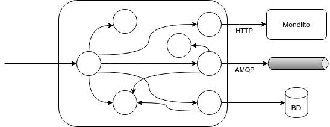
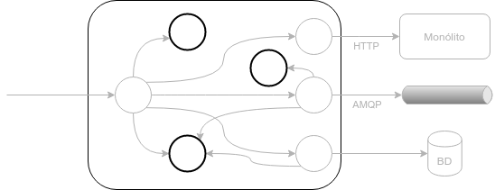
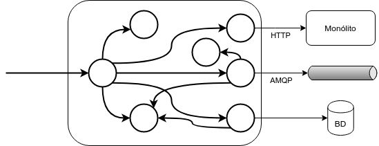
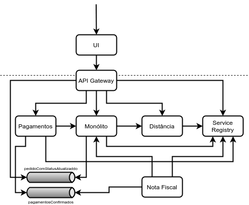
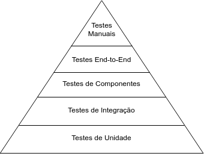
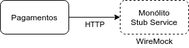
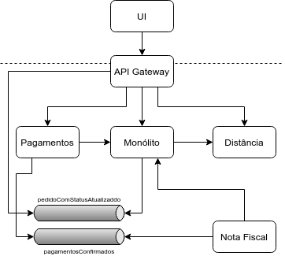
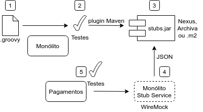

# Testes Automatizados e Contratos

## O perigo de testar tarde demais

Em tempos remotos, havia uma maneira tradicional de desenvolver, o [Waterfall](https://en.wikipedia.org/wiki/Waterfall_model), em que testar o software era uma atividade realizada depois de todo o código pronto e por um grupo diferente de pessoas: a equipe de Testes (em inglês, _Quality Assurance_ ou QA). Testes seriam trabalho do time de QA. Programadores ajudarem nos testes seria um desperdício do precioso tempo dos programadores.

Essa separação da programação dos testes trazia uma série de desvantagens. Entre elas:

- uma cultura de conflito entre programadores e QA.
- ineficiência, já que boa parte dos cenários de teste eram roteiros seguidos à risca pelo time de QA, repetidamente.
- acúmulo de trabalho não finalizado, levando a uma sobrecarga do time de QA em fases tardias do projeto
- como QA está no final do processo, tende a ser descartado à medida que a pressão de entrega aumenta

<!--@note
  Alexandre - costumo a brincar que a mentalidade de dev é construção e de QA é destruição. Ambos se completam. 
-->

Com o surgimento de outras maneiras de desenvolver software, que pregavam entrega constante de software de valor por times autônomos, as Metodologias Ágeis, houve uma mudança no processo. Para que um software pudesse ser potencialmente colocado em produção continuamente, a verificação proporcionada pelo time de QA deveria ser feita a todo momento.

À medida que mais funcionalidades e código vão se acumulando no decorrer de um projeto, seguir roteiros de teste passa a ser um esforço repetitivo muito árduo para o time de QA.

## Testes Automatizados

Para que seja possível testar continuamente o software de maneira eficiente, as tarefas repetitivas precisam ser minimizadas. Precisamos automatizar os testes!

Para isso, devemos criar um código que invoca o sistema, ou partes dele, com os parâmetros necessários e verifica se o resultado é o esperado.

Há diversos frameworks que ajudam nessa tarefa. Entre os principais da plataforma Java:

- [JUnit](https://junit.org/)
- [TestNG](https://testng.org/doc/)
- [Spock](http://spockframework.org/), em que os testes são feitos na linguagem Groovy

> Nunca no desenvolvimento de software tanto foi devido por tantos a tão poucas linhas de código.
>
> Martin Fowler, citado na página principal de [versões antigas do JUnit](https://web.archive.org/web/20070220102853/http://junit.org/index.htm)

### Tipos de Testes Automatizados

Digamos que somos do time do serviço de Pagamentos e desejamos implementar testes automatizados.

Primeiramente, precisamos ter uma ideia de como está organizado o código.

No serviço de Pagamentos, temos:

- `PagamentoController`, que recebe requests HTTP do API Gateway que, por sua vez, é chamado pela UI
- `PagamentoRepository`, que cuida da persistência de um pagamento no MySQL desse serviço
- `PedidoRestClient`, que invoca o módulo de Pedido do Monólito para avisar que um pedido foi pago
- `NotificadorPagamentoConfirmado`, que manda uma mensagem do Domain Event `PagamentoConfirmado` para um Message Channel que será consumido pelo serviço de Nota Fiscal
- diversas outras classes internas, que não tem nenhuma responsabilidade nas bordas desse sistema 



Classes com diferentes responsabilidades podem ser testadas de diferentes maneiras.

Como diz Ham Vocke no artigo [The Practical Test Pyramid](https://martinfowler.com/articles/practical-test-pyramid.html) (VOCKE, 2018), a terminologia usada na classificação de tipos de testes automatizados é muito confusa. Não há termos bem definidos: o que é teste de componentes para uns, é chamado de testes de integração ou de serviços para outros. E as nuances na escrita e arquitetura fazem com que os termos sejam mais um espectro que definições precisas. A dica de Vocke é ter um consenso nos termos usados pelo time.

Vamos usar a mesma terminologia de Chris Richardson no livro [Microservices Patterns](https://www.manning.com/books/microservices-patterns) (RICHARDSON, 2018a):

- Unidade
- Integração
- Componentes
- End-to-End

#### Testes de Unidade

De acordo com Martin Fowler, em seu artigo **[Unit Test](https://martinfowler.com/bliki/UnitTest.html)** (FOWLER, 2014c), há diversas variações na definição do que é um Teste de Unidade, mas há alguns elementos em comum:

- são de baixo nível, exercitando uma pequena parte do sistema (ou unidade).
- são escritos pelos próprios programadores usando ferramentas corriqueiras e frameworks como o JUnit.
- são rápidos

Mas o que seria essa unidade a ser testada e cujos resultados são verificados?

Alguns, como Sam Newman no livro [Building Microservices](https://learning.oreilly.com/library/view/building-microservices/9781491950340/) (NEWMAN, 2015), consideram que uma unidade é um único método ou função.

Tanto para Martin Fowler, ainda no artigo [Unit Test](https://martinfowler.com/bliki/UnitTest.html) (FOWLER, 2014c), como para Chris Richardson no livro [Microservices Patterns](https://www.manning.com/books/microservices-patterns) (RICHARDSON, 2018a), em linguagens OO, uma unidade é uma classe.



É comum que uma Unidade seja testada de maneira isolada. Isso é trivial para uma regra de negócio que recebe alguns parâmetros, faz alguns cálculos e retorna algum valor.

Mas boa parte das Unidades interagem com outras classes. Nesse caso, há duas abordagens.

Em uma das abordagens, as dependências da Unidade que está sendo testada são trocadas por _Test Doubles_ (algo como dublês de teste), que são objetos projetados para serem usados especificamente nos testes. Martin Fowler chama essa abordagem de Testes Solitários (em ingleŝ, _Solitary Tests_), citando o termo criado por Jay Fields. 

A outra abordagem traz um conceito diferente de Unidade. Martin Fowler diz que frequentemente considera um conjunto de classes relacionadas como uma Unidade. Os testes para esse tipo de Unidade seriam Testes Sociáveis (em inglês, _Sociable Tests_), em que os colaboradores de uma classe são invocados.

Toby Clemson, na palestra [Testing Strategies in a Microservice Architecture](https://martinfowler.com/articles/microservice-testing/) (CLEMSON, 2014), argumenta que, para lógica de domínio complexa, faz mais sentido usar Sociable Tests, que invocam os cálculos e transições de estados dos próprios objetos de domínio.

#### Testes de Integração

Como testar Unidades na "borda" de uma aplicação, que invocam recursos externos como serviços remotos, BDs e Message Brokers?

Para exercitar essas partes do código, os recursos externos precisam ter resultados pré-estabelecidos. Para isso, são usados Test Doubles.

É o que Chris Richardson, no livro [Microservices Patterns](https://www.manning.com/books/microservices-patterns) (RICHARDSON, 2018a), chama de Testes de Integração (em inglês, **Integration Tests**).

Um Integration Test tende a ser bem mais lento que um Unit Test.

No artigo [Integration Test](https://martinfowler.com/bliki/IntegrationTest.html) (FOWLER, 2018), Martin Fowler indica que há duas noções de Integration Tests no mercado:

- Testes de Integração restritos (em inglês, _Narrow Integration Tests_), mais focados nos pontos de integração de uma aplicação com recursos externos. É a abordagem usada por aqui.
- Testes de Integração amplos (em inglês, _Broad Integration Tests_), que é o que chamamos aqui de Testes de Componentes.

No Caelum Eats, faríamos Integration Tests (restritos) para classes como:

- `PagamentoRepository`, que integra com o MySQL
- `PedidoRestClient`, que invoca o Monólito usando HTTP como protocolo
- `NotificadorPagamentoConfirmado`, que publica o Domain Event `PagamentoConfirmado` no um Message Channel `pagamentosConfirmados`


Para a testar um ponto de integração com um BD, como `PagamentoRepository`, podemos usar um BD em memória como [H2](https://www.h2database.com/html/main.html), [HSQLDB](http://hsqldb.org/) ou [Derby](http://db.apache.org/derby/). Outra abordagem é usar um BD real, que pode apresentar erros que não seriam apresentados em um BD em memória. Tecnologias como [Testcontainers](https://www.testcontainers.org/modules/databases/) ajudam no gerenciamento desses BD reais. Ferramentas de migration como o [Flyway](https://flywaydb.org/) ou [Liquibase](https://www.liquibase.org/) auxiliam a criar a estrutura de um BD relacional necessária para os testes.

E como testar integrações com outros serviços e com Message Channels? Veremos isso mais adiante.

#### Testes de Componentes

Uma outra abordagem seria testar a integração entre os vários componentes de uma aplicação. No caso de uma Arquitetura de Microservices, estaríamos exercitando um serviço individualmente por sua API e verificando se os resultados retornados correspondem aos esperados.

Os recursos usados pelo serviço a ser testado, como BDs, caches, Message Brokers e outros serviços, seriam trocados por Test Doubles.

Chris Richardson chama esse tipo de teste, no livro [Microservices Patterns](https://www.manning.com/books/microservices-patterns) (RICHARDSON, 2018a), de Testes de Componentes (em inglês, **Component Tests**). Essa nomenclatura também é [usada por Martin Fowler](https://www.martinfowler.com/bliki/ComponentTest.html).

Há bastante discussão sobre a nomenclatura desse tipo de teste.

Alguns usam o termo Integration Tests, equivalendo aos Broad Integration Tests do artigo [Integration Test](https://martinfowler.com/bliki/IntegrationTest.html) (FOWLER, 2018) de Martin Fowler.

Como os testes não são pela UI, mas diretamente pela API de um serviço isolado, como se fossem por baixo da "pele" do sistema, Martin Fowler também usa o termo [Subcutaneous Test](https://martinfowler.com/bliki/SubcutaneousTest.html).

Sam Newman, no livro [Building Microservices](https://learning.oreilly.com/library/view/building-microservices/9781491950340/) (NEWMAN, 2015), usa o termo _Service Tests_, citando o agilista Mike Cohn.

No Caelum Eats, um Component Tests para o serviço de Pagamentos exercitaria o `PagamentoController` que, por sua vez, chamaria o restante das classes.



#### Testes End-to-End

Testes End-to-End (em inglês, **End-to-End Tests**) exercitam uma aplicação como um todo. Em uma Arquitetura de Microservices, os diversos serviços e toda a infraestrutura usada por esses serviços deve ser colocada no ar.

Sam Newman, no livro [Building Microservices](https://learning.oreilly.com/library/view/building-microservices/9781491950340/) (NEWMAN, 2015), cita o trabalho do agilista Mike Cohn para explicar que o intuito dos End-to-End Tests é exercitar as funcionalidades por meio da UI, passando por tudo o que estiver abaixo, de maneira oferecer uma verificação de grande quantidade do sistema.

Assim como em outros tipos de testes, a terminologia é variada.

Martin Fowler, por exemplo, também usa os nomes _[Broad-stack Test e Full-stack Test](https://www.martinfowler.com/bliki/BroadStackTest.html)_.

No Caelum Eats, um End-to-End Test deveria ter no ar: a UI, o API Gateway, o Monólito, o serviço de Pagamentos, o serviço de Distância, o serviço de Nota Fiscal, além do Service Registry, do Message Broker e dos BDs de cada serviço. É muita coisa!



Martin Fowler argumenta, no artigo [Broad-stack Test](https://www.martinfowler.com/bliki/BroadStackTest.html) (FOWLER, 2013), que End-to-End Tests não necessariamente precisam usar a UI. O sistema pode ser exercitado por uma API, ainda mantendo no ar vários serviços e a infraestrutura necessária. Ou seja, End-to-End Tests podem ser o que Fowler chama de [Subcutaneous Tests](https://martinfowler.com/bliki/SubcutaneousTest.html).

Uma ideia comum nos End-to-End Tests é simular um fluxo do usuário, baseado nos critérios de aceitação de Histórias do Usuário (em inglês, User Stories). Uma vantagem é prover rastreabilidade entre os requisitos e a execução dos testes. Esse tipo de teste é chamado por Martin Fowler de [StoryTest](https://www.martinfowler.com/bliki/StoryTest.html).

No livro [Building Microservices](https://learning.oreilly.com/library/view/building-microservices/9781491950340/) (NEWMAN, 2015), Sam Newman lista diversos pontos negativos de End-to-End Tests:

- Fragilidade: ao testar uma funcionalidade que passa por quatro ou cinco serviços, há muita coisa que pode dar errado. Por exemplo, pode haver uma falha momentânea na rede ou uma demora que leva a um timeout, quebrando o teste mesmo que a funcionalidade sendo testada esteja sem defeitos. Executar novamente o mesmo teste pode levá-lo a passar. A confiança no resultado diminui, o que pode levar os testes a serem ignorados. Newman recomenda uma ideia de Martin Fowler de colocar testes frágeis em quarentena, removendo-os da suíte de testes e encontrando maneiras de deixá-los mais estáveis.
- Código sem dono: quem mantém os End-to-End Tests? Se forem todos os times de todos os serviços, quando houver uma falha há o risco de cada time ignorar, achando que é um problema dos outros times. Tem um time dedicado a End-to-End Tests é ruim, porque tira a autonomia dos times dos serviços.
- Lentidão: há suítes de End-to-End Tests que duram horas, dias e até semanas para serem executadas. O feedback proporcionado pelos testes fica prejudicado. Além disso, colocar esses testes lentos em um Build Pipeline que entrega software continuamente, faria com que mudanças fossem empilhadas. Isso aliado à fragilidade é desastroso!

Newman relata que é comum, em empresas que usam uma Arquitetura de Microservices, remover os End-to-End Tests, favorecendo monitoramento detalhado.

Para minimizar o número de End-to-End Tests, diversos autores como Chris Richardson, Sam Newman e Martin Fowler, recomendam simular não uma User Story, mas uma série de interações do usuário que visam atingir algum objetivo de negócio. Por exemplo, não seria criado um End-to-End Test somente da primeira etapa de um pedido. O teste deveria incluir da criação e pagamento até a finalização do pedido, sem considerar casos de exceção. É o que Martin Fowler chama de Testes de Jornadas de Usuário (em inglês, _[User Journey Tests](https://www.martinfowler.com/bliki/UserJourneyTest.html)_).

#### Ainda outros tipos de testes

Como testar de maneira automatizada a Usabilidade do Sistema?

Testes repetitivos, que verificam funcionalidades e detectam regressões devem ser automatizados. Mas ainda são necessários testes manuais, que permitam que o software seja criticado com um olhar humano.

Além de Usabilidade, podem ser feitos Testes Exploratórios por especialistas em testes, buscando maneiras de quebrar o sistema.

Há ainda testes de _iliades_, requisitos técnicos e transversais como Performance, Escalabilidade, Segurança. Esse tipo de teste pode ser feito por especialistas, auxiliados pelas ferramentas adequadas.

Martin Fowler argumenta no artigo [Threshold Test](https://www.martinfowler.com/bliki/ThresholdTest.html) (FOWLER, 2013b), que até é possível fazer testes de Performance de maneira automatizada. Poderíamos chamar um conjunto de operações do sistema, anotando o tempo de resposta. Mas ao invés de verificarmos valores exatos, compararíamos com um valor limite. Num ambiente de Integração Contínua, esse tipo de teste ajuda a identificar uma degradação de performance assim que o código for comitado.

### Pirâmide de Testes

Testes de Unidade são rápidos: uma suíte extensa em geral é executada em milissegundos ou segundos. Além disso, são bem baratos de se escrever porque estão isolados e no mesmo nível de abstração do código. Aliados a práticas como TDD e refatoração, influenciam positivamente no design do nosso código.

Testes de Integração e de Componentes são um pouco mais lentos, tendo uma suíte executada em alguns minutos, em geral. É comum acessarem outras peças da infra-estrutura como Bancos de Dados ou WebServices. Por isso, seu setup é mais complicado e tais testes acabam sendo mais caros de desenvolver.

Testes End-to-End são os mais lentos, chegando a horas de execução, além de caros, pela complexidade de escrevê-los. Há diversos motivos para pode quebrá-los e, às vezes, apresentam falhas intermitentes.

Martin Fowler cita a ideia do agilista Mike Cohn de uma Pirâmide de Testes, que indica que Testes de Unidade devem ser favorecidos, em detrimento de formas de testes mais lentas, caras e frágeis.



> Há relatos de sistemas no mercado que têm classes responsáveis por diversas funcionalidades e regras de negócio, chegando a 15 mil linhas de código.
>
> Além de incompreensível, um código tão desorganizado é difícil de testar porque torna-se complicado exercitar isoladamente uma regra de negócio ou um ponto de integração. Em geral, apenas testes end-to-end são possíveis para esse tipo de código. Como diz Michael Feathers em um [post em seu blog](https://michaelfeathers.typepad.com/michael_feathers_blog/2007/09/the-deep-synerg.html) (FEATHERS, 2007), há uma forte sinergia entre um bom design de código e testabilidade.
>
> Martin Fowler [relata em seu blog](https://martinfowler.com/bliki/Detestable.html) (FOWLER, 2005b) que uma pessoa no grupo de eXtreme Programming de Sidney fez a seguinte brincadeira:
>
> Detestável (adjetivo): software que não é testável.

## Test Doubles

Conforme mencionamos, Testes de Unidade do estilo Solitário, Testes de Integração e Testes de Componentes, trocam dependências a serviços externos com o BDs ou outros serviços por _Test Doubles_, objetos projetados para serem usados especificamente nos testes.

De maneira semelhante às outras terminologias de Testes Automatizados, há uma grande confusão na classificação de Test Doubles. Muitas vezes, o único termo usado é Mock.

No artigo [Test Double](https://www.martinfowler.com/bliki/TestDouble.html) (FOWLER, 2006), Martin Fowler sugere o uso dos termos de Gerard Meszaros:

- _Dummy_: um objeto passado apenas para preencher argumentos de um método, mas que não é realmente invocado.
- _Fake_: um objeto com uma implementação funcional, mas que não deve ser usada em produção. Por exemplo, um BD em memória.
- _Stub_: provê respostas pré-estabelecidas às chamadas feitas durante um teste. Ignoram chamadas não esperadas.
- _Spy_: stubs que gravam informações sobre como foram chamados. Por exemplo, um serviço de email que conta quantas mensagens foram enviadas.
- _Mock_: especifica as interações exatas com objetos que o usam. Há uma verificação de que todas as chamadas esperadas devem ser realizadas, retornando os resultados pré-estabelecidos. Nenhuma chamada a mais pode ser feita.

No paper [Mock Roles, not Objects](http://jmock.org/oopsla2004.pdf) (FREEMAN et al., 2004), os autores, pioneiros de Test Doubles, descrevem o princípio _Only Mock Types You Own_: não devem ser feitos Mocks de tipos (classes, interfaces, etc) cujo código não podemos modificar, como tipos de bibliotecas externas.

## Stub Services e WireMock

Quando implementamos Integration e Component Tests, precisamos exercitar as integrações com serviços externos.

Mas invocar instâncias reais desses serviços externos é algo bastante trabalhoso. Seria necessário executar toda a infraestrutura e os serviços externos usados por esses serviços externos. A complexidade aumentaria absurdamente.

Uma abordagem mais interessante é usar Test Doubles para cada um dos serviços externos usados por uma aplicação. Usando a terminologia estudada anteriormente, criaríamos Stubs para esses serviços.

No livro [Building Microservices](https://learning.oreilly.com/library/view/building-microservices/9781491950340/) (NEWMAN, 2015), Sam Newman relata que já criou esses **Stub Services** na mão, executando código baseado em servidores HTTP como Apache, Nginx, Jetty ou implementados em Python.

Mas existem Stub Services já prontos, como:

- [mountebank](http://www.mbtest.org/), escrito em NodeJS
- [WireMock](http://wiremock.org/), escrito em Java

Ambos provêem uma API RESTful que permite que aplicações escritas em múltiplas plataformas registrem quais os requests esperados e os responses associados a esses requests. Então, testes usariam a API como um Stub do serviço real. 

Também há como verificar as chamadas realmente realizadas durante o teste, servindo como um Mock.

### WireMock

Focando no WireMock, para executá-lo, podemos disparar o JAR executável da seguinte forma:

```sh
java -jar wiremock-standalone-2.26.0.jar --port 7070
```

_Observação: a porta padrão é a `8080`. Com a opção `--port`, modificamos a porta do WireMock para `7070`._

Para registrar um novo request e o respectivo response, de maneira a simular uma chamada que obtém os detalhes de um pedido do Monólito, faríamos:

```
POST http://localhost:7070/__admin/mappings/new
```

```json
{
  "request": {
    "url": "/pedidos/1", 
    "method": "GET"
  }, 
  "response": {
    "status": 200,
    "body": "{\"id\": 1, \"dataHora\": \"2019-07-18T08:22:01\", \"status\": \"PAGO\"}"
  }
}
```

Então, qualquer request à URL http://localhost:7070/pedidos/1, teria como response o status code `200 OK` e um JSON com os dados do pedido registrados no passo anterior.

Requisições a outras URLs ocasionariam um status code `404 Not Found`.

### Quem deve manter o código do Stub Service?

Digamos que estamos criando um Integration Test da classe `PedidoRestClient`: o ponto de integração do serviço de Pagamentos com o módulo de Pedido do Monólito.

O Integration Test do serviço de Pagamentos poderia utilizar o WireMock para subir um Stub Service do Monólito e carregá-lo com uma série de requests e responses pré-determinados.



Mas quem deve manter esse conjunto de requests e responses?

Seguindo o princípio _Only Mock Types You Own_, o serviço de Pagamentos não deveria manter o Stub Service do Monólito. Deveria ser o próprio time que desenvolve o Monólito.

Para auxiliar nessa tarefa, poderiam ser usados contratos.

## Contratos entre serviços

Nesse momento, há diversas integrações entre os serviços.

Temos integrações síncronas e RESTful, que usam HTTP:

- o API Gateway invoca os módulos do Monólito e os serviços de Pagamentos e Distância, tanto como Proxy quanto como API Composer
- o serviço de Pagamentos invoca o módulo de Pedido do Monólito, avisando que um pedido foi pago
- o módulo de Restaurante do Monólito invoca o serviço de Distância, informando que novos restaurantes foram aprovados ou que um restaurante foi atualizado
- o serviço de Nota Fiscal busca detalhes de um pedido do módulo de Pedido do Monólito

Temos integrações assíncronas, que usam Mensageria com AMQP:

- o serviço de Pagamentos produz um Domain Event que indica que um pagamento foi confirmado, que é consumido pelo serviço de Nota Fiscal
- o módulo de Pedido do Monólito produz um Domain Event para cada atualização de status de um pedido, cujo consumidor é o API Gateway, que usa um WebSocket para notificar o front-end



Em cada uma dessas integrações há um contrato.

Chris Richardson, no livro [Microservices Patterns](https://www.manning.com/books/microservices-patterns) (RICHARDSON, 2018a), diz que no caso das endpoints REST, oum contrato é composto por:

- o método HTTP usado no request
- a URL invocada no request
- os cabeçalhos HTTP no request e no response, como `Content-Type` e `Accept`
- o corpo do request e do response, que contém os dados
- o status code do response

Já para integrações que usam Mensageria, Richardson indica que o contrato é composto por:

- a estrutura do corpo da mensagem
- o Message Channel utilizado

## Testes de Contratos

Os contratos entre serviços mencionados anteriormente poderiam ser usados para influenciar na criação de Stub Services que são usados em Integration e Component Tests.

Esse contratos seriam materializados em um ou mais arquivos que provêem exemplos dos requests, responses ou mensagens trafegadas na integração entre os serviços.

Algumas ferramentas ajudam a definir e executar esses contratos. Entre elas:

- [Pact](https://docs.pact.io/), uma ferramenta que checa se chamadas ao serviço real tem os mesmos resultados das definidas no contrato. É implementado em diversas linguagens.
- [Spring Cloud Contract](https://spring.io/projects/spring-cloud-contract), uma ferramenta do ecossistema Spring que ajuda a definir contratos tanto para APIs REST como para Mensageria, que são usados para gerar testes automatizados e Stub Services.

### Spring Cloud Contract

Voltando à integração entre o serviço de Pagamentos e o Monólito, como usar o Spring Cloud Contract para testá-la?

O Monólito, nos temos do Spring Cloud Contract, seria o Producer. Já o serviço de Pagamentos, seria o Consumer.

Do lado do Producer, usamos o Spring Cloud Contract Verifier. Com esse projeto, podemos definir exemplos de request/response HTTP ou mensagens usando uma DSL Groovy ou YAML. Esse arquivo é a materialização do contrato entre os serviços.

Ainda do lado do Producer, através de um plugin do Maven, esse contrato é usado para gerar automaticamente Component Tests, verificando se o próprio Producer segue os contratos. É necessário fornecer uma classe base que é estendida por todos os Component Tests gerados. Por exemplo, para um contrato de API REST, a classe base ficaria responsável por configurar o `RestAssuredMockMvc`.

No caso do build do Maven ser bem sucedido, é gerado um JAR contendo o contrato. No caso de contratos de APIs REST, o JAR também contém um JSON no formato do WireMock . É o caso da integração entre o serviço de Pagamentos e o Monólito.  Esse JAR é publicado em algum repositório de artefatos como o Nexus, Archiva ou localmente no diretório `.m2`.

Já do lado do Consumer, o JAR é obtido e executado usando o Spring Cloud Contract Stub Runner. No caso de uma API REST, o WireMock é iniciado e o JSON com os exemplos de request/response são carregados.

Então, os pontos de integração são exercitados pelos testes automatizados usando o Stub fornecido pelo Producer.



## Fornecendo stubs do contrato a partir do servidor

Adicione ao `pom.xml` do serviço de distância, uma dependência ao starter do Spring Cloud Contract Verifier:

####### fj33-eats-distancia-service/pom.xml

```xml
<dependency>
  <groupId>org.springframework.cloud</groupId>
  <artifactId>spring-cloud-starter-contract-verifier</artifactId>
  <scope>test</scope>
</dependency>
```

Adicione também o plugin Maven do Spring Cloud Contract:

####### fj33-eats-distancia-service/pom.xml

```xml
<plugin>
  <groupId>org.springframework.cloud</groupId>
  <artifactId>spring-cloud-contract-maven-plugin</artifactId>
  <extensions>true</extensions>
  <configuration>
    <packageWithBaseClasses>br.com.caelum.eats.distancia.base</packageWithBaseClasses>
  </configuration>
</plugin>
```

Note que na configuração `packageWithBaseClasses` definimos um pacote para as classes base, que serão usadas na execução de testes.

No Eclipse, com o botão direito no projeto `eats-distancia-service`, acesse o menu _New > Folder..._. Defina em _Folder name_, o caminho `src/test/resources/contracts/restaurantes`.

_Dica: para que o diretório `src/test/resources` seja reconhecido como um source folder faça um refresh no projeto e, com o botão direito no projeto, clique em Maven > Update Project... e, então, em OK._

Dentro desse diretório, crie o arquivo `deveAdicionarNovoRestaurante.groovy`. Esse arquivo conterá o contrato que estamos definindo, utilizando uma DSL Groovy:

####### fj33-eats-distancia-service/src/test/resources/contracts/restaurantes/deveAdicionarNovoRestaurante.groovy

```groovy
import org.springframework.cloud.contract.spec.Contract
Contract.make {
    description "deve adicionar novo restaurante"
    request{
        method POST()
        url("/restaurantes")
        body([
          id: 2,
          cep: '71500-000',
          tipoDeCozinhaId: 1
        ])
        headers {
          contentType('application/json')
        }
    }
    response {
        status 201
        body([
          id: 2,
          cep: '71500-000',
          tipoDeCozinhaId: 1
        ])
        headers {
          contentType('application/json')
        }
    }
}
```

No serviço de distância, clique com o botão direto no projeto e então acesse o menu _New > Folder..._ e defina, em _Folder name_, o caminho `src/test/java`. Será criado um source folder de testes.

No pacote `br.com.caelum.eats.distancia.base` do _source folder_ `src/test/java`, definido anteriormente no plugin do Maven, crie a classe a classe `RestaurantesBase`, que será a base para a execução de testes baseados no contrato do controller de restaurantes.

_Dica: para que o diretório `src/test/java` seja reconhecido como um source folder faça um refresh no projeto e, com o botão direito no projeto, clique em Maven > Update Project... e, então, em OK._

Nessa classe injete o `RestaurantesController`, passando a instância para o `RestAssuredMockMvc`, uma integração da biblioteca REST Assured com o MockMvc do Spring.

Além disso, injetaremos um `RestauranteRepository` anotado com `@MockBean`, fazendo com que a instância seja gerenciada pelo Mockito. Usaremos essa instância como um _stub_, registrando uma chamada ao método `insert` que retorna o próprio objeto passado como parâmetro.

Para evitar que o Spring tente conectar com o MongoDB durante os testes, anote a classe com `@ImportAutoConfiguration`, passando na propriedade `exclude` a classe `MongoAutoConfiguration`.

_Observação: o nome da classe `RestaurantesBase` usa como prefixo o diretório de nosso contrato (`restaurantes`). O sufixo `Base` é um requisito do Spring Cloud Contract._

####### fj33-eats-distancia-service/src/test/java/br/com/caelum/eats/distancia/base/RestaurantesBase.java

```java
@ImportAutoConfiguration(exclude=MongoAutoConfiguration.class)
@SpringBootTest
@RunWith(SpringRunner.class)
class RestaurantesBase {

  @Autowired
  private RestaurantesController restaurantesController;

  @MockBean
  private RestauranteRepository restauranteRepository;

  @Before
  public void before() {
    RestAssuredMockMvc.standaloneSetup(restaurantesController);

    Mockito.when(restauranteRepository.insert(Mockito.any(Restaurante.class)))
      .thenAnswer((InvocationOnMock invocation) -> {
        Restaurante restaurante = invocation.getArgument(0);
        return restaurante;
      });

  }
}
```

Os imports são os seguintes:

```java
import org.junit.Before;
import org.junit.runner.RunWith;
import org.mockito.Mockito;
import org.mockito.invocation.InvocationOnMock;
import org.springframework.beans.factory.annotation.Autowired;
import org.springframework.boot.test.context.SpringBootTest;
import org.springframework.boot.test.mock.mockito.MockBean;
import org.springframework.test.context.junit4.SpringRunner;

import br.com.caelum.eats.distancia.Restaurante;
import br.com.caelum.eats.distancia.RestauranteRepository;
import br.com.caelum.eats.distancia.RestaurantesController;
import io.restassured.module.mockmvc.RestAssuredMockMvc;

import io.restassured.module.mockmvc.RestAssuredMockMvc;
```

Altere a classe `RestaurantesController`, tornando-a pública:

```java
// anotações omitidas ...
public class RestaurantesController { // modificado

  // código omitido ...

}
```

Também torne pública a interface `RestauranteRepository`:

```java
public interface RestauranteRepository extends MongoRepository<Restaurante, Long> {

  // código omitido ...

}
```

Abra um Terminal e, no diretório do serviço de distância, execute:

```sh
mvn clean install
```

Depois do sucesso no build, podemos observar que uma classe `RestaurantesTest` foi gerada pelo Spring Cloud Contract: 

####### fj33-eats-distancia-service/target/generated-test-sources/contracts/br/com/caelum/eats/distancia/base/RestaurantesTest.java

```java
public class RestaurantesTest extends RestaurantesBase {

  @Test
  public void validate_deveAdicionarNovoRestaurante() throws Exception {
    // given:
      MockMvcRequestSpecification request = given()
          .header("Content-Type", "application/json")
          .body("{\"id\":2,\"cep\":\"71500-000\",\"tipoDeCozinhaId\":1}");

    // when:
      ResponseOptions response = given().spec(request)
          .post("/restaurantes");

    // then:
      assertThat(response.statusCode()).isEqualTo(201);
      assertThat(response.header("Content-Type")).matches("application/json.*");
    // and:
      DocumentContext parsedJson = JsonPath.parse(response.getBody().asString());
      assertThatJson(parsedJson).field("['tipoDeCozinhaId']").isEqualTo(1);
      assertThatJson(parsedJson).field("['cep']").isEqualTo("71500-000");
      assertThatJson(parsedJson).field("['id']").isEqualTo(2);
  }

}
```

A classe `RestaurantesTest` é responsável por verificar que o próprio servidor segue o contrato.

Além do _fat JAR_ gerado pelo Spring Boot com a aplicação, o Spring Cloud Contract gera um outro JAR com stubs do contrato:
`eats-distancia-service/target/eats-distancia-service-0.0.1-SNAPSHOT-stubs.jar`.

Dentro do diretório `/META-INF/br.com.caelum/eats-distancia-service/0.0.1-SNAPSHOT/` desse JAR, no subdiretório `contracts/restaurantes/`, há a DSL Groovy que descreve o contrato, no arquivo `deveAdicionarNovoRestaurante.groovy`.

Já no subdiretório `mappings/restaurantes/`, há o arquivo `deveAdicionarNovoRestaurante.json`:

```json
{
  "id" : "80bcbe99-0504-4ff9-8f32-e9eb0645b646",
  "request" : {
    "url" : "/restaurantes",
    "method" : "POST",
    "headers" : {
      "Content-Type" : {
        "matches" : "application/json.*"
      }
    },
    "bodyPatterns" : [ {
      "matchesJsonPath" : "$[?(@.['tipoDeCozinhaId'] == 1)]"
    }, {
      "matchesJsonPath" : "$[?(@.['cep'] == '71500-000')]"
    }, {
      "matchesJsonPath" : "$[?(@.['id'] == 2)]"
    } ]
  },
  "response" : {
    "status" : 201,
    "body" : "{\"tipoDeCozinhaId\":1,\"id\":2,\"cep\":\"71500-000\"}",
    "headers" : {
      "Content-Type" : "application/json"
    },
    "transformers" : [ "response-template" ]
  },
  "uuid" : "80bcbe99-0504-4ff9-8f32-e9eb0645b646"
}
```

Esse JSON é compatível com a ferramenta WireMock, que permite a execução de um _mock server_ para testes de API.

## Usando stubs do contrato no cliente

No `pom.xml` do módulo `eats-application` do monólito, adicione o starter do Spring Cloud Contract Stub Runner:

####### fj33-eats-monolito-modular/eats/eats-application/pom.xml

```xml
<dependency>
  <groupId>org.springframework.cloud</groupId>
  <artifactId>spring-cloud-starter-contract-stub-runner</artifactId>
  <scope>test</scope>
</dependency>
```

No source folder `src/test/java` do módulo `eats-application`, dentro do pacote `br.com.caelum.eats`, crie a classe `DistanciaRestClientWiremockTest`.

Anote-a com `@AutoConfigureStubRunner`, passando no parâmetro `ids`, o `groupId` e `artifactId` do JAR gerado no exercício anterior. Use um `+` para sempre obter a última versão. Passe também a porta que deve ser usada pelo servidor do WireMock. No parâmetro `stubsMode`, informe que o JAR do contrato será obtido do repositório `LOCAL` (o diretório `.m2`).

Em um método anotado com `@Before`, crie uma instância do `DistanciaRestClient`, o ponto de integração do monólito com o serviço de distância. Passe um `RestTemplate` sem balanceamento de carga e fixe a URL para a porta definida na anotação `@AutoConfigureStubRunner`.

Invoque o método `novoRestauranteAprovado` de `DistanciaRestClient`, passando um objeto `Restaurante` com valores condizentes com o contrato. Como o método é `void`, em caso de exceção force a falha do teste.

####### fj33-eats-monolito-modular/eats/eats-application/src/test/java/br/com/caelum/eats/DistanciaRestClientWiremockTest.java

```java
@SpringBootTest
@RunWith(SpringRunner.class)
@AutoConfigureStubRunner(ids = "br.com.caelum:eats-distancia-service:+:stubs:9992", stubsMode = StubsMode.LOCAL)
public class DistanciaRestClientWiremockTest {

  private DistanciaRestClient distanciaClient;

  @Before
  public void before() {
    RestTemplate restTemplate = new RestTemplate();
    distanciaClient = new DistanciaRestClient(restTemplate, "http://localhost:9992");
  }

  @Test
  public void deveAdicionarUmNovoRestaurante() {
      TipoDeCozinha tipoDeCozinha = new TipoDeCozinha(1L, "Chinesa");

      Restaurante restaurante = new Restaurante();
      restaurante.setId(2L);
      restaurante.setCep("71500-000");
      restaurante.setTipoDeCozinha(tipoDeCozinha);

      distanciaClient.novoRestauranteAprovado(restaurante);
  }
}
```

<!--@note

Alexandre Aquiles / 17/09/2019

Esse teste bate no BD.

Daria pra colocar o H2 como dependência e usar @DataJpaTest.
Porém, os scripts do Flyway deram problema no CHARSET.
Eventualmente vou arrumar isso.

Teste desligar a auto-configuração do data source, mas dá problema em classes que usam os repositories.
O Spring Data JPA deixa de criar objetos gerenciados pelo Spring a partir das interfaces e acaba dando UnsatisfiedDependencyException.

Mas dá pra mockar os repositories. Ficaria assim:

@ImportAutoConfiguration(exclude=DataSourceAutoConfiguration.class)
@MockBeans({@MockBean(UserRepository.class),
			@MockBean(FormaDePagamentoRepository.class),
			@MockBean(TipoDeCozinhaRepository.class),
			@MockBean(RestauranteRepository.class),
			@MockBean(RestauranteFormaDePagamentoRepository.class),
			@MockBean(CardapioRepository.class),
			@MockBean(CategoriaDoCardapioRepository.class),
			@MockBean(ItemDoCardapioRepository.class),
			@MockBean(HorarioDeFuncionamentoRepository.class),
			@MockBean(PedidoRepository.class),
			@MockBean(AvaliacaoRepository.class)})

E todos esses repositories tem que ser mudados para public, para poderem ser acessados pela classe do teste.

Muito feio, então deixei o código do teste bater no BD, pelo menos por enquanto.

-->

_Observação: o teste anterior falhará quando for lançada uma exceção._

Seguem os imports:

```java
import org.junit.Before;
import org.junit.Test;
import org.junit.runner.RunWith;
import org.springframework.boot.test.context.SpringBootTest;
import org.springframework.cloud.contract.stubrunner.spring.AutoConfigureStubRunner;
import org.springframework.cloud.contract.stubrunner.spring.StubRunnerProperties.StubsMode;
import org.springframework.test.context.junit4.SpringRunner;
import org.springframework.web.client.RestTemplate;

import br.com.caelum.eats.administrativo.TipoDeCozinha;
import br.com.caelum.eats.restaurante.DistanciaRestClient;
import br.com.caelum.eats.restaurante.Restaurante;
```

No módulo de restaurante do monólito, torne públicos a classe `DistanciaRestClient`, seu construtor e o método `novoRestauranteAprovado`:

####### fj33-eats-monolito-modular/eats-restaurante/src/main/java/br/com/caelum/eats/restaurante/DistanciaRestClient.java

```java
@Slf4j
@Service
public class DistanciaRestClient { // modificado

  // código omitido ...

  public DistanciaRestClient(RestTemplate restTemplate, // modificado
                                      @Value("${configuracao.distancia.service.url}") String distanciaServiceUrl) {
    this.distanciaServiceUrl = distanciaServiceUrl;
    this.restTemplate = restTemplate;
  }

  public void novoRestauranteAprovado(Restaurante restaurante) { // modificado
    // código omitido ...
  }

  // restante do código ...

}
```

Execute a classe `DistanciaRestClientWiremockTest` com o JUnit 4.

Observe, nos logs, a definição no WireMock do contrato descrito no arquivo `deveAdicionarNovoRestaurante.json` do JAR de stubs.

```txt
2019-07-03 17:41:27.681  INFO [monolito,,,] 32404 --- [tp1306763722-35] WireMock                                 : Admin request received:
127.0.0.1 - POST /mappings

Connection: [keep-alive]
User-Agent: [Apache-HttpClient/4.5.5 (Java/1.8.0_201)]
Host: [localhost:9992]
Content-Length: [718]
Content-Type: [text/plain; charset=UTF-8]
{
  "id" : "64ce3139-e460-405d-8ebb-fe7f527018c3",
  "request" : {
    "url" : "/restaurantes",
    "method" : "POST",
    "headers" : {
      "Content-Type" : {
        "matches" : "application/json.*"
      }
    },
    "bodyPatterns" : [ {
      "matchesJsonPath" : "$[?(@.['tipoDeCozinhaId'] == 1)]"
    }, {
      "matchesJsonPath" : "$[?(@.['cep'] == '71500-000')]"
    }, {
      "matchesJsonPath" : "$[?(@.['id'] == 2)]"
    } ]
  },
  "response" : {
    "status" : 201,
    "body" : "{\"tipoDeCozinhaId\":1,\"id\":2,\"cep\":\"71500-000\"}",
    "headers" : {
      "Content-Type" : "application/json"
    },
    "transformers" : [ "response-template" ]
  },
  "uuid" : "64ce3139-e460-405d-8ebb-fe7f527018c3"
}
```

Mais adiante, observe que o WireMock recebeu uma requisição POST na URL `/restaurantes` e enviou a resposta descrita no contrato:

```txt
2019-07-03 17:41:37.689  INFO [monolito,,,] 32404 --- [tp1306763722-36] WireMock:
Request received:
127.0.0.1 - POST /restaurantes

User-Agent: [Java/1.8.0_201]
Connection: [keep-alive]
Host: [localhost:9992]
Accept: [application/json, application/*+json]
Content-Length: [46]
Content-Type: [application/json;charset=UTF-8]
{"id":2,"cep":"71500-000","tipoDeCozinhaId":1}

Matched response definition:
{
  "status" : 201,
  "body" : "{\"tipoDeCozinhaId\":1,\"id\":2,\"cep\":\"71500-000\"}",
  "headers" : {
    "Content-Type" : "application/json"
  },
  "transformers" : [ "response-template" ]
}

Response:
HTTP/1.1 201
Content-Type: [application/json]
Matched-Stub-Id: [64ce3139-e460-405d-8ebb-fe7f527018c3]
```

## Exercício: Contract Test para comunicação síncrona

1. Abra um Terminal e vá até a branch `cap11-contrato-cliente-servidor` do projeto do serviço de distância:

  ```sh
  cd ~/Desktop/fj33-eats-distancia-service
  git checkout -f cap11-contrato-cliente-servidor
  ```

  Então, faça o build do serviço de distância, rode o Contract Test no próprio serviço, gere o JAR com os stubs do contrato e instale no repositório local do Maven. Basta executar o comando:

  ```sh
  mvn clean install
  ```

  Aguarde a execução do build. As mensagens finais devem conter:

  ```txt
  [INFO] Results:
  [INFO]
  [INFO] Tests run: 1, Failures: 0, Errors: 0, Skipped: 0
  [INFO]
  [INFO]
  ...
  [INFO] Installing /home/<USUARIO-DO-CURSO>/Desktop/fj33-eats-distancia-service/target/eats-distancia-service-0.0.1-SNAPSHOT.jar to /home/<USUARIO-DO-CURSO>/.m2/repository/br/com/caelum/eats-distancia-service/0.0.1-SNAPSHOT/eats-distancia-service-0.0.1-SNAPSHOT.jar
  [INFO] Installing /home/<USUARIO-DO-CURSO>/Desktop/fj33-eats-distancia-service/pom.xml to /home/<USUARIO-DO-CURSO>/.m2/repository/br/com/caelum/eats-distancia-service/0.0.1-SNAPSHOT/eats-distancia-service-0.0.1-SNAPSHOT.pom
  [INFO] Installing /home/<USUARIO-DO-CURSO>/Desktop/fj33-eats-distancia-service/target/eats-distancia-service-0.0.1-SNAPSHOT-stubs.jar to /home/<USUARIO-DO-CURSO>/.m2/repository/br/com/caelum/eats-distancia-service/0.0.1-SNAPSHOT/eats-distancia-service-0.0.1-SNAPSHOT-stubs.jar
  [INFO] ------------------------------------------------------------------------
  [INFO] BUILD SUCCESS
  [INFO] ------------------------------------------------------------------------
  [INFO] Total time: 02:45 min
  [INFO] Finished at: 2019-07-03T16:45:17-03:00
  [INFO] ------------------------------------------------------------------------
  ```

  Observe, pelas mensagens anteriores, que o JAR com os stubs foi instalado no diretório `.m2`, o repositório local Maven, do usuário do curso.

2. No projeto do monólito modular, faça checkout da branch `cap11-contrato-cliente-servidor`:

  ```sh
  cd ~/Desktop/fj33-eats-monolito-modular
  git checkout -f cap11-contrato-cliente-servidor
  ```

  Faça o refresh do projeto no Eclipse.

  Clique com o botão direito na classe `DistanciaRestClientWiremockTest`, do módulo `eats-application` do monólito, e, então, em _Run As... > Run Configurations..._. Clique com o botão direito em _JUnit_ e, a seguir, em _New Configuration_. Em _Test runner_, escolha o JUnit 4. Então, clique em _Run_.

  Aguarde a execução dos testes. Sucesso!

## Definindo um contrato no publisher

Adicione, ao `pom.xml` do serviço de pagamentos, as dependências ao starter do Spring Cloud Contract Verifier e à biblioteca de suporte a testes do Spring Cloud Stream:

####### fj33-eats-pagamento-service/pom.xml

```xml
<dependency>
  <groupId>org.springframework.cloud</groupId>
  <artifactId>spring-cloud-starter-contract-verifier</artifactId>
  <scope>test</scope>
</dependency>
<dependency>
  <groupId>org.springframework.cloud</groupId>
  <artifactId>spring-cloud-stream-test-support</artifactId>
  <scope>test</scope>
</dependency>
```

Adicione também o plugin Maven do Spring Cloud Contract, configurando `br.com.caelum.eats.pagamento.base` como pacote das classes base a serem usadas nos testes gerados a partir dos contratos.

####### fj33-eats-pagamento-service/pom.xml

```xml
<plugin>
  <groupId>org.springframework.cloud</groupId>
  <artifactId>spring-cloud-contract-maven-plugin</artifactId>
  <extensions>true</extensions>
  <configuration>
    <packageWithBaseClasses>br.com.caelum.eats.pagamento.base</packageWithBaseClasses>
  </configuration>
</plugin>
```

Dentro do Eclipse, clique com o botão direito no projeto `eats-pagamento-service`, acessando _New > Folder..._ e definindo o caminho `src/test/resources/contracts/pagamentos/confirmados` em _Folder name_.

_Dica: para que o diretório `src/test/resources` seja reconhecido como um source folder faça um refresh no projeto e, com o botão direito no projeto, clique em Maven > Update Project... e, então, em OK._

Crie o arquivo `deveAdicionarNovoRestaurante.groovy` nesse diretório, definindo o contrato por meio da DSL Groovy:

####### fj33-eats-pagamento-service/src/test/resources/contracts/pagamentos/confirmados/deveNotificarPagamentosConfirmados.groovy

```groovy
import org.springframework.cloud.contract.spec.Contract
Contract.make {
  description "deve notificar pagamentos confirmados"
  label 'pagamento_confirmado'
  input {
    triggeredBy('novoPagamentoConfirmado()')
  }
  outputMessage {
    sentTo 'pagamentosConfirmados'
    body([
      pagamentoId: 2,
      pedidoId: 3
    ])
    headers {
      messagingContentType(applicationJson())
    }
  }
}
```

Definimos `pagamento_confirmado` como `label`, que será usado nos testes do subscriber. Em `input`, invocamos o método `novoPagamentoConfirmado` da classe base. Já em `outputMessage`, definimos `pagamentosConfirmados` como _destination_ esperado, o corpo da mensagem e o _Content Type_ nos cabeçalhos.

Defina um source folder de testes no projeto `fj33-eats-pagamento-service`. Para isso, no Eclipse, clique com o botão direto no projeto e então acesse o menu _New > Folder..._ e defina, em _Folder name_, o caminho `src/test/java`

No pacote `br.com.caelum.eats.pagamento.base`,  do source folder `src/test/java`, crie a classe `PagamentosConfirmadosBase`. Anote essa classe com `@AutoConfigureMessageVerifier`, além das anotações de testes do Spring Boot. Na anotação `@SpringBootTest`, configure o `webEnvironment` para `NONE`.

Para que o teste não tente conectar com o MySQL, use a anotação `@ImportAutoConfiguration` com a class `DataSourceAutoConfiguration` no atributo `exclude`. Ocorrerá um problema na criação de `PagamentoRepository` pelo Spring Data JPA, já que não teremos mais um data source configurado. Por isso, faça um mock de `PagamentoRepository` com `@MockBeans`.

Peça ao Spring para injetar uma instância da classe `NotificadorPagamentoConfirmado`.

Defina um método `novoPagamentoConfirmado`, que usa a instância injetada para chamar o método `notificaPagamentoConfirmado` passando como parâmetro um `Pagamento` com dados compatíveis com o contrato definido anteriormente.

_Observação: o nome da classe `PagamentosConfirmadosBase` usa como prefixo o diretório de nosso contrato (`pagamentos/confirmados`) com o sufixo `Base`._

####### fj33-eats-pagamento-service/src/test/java/br/com/caelum/eats/pagamento/base/PagamentosConfirmadosBase.java

```java
@ImportAutoConfiguration(exclude=DataSourceAutoConfiguration.class)
@MockBeans(@MockBean(PagamentoRepository.class))
@RunWith(SpringRunner.class)
@SpringBootTest(webEnvironment = SpringBootTest.WebEnvironment.NONE)
@AutoConfigureMessageVerifier
public class PagamentosConfirmadosBase {

  @Autowired
  private NotificadorPagamentoConfirmado notificador;

  public void novoPagamentoConfirmado() {
    Pagamento pagamento = new Pagamento();
    pagamento.setId(2L);
    pagamento.setPedidoId(3L);
    notificador.notificaPagamentoConfirmado(pagamento);
  }

}
```

Confira os imports:

```java
import org.junit.runner.RunWith;
import org.springframework.beans.factory.annotation.Autowired;
import org.springframework.boot.autoconfigure.ImportAutoConfiguration;
import org.springframework.boot.autoconfigure.jdbc.DataSourceAutoConfiguration;
import org.springframework.boot.test.context.SpringBootTest;
import org.springframework.boot.test.mock.mockito.MockBean;
import org.springframework.boot.test.mock.mockito.MockBeans;
import org.springframework.cloud.contract.verifier.messaging.boot.AutoConfigureMessageVerifier;
import org.springframework.test.context.junit4.SpringRunner;
```

Deve acontecer um erro de compilação no uso de `Pagamento`, `NotificadorPagamentoConfirmado` e `PagamentoRepository` na classe `PagamentosConfirmadosBase`.

Corrija esse erro, fazendo com que a classe `Pagamento` seja pública:

####### fj33-eats-pagamento-service/src/main/java/br/com/caelum/eats/pagamento/Pagamento.java

```java
public class Pagamento { // modificado

  // código omitido ...

}
```

Faça com a classe `NotificadorPagamentoConfirmado` e o método `notificaPagamentoConfirmado` sejam públicos:

####### fj33-eats-pagamento-service/src/main/java/br/com/caelum/eats/pagamento/NotificadorPagamentoConfirmado.java

```java
// anotações omitidas ...
public class NotificadorPagamentoConfirmado { // modificado

  // código omitido ...

  public void notificaPagamentoConfirmado(Pagamento pagamento) { // modificado
    // código omitido ...
  }

}
```

Torne a interface `PagamentoRepository` pública:

####### fj33-eats-pagamento-service/src/main/java/br/com/caelum/eats/pagamento/PagamentoRepository.java

```java
public interface PagamentoRepository extends JpaRepository<Pagamento, Long> { // modificado
}
```

Ajuste os imports na classe `PagamentosConfirmadosBase`:

####### fj33-eats-pagamento-service/src/test/java/br/com/caelum/eats/pagamento/base/PagamentosConfirmadosBase.java

```java
import br.com.caelum.eats.pagamento.NotificadorPagamentoConfirmado;
import br.com.caelum.eats.pagamento.Pagamento;
import br.com.caelum.eats.pagamento.PagamentoRepository;
```

Faça o build do Maven:

```sh
mvn clean install
```

Depois da execução do build, o Spring Cloud Contract deve ter gerado a classe `ConfirmadosTest`:

####### fj33-eats-pagamento-service/target/generated-test-sources/contracts/br/com/caelum/eats/pagamento/base/pagamentos/ConfirmadosTest.java

```java
public class ConfirmadosTest extends PagamentosConfirmadosBase {

  @Inject ContractVerifierMessaging contractVerifierMessaging;
  @Inject ContractVerifierObjectMapper contractVerifierObjectMapper;

  @Test
  public void validate_deveAdicionarNovoRestaurante() throws Exception {
    // when:
      novoPagamentoConfirmado();

    // then:
      ContractVerifierMessage response = contractVerifierMessaging.receive("pagamentosConfirmados");
      assertThat(response).isNotNull();
      assertThat(response.getHeader("contentType")).isNotNull();
      assertThat(response.getHeader("contentType").toString()).isEqualTo("application/json");
    // and:
      DocumentContext parsedJson = JsonPath.parse(contractVerifierObjectMapper.writeValueAsString(response.getPayload()));
      assertThatJson(parsedJson).field("['pedidoId']").isEqualTo(3);
      assertThatJson(parsedJson).field("['pagamentoId']").isEqualTo(2);
  }

}
```

O intuito dessa classe é verificar que o contrato é seguido pelo próprio publisher.

Com o sucesso dos testes, é  gerado o arquivo `eats-pagamento-service-0.0.1-SNAPSHOT-stubs.jar` em `target`, contendo o contrato `deveAdicionarNovoRestaurante.groovy`. Esse JAR será usado na verificação do contrato do lado do subscriber.

## Verificando o contrato no subscriber

Adicione, no `pom.xml` do serviço de nota fiscal, as dependências ao starter do Spring Cloud Contract Stub Runner e à biblioteca de suporte a testes do Spring Cloud Stream:

####### fj33-eats-nota-fiscal-service/pom.xml

```xml
<dependency>
  <groupId>org.springframework.cloud</groupId>
  <artifactId>spring-cloud-starter-contract-stub-runner</artifactId>
  <scope>test</scope>
</dependency>
<dependency>
  <groupId>org.springframework.cloud</groupId>
  <artifactId>spring-cloud-stream-test-support</artifactId>
  <scope>test</scope>
</dependency>
```

Crie um source folder de testes no serviço de nota fiscal, clicando com o botão direto no projeto. Então, acesse o menu _New > Folder..._ e defina, em _Folder name_, o caminho `src/test/java`.

Crie a classe `ProcessadorDePagamentosTest`, dentro do pacote `br.com.caelum.notafiscal` do source folder `src/test/java`.

Anote-a com as anotações de teste do Spring Boot, definindo em `@SpringBootTest` o valor `NONE` no atributo `webEnvironment`.

Adicione também a anotação `@AutoConfigureStubRunner`. No atributo `ids`, aponte para o artefato que conterá os stubs, definindo `br.com.caelum` como `groupId` e `eats-pagamento-service` como `artifactId`. No atributo `stubsMode`, use o modo `LOCAL`.

Faça com que o Spring injete uma instância de `StubTrigger`.

Injete também mocks para `GeradorDeNotaFiscal` e `PedidoRestClient` e um spy para `ProcessadorDePagamentos`, a classe que recebe as mensagens.

Defina um método `deveProcessarPagamentoConfirmado`, anotando-o com `@Test`.

No método de teste, use as instâncias de `GeradorDeNotaFiscal` e `PedidoRestClient` como stubs, registrando respostas as chamadas dos métodos `detalhaPorId` e `geraNotaPara`, respectivamente. O valor dos parâmetros deve considerar os valores definidos no contrato.

Dispare a mensagem usando o label `pagamento_confirmado` no método `trigger` do `StubTrigger`.

Verifique a chamada ao `ProcessadorDePagamentos`, usando um `ArgumentCaptor` do Mockito. Os valores dos parâmetros devem corresponder aos definidos no contrato.

####### fj33-eats-nota-fiscal-service/src/test/java/br/com/caelum/notafiscal/ProcessadorDePagamentosTest.java

```java
@RunWith(SpringRunner.class)
@SpringBootTest(webEnvironment = WebEnvironment.NONE)
@AutoConfigureStubRunner(ids = "br.com.caelum:eats-pagamento-service", stubsMode = StubRunnerProperties.StubsMode.LOCAL)
public class ProcessadorDePagamentosTest {

  @Autowired
  private StubTrigger stubTrigger;

  @MockBean
  private GeradorDeNotaFiscal notaFiscal;

  @MockBean
  private PedidoRestClient pedidos;

  @SpyBean
  private ProcessadorDePagamentos processadorPagamentos;

  @Test
  public void deveProcessarPagamentoConfirmado() {

    PedidoDto pedidoDto = new PedidoDto();
    Mockito.when(pedidos.detalhaPorId(3L)).thenReturn(pedidoDto);
    Mockito.when(notaFiscal.geraNotaPara(pedidoDto)).thenReturn("<xml>...</xml>");

    stubTrigger.trigger("pagamento_confirmado");

    ArgumentCaptor<PagamentoConfirmado> pagamentoArg = ArgumentCaptor.forClass(PagamentoConfirmado.class);

    Mockito.verify(processadorPagamentos).processaPagamento(pagamentoArg.capture());

    PagamentoConfirmado pagamentoConfirmado = pagamentoArg.getValue();
    Assert.assertEquals(2L, pagamentoConfirmado.getPagamentoId().longValue());
    Assert.assertEquals(3L, pagamentoConfirmado.getPedidoId().longValue());
  }

}
```

Os imports são os seguintes:

```java
import org.junit.Assert;
import org.junit.Test;
import org.junit.runner.RunWith;
import org.mockito.ArgumentCaptor;
import org.mockito.Mockito;
import org.springframework.beans.factory.annotation.Autowired;
import org.springframework.boot.test.context.SpringBootTest;
import org.springframework.boot.test.context.SpringBootTest.WebEnvironment;
import org.springframework.boot.test.mock.mockito.MockBean;
import org.springframework.boot.test.mock.mockito.SpyBean;
import org.springframework.cloud.contract.stubrunner.StubTrigger;
import org.springframework.cloud.contract.stubrunner.spring.AutoConfigureStubRunner;
import org.springframework.cloud.contract.stubrunner.spring.StubRunnerProperties;
import org.springframework.test.context.junit4.SpringRunner;

import br.com.caelum.notafiscal.pedido.PedidoDto;
import br.com.caelum.notafiscal.pedido.PedidoRestClient;
```

Rode o teste. Sucesso!

## Exercício: Contract Test para comunicação assíncrona

1. Abra um Terminal e vá até a branch `cap11-contrato-publisher-subscriber` do projeto do serviço de pagamentos:

  ```sh
  cd ~/Desktop/fj33-eats-pagamento-service
  git checkout -f cap11-contrato-publisher-subscriber
  ```

  Então, faça o build, rode o Contract Test no próprio serviço, gere o JAR com os stubs do contrato e instale no repositório local do Maven. Para isso, basta executar o comando:

  ```sh
  mvn clean install
  ```

  Aguarde a execução do build. As mensagens finais devem conter:

  ```txt
  [INFO] Results:
  [INFO]
  [INFO] Tests run: 1, Failures: 0, Errors: 0, Skipped: 0
  [INFO]
  [INFO]
  ...
  [INFO] Installing /home/<USUARIO-DO-CURSO>/Desktop/fj33-eats-pagamento-service/target/eats-pagamento-service-0.0.1-SNAPSHOT.jar to /home/<USUARIO-DO-CURSO>/.m2/repository/br/com/caelum/eats-pagamento-service/0.0.1-SNAPSHOT/eats-pagamento-service-0.0.1-SNAPSHOT.jar
  [INFO] Installing /home/<USUARIO-DO-CURSO>/Desktop/fj33-eats-pagamento-service/pom.xml to /home/<USUARIO-DO-CURSO>/.m2/repository/br/com/caelum/eats-pagamento-service/0.0.1-SNAPSHOT/eats-pagamento-service-0.0.1-SNAPSHOT.pom
  [INFO] Installing /home/<USUARIO-DO-CURSO>/Desktop/fj33-eats-pagamento-service/target/eats-pagamento-service-0.0.1-SNAPSHOT-stubs.jar to /home/<USUARIO-DO-CURSO>/.m2/repository/br/com/caelum/eats-pagamento-service/0.0.1-SNAPSHOT/eats-pagamento-service-0.0.1-SNAPSHOT-stubs.jar
  [INFO] ------------------------------------------------------------------------
  [INFO] BUILD SUCCESS
  [INFO] ------------------------------------------------------------------------
  [INFO] Total time: 02:45 min
  [INFO] Finished at: 2019-07-03T16:45:17-03:00
  [INFO] ------------------------------------------------------------------------
  ```

  Observe, pelas mensagens anteriores, que o JAR com os stubs foi instalado no diretório `.m2`, o repositório local Maven, do usuário do curso.

2. No projeto do serviço de nota fiscal, faça checkout da branch `cap11-contrato-publisher-subscriber`:

  ```sh
  cd ~/Desktop/fj33-eats-nota-fiscal-service
  git checkout -f cap11-contrato-publisher-subscriber
  ```

  Faça o refresh do projeto no Eclipse.

  Clique com o botão direito na classe `ProcessadorDePagamentosTest` e, então, em _Run As... > Run Configurations..._. Clique com o botão direito em _JUnit_ e, a seguir, em _New Configuration_. Em _Test runner_, escolha o JUnit 4. Então, clique em _Run_.

  Aguarde a execução dos testes. Sucesso!

## Para saber mais: Consumer-driven Contract Tests

Em uma abordagem aderente ao TDD, iniciamos uma implementação com um teste que falha, provando que a aplicação ainda não tem o comportamento sob teste.

Como aplicar essa ideia a Contract Tests?

Uma nova funcionalidade que requer a integração entre serviços, poderia ser iniciada pelo lado do Consumer, definindo um novo contrato e, em seguida, compartilhando com o time que mantém o Producer. Poderiam ser utilizados Pull Requests para essa tarefa.

O novo contrato ainda não atendido pelo lado do Producer iria falhar quando  exercitado por Component Tests semelhantes aos do gerados pelo Spring Cloud Contract Verifier.

Então, o time do Producer faria esses Component Tests passarem. Se tudo der certo com o build, um novo JAR com o contrato seria publicado no repositório de artefatos.

Esse novo JAR seria obtido pelo time do Consumer e poderia ser usado em Integration Tests nos pontos de integração com o Producer.

> **Pattern: Consumer-driven contract test**
>
> Verifique que o serviço atende às expectativas de seus clientes.
>
> Chris Richardson no livro [Microservices Patterns](https://www.manning.com/books/microservices-patterns) (RICHARDSON, 2018a)
