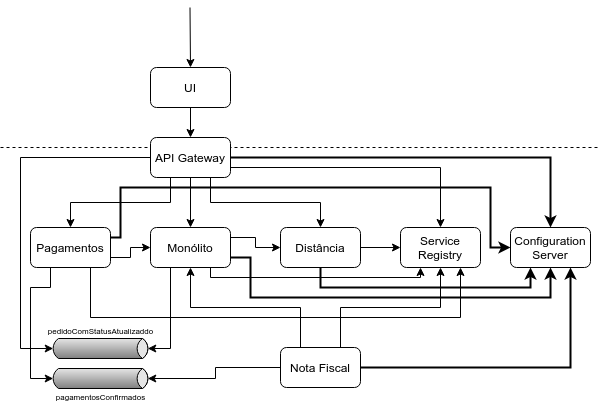

# Configuração

## Externalizando as configurações

<!--@note
  No livro Microservices Patterns, no capítulo 11 (Developing production-ready Microservices), Chris Richardson discute os impactos de 3 "atributos de qualidade" que são críticos para colocar uma Arquitetura de Microservices em produção:

  - configurabilidade
  - observabilidade
  - segurança

  Os próximos 3 capítulos tratam dessas questões.
-->

Boa parte das aplicações precisa manter uma série de configurações como credenciais de BD e Message Brokers, URLs e API keys de serviços externos, entre diversas outras.

Há relatos de aplicações implementadas em Java cujas configurações de diferentes ambientes são hard-coded no próprio código. Por exemplo, as credenciais de BD de desenvolvimento seriam usadas por padrão, enquanto credenciais de outros ambientes, como homologação e produção, ficariam comentadas. No caso de um deploy em produção, os desenvolvedores precisariam comentar as configurações de desenvolvimento, descomentando as de produção. O código então teria que ser novamente compilado e só então o entregável (JAR, WAR ou EAR) seria implantado em produção. Além disso, seria uma forte falha de segurança!

No livro [Microservices Patterns](https://www.manning.com/books/microservices-patterns) (RICHARDSON, 2018a), Chris Richardson recomenda que um único build possa ser implantado em diferentes ambientes, cada um com suas configurações. Para isso, um mecanismo deve prover configurações em _runtime_.

> **Pattern: Externalized configuration**
>
> Forneça valores de configuração a um serviço, como credenciais do banco de dados e URLs, em tempo de execução.
>
> Chris Richardson, no livro [Microservices Patterns](https://www.manning.com/books/microservices-patterns) (RICHARDSON, 2018a)

Richardson identifica duas abordagens para a externalização de configurações:

- Push
- Pull

### Push

No modelo de Push, a própria infraestrutura contém as configurações, por exemplo, por meio de variáveis de ambiente do Sistema Operacional ou arquivos de configuração.

Esse é o modelo de tecnologias de containers como Docker e orquestradores de containers como o Kubernetes.

Plataformas como o Heroku, com seus [12 fatores](https://www.12factor.net), pregam a definição de configurações em variáveis de ambiente, já que são uma maneira multiplataforma e externa à base de código.

O Spring Boot tem um mecanismo bastante flexível de [configurações externalizadas](https://docs.spring.io/spring-boot/docs/current/reference/html/boot-features-external-config.html) que obtém configurações de diversas fontes, com regras de precedência bem definidas. Segue uma lista das fontes de configuração mais úteis, da menos importante à mais importante:

- o arquivo de configuração `application.properties` (ou `application.yml`)

  Para definir uma taxa de desconto, poderíamos fazer:

  ```properties
  taxa.desconto=0.5
  ```

- Variáveis de ambiente

  O nome seria o mesmo da propriedade anterior, mas em uppercase e com underscore como separador.
  
  No Linux, em um Terminal, a definiríamos como `export TAXA_DESCONTO=0.4`

- JVM System properties

  Para defini-las, passaríamos no comando `java` com a opção `-D`:

  ```sh
  java -Dtaxa.desconto=0.3 -jar app.jar
  ```

- Argumentos da linha de comando

  ```sh
  java -jar app.jar --taxa.desconto=0.3 
  ```

Uma limitação do push model é que reconfigurar um serviço já executado requer a reinicialização. Outro problema é o risco das configurações ficarem espalhadas na definição de centenas de serviços.

### Pull

No modelo de Pull de configurações, uma instância de um serviço lê os valores de um **Configuration Server**.

Ao ser inicializado, a instância consulta o servidor para obter suas configurações. A URL do Configuration Server tem que ser mantida em um modelo de Push, com variáveis de ambiente ou arquivos de configuração.

Segundo Richardson, usar um Configuration Server traz diversos benefícios:

- Configuração centralizada: toda as configurações são armazenadas em um só lugar, fazendo com que sejam mais fáceis de gerenciar e eliminando duplicação. É possível definir valores padrão que podem ser sobrescritos em serviços específicos.
- Reconfiguração dinâmica: um serviço pode detectar os valores de configuração que foram atualizados e reconfigurar a si mesmo.
- Criptografia: algumas implementações podem manter chaves criptográficas, decriptando valores que os serviços demandarem. 

Para Richardson, a principal desvantagem de manter um Configuration Server é que trata-se de mais uma peça na infraestrutura que precisa ser mantida.

Entre os Configuration Servers disponíveis no mercado, temos:

- AWS Parameter Store
- Vault, um gerenciador de credenciais da HashiCorp, que permite armazenamento de credenciais, API Keys e outros dados sensíveis
- Spring Cloud Config Server

## Spring Cloud Config

O Spring Cloud Config Server pode armazenar as configurações em:

- arquivos `.properties` ou `.yml`
- repositório Git
- BD acessado por JDBC
- Redis
- AWS S3
- CredHub, um gerenciador de credenciais da Cloud Foundry
- Vault, um gerenciador de credenciais da HashiCorp

Cada serviço deve ter o projeto Spring Cloud Config Client, que obtém os valores das configurações do servidor na inicialização do serviço e as injeta no `ApplicationContext` do Spring.



Surge uma questão: a URL do Config Server realmente ser configurada em cada serviço ou podemos obtê-la do Service Registry?

A [documentação do Spring Cloud Config](https://cloud.spring.io/spring-cloud-config/reference/html/#_spring_cloud_config_client) descreve duas abordagens:

- Config First Bootstrap: a URL do Config Server fica em um arquivo `bootstrap.properties` de cada serviço.
- Discovery First Bootstrap: o Config Server é registrado no Service Registry (no nosso caso, o Eureka), de onde cada serviço obtém a URL do servidor de configuração. Para isso, a URL do Service Registry deve ser definida no `bootstrap.properties` dos serviços. 

## Implementando um Config Server

Pelo navegador, abra `https://start.spring.io/`.
Em _Project_, mantenha _Maven Project_.
Em _Language_, mantenha _Java_.
Em _Spring Boot_, mantenha a versão padrão.
No trecho de _Project Metadata_, defina:

- `br.com.caelum` em _Group_
- `config-server` em _Artifact_

Mantenha os valores em _More options_.

Mantenha o _Packaging_ como `Jar`.
Mantenha a _Java Version_ em `8`.

Em _Dependencies_, adicione:

- Config Server

Clique em _Generate Project_.
Extraia o `config-server.zip` e copie a pasta para seu Desktop.

Adicione a anotação `@EnableConfigServer` à classe `ConfigServerApplication`:

####### fj33-config-server/src/main/java/br/com/caelum/configserver/ConfigServerApplication.java

```java
@EnableConfigServer
@SpringBootApplication
public class ConfigServerApplication {

  public static void main(String[] args) {
    SpringApplication.run(ConfigServerApplication.class, args);
  }

}
```

Adicione o import:

```java
import org.springframework.cloud.config.server.EnableConfigServer;
```

No arquivo `application.properties`, modifique a porta para `8888`, defina `configserver` como _application name_ e configure o _profile_ para `native`, que obtém os arquivos de configuração de um sistema de arquivos ou do próprio classpath.

Nossos arquivos de configuração ficarão no diretório `src/main/resources/configs`, sendo copiados para a raiz do JAR e, em _runtime_, disponível pelo classpath. Portanto, configure a propriedade `spring.cloud.config.server.native.searchLocations` para apontar para esse diretório.

####### fj33-config-server/src/main/resources/application.properties

```properties
server.port=8888
spring.application.name=configserver

spring.profiles.active=native
spring.cloud.config.server.native.searchLocations=classpath:/configs
```

Crie o _Folder_ `configs` dentro de `src/main/resources/configs`. Dentro desse diretório, defina um `application.properties` contendo propriedades comuns à maioria dos serviços, como a URL do Eureka e as credencias do RabbitMQ:

```properties
spring.rabbitmq.username=eats
spring.rabbitmq.password=caelum123

eureka.client.serviceUrl.defaultZone=${EUREKA_URI:http://localhost:8761/eureka/}
```

Pelo Eclipse, execute a classe `ConfigServerApplication` e acesse a URL http://localhost:8888/application/default.

Deve ser retornado um JSON com as configurações:

```json
{
   "name":"application",
   "profiles":[
      "default"
   ],
   "label":null,
   "version":null,
   "state":null,
   "propertySources":[
      {
         "name":"classpath:/configs/application.properties",
         "source":{
            "spring.rabbitmq.username":"eats",
            "spring.rabbitmq.password":"caelum123",
            "eureka.client.serviceUrl.defaultZone":"${EUREKA_URI:http://localhost:8761/eureka/}"
         }
      }
   ]
}
```

## Configurando Config Clients nos serviços

Vamos usar como exemplo a configuração do Config Client no serviço de pagamento. Os passos para os demais serviços serão semelhantes.

No `pom.xml` de `eats-pagamento-service`, adicione a dependência ao _starter_ do Spring Cloud Config Client:

####### fj33-eats-pagamento-service/pom.xml

```xml
<dependency>
  <groupId>org.springframework.cloud</groupId>
  <artifactId>spring-cloud-starter-config</artifactId>
</dependency>
```

Retire do `application.properties` do serviço de pagamentos as configurações comuns que foram definidas no Config Server. Remova também o nome da aplicação:

####### fj33-eats-pagamento-service/src/main/resources/application.properties

```properties
s̶p̶r̶i̶n̶g̶.̶a̶p̶p̶l̶i̶c̶a̶t̶i̶o̶n̶.̶n̶a̶m̶e̶=̶p̶a̶g̶a̶m̶e̶n̶t̶o̶s̶

e̶u̶r̶e̶k̶a̶.̶c̶l̶i̶e̶n̶t̶.̶s̶e̶r̶v̶i̶c̶e̶U̶r̶l̶.̶d̶e̶f̶a̶u̶l̶t̶Z̶o̶n̶e̶=̶$̶{̶E̶U̶R̶E̶K̶A̶_̶U̶R̶I̶:̶h̶t̶t̶p̶:̶/̶/̶l̶o̶c̶a̶l̶h̶o̶s̶t̶:̶8̶7̶6̶1̶/̶e̶u̶r̶e̶k̶a̶/̶}̶

s̶p̶r̶i̶n̶g̶.̶r̶a̶b̶b̶i̶t̶m̶q̶.̶u̶s̶e̶r̶n̶a̶m̶e̶=̶e̶a̶t̶s̶
s̶p̶r̶i̶n̶g̶.̶r̶a̶b̶b̶i̶t̶m̶q̶.̶p̶a̶s̶s̶w̶o̶r̶d̶=̶c̶a̶e̶l̶u̶m̶1̶2̶3̶
```

Crie o arquivo `bootstrap.properties` no diretório `src/main/resources` do serviço de pagamentos. Nesse arquivo, defina o nome da aplicação e a URL do Config Server:

####### fj33-eats-pagamento-service/src/main/resources/bootstrap.properties

```properties
spring.application.name=pagamentos

spring.cloud.config.uri=http://localhost:8888
```

<!--@note
  Na verdade, podemos omitir essa configuração e o bootstrap.properties, já que essa é a configuração padrão.
-->

Faça o mesmo para:

- o API Gateway
- o monólito
- o serviço de nota fiscal
- o serviço de distância

_Observação: no monólito, as configurações devem ser feitas no módulo `eats-application`._

## Git como backend do Config Server

É possível manter as configurações do Config Server em um repositório Git. Assim, podemos manter um histório da alteração das configurações.

O Git é o backend padrão do Config Server. Por isso, não precisamos ativar nenhum profile.

Temos que configurar o endereço do repositório com a propriedade `spring.cloud.config.server.git.uri`.

Para testes, podemos apontar para um repositório local, na própria máquina do Config Server:

####### fj33-config-server/src/main/resources/application.properties

```properties
s̶p̶r̶i̶n̶g̶.̶p̶r̶o̶f̶i̶l̶e̶s̶.̶a̶c̶t̶i̶v̶e̶=̶n̶a̶t̶i̶v̶e̶
s̶p̶r̶i̶n̶g̶.̶c̶l̶o̶u̶d̶.̶c̶o̶n̶f̶i̶g̶.̶s̶e̶r̶v̶e̶r̶.̶n̶a̶t̶i̶v̶e̶.̶s̶e̶a̶r̶c̶h̶L̶o̶c̶a̶t̶i̶o̶n̶s̶=̶c̶l̶a̶s̶s̶p̶a̶t̶h̶:̶/̶c̶o̶n̶f̶i̶g̶s̶

spring.cloud.config.server.git.uri=file://${user.home}/Desktop/config-repo
```

Podemos também usar o endereço HTTPS de um repositório Git remoto, definindo usuário e senha:

####### fj33-config-server/src/main/resources/application.properties

```properties
spring.cloud.config.server.git.uri=https://github.com/organizacao/repositorio-de-configuracoes
spring.cloud.config.server.git.username=meu-usuario
spring.cloud.config.server.git.password=minha-senha-secreta
```

Também podemos usar SSH: basta usarmos o endereço SSH do repositório e mantermos as chaves no diretório padrão (`~/.ssh`).

####### fj33-config-server/src/main/resources/application.properties

```properties
spring.cloud.config.server.git.uri=git@github.com:organizacao/repositorio-de-configuracoes
```

É possível manter as chaves SSH no próprio `application.properties` do Config Server.

## Exercício: repositório Git local no Config Server


1. Faça o clone do Config Server para o seu Desktop com o seguinte comando:

  ```sh
  cd ~/Desktop
  git clone https://gitlab.com/aovs/projetos-cursos/fj33-config-server.git
  ```

  No Eclipse, no workspace de microservices, importe o projeto `config-server`, usando o menu _File > Import > Existing Maven Projects_.

  Execute a classe `ConfigServerApplication`.

2. Faça checkout da branch `cap12-repositorio-git-no-config-server` do projeto do Config Server:

  ```sh
  cd ~/Desktop/fj33-config-server
  git checkout -f cap12-repositorio-git-no-config-server
  ```

  Reinicie o Config Server, parando e rodando novamente a classe `ConfigServerApplication`.

3. No exercício, vamos usar um repositório local do Git para manter nossas configurações.

  Crie um repositório Git no diretório `config-repo` do seu Desktop com os comandos:

  ```sh
  cd ~/Desktop
  mkdir config-repo
  cd config-repo
  git init
  ```

  Defina um arquivo `application.properties` no repositório `config-repo`, com o conteúdo:

  ```properties
  spring.rabbitmq.username=eats
  spring.rabbitmq.password=caelum123

  eureka.client.serviceUrl.defaultZone=${EUREKA_URI:http://localhost:8761/eureka/}
  ```

  Obtenha o arquivo anterior na seguinte URL: https://gitlab.com/snippets/1896483

  ```sh
  cd ~/Desktop/config-repo
  git add .
  git commit -m "versão inicial do application.properties"
  ```

4. Com o Config Server no ar, acesse a seguinte URL: http://localhost:8888/application/default

  Você deve obter como resposta, um JSON semelhante a:

  ```json
  {
      "name": "application",
      "profiles": [
          "default"
      ],
      "label": null,
      "version": "04d35e5b5ae06c70abd8e08be19dba67f6b45e30",
      "state": null,
      "propertySources": [
          {
              "name": "file:///home/<SEU-USUARIO>/Desktop/config-repo/application.properties",
              "source": {
                  "spring.rabbitmq.username": "eats",
                  "spring.rabbitmq.password": "caelum123",
                  "eureka.client.serviceUrl.defaultZone": "${EUREKA_URI:http://localhost:8761/eureka/}"
              }
          }
      ]
  }
  ```

  Faça alguma mudança no `application.properties` do `config-repo` e acesse novamente a URL anterior. Perceba que o Config Server precisa de um repositório Git, mas obtém o conteúdo do próprio arquivo (_working directory_ nos termos do Git), mesmo sem as alterações terem sido comitadas. Isso acontece apenas quando usamos um repositório Git local, o que deve ser usado apenas para testes.

5. Reinicie todos os serviços. Teste a aplicação. Deve continuar funcionando!

  Observação: as configurações só são obtidas no start up da aplicação. Se alguma configuração for modificada no Config Server, só será obtida pelos serviços quando forem reiniciados.

## Movendo configurações específicas dos serviços para o Config Server

É possível criar, no repositório de configurações do Config Server, configurações específicas para cada serviço e não apenas para aquelas que são comuns a todos os serviços.

Para um backend Git, defina um arquivo `.properties` ou  `.yml` cujo nome tem o mesmo valor definido em `spring.application.name`.

Para o monólito, crie um arquivo `monolito.properties` no diretório `config-repo`, que é nosso repositório Git. Passe para esse novo arquivo as configurações de BD e chaves criptográficas, removendo-as do monólito:

####### config-repo/monolito.properties

```properties
# DATASOURCE CONFIGS
spring.datasource.url=jdbc:mysql://localhost/eats?createDatabaseIfNotExist=true
spring.datasource.username=root
spring.datasource.password=

#JWT CONFIGS
jwt.secret = um-segredo-bem-secreto
jwt.expiration = 604800000
```

Remova essas configurações do `application.properties` do módulo `eats-application` do monólito:

####### fj33-eats-monolito-modular/eats/eats-application/src/main/resources/application.properties

```properties
#̶D̶A̶T̶A̶S̶O̶U̶R̶C̶E̶ ̶C̶O̶N̶F̶I̶G̶S̶
s̶p̶r̶i̶n̶g̶.̶d̶a̶t̶a̶s̶o̶u̶r̶c̶e̶.̶u̶r̶l̶=̶j̶d̶b̶c̶:̶m̶y̶s̶q̶l̶:̶/̶/̶l̶o̶c̶a̶l̶h̶o̶s̶t̶/̶e̶a̶t̶s̶?̶c̶r̶e̶a̶t̶e̶D̶a̶t̶a̶b̶a̶s̶e̶I̶f̶N̶o̶t̶E̶x̶i̶s̶t̶=̶t̶r̶u̶e̶
s̶p̶r̶i̶n̶g̶.̶d̶a̶t̶a̶s̶o̶u̶r̶c̶e̶.̶u̶s̶e̶r̶n̶a̶m̶e̶=̶r̶o̶o̶t̶
s̶p̶r̶i̶n̶g̶.̶d̶a̶t̶a̶s̶o̶u̶r̶c̶e̶.̶p̶a̶s̶s̶w̶o̶r̶d̶=̶

# código omitido ...

#̶J̶W̶T̶ ̶C̶O̶N̶F̶I̶G̶S̶
j̶w̶t̶.̶s̶e̶c̶r̶e̶t̶ ̶=̶ ̶u̶m̶-̶s̶e̶g̶r̶e̶d̶o̶-̶b̶e̶m̶-̶s̶e̶c̶r̶e̶t̶o̶
j̶w̶t̶.̶e̶x̶p̶i̶r̶a̶t̶i̶o̶n̶ ̶=̶ ̶6̶0̶4̶8̶0̶0̶0̶0̶0̶
```

Observação: o novo arquivo deve ser comitado no `config-repo`, conforme a necessidade. Para repositório locais, que devem ser usados só para testes, o commit não é necessário.

Faça o mesmo para o serviço de pagamentos. Crie o arquivo `pagamentos.properties` no repositório de configurações, com as configurações de BD:

####### config-repo/pagamentos.properties

```properties
#DATASOURCE CONFIGS
spring.datasource.url=jdbc:mysql://localhost:3307/eats_pagamento?createDatabaseIfNotExist=true
spring.datasource.username=pagamento
spring.datasource.password=pagamento123
```

Remova as configurações BD do `application.properties` do serviço de pagamentos:

####### fj33-eats-pagamento-service/src/main/resources/application.properties

```properties
#̶D̶A̶T̶A̶S̶O̶U̶R̶C̶E̶ ̶C̶O̶N̶F̶I̶G̶S̶
s̶p̶r̶i̶n̶g̶.̶d̶a̶t̶a̶s̶o̶u̶r̶c̶e̶.̶u̶r̶l̶=̶j̶d̶b̶c̶:̶m̶y̶s̶q̶l̶:̶/̶/̶l̶o̶c̶a̶l̶h̶o̶s̶t̶:̶3̶3̶0̶7̶/̶e̶a̶t̶s̶_̶p̶a̶g̶a̶m̶e̶n̶t̶o̶?̶c̶r̶e̶a̶t̶e̶D̶a̶t̶a̶b̶a̶s̶e̶I̶f̶N̶o̶t̶E̶x̶i̶s̶t̶=̶t̶r̶u̶e̶
s̶p̶r̶i̶n̶g̶.̶d̶a̶t̶a̶s̶o̶u̶r̶c̶e̶.̶u̶s̶e̶r̶n̶a̶m̶e̶=̶p̶a̶g̶a̶m̶e̶n̶t̶o̶
s̶p̶r̶i̶n̶g̶.̶d̶a̶t̶a̶s̶o̶u̶r̶c̶e̶.̶p̶a̶s̶s̶w̶o̶r̶d̶=̶p̶a̶g̶a̶m̶e̶n̶t̶o̶1̶2̶3̶
```

Transfira as configurações de BD do serviço de distância para um novo arquivo `distancia.properties` do `config-repo`:

####### config-repo/distancia.properties

```properties
spring.data.mongodb.database=eats_distancia
spring.data.mongodb.port=27018
```

Remova as configurações do `application.properties` de distância:

####### eats-distancia-service/src/main/resources/application.properties

```properties
s̶p̶r̶i̶n̶g̶.̶d̶a̶t̶a̶.̶m̶o̶n̶g̶o̶d̶b̶.̶d̶a̶t̶a̶b̶a̶s̶e̶=̶e̶a̶t̶s̶_̶d̶i̶s̶t̶a̶n̶c̶i̶a̶
s̶p̶r̶i̶n̶g̶.̶d̶a̶t̶a̶.̶m̶o̶n̶g̶o̶d̶b̶.̶p̶o̶r̶t̶=̶2̶7̶0̶1̶8̶
```

## Exercícios: Configurações específicas de cada serviço no Config Server

1. Faça o checkout da branch `cap12-movendo-configuracoes-especificas-para-o-config-server` no monólito e nos serviços de pagamentos e de distância:

  ```sh
  cd ~/Desktop/fj33-eats-monolito-modular
  git checkout -f cap12-movendo-configuracoes-especificas-para-o-config-server

  cd ~/Desktop/fj33-eats-pagamento-service
  git checkout -f cap12-movendo-configuracoes-especificas-para-o-config-server

  cd ~/Desktop/fj33-eats-distancia-service
  git checkout -f cap12-movendo-configuracoes-especificas-para-o-config-server
  ```

  Por enquanto, pare o monólito, o serviço de pagamentos e o serviço de distância.

2. Crie o arquivo `monolito.properties` no `config-repo` com o seguinte conteúdo:

  ####### config-repo/monolito.properties

  ```properties
  # DATASOURCE CONFIGS
  spring.datasource.url=jdbc:mysql://localhost/eats?createDatabaseIfNotExist=true
  spring.datasource.username=root
  spring.datasource.password=

  #JWT CONFIGS
  jwt.secret = um-segredo-bem-secreto
  jwt.expiration = 604800000
  ```

  O conteúdo anterior pode ser encontrado em: https://gitlab.com/snippets/1896524

  Observação: não precisamos comitar os novos arquivos no repositório Git porque estamos usando um repositório local.

3. Ainda no `config-repo`, crie um arquivo `pagamentos.properties`:

  ####### config-repo/pagamentos.properties

  ```properties
  #DATASOURCE CONFIGS
  spring.datasource.url=jdbc:mysql://localhost:3307/eats_pagamento?createDatabaseIfNotExist=true
  spring.datasource.username=pagamento
  spring.datasource.password=pagamento123
  ```

  É possível obter as configurações anteriores na URL: https://gitlab.com/snippets/1896525

4. Defina também, no `config-repo`, um arquivo `distancia.properties`:

  ####### config-repo/distancia.properties

  ```properties
  spring.data.mongodb.database=eats_distancia
  spring.data.mongodb.port=27018
  ```

  O código anterior está na URL: https://gitlab.com/snippets/1896527

5. Faça com que os serviços sejam reiniciados, para obterem as novas configurações do Config Server. Acesse a UI e teste as funcionalidades.

<!-- TODO:
  Para saber mais: Push Notifications and Spring Cloud Bus
  https://cloud.spring.io/spring-cloud-config/reference/html/#_push_notifications_and_spring_cloud_bus
-->
