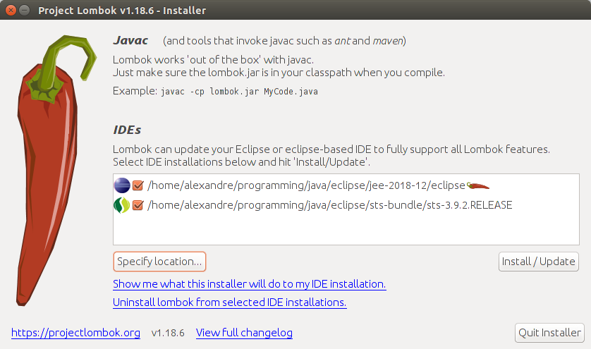

# Apêndice: Instalação

Instalação das ferramentas usadas no decorrer do curso.

## Git

### Windows

No Windows, siga os passos em: https://git-scm.com/download/win

### MacOS

No MacOS, siga os passos em: https://git-scm.com/download/mac

### Linux

No Linux, provavelmente já está instalado. Faça o teste a seguir!

Se o Git não estiver instalado, execute os seguintes comandos:

- Ubuntu, Debian, Mint: `sudo apt-get install git`
- Fedora, CentOS: `sudo yum install git`

### Teste a instalação do Git

Digite em um Terminal

```sh
git --version.
```

A resposta será algo como:

```txt
git version 2.25.0.
```

## Docker e Docker Compose

### Windows

Se tiver o Windows 10 Professional Edition/Enterprise Edition, instale o Docker Desktop for Windows: https://docs.docker.com/docker-for-windows/install/

O Docker Desktop for Windows já contém o Docker e Docker Compose.

Se tiver o Windows 10 Home Edition e outras versões, precisaremos do _VirtualBox_ e de uma máquina virtual Linux com o Docker instalado.

- Instale o VirtualBox: https://download.virtualbox.org/virtualbox/6.1.4/VirtualBox-6.1.4-136177-Win.exe
- Baixe a imagem do Linux com Docker já instalado no seguinte link: https://drive.google.com/open?id=1W2RIYQ_EO0LlpRjFWtcyW2YF-diEV72e
- Importe a imagem para o VirtualBox com o seguinte tutorial: https://www.maketecheasier.com/import-export-ova-files-in-virtualbox/
- Executar a máquina virtual. O usuário/senha configurados são: **caelum**/**caelum**
- Se durante a execução da máquina virtual for solicitada a instalação do _VirtualBox Extension Pack_ basta seguir o tutorial: https://www.nakivo.com/blog/how-to-install-virtualbox-extension-pack

### MacOS

Instale o Docker Desktop for MacOS: https://docs.docker.com/docker-for-mac/

O Docker Desktop for MacOS já tem o Docker e o Docker Compose.

A versão do MacOS precisa ser 10.3 ou posterior. Por exemplo, High Sierra (10.13), Mojave (10.14) or Catalina (10.15).

### Linux

#### Instalação do Docker

Siga os passos de _Install using the repository_ para as diferentes distribuições:

- Ubuntu, Mint: https://docs.docker.com/install/linux/docker-ce/ubuntu/
- Debian: https://docs.docker.com/install/linux/docker-ce/debian/
- Fedora: https://docs.docker.com/install/linux/docker-ce/fedora/
- CentOS: https://docs.docker.com/install/linux/docker-ce/centos/

Siga os passos de pós-instalação: 

- Manage Docker as a non-root user: https://docs.docker.com/install/linux/linux-postinstall/#manage-docker-as-a-non-root-user
- Configure Docker to start on boot: https://docs.docker.com/install/linux/linux-postinstall/#configure-docker-to-start-on-boot

#### Instalação do Docker Compose

Siga os passos em: https://docs.docker.com/compose/install/#install-compose-on-linux-systems

### Teste a instalação do Docker

Abra um Terminal e verifique a versão instalada do Docker com o comando:

```sh
docker --version
```

A resposta deve ser algo semelhante a:

```txt
Docker version 19.03.5, build 633a0ea
```

Em um Terminal, execute um container a partir da imagem `hello-world` do Docker Hub:

```sh
docker run hello-world
```

Depois de uma série de mensagens, se tudo funcionou, você deve obter mensagens semelhantes a:

```txt
Hello from Docker!
This message shows that your installation appears to be working correctly.
```

### Teste a instalação do Docker Compose

Em um Terminal, verifique a versão do Docker Compose com o comando: 

```sh
docker-compose --version
```

A resposta deve ser algo semelhante a:

```txt
docker-compose version 1.22.0, build f46880fe
```

## Java 8 (JDK)

### Windows 

Faça download e instalação do Java 8 (JDK) a partir da seguinte URL: https://www.oracle.com/webapps/redirect/signon?nexturl=https://download.oracle.com/otn/java/jdk/8u241-b07/1f5b5a70bf22433b84d0e960903adac8/jdk-8u241-windows-x64.exe
### MacOS

Faça download e instalação do Java 8 (JDK) a partir da seguinte URL: https://www.oracle.com/webapps/redirect/signon?nexturl=https://download.oracle.com/otn/java/jdk/8u241-b07/1f5b5a70bf22433b84d0e960903adac8/jdk-8u241-macosx-x64.dmg

### Linux

Faça download e instalação do Java 8 (JDK) a partir das seguintes URLs.

- Para Ubuntu, Debian e Mint:  https://www.oracle.com/webapps/redirect/signon?nexturl=https://download.oracle.com/otn/java/jdk/8u241-b07/1f5b5a70bf22433b84d0e960903adac8/jdk-8u241-linux-x64.tar.gz
- Para Fedora e CentOS: https://www.oracle.com/webapps/redirect/signon?nexturl=https://download.oracle.com/otn/java/jdk/8u241-b07/1f5b5a70bf22433b84d0e960903adac8/jdk-8u241-linux-x64.rpm

### Teste a instalação da JDK:

Abra um Terminal e digite:

```sh
javac -version
```

A resposta deve ser algo semelhante à seguinte:

```txt
javac 1.8.0_212
```

## Maven 3

Baixe o zip do Maven no link: http://mirror.nbtelecom.com.br/apache/maven/maven-3/3.6.3/binaries/apache-maven-3.6.3-bin.zip

Extraia o zip baixado no passo anterior em um diretório de sua preferência. Dica: evite espaços no nome dos diretórios.

Coloque a pasta bin do Maven na variável de ambiente PATH.

Certifique-se que há uma variável de ambiente `JAVA_HOME` apontando para o diretório da sua JDK. No Windows seria algo como `C:\Program Files\Java\jdk1.8.0_212`. Já no Linux, seria algo como `/usr/lib/jvm/java-8-oracle`.

### Windows:

Entre nas propriedades do diretório _Computador_.

Clique na aba _Avançado_ 

Clique no botão _Variáveis de ambiente_.

Crie (ou atualize) a variável de ambiente `PATH` com algo como `C:\Program Files\apache-maven-3.6.3\bin`.

### MacOS

Edite o arquivo `.bash_profile` do Home de seu usuário.

Inclua uma linha que define a variável de ambiente `PATH`. Algo como:

```sh
export PATH=/opt/apache-maven-3.6.3/bin:$PATH
```

### Linux

Edite o arquivo `.bashrcd' o Home de seu usuário.

Inclua a linha que define a variável de ambiente `PATH`. Algo como:

```sh
export PATH=/opt/apache-maven-3.6.3/bin:$PATH
```

### Teste a instalação do Maven

Abra um Terminal e digite:

```sh
mvn -v
```

Deve ser exibido algo como:

```txt
Apache Maven 3.5.4 (1edded0938998edf8bf061f1ceb3cfdeccf443fe; 2018-06-17T15:33:14-03:00)
```

## Eclipse

### Windows

Faça download e instalação do Eclipse IDE for Java EE Developers na seguinte URL: https://www.eclipse.org/downloads/download.php?file=/technology/epp/downloads/release/2020-03/R/eclipse-jee-2020-03-R-incubation-win32-x86_64.zip&mirror_id=576

### MacOS

Faça download e instalação do Eclipse IDE for Java EE Developers na seguinte URL: https://www.eclipse.org/downloads/download.php?file=/technology/epp/downloads/release/2020-03/R/eclipse-jee-2020-03-R-incubation-macosx-cocoa-x86_64.dmg&mirror_id=576

### Linux

Faça download e instalação do Eclipse IDE for Java EE Developers nas seguintes URLs:

- Para Ubuntu, Debian e Mint: https://www.eclipse.org/downloads/download.php?file=/technology/epp/downloads/release/2020-03/R/eclipse-jee-2020-03-R-incubation-linux-gtk-x86_64.tar.gz&mirror_id=576

- Para Fedora e CentOS: https://www.eclipse.org/downloads/download.php?file=/technology/epp/downloads/release/2020-03/R/eclipse-jee-2020-03-R-incubation-linux-gtk-x86_64.tar.gz&mirror_id=576

## Lombok

Baixe a última versão do Lombok na seguinte URL: https://projectlombok.org/downloads/lombok.jar

Dê duplo clique no lombok.jar.

Se o duplo clique não funcionar, abra um Terminal e execute `java -jar lombok.jar`.

Devem ser exibidas as instalações do seu Eclipse (ou STS), conforme imagem a seguir:



Selecione e instale o Lombok nas versões adequadas.

O instalador do Lombok copia o JAR para o diretório do Eclipse e adiciona a seguinte linha no `eclipse.ini`:

```txt
-javaagent:lombok.jar
```

No MacOS, o `eclipse.ini` fica em `Eclipse.app/Contents/MacOS`.

### Teste a instalação do Lombok no Eclipse

Abra o Eclipse e vé em _Help_ e _About Eclipse IDE_.

No final do texto sobre o Eclipse, devem ser exibidas informações sobre a versão do Lombok, conforme imagem a seguir:


## cURL

cURL é uma ferramenta de linha de comando que permite acesso a APIs REST.

### Windows

A partir do Windows 10 versão 1804, o cURL já vem instalado.

Para versões mais antigas, baixe e instale o cURL: https://curl.haxx.se/windows/dl-7.69.1/curl-7.69.1-win64-mingw.zip 

### MacOS

No MacOS, o cURL já está instalado. Faça o teste!

### Linux

Para instalar o cURL no Linux, faça:

- Ubuntu, Debian, Mint: `sudo apt-get install curl`
- Fedora, CentOS: `sudo yum install curl`

### Teste a instalação do cURL

Execute o seguinte comando em um Terminal:

```sh
curl --version
```

A resposta deverá conter algo como:

```txt
curl 7.35.0 (x86_64-pc-linux-gnu)
```

Para testar a instalação do cURL, em um Terminal, digite:

```sh
curl http://httpbin.org/get
```

O resultado deve ser algo como:

```txt
{
  "args": {}, 
  "headers": {
    "Accept": "*/*", 
    "Host": "httpbin.org", 
    "User-Agent": "curl/7.35.0", 
    "X-Amzn-Trace-Id": "Root=1-5e79100f-9a9801103a061ac8a3d2d260"
  }, 
  "origin": "177.20.207.183", 
  "url": "http://httpbin.org/get"
}
```

## ab (Apache Bench)

ab (Apache Bench) é uma ferramenta usada no benchmarking do Apache httpd.

### Windows

No Windows, faça o download e instalação do Apache httpd, que conterá o comando `ab`: https://www.apachehaus.com/downloads/httpd-2.4.41-o111c-x86-vc15-r2.zip 

### MacOS

No MacOS, o ab já vem instalado. Faça o teste!

### Linux

Para instalar o ab no Linux, faça:

- Ubuntu, Debian e Mint: `sudo apt-get install apache2-utils`
- Fedora, CentOS: `sudo yum install httpd-tools`

### Teste a instalação do Apache Bench

Em um Terminal, execute:

```sh
ab -V
```

A resposta deverá conter algo como:

```
This is ApacheBench, Version 2.3 <$Revision: 1528965 $>
```

## NodeJS

O NodeJS é necessário para executar o front-end.

Baixe e instale o NodeJS versão LTS pelo site oficial: https://nodejs.org/en/

Ao baixar diretamente pelo site, o próprio site já indicará o instalador apropriado para seu sistema operacional.

### Teste a instalação do NodeJS

Após a instalação do NodeJS, para verificar se tudo está correto, abra o Terminal do computador e execute o comando:

```sh
node -v
```

Este comando deverá exibir o número da versão do NodeJS. Algo como:

```txt
12.16.1
```

Digite também outro comando para garantir que o NPM também foi instalado com o NodeJS:

```sh
npm -v
```

Deverá ser retornado algum outro número como:

```txt
6.14.3
```

## Angular CLI

Para executar o front-end, precisamos do Angular CLI. Com o NodeJS e NPM, podemos instalá-lo.

Para isso, abra o terminal e execute:

```sh
npm install -g @angular/cli
```

### Teste a instalação do Angular CLI

Depois de instalado, execute:

```sh
ng version
```

Deve ser retornado algo semelhante a:

```txt
Angular CLI: 8.3.14
```

## Visual Studio Code

Recomendamos o Visual Studio Code como editor de texto para o front-end.

### Windows

Faça o download e instalação a partir da seguinte URL: https://aka.ms/win32-x64-user-stable

### MacOS
Faça o download e instalação a partir da seguinte URL: https://go.microsoft.com/fwlink/?LinkID=620882

### Linux

No Linux, faça o download e instalação a partir das seguintes URLs:

- Ubuntu, Debian, Mint: https://go.microsoft.com/fwlink/?LinkID=760868
- Fedora, CentOS: https://go.microsoft.com/fwlink/?LinkID=760867

## Postman

Ao invés do cURL, você pode usar o Postman como ferramenta para explorar e testar APIs.

### Windows

Faça o download e instalação a partir da seguinte URL: https://dl.pstmn.io/download/latest/win64

### MacOS

Faça o download e instalação a partir da seguinte URL: https://dl.pstmn.io/download/latest/osx

### Linux

Faça o download e instalação a partir da seguinte URL: https://dl.pstmn.io/download/latest/linux64
